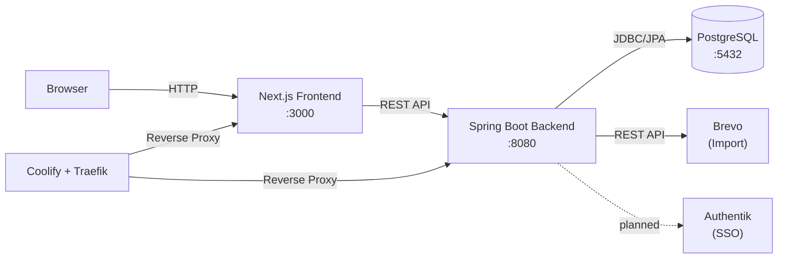
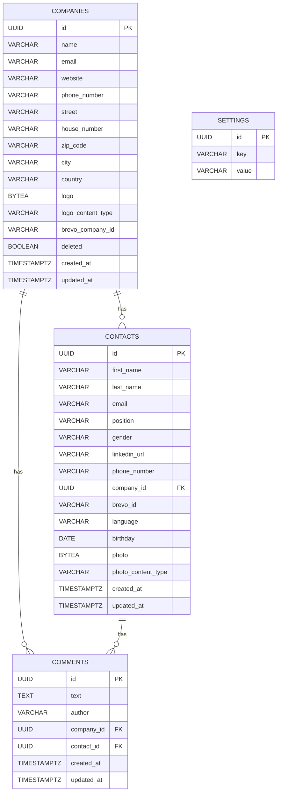

# Project Architecture

## Components

- **Frontend (Next.js)** — Server-side rendered React application using the App Router. Communicates with the backend via REST API calls from both server components (SSR) and client components (browser). Uses `BACKEND_URL` env var for server-side requests and proxies client-side requests through Next.js rewrites. Bilingual UI (DE/EN) with client-side language detection and switching.
- **Backend (Spring Boot)** — RESTful JSON API handling business logic, validation, and data persistence. Organized by domain packages (company, contact, comment, brevo, health, settings, user). Exposes OpenAPI documentation via Swagger UI. CSV export endpoints generate files server-side using Apache Commons CSV.
- **Database (PostgreSQL)** — Relational storage for all domain data. Schema managed by Flyway migrations (V1–V11). Uses UUID primary keys, soft-delete pattern for companies, and timestamp tracking.
- **Brevo** — External marketing platform. One-directional import of companies and contacts via Brevo API, triggered manually. API key stored in settings table.

## Communication

- **Frontend → Backend:** HTTP REST (JSON). Server-side calls go directly to `BACKEND_URL`; client-side calls go to the Next.js server which proxies to the backend via rewrites.
- **Backend → Database:** JDBC via Spring Data JPA. Hibernate validates schema against entity mappings (`ddl-auto: validate`).
- **Backend → Brevo:** HTTP REST via Brevo Java SDK. Import-only (CRM reads from Brevo, never writes back).
- **Schema management:** Flyway runs migrations on startup from `classpath:db/migration`.
- **Page serialization:** `@EnableSpringDataWebSupport(pageSerializationMode = VIA_DTO)` for stable paginated JSON responses with nested `page` metadata object.

## Architecture Diagram

## Data Model

## Key Architectural Decisions

- **Soft-delete for companies** — Companies are marked as `deleted=true` rather than physically removed, allowing restoration. Contacts block company deletion (409 Conflict).
- **Comments are polymorphic** — A comment belongs to either a company or a contact (enforced by a CHECK constraint), never both. Author is a simple string field set from the current user (hardcoded "Demo User" until Authentik integration).
- **Flyway for schema management** — Hibernate is set to `validate` only; all schema changes go through versioned SQL migrations.
- **Separate DTOs per operation** — Each domain uses distinct `CreateDto`, `UpdateDto`, and `Dto` records to control API surface per operation.
- **User model without database** — No user table exists. User info will come from the Authentik auth token. A `UserService` currently returns hardcoded dummy values. Both frontend and backend resolve user info independently (no user API endpoint).
- **Image storage in database** — Company logos and contact photos are stored as `bytea` columns in PostgreSQL alongside a `_content_type` column. Dedicated REST endpoints handle upload, retrieval, and deletion. DTOs expose `hasLogo`/`hasPhoto` boolean flags instead of binary data.
- **Brevo import is one-directional** — The CRM imports from Brevo but never writes back. Brevo-managed fields on contacts are read-only. Re-import preserves user-editable fields.
- **Docker Compose split for Coolify** — `docker-compose.yml` has no port bindings (for Coolify/Traefik deployment); `docker-compose.override.yml` adds host ports for local development. Docker Compose auto-merges the override file locally.
- **Spec-driven development** — Features are planned in `specs/` with design documents, behavioral scenarios (given-when-then), and implementation steps before coding begins.
