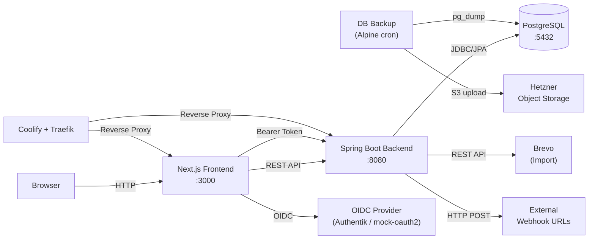
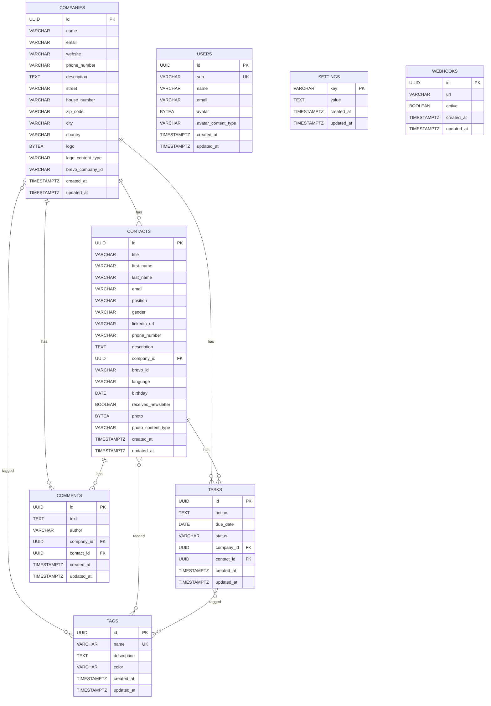
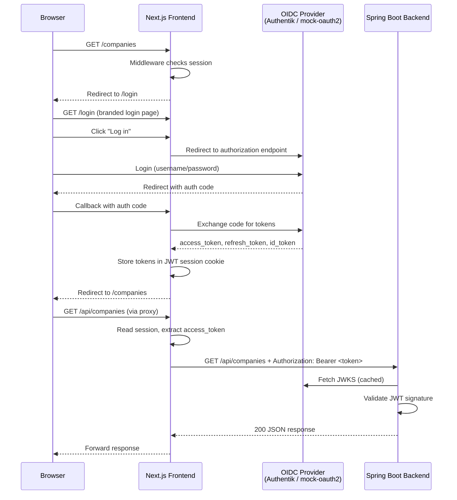

# Project Architecture

## Components

- **Frontend (Next.js)** — Server-side rendered React application using the App Router with route groups. The `(app)` route group contains all authenticated pages with the sidebar layout. The `/login` page is outside the route group with a standalone layout (no sidebar). All app pages require OIDC authentication via Auth.js v5 (middleware redirects unauthenticated users to `/login`). API calls are proxied through a catch-all Route Handler that injects the JWT access token as an Authorization Bearer header. Uses `BACKEND_URL` env var for server-side requests. Bilingual UI (DE/EN) with client-side language detection and switching.
- **Backend (Spring Boot)** — RESTful JSON API handling business logic, validation, and data persistence. All API endpoints require JWT Bearer token authentication via Spring Security OAuth2 Resource Server (except health and Swagger UI which are public). User info is extracted from JWT claims. Organized by domain packages (company, contact, comment, task, tag, user, brevo, health, settings). Exposes OpenAPI documentation via Swagger UI with OIDC authorize button. CSV export endpoints generate files server-side using Apache Commons CSV.
- **Database (PostgreSQL)** — Relational storage for all domain data. Schema managed by Flyway migrations (V1–V17). Uses UUID primary keys and timestamp tracking.
- **Brevo** — External marketing platform. One-directional import of companies and contacts via Brevo API, triggered manually. API key stored in settings table. Newsletter subscription status synced during import.
- **DB Backup (Alpine container)** — Dedicated Docker container running a cron job for automated daily PostgreSQL backups. Uses `pg_dump` to create compressed SQL dumps, uploads to S3-compatible object storage (Hetzner Object Storage), and automatically cleans up backups older than the configured retention period. Also provides a manual restore script.

## Communication

- **Frontend → Backend:** HTTP REST (JSON). All API calls go through a server-side Route Handler (`app/api/[...path]/route.ts`) that reads the Auth.js session, injects the JWT access token as an `Authorization: Bearer` header, and forwards the request to the backend at `BACKEND_URL`.
- **Backend → Database:** JDBC via Spring Data JPA. Hibernate validates schema against entity mappings (`ddl-auto: validate`).
- **Backend → Brevo:** HTTP REST via `BrevoApiClient`. Import-only (CRM reads from Brevo, never writes back).
- **Schema management:** Flyway runs migrations on startup from `classpath:db/migration`.
- **Page serialization:** `@EnableSpringDataWebSupport(pageSerializationMode = VIA_DTO)` for stable paginated JSON responses with nested `page` metadata object.

## Architecture Diagram

## Data Model

## Authentication & Authorization (OIDC)

The application uses OpenID Connect (OIDC) for authentication with a clear separation of concerns between frontend and backend.

### OIDC Provider

- **Production:** Authentik (self-hosted identity provider)
- **Local development:** mock-oauth2-server (started automatically via Docker Compose override, no configuration needed)

### Frontend Authentication (Auth.js v5)

- **Provider:** Generic OIDC provider configured via environment variables (`OIDC_ISSUER_URI`, `OIDC_CLIENT_ID`, `OIDC_CLIENT_SECRET`)
- **Session strategy:** JWT (stateless, no server-side session store)
- **Scopes:** `openid profile email offline_access`
- **Custom login page:** Auth.js is configured with `pages: { signIn: "/login" }` to use a branded login page instead of the default. The login page lives outside the `(app)` route group and has no sidebar.
- **Middleware:** Next.js middleware (`src/middleware.ts`) runs the Auth.js `authorized` callback on every route except `/api/auth/*`, `/api/logout`, `/login`, `/_next/static`, `/_next/image`, and static assets (`.svg`, `.png`, `.jpg`, `.ico`). Unauthenticated users are redirected to `/login`.
- **Token lifecycle:** On initial sign-in, access token, refresh token, and ID token are stored in the JWT session. Before each request, the token expiry is checked; expired tokens are refreshed automatically via the OIDC provider's token endpoint using the refresh token. Failed refreshes set a `RefreshTokenError` flag that clears the access token from the session.
- **User info:** Name, email, and profile picture are extracted from the OIDC profile on sign-in and stored in the JWT session.

### API Proxy (Token Injection)

- The frontend never exposes the access token to the browser. All API calls from the frontend go through a server-side catch-all Route Handler (`app/api/[...path]/route.ts`).
- The Route Handler reads the Auth.js session server-side, extracts the access token, and sets it as an `Authorization: Bearer` header before forwarding the request to the backend at `BACKEND_URL`.
- Query parameters, request body, `Content-Type`, and `Accept` headers are forwarded transparently.

### Backend Authentication (Spring Security)

- **Configuration:** `SecurityConfig.java` sets up a `SecurityFilterChain` with OAuth2 Resource Server and JWT validation.
- **JWT validation:** The backend validates JWT signatures against the OIDC provider's JWKS endpoint (`OIDC_JWK_SET_URI`). It does not communicate with the OIDC provider beyond fetching the JWK set.
- **Public endpoints:** `/api/health/**`, `/swagger-ui.html`, `/swagger-ui/**`, `/v3/api-docs/**` are accessible without authentication.
- **All other endpoints** require a valid JWT Bearer token.
- **CSRF:** Disabled (stateless API with Bearer token authentication).

### Logout

- The logout route (`/api/logout`) clears all Auth.js session cookies — including chunked cookies (`.0`, `.1`, etc.) that Auth.js creates when JWT sessions exceed 4KB — and redirects to the OIDC provider's `end_session_endpoint` (discovered via `.well-known/openid-configuration`) with the `id_token_hint` for provider-side session termination. Cookie deletion attributes (`secure`, `httpOnly`, `path`, `sameSite`) are set dynamically based on whether `AUTH_URL` uses HTTPS or HTTP.

### Authentication Flow

## Key Architectural Decisions

- **Hard-delete for companies** — Companies are permanently deleted with a confirmation dialog. Contacts linked to a company block deletion (409 Conflict).
- **Comments are polymorphic** — A comment belongs to either a company or a contact (enforced by a CHECK constraint), never both. Author is a simple string field set from the authenticated user's name.
- **Flyway for schema management** — Hibernate is set to `validate` only; all schema changes go through versioned SQL migrations.
- **Separate DTOs per operation** — Each domain uses distinct `CreateDto`, `UpdateDto`, and `Dto` records to control API surface per operation.
- **User entity for OIDC users** — Users are stored in the database with their OIDC subject (`sub`), name, email, and optional avatar. User info is synced from the OIDC token. Frontend user info comes from the Auth.js session; backend validates JWT tokens independently.
- **Image storage in database** — Company logos, contact photos, and user avatars are stored as `bytea` columns in PostgreSQL alongside a `_content_type` column. Dedicated REST endpoints handle upload, retrieval, and deletion. DTOs expose `hasLogo`/`hasPhoto` boolean flags instead of binary data.
- **Brevo import is one-directional** — The CRM imports from Brevo but never writes back. Brevo-managed fields on contacts are read-only. Re-import preserves user-editable fields. Newsletter status is synced during import.
- **Docker Compose split for Coolify** — `docker-compose.yml` has no port bindings (for Coolify/Traefik deployment); `docker-compose.override.yml` adds host ports for local development. Docker Compose auto-merges the override file locally.
- **Webhook event publishing** — Domain services publish `WebhookEvent` via Spring `ApplicationEventPublisher` after CRUD operations. A `WebhookEventListener` with `@TransactionalEventListener(AFTER_COMMIT)` + `@Async` fires HTTP POST calls to all active webhooks in parallel. Fire-and-forget with 10s timeout — failures are logged but never affect business operations. No user info in payloads (GDPR).
- **Spec-driven development** — Features are planned in `specs/` with design documents, behavioral scenarios (given-when-then), and implementation steps before coding begins.