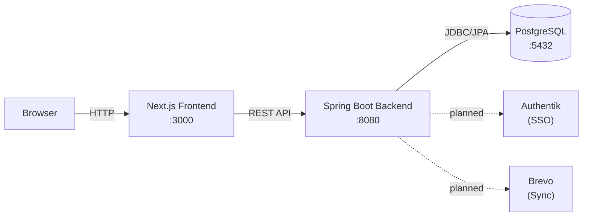
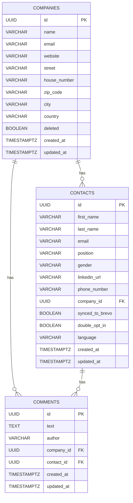

# Project Architecture

## Components

- **Frontend (Next.js)** — Server-side rendered React application using the App Router. Communicates with the backend via REST API calls from both server components (SSR) and client components (browser). Uses `BACKEND_URL` env var for server-side requests and proxies client-side requests through Next.js rewrites.
- **Backend (Spring Boot)** — RESTful JSON API handling business logic, validation, and data persistence. Organized by domain packages (company, contact, comment, health). Exposes OpenAPI documentation via Swagger UI.
- **Database (PostgreSQL)** — Relational storage for all domain data. Schema managed by Flyway migrations. Uses UUID primary keys, soft-delete pattern for companies, and timestamp tracking.

## Communication

- **Frontend → Backend:** HTTP REST (JSON). Server-side calls go directly to `BACKEND_URL`; client-side calls go to the Next.js server which proxies to the backend.
- **Backend → Database:** JDBC via Spring Data JPA. Hibernate validates schema against entity mappings (`ddl-auto: validate`).
- **Schema management:** Flyway runs migrations on startup from `classpath:db/migration`.

## Architecture Diagram

## Data Model

## Key Architectural Decisions

- **Soft-delete for companies** — Companies are marked as `deleted=true` rather than physically removed, allowing restoration. Contacts block company deletion (409 Conflict).
- **Comments are polymorphic** — A comment belongs to either a company or a contact (enforced by a CHECK constraint), never both.
- **Flyway for schema management** — Hibernate is set to `validate` only; all schema changes go through versioned SQL migrations.
- **Separate DTOs per operation** — Each domain uses distinct `CreateDto`, `UpdateDto`, and `Dto` records to control API surface per operation.
- **No authentication yet** — The application currently has no security layer. Authentik SSO integration is planned.
- **Spec-driven development** — Features are planned in `specs/` with design documents, behavioral scenarios (given-when-then), and implementation steps before coding begins.