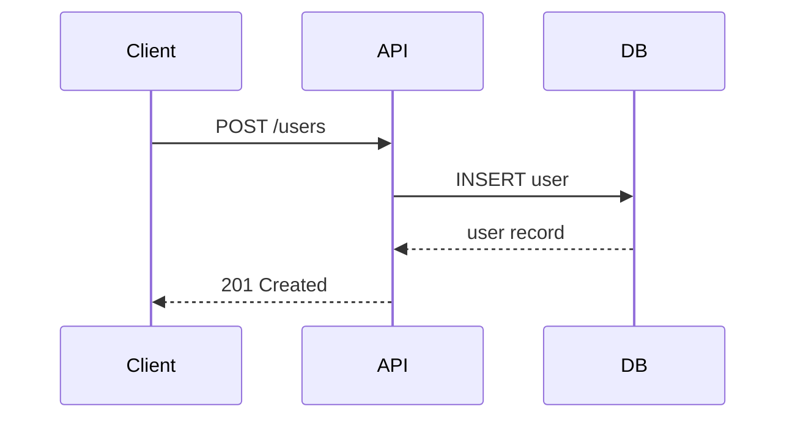

# Spec-Driven Development

This document defines the structure and conventions for the `specs/` directory used in spec-driven development. Features and bug fixes are planned as specifications before implementation begins.

## Overview

Every non-trivial change goes through a specification phase:
1. A GitHub issue describes the **what** and **why**
2. A spec folder contains the **how** — technical design, behavioral scenarios, and optionally implementation steps
3. Implementation follows the spec, and is verified against it

## Directory Structure

Specs live in a `specs/` directory in the project root. Each spec gets its own sub-folder:

```
specs/
├── INDEX.md
├── 001-user-auth-flow/
│   ├── design.md
│   ├── behaviors.md
│   └── steps.md          (optional)
├── 002-csv-export-api/
│   ├── design.md
│   └── behaviors.md
└── ...
```

### Folder Naming

- Format: `<ID>-<short-description>` — the three-digit ID followed by a kebab-case description (e.g., `001-user-auth-flow`, `002-csv-export-api`)
- Keep the description to 3–4 words.
- The ID prefix must match the sequential ID in `INDEX.md`.

### `INDEX.md` — Spec Overview

The file `specs/INDEX.md` is a central index of all specs. It provides Claude and developers with an at-a-glance overview of which specs exist, what they cover, and whether they have been implemented.

Format:

```markdown
# Spec Index

| ID  | Spec-Folder | Name | Areas | Description | GitHub Issue | Status |
|-----|-------------|------|-------|-------------|--------------|--------|
| 001 | 001-user-auth-flow | User auth flow | backend, authentication, database | JWT-based login and registration with refresh tokens | #42 | done |
| 002 | 002-csv-export-api | CSV export API | backend, frontend | REST endpoint to export filtered datasets as CSV | #87 | open |
| 003 | 003-rate-limiting | Rate limiting | backend, security | Token-bucket rate limiting for all public API endpoints | — | in progress |
```

Rules:
- Every spec must have an entry in `INDEX.md`. A spec without an index entry is incomplete.
- **Spec-Folder** contains the exact folder name under `specs/` (e.g., `001-user-auth-flow`). This allows Claude and developers to navigate directly to the spec folder without ambiguity.
- **Areas** lists the affected parts of the project as comma-separated lowercase tags. Common values: `frontend`, `backend`, `database`, `build`, `docker`, `styling`, `documentation`, `authentication`, `security`, `architecture`, `api`, `testing`, `infrastructure`. Use project-appropriate terms — this list is not exhaustive.
- **Status** values: `open` (not started), `in progress` (being implemented), `done` (implemented and verified).
- **GitHub Issue** column contains the issue reference (e.g., `#42`) or `—` if no issue exists.
- The index is updated whenever a spec is created or its status changes.
- The sequential ID in the index determines the canonical order of specs.

## Files

### `design.md` — Technical Design

Describes the technical approach for the change. Sections (include only what is relevant):

- **GitHub Issue** — Link to the source issue
- **Summary** — What is being built and why (1–2 paragraphs)
- **Goals** — What this change aims to achieve
- **Non-goals** — What is explicitly out of scope
- **Technical approach** — High-level implementation strategy
- **API design** — Endpoints, request/response shapes, status codes
- **Data model** — Entities, relationships, migrations
- **Key flows** — Step-by-step execution paths
- **Dependencies** — External services, libraries, internal modules
- **Security considerations** — Auth, validation, data exposure
- **Open questions** — Unresolved items

Key design decisions include a brief **rationale** explaining why the approach was chosen over alternatives.

**For bug fixes**, the design focuses on different sections:
- **Summary** — What is broken and what is the user-visible impact
- **Reproduction** — Steps to reproduce the bug, preconditions, environment details
- **Root cause analysis** — Why the bug occurs, which component is responsible
- **Fix approach** — How the bug will be fixed, which files/components change
- **Regression risk** — What could break as a side effect

Use **Mermaid diagrams** where they help clarify the design — for example sequence diagrams for key flows, entity-relationship diagrams for data models, or component diagrams for architecture. Embed them directly in the Markdown using fenced code blocks:

````markdown

````

Diagrams are optional — only add them when they communicate structure or flow more clearly than text alone.

### `behaviors.md` — Behavioral Scenarios

Defines the expected behavior using given-when-then scenarios (Behavior-Driven Design). These scenarios serve as the basis for unit and integration tests.

Format:

```markdown
# Behaviors: <Spec Name>

## <Feature or Area>

### <Scenario Name>

- **Given** <precondition>
- **When** <action>
- **Then** <expected outcome>
```

Coverage should include:
- **Happy paths** — Main success scenarios
- **Edge cases** — Boundary values, empty inputs, concurrent access
- **Error cases** — Invalid input, missing permissions, downstream failures
- **State transitions** — Before/after states where relevant

Each scenario should be specific enough to translate directly into a test case.

### Drift Log — Tracking Post-Implementation Divergence

After a spec is implemented and its status is `done`, the original `design.md` and `behaviors.md` must not be modified — they serve as a historical record of the design decisions made at the time.

However, later specs may change shared code, causing the implementation to diverge from the original design or behaviors. When `/spec-review` detects such drift, it is recorded in a **Drift Log** section appended to the end of the affected file (`design.md` or `behaviors.md`).

Format for `design.md`:

```markdown
---

## Drift Log

### <Date> — Caused by spec `<ID-spec-folder-name>`

- **Affected element:** <design element that drifted>
- **Original design:** <what was specified>
- **Current state:** <what the code does now>
- **Reason:** <brief explanation of why the other spec changed this>
```

Format for `behaviors.md`:

```markdown
---

## Drift Log

### <Date> — Caused by spec `<ID-spec-folder-name>`

- **Affected scenario:** <scenario name>
- **Original behavior:** <what was specified>
- **Current behavior:** <what the code does now>
- **Reason:** <brief explanation of why the other spec changed this>
```

Rules:
- The Drift Log is always the last section in the file, separated by a horizontal rule (`---`).
- Each entry identifies the causing spec so the chain of changes is traceable.
- Only `/spec-review` writes Drift Log entries — they are not added during normal implementation.
- If drift is detected but no causing spec can be identified, use `unknown` as the spec reference.

### `steps.md` — Implementation Steps (optional)

An ordered, actionable checklist for implementing the spec. Uses GitHub-flavored Markdown checkboxes for tracking progress:

```markdown
# Implementation Steps: <Spec Name>

## Step 1: <Title>

- [ ] Create `src/models/user.ts` with fields: id, email, name, createdAt
- [ ] Create migration `migrations/001_create_users.sql`

**Acceptance criteria:**
- [ ] Migration runs successfully
- [ ] Entity can be instantiated in a test
- [ ] Unit tests for new code exist and pass
- [ ] Project builds successfully

**Related behaviors:** User creation happy path

---

## Step 2: <Title>
...
```

Each step is:
- **Atomic** — One focused change
- **Independently verifiable** — Can be confirmed after completion
- **Sequenced by dependency** — Earlier steps are foundations for later ones

## Roadmap Integration

Projects may include a `ROADMAP.md` in the project root that defines high-level milestones as a checklist:

```markdown
# Roadmap V1

- [ ] User authentication with JWT (login, registration, password reset)
- [ ] Dashboard page showing key metrics
- [ ] CSV export for reports
- [x] Project setup (already done)
```

Each top-level checkbox represents one step that maps to a spec. Steps marked `[x]` are completed. The roadmap provides the **what** at a high level — specs provide the **how** in detail.

When a `ROADMAP.md` exists, the `/roadmap-execute` skill can autonomously process all unchecked steps end-to-end: creating specs, implementing them, reviewing, and committing — using a fresh sub-agent for each step to avoid context bloat.

The roadmap is optional. Projects can also create specs directly from GitHub issues using `/spec-create`.

## Workflow

The spec-driven workflow uses three skills:

| Skill | Purpose |
|-------|---------|
| `/spec-create` | Create `design.md` and `behaviors.md` through interactive discussion |
| `/spec-implement` | Generate `steps.md` from a completed spec |
| `/spec-review` | Verify implementation completeness against design and behaviors |
| `/spec-flow` | End-to-end GitHub flow: issue → branch → implement → review → PR |
| `/roadmap-execute` | Autonomously process all unchecked steps in `ROADMAP.md` end-to-end using sub-agents |

A typical flow:
1. Start with a GitHub issue (or create one first)
2. `/spec-create` — Plan the change collaboratively
3. `/spec-implement` — Break it down into steps (optional)
4. Implement (manually, guided, or automated)
5. `/spec-review` — Verify completeness

Alternative flow with spec-flow (recommended for a complete GitHub workflow):
1. Start with a GitHub issue (or create one first)
2. `/spec-create` — Plan the change collaboratively
3. `/spec-flow` — Implements, reviews iteratively, and opens a PR

Alternative flow with roadmap:
1. Write a `ROADMAP.md` with high-level steps
2. `/roadmap-execute` — Processes all steps autonomously (creates specs, implements, reviews, commits)

## Principles

- **English only** — All spec documents (`design.md`, `behaviors.md`, `steps.md`) must be written in English, regardless of what language the user communicates in. This ensures specs are accessible to all contributors and consistent across projects.
- **Issue first** — Every PR should have a corresponding GitHub issue
- **Discuss before writing** — Specs are created through dialogue, not generated silently
- **Right-size the spec** — A bug fix needs less documentation than a new feature. Skip sections that are not relevant.
- **Living documents during implementation** — Specs can be updated during implementation if decisions change. Once a spec reaches `done` status, the original design and behaviors are frozen. Post-implementation divergence is tracked in the Drift Log.
- **Specs are not throwaway** — They remain in the repository as documentation of design decisions and expected behavior
- **Commits and PRs are human work** — Developers create commits and pull requests themselves. The spec folder and its design decisions should be referenced in the PR description, but the PR itself is authored by the developer, not generated by AI.
