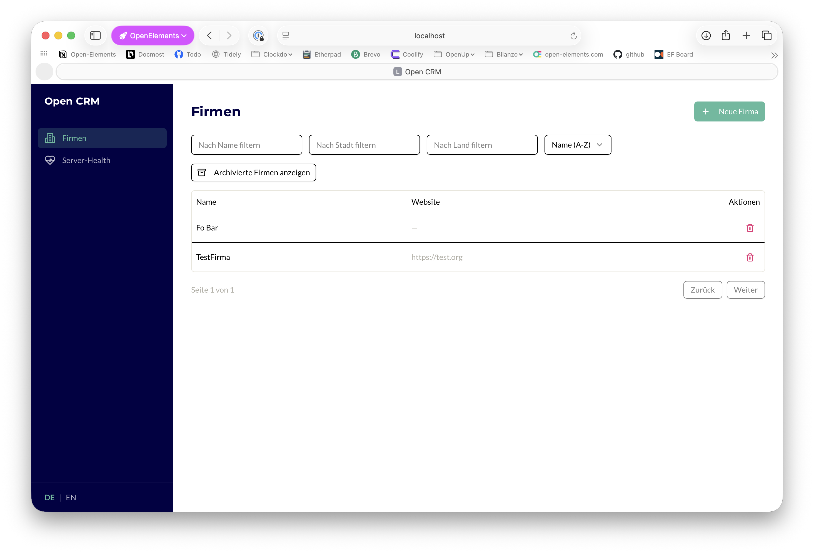
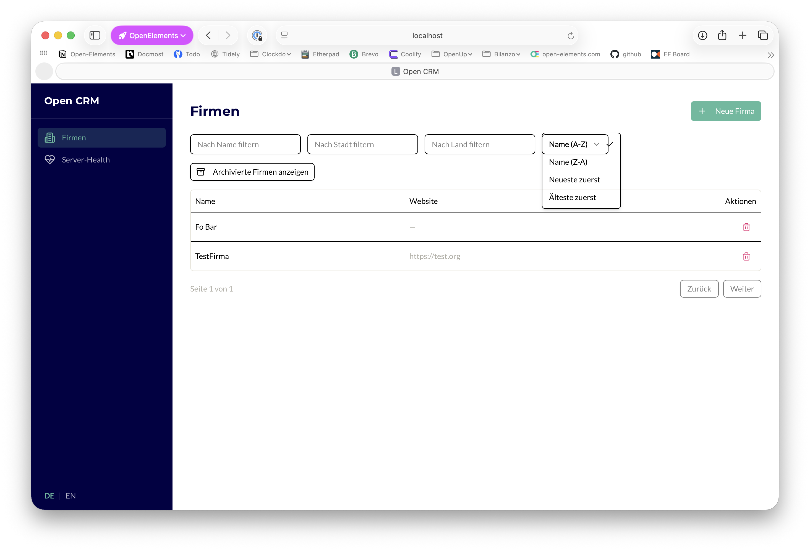
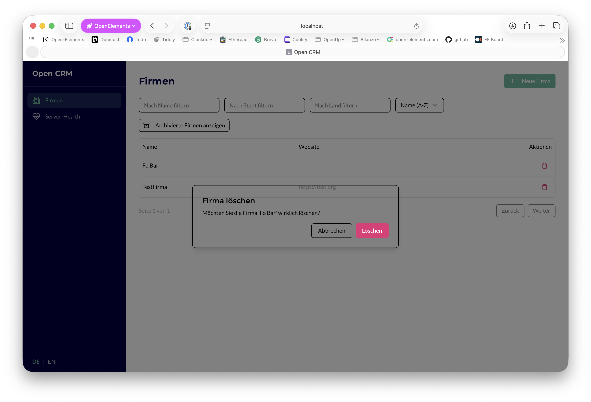

# Design: Global UI Styling Fixes

## GitHub Issue

— (to be created)

## Summary

The frontend uses shadcn/ui components that reference semantic CSS variables (e.g., `bg-background`, `bg-popover`, `border`) via Tailwind utility classes. However, `globals.css` only defines Open Elements brand colors — none of the 21 shadcn/ui semantic tokens are mapped. This causes three visible problems:

1. **Dialogs are transparent** — `AlertDialog` content uses `bg-background`, which resolves to nothing, making dialogs nearly unusable.
2. **Select dropdowns are transparent** — `SelectContent` uses `bg-popover`, same problem.
3. **Table row borders are too heavy** — `border` color is undefined and falls back to browser default (solid black), making row separators as prominent as the header separator.

These issues affect the entire application globally, but are currently only visible on Company views since those are the only pages with interactive dialogs and select dropdowns.

### Current State (Screenshots)

| Screenshot | Shows |
|------------|-------|
|  | Company list table with overly heavy black row separators |
|  | Sort select dropdown with transparent background — table content visible through the dropdown |
|  | Delete confirmation dialog with transparent background — page content visible behind the dialog |

## Goals

- All dialogs render with an opaque white background and visible shadow
- All select/combobox dropdowns render with an opaque white background
- Table row separators use a subtle, light color instead of the browser default black
- All shadcn/ui semantic tokens are mapped to Open Elements brand colors so future components work out of the box

## Non-goals

- Changing the shadcn/ui component files themselves
- Adding dark mode support
- Redesigning the table layout (e.g., zebra-striping)
- Changing the overall color scheme or brand identity

## Root Cause Analysis

The shadcn/ui components were installed with `cssVariables: true` (confirmed in `components.json`). This means components use Tailwind utility classes like `bg-background`, `bg-popover`, `text-foreground`, etc., which map to CSS custom properties like `--color-background`, `--color-popover`, `--color-foreground`.

The `globals.css` file defines brand colors (`--color-oe-dark`, `--color-oe-green`, etc.) inside a `@theme` block but does **not** define the semantic tokens that shadcn/ui components expect. When these variables are undefined, the computed value is empty/transparent.

**Rationale:** Fixing this at the CSS variable level (rather than overriding per-component) is the correct approach because:
- It solves all three problems in a single place
- It ensures any future shadcn/ui components added to the project will work correctly
- It follows the intended shadcn/ui theming architecture

## Technical Approach

Add all 21 missing semantic CSS variables to the existing `@theme` block in `frontend/src/app/globals.css`, mapped to Open Elements brand colors.

### Variable Mapping

| Semantic Token | CSS Variable | Value | Source |
|---|---|---|---|
| background | `--color-background` | `#ffffff` | oe-white |
| foreground | `--color-foreground` | `#000000` | oe-black |
| card | `--color-card` | `#ffffff` | oe-white |
| card-foreground | `--color-card-foreground` | `#000000` | oe-black |
| popover | `--color-popover` | `#ffffff` | oe-white |
| popover-foreground | `--color-popover-foreground` | `#000000` | oe-black |
| muted | `--color-muted` | `#e8e6dc` | oe-gray-light |
| muted-foreground | `--color-muted-foreground` | `#b0aea5` | oe-gray-mid |
| accent | `--color-accent` | `#e8e6dc` | oe-gray-light |
| accent-foreground | `--color-accent-foreground` | `#000000` | oe-black |
| primary | `--color-primary` | `#5CBA9E` | oe-green |
| primary-foreground | `--color-primary-foreground` | `#ffffff` | oe-white |
| secondary | `--color-secondary` | `#e8e6dc` | oe-gray-light |
| secondary-foreground | `--color-secondary-foreground` | `#000000` | oe-black |
| destructive | `--color-destructive` | `#E63277` | oe-red |
| destructive-foreground | `--color-destructive-foreground` | `#ffffff` | oe-white |
| border | `--color-border` | `#e8e6dc` | oe-gray-light |
| input | `--color-input` | `#e8e6dc` | oe-gray-light |
| ring | `--color-ring` | `#5CBA9E` | oe-green |

### Design Decisions

- **Border color = `oe-gray-light`:** Subtle enough for row separators but still visible. The table header retains visual prominence through `font-medium` text weight, not a different border color.
- **Primary = `oe-green`:** Aligns with the existing button styling convention (green for primary actions).
- **Destructive = `oe-red`:** Aligns with the existing delete button convention.
- **Muted/Accent/Secondary = `oe-gray-light`:** Provides a neutral, on-brand surface for hover states, disabled elements, and secondary actions.
- **Ring = `oe-green`:** Focus indicators use the primary brand color for consistency.

## Files Affected

| File | Change |
|------|--------|
| `frontend/src/app/globals.css` | Add 21 semantic CSS variables to `@theme` block |

## Regression Risk

- **Low.** This change only adds previously undefined CSS variables. No existing styling is overridden. Components that already use inline colors or brand-color classes directly are unaffected.
- The only visual changes are: transparent backgrounds become white, and black borders become light gray — both are the intended appearance.

## Open Questions

- Should the table header border be visually heavier than the row borders? Currently both use the same `--color-border`. If the header needs more emphasis, a small change to `table.tsx` would be needed (e.g., `border-b-2` or a darker border class on `TableHeader`).