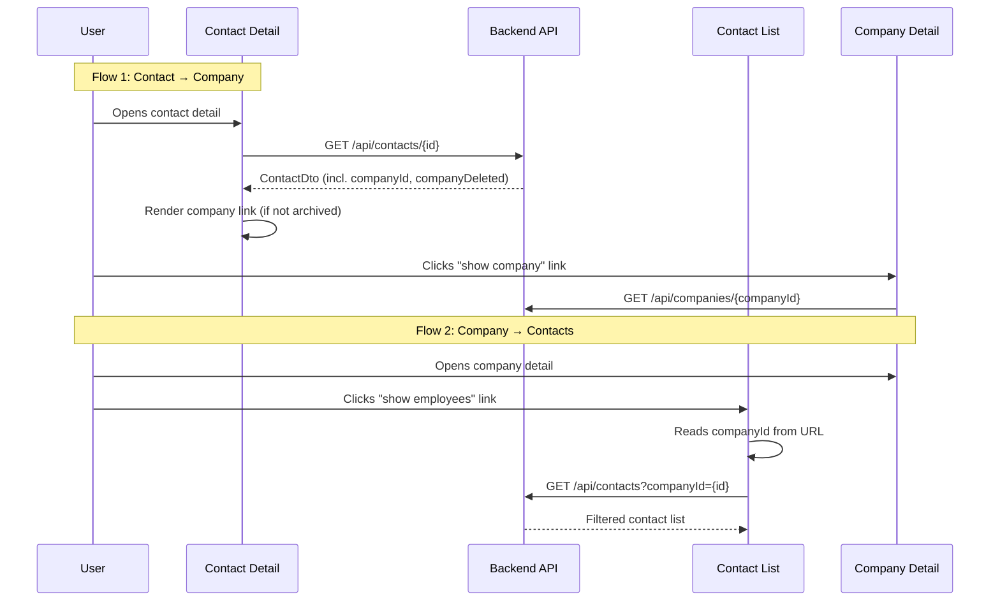

# Design: Contact–Company Cross-Navigation

## GitHub Issue

_(to be linked once created)_

## Summary

Contacts and companies are related entities in the CRM, but the UI provides no cross-navigation between their detail views. A user viewing a contact must manually navigate via the sidebar to find the associated company, and vice versa. This spec adds bidirectional navigation links: a company link in the contact detail view, and a "show employees" link in the company detail view.

## Goals

- Allow users to navigate from a contact's detail view directly to the associated company
- Allow users to navigate from a company's detail view to a filtered list of that company's contacts
- Eliminate the extra API call in the contact detail page by including `companyDeleted` in the backend DTO

## Non-goals

- Full URL ↔ filter dropdown synchronization in the contact list (deferred to a future spec, tracked in `TODO.md`)
- Adding employee count to the company detail view or company list
- Inline display of contacts within the company detail view

## Technical Approach

### Backend: Add `companyDeleted` to `ContactDto`

The `ContactDto` Java record already resolves `companyId` and `companyName` from the associated `CompanyEntity`. A new boolean field `companyDeleted` will be added, resolved from the company's soft-delete status.

**File:** `backend/src/main/java/com/openelements/crm/contact/ContactDto.java`

- Add `companyDeleted` field to the record signature
- In `fromEntity()`: set to `company.isDeleted()` when company is non-null, `false` otherwise
- Add `@Schema` annotation consistent with existing fields

**Rationale:** The contact detail page (`contacts/[id]/page.tsx`) currently makes a separate `getCompany()` API call solely to check `company.deleted`. Including this in the DTO eliminates that call and keeps the frontend simpler.

### Frontend: Contact Detail → Company Link

**File:** `frontend/src/components/contact-detail.tsx`

The existing company field (lines 122–138) renders the company name as static text with an optional "archived" badge. This will be changed to:

- **Company exists and is active (`companyId` present, `companyDeleted` false):** Render as a Next.js `<Link>` to `/companies/{companyId}` with an additional label "zur Firma" / "show company"
- **Company exists but is archived (`companyDeleted` true):** Keep static text + archived badge, no link
- **No company:** Keep "—"

The `companyDeleted` prop currently passed from the page component will be removed — the component will read `contact.companyDeleted` directly from the DTO.

**File:** `frontend/src/app/contacts/[id]/page.tsx`

- Remove the `getCompany()` call and `companyDeleted` logic
- Pass only `contact` to `<ContactDetail>`

### Frontend: Company Detail → "Show Employees" Link

**File:** `frontend/src/components/company-detail.tsx`

A new link will be added to the header actions area (alongside Edit and Delete buttons):

- Uses the `Users` icon from Lucide
- Label: "Alle Mitarbeiter" / "show employees"
- Navigates to `/contacts?companyId={company.id}`
- When `company.deleted` is true: rendered as disabled (grayed out, not clickable)

**Rationale:** Placed in the header with other actions for consistency. Uses a link style (not a filled button) to visually distinguish navigation from mutation actions (Edit, Delete).

### Frontend: Contact List Reads `companyId` from URL

**File:** `frontend/src/components/contact-list.tsx`

- Use `useSearchParams()` to read `companyId` from the URL on mount
- Initialize `companyIdFilter` state from the URL parameter if present
- The filter dropdown will **not** reflect this initial value (out of scope)

**Rationale:** This is the minimum needed to make the "show employees" link functional. Full bidirectional URL ↔ filter sync is a separate concern.

### i18n Labels

**Files:** `frontend/src/lib/i18n/de.ts`, `frontend/src/lib/i18n/en.ts`

| Key | DE | EN |
|-----|----|----|
| `contacts.detail.showCompany` | zur Firma | show company |
| `companies.detail.showEmployees` | Alle Mitarbeiter | show employees |

### Frontend Type Update

**File:** `frontend/src/lib/types.ts`

Add `companyDeleted: boolean` to the `ContactDto` interface.

## Key Flows

## Dependencies

- Backend `CompanyEntity` must have a `deleted` (or equivalent) boolean field — already exists
- Frontend `useSearchParams()` from Next.js — already available

## Open Questions

- None — all questions resolved during grill session
