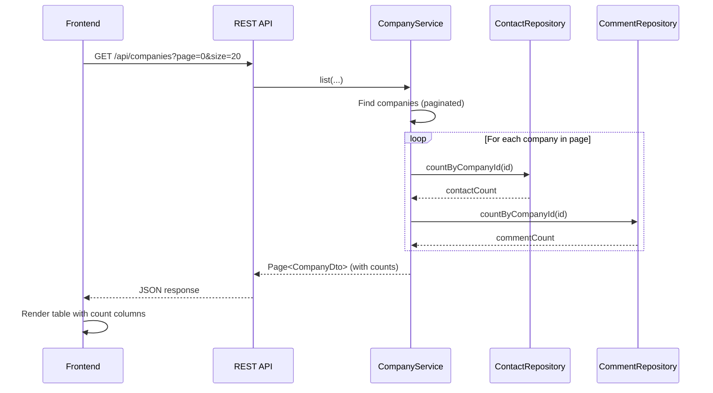

# Design: Count Columns for Company and Contact Tables

## GitHub Issue

_(to be linked once created)_

## Summary

The company and contact list tables currently show minimal information. Users must navigate into detail views to understand how many contacts belong to a company or how many comments exist. This spec adds count columns to both list tables and displays counts in the detail views, giving users at-a-glance visibility without extra navigation.

## Goals

- Show contact count and comment count in the company list table
- Show comment count in the contact list table
- Display comment count in detail view headings for both companies and contacts
- Display contact count in the "show employees" link on company detail
- Deliver counts as part of existing DTOs (no additional REST endpoints)

## Non-goals

- Making count columns sortable (would require significant backend query changes)
- Adding count-based filtering
- Birthday field for contacts (separate spec)
- Image upload for companies/contacts (separate spec)

## Technical Approach

### Backend: Repository Count Methods

**File:** `backend/src/main/java/com/openelements/crm/comment/CommentRepository.java`

Add Spring Data derived query methods:
- `long countByCompanyId(UUID companyId)` — count comments for a company
- `long countByContactId(UUID contactId)` — count comments for a contact

**File:** `backend/src/main/java/com/openelements/crm/contact/ContactRepository.java`

Add:
- `long countByCompanyId(UUID companyId)` — count contacts for a company

**Rationale:** Spring Data derived queries are simple, well-tested, and sufficient for the expected data volumes. For a page of 20 companies this means up to 40 extra queries (20 for contact counts + 20 for comment counts). This is acceptable for a startup CRM with low concurrent user counts.

### Backend: Update `CompanyDto`

**File:** `backend/src/main/java/com/openelements/crm/company/CompanyDto.java`

Add two new fields to the record:
- `long contactCount` — number of contacts associated with this company
- `long commentCount` — number of comments on this company

The existing `fromEntity()` static factory method cannot resolve counts because it has no access to repositories. Two options:

1. **Remove `fromEntity()` and build DTOs in the service layer** — keeps the DTO a plain data carrier
2. **Add a new `fromEntity(entity, contactCount, commentCount)` overload** — keeps construction close to the record

**Decision:** Option 2 (overloaded factory method). This keeps the mapping logic in one place while accepting the count values as parameters. The service layer resolves the counts and passes them in.

### Backend: Update `CompanyService`

**File:** `backend/src/main/java/com/openelements/crm/company/CompanyService.java`

- Inject `CommentRepository`
- In every method that returns a `CompanyDto`, resolve counts via repository calls:
  - `contactRepository.countByCompanyId(id)`
  - `commentRepository.countByCompanyId(id)`
- In `list()`, map each entity in the page to a DTO with counts
- In `create()`, counts are 0 (new company, no contacts or comments yet)

### Backend: Update `ContactDto`

**File:** `backend/src/main/java/com/openelements/crm/contact/ContactDto.java`

Add:
- `long commentCount` — number of comments on this contact

Same pattern: overloaded `fromEntity(entity, commentCount)` factory method.

### Backend: Update `ContactService`

**File:** `backend/src/main/java/com/openelements/crm/contact/ContactService.java`

- Inject `CommentRepository`
- Resolve `commentRepository.countByContactId(id)` when building DTOs
- In `create()`, comment count is 0

### Frontend: TypeScript Types

**File:** `frontend/src/lib/types.ts`

- Add `contactCount: number` and `commentCount: number` to `CompanyDto`
- Add `commentCount: number` to `ContactDto`

### Frontend: Company List Table

**File:** `frontend/src/components/company-list.tsx`

Add two new columns between "Website" and "Actions":
- "Kontakte" / "Contacts" — displays `company.contactCount`
- "Kommentare" / "Comments" — displays `company.commentCount`

Column order: Name, Website, **Contacts**, **Comments**, Actions

Both columns are display-only (no sorting). Values are plain numbers.

### Frontend: Contact List Table

**File:** `frontend/src/components/contact-list.tsx`

Add one new column between "Company" and "Actions":
- "Kommentare" / "Comments" — displays `contact.commentCount`

Column order: First Name, Last Name, Company, **Comments**, Actions

### Frontend: Company Detail View

**File:** `frontend/src/components/company-detail.tsx`

- The "show employees" link (from spec 010) shows contact count as `(x)` suffix, e.g., "Alle Mitarbeiter (5)"
- Pass `company.commentCount` to the `CompanyComments` component

### Frontend: Company Comments Component

**File:** `frontend/src/components/company-comments.tsx`

- Accept an optional `totalCount` prop (number)
- Display as `(x)` after the "Kommentare" / "Comments" heading, e.g., "Kommentare (12)"
- When `totalCount` is provided, use it; otherwise fall back to not showing a count (backwards compatible)

### Frontend: Contact Detail View

**File:** `frontend/src/components/contact-detail.tsx`

- Show comment count as `(x)` after the "Kommentare" / "Comments" heading
- Uses `contact.commentCount` from the DTO

### Frontend: i18n Labels

**Files:** `frontend/src/lib/i18n/de.ts`, `frontend/src/lib/i18n/en.ts`

| Key | DE | EN |
|-----|----|----|
| `companies.columns.contacts` | Kontakte | Contacts |
| `companies.columns.comments` | Kommentare | Comments |
| `contacts.columns.comments` | Kommentare | Comments |

## Key Flows

## Dependencies

- Spec 010 (Contact-Company Navigation) must be implemented — the "show employees" link is where the contact count is displayed in the detail view
- `CommentRepository` already exists with `findByCompanyId` and `findByContactId` — adding `countBy*` methods follows the same pattern

## Open Questions

- None — all resolved during grill session

---

## Appendix: Known Limitations

### Comment count does not update live after adding a comment

The `totalCount` displayed in the comments heading ("Kommentare (x)") comes from the DTO loaded when the page was first rendered. When a user adds a new comment via the modal dialog, the new comment appears in the list, but the count in the heading remains unchanged until the next page load. This is acceptable for the current project phase — a live update would require either re-fetching the parent entity after each comment creation or maintaining a separate client-side counter synchronized with the comment list state.
