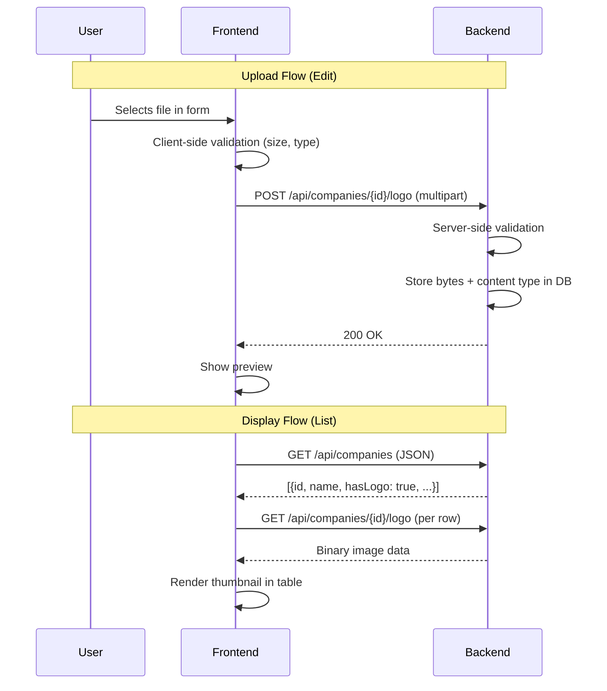

# Design: Company Logo & Contact Photo Upload

## GitHub Issue

_(to be linked once created)_

## Summary

Companies and contacts in the CRM lack visual identity. Users want to see logos and photos at a glance — in list tables as thumbnails and in detail views as larger images. This spec introduces file upload infrastructure to the backend (which currently has none) and adds image display throughout the frontend.

## Goals

- Upload, view, replace, and remove company logos (SVG, PNG, JPEG)
- Upload, view, replace, and remove contact photos (JPEG)
- Display thumbnails in list tables as the first column
- Display larger images in detail views
- Show placeholder icons when no image is uploaded

## Non-goals

- Image resizing or thumbnail generation (images are served as-is)
- SVG sanitization (only trusted users access the CRM)
- Cloud storage (S3, MinIO) — images are stored in the database
- Drag & drop upload (unless a ready-made component is available)

## Technical Approach

### Data Model

**Migration:** `V5__add_images.sql`

```sql
ALTER TABLE companies ADD COLUMN logo BYTEA;
ALTER TABLE companies ADD COLUMN logo_content_type VARCHAR(50);

ALTER TABLE contacts ADD COLUMN photo BYTEA;
ALTER TABLE contacts ADD COLUMN photo_content_type VARCHAR(50);
```

**Rationale:** Storing images as `bytea` in PostgreSQL keeps the architecture simple — one backup, one data store, no external dependencies. For the expected initial data volume this is acceptable. The `content_type` column stores the MIME type so the GET endpoint can set the correct `Content-Type` header.

### Backend: Spring Multipart Configuration

**File:** `backend/src/main/resources/application.yml`

```yaml
spring:
  servlet:
    multipart:
      max-file-size: 2MB
      max-request-size: 2MB
```

### Backend: Entity Updates

**File:** `backend/src/main/java/com/openelements/crm/company/CompanyEntity.java`

Add:
- `byte[] logo` — mapped to `logo` column, `@Lob` annotated, fetch `LAZY`
- `String logoContentType` — mapped to `logo_content_type`

**File:** `backend/src/main/java/com/openelements/crm/contact/ContactEntity.java`

Add:
- `byte[] photo` — mapped to `photo` column, `@Lob` annotated, fetch `LAZY`
- `String photoContentType` — mapped to `photo_content_type`

**Rationale:** `LAZY` fetch on the byte arrays ensures that listing queries do not load image data into memory. The bytes are only fetched when explicitly accessed via the image endpoints.

### Backend: DTO Updates

**File:** `backend/src/main/java/com/openelements/crm/company/CompanyDto.java`

Add:
- `boolean hasLogo` — true when `logo` is non-null

**File:** `backend/src/main/java/com/openelements/crm/contact/ContactDto.java`

Add:
- `boolean hasPhoto` — true when `photo` is non-null

No binary data in DTOs. The frontend uses `hasLogo`/`hasPhoto` to decide whether to load the image via the dedicated endpoint or show a placeholder.

### Backend: API Endpoints

#### Company Logo

**File:** `backend/src/main/java/com/openelements/crm/company/CompanyController.java`

| Method | Path | Description |
|--------|------|-------------|
| `POST` | `/api/companies/{id}/logo` | Upload logo (`multipart/form-data`, field `file`) |
| `GET` | `/api/companies/{id}/logo` | Get logo as binary with correct `Content-Type` |
| `DELETE` | `/api/companies/{id}/logo` | Remove logo |

- **POST** validates: file is present, content type is `image/svg+xml`, `image/png`, or `image/jpeg`, size ≤ 2MB. Returns 400 on validation failure, 404 if company not found.
- **GET** returns `ResponseEntity<byte[]>` with the stored `Content-Type`. Returns 404 if company not found or no logo exists.
- **DELETE** sets logo and content type to null. Returns 204. Returns 404 if company not found.

#### Contact Photo

**File:** `backend/src/main/java/com/openelements/crm/contact/ContactController.java`

| Method | Path | Description |
|--------|------|-------------|
| `POST` | `/api/contacts/{id}/photo` | Upload photo (`multipart/form-data`, field `file`) |
| `GET` | `/api/contacts/{id}/photo` | Get photo as binary |
| `DELETE` | `/api/contacts/{id}/photo` | Remove photo |

- **POST** validates: content type is `image/jpeg` only, size ≤ 2MB.
- **GET** and **DELETE** follow the same pattern as company logo.

### Backend: Service Methods

**File:** `backend/src/main/java/com/openelements/crm/company/CompanyService.java`

Add:
- `uploadLogo(UUID id, byte[] data, String contentType)` — stores logo bytes and content type
- `ImageData getLogo(UUID id)` — returns bytes + content type (or throws 404)
- `deleteLogo(UUID id)` — sets logo to null

**File:** `backend/src/main/java/com/openelements/crm/contact/ContactService.java`

Add:
- `uploadPhoto(UUID id, byte[] data, String contentType)` — stores photo bytes and content type
- `ImageData getPhoto(UUID id)` — returns bytes + content type (or throws 404)
- `deletePhoto(UUID id)` — sets photo to null

A simple `ImageData` record (or similar) holds `byte[] data` and `String contentType` for the GET response.

### Frontend: API Functions

**File:** `frontend/src/lib/api.ts`

```typescript
// Company Logo
uploadCompanyLogo(id: string, file: File): Promise<void>    // POST multipart
getCompanyLogoUrl(id: string): string                        // returns URL string
deleteCompanyLogo(id: string): Promise<void>                 // DELETE

// Contact Photo
uploadContactPhoto(id: string, file: File): Promise<void>
getContactPhotoUrl(id: string): string
deleteContactPhoto(id: string): Promise<void>
```

`getCompanyLogoUrl` / `getContactPhotoUrl` return a URL string (e.g., `/api/companies/{id}/logo`) that can be used directly in ``. No fetch needed — the browser loads the image.

### Frontend: TypeScript Types

**File:** `frontend/src/lib/types.ts`

- `CompanyDto`: add `hasLogo: boolean`
- `ContactDto`: add `hasPhoto: boolean`

### Frontend: List Tables — Image Column

**File:** `frontend/src/components/company-list.tsx`

New first column (before Name):
- If `company.hasLogo`: render `` with `src={getCompanyLogoUrl(company.id)}`, sized ~32x32, rounded
- If `!company.hasLogo`: render a `Building2` Lucide icon as placeholder (gray, same size)

**File:** `frontend/src/components/contact-list.tsx`

New first column (before First Name):
- If `contact.hasPhoto`: render `` with `src={getContactPhotoUrl(contact.id)}`, sized ~32x32, rounded-full
- If `!contact.hasPhoto`: render a `User` Lucide icon as placeholder

### Frontend: Detail Views

**File:** `frontend/src/components/company-detail.tsx`

Show logo near the company name in the header area. Larger size (~96x96). Placeholder `Building2` icon if no logo.

**File:** `frontend/src/components/contact-detail.tsx`

Show photo near the contact name in the header area. Larger size (~96x96), rounded-full. Placeholder `User` icon if no photo.

### Frontend: Forms — Upload

**File:** `frontend/src/components/company-form.tsx`

Add a file input field for logo:
- Standard `<input type="file" accept="image/svg+xml,image/png,image/jpeg">` styled with shadcn/ui Button
- Preview of selected file (or current logo if editing)
- "Remove logo" button if a logo exists
- Client-side validation: file size ≤ 2MB, allowed MIME types
- Upload happens as a separate API call after the entity is created/updated

**File:** `frontend/src/components/contact-form.tsx`

Same pattern but:
- `accept="image/jpeg"` only
- "Remove photo" button

**Upload flow for create:** First create the entity (POST), then upload the image (POST logo/photo). If image upload fails, the entity still exists but without an image — user can retry.

**Upload flow for edit:** Image upload/delete is independent of the entity update. The form handles both.

### Frontend: i18n Labels

**Files:** `frontend/src/lib/i18n/de.ts`, `frontend/src/lib/i18n/en.ts`

| Key | DE | EN |
|-----|----|----|
| `companies.form.logo` | Logo | Logo |
| `companies.form.uploadLogo` | Logo hochladen | Upload logo |
| `companies.form.removeLogo` | Logo entfernen | Remove logo |
| `contacts.form.photo` | Foto | Photo |
| `contacts.form.uploadPhoto` | Foto hochladen | Upload photo |
| `contacts.form.removePhoto` | Foto entfernen | Remove photo |
| `common.imageErrors.tooLarge` | Datei ist zu groß (max. 2 MB) | File is too large (max. 2 MB) |
| `common.imageErrors.invalidFormat` | Ungültiges Dateiformat | Invalid file format |

## Key Flows



## Deletion Behavior

- **Replace:** Uploading a new image overwrites the old one (no versioning)
- **Remove:** DELETE endpoint sets bytes to null, frontend shows placeholder
- **Soft-delete company:** Logo bytes remain in DB, available after restore
- **Hard-delete contact:** Photo bytes deleted with the row (CASCADE)

## GDPR Consideration

Contact photos are personal data under DSGVO. Covered by the same legal basis as other contact data. Photos are deleted when the contact is hard-deleted. Photos can be removed individually via the DELETE endpoint.

## Dependencies

- Spring Boot multipart support (built-in, just needs configuration)
- Lucide icons `Building2` and `User` for placeholders (already available)

## Open Questions

- None
