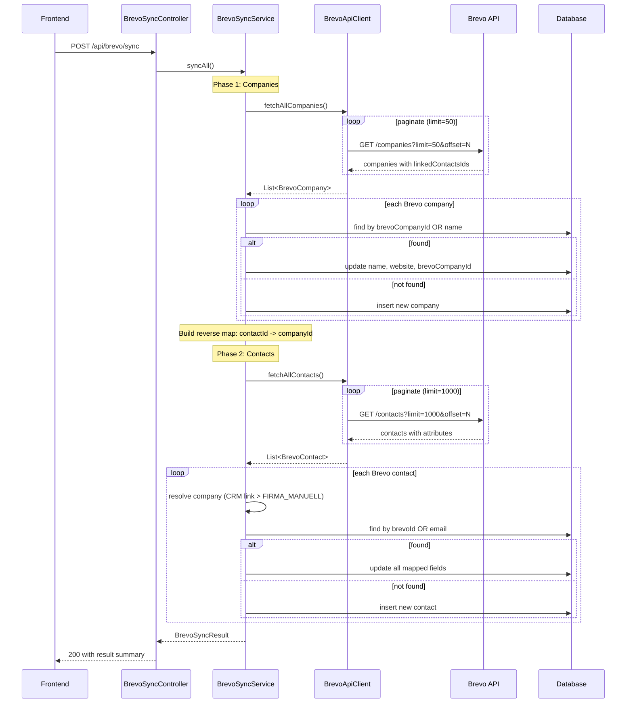

# Design: Brevo Import

## GitHub Issue

---

## Summary

Add a one-directional import (Brevo to CRM) for companies and contacts. The import is triggered manually from a new "Brevo Sync" page in the frontend. A single Brevo API key per CRM instance is stored in a new `settings` database table. Companies are imported from the Brevo CRM Companies API, contacts from the Brevo Contacts API. Field mapping between Brevo attributes and CRM entity fields is predefined. On conflict, Brevo data always wins. CRM-only records are left untouched.

## Goals

- Import Brevo CRM companies into the CRM companies table (name, domain)
- Import Brevo contacts into the CRM contacts table with correct field mapping
- Link imported contacts to their companies (explicit Brevo CRM company link takes priority over FIRMA_MANUELL text field)
- Provide a settings UI for storing and managing the Brevo API key
- Show import results with counts (imported, updated, failed)
- Support partial failure: already-imported records are kept if a later record fails

## Non-goals

- CRM to Brevo export (sync is one-directional, Brevo to CRM only)
- Automatic or scheduled imports (manual trigger only)
- Encryption of the API key at rest
- Duplicate detection and merging for companies created from FIRMA_MANUELL (tracked separately in TODO.md)
- Incremental sync based on modification timestamps (every import fetches all data)
- Webhook-based real-time sync

---

## Database Changes

### Migration V5: Brevo sync columns and nullable language

**File:** `backend/src/main/resources/db/migration/V5__add_brevo_sync_columns.sql`

```sql
-- Brevo company ID for matching after first import
ALTER TABLE companies ADD COLUMN brevo_company_id BIGINT;
CREATE UNIQUE INDEX idx_companies_brevo_company_id
    ON companies(brevo_company_id) WHERE brevo_company_id IS NOT NULL;

-- Brevo contact ID for matching after first import
ALTER TABLE contacts ADD COLUMN brevo_id BIGINT;
CREATE UNIQUE INDEX idx_contacts_brevo_id
    ON contacts(brevo_id) WHERE brevo_id IS NOT NULL;

-- Make language nullable (prerequisite for SPRACHE=Unbekannt mapping)
ALTER TABLE contacts ALTER COLUMN language DROP NOT NULL;
```

Both Brevo ID columns are nullable (only set for records that originated from Brevo). Partial unique indexes ensure no two CRM records map to the same Brevo record while allowing multiple NULLs.

**Rationale for nullable language:** The Brevo SPRACHE attribute has value "Unbekannt" (3) which maps to `null` in the CRM. The existing `language` column is NOT NULL, which would prevent importing contacts with unknown language. This change overlaps with spec 015 (optional contact language).

### Migration V6: Settings table

**File:** `backend/src/main/resources/db/migration/V6__create_settings.sql`

```sql
CREATE TABLE settings (
    key         VARCHAR(100)    PRIMARY KEY,
    value       TEXT            NOT NULL,
    created_at  TIMESTAMPTZ     NOT NULL DEFAULT now(),
    updated_at  TIMESTAMPTZ     NOT NULL DEFAULT now()
);
```

A generic key-value table. The Brevo API key is stored under key `brevo.api-key`.

**Rationale:** The requirement specifies one API key per CRM instance stored in the database (not a config file), so it can be managed at runtime through the UI without restarting the application.

---

## Backend Architecture

### Package structure

Following the existing domain-driven package layout:

```
com.openelements.crm.settings/
    SettingsEntity.java
    SettingsRepository.java
    SettingsService.java

com.openelements.crm.brevo/
    BrevoApiClient.java
    BrevoSyncService.java
    BrevoSyncController.java
    BrevoCompany.java          (internal record)
    BrevoContact.java          (internal record)
    BrevoSyncResultDto.java
    BrevoSettingsDto.java
    BrevoSettingsUpdateDto.java
```

### Settings module

**`SettingsEntity`** -- JPA entity for the `settings` table with `String key` (@Id), `String value`, `Instant createdAt`, `Instant updatedAt`. Follows existing entity patterns (protected default constructor, `Objects.requireNonNull` on non-nullable setters).

**`SettingsRepository`** -- `JpaRepository<SettingsEntity, String>`.

**`SettingsService`** -- `@Service`, `@Transactional`. Methods:
- `Optional<String> get(String key)` -- returns the value for a key
- `void set(String key, String value)` -- upsert
- `void delete(String key)` -- remove

### Brevo API client

**`BrevoApiClient`** -- `@Component`. Uses Spring's `RestClient` (included in `spring-boot-starter-web`, no additional dependency).

The API key is read from `SettingsService` at call time (not at construction time), since the key can be changed at runtime.

**Methods:**

```java
List<BrevoCompany> fetchAllCompanies()
List<BrevoContact> fetchAllContacts()
```

**Rate limiting:** Brevo allows 10 requests/second on contact endpoints. The client enforces this with a simple elapsed-time check between requests: if less than 100ms since the last call, sleep for the remainder.

**Internal DTOs:**

`BrevoCompany` record:
- `long id`
- `String name`
- `String domain`
- `List<Long> linkedContactsIds`

`BrevoContact` record:
- `long id`
- `String email`
- `Map<String, Object> attributes`

**Rationale for RestClient over WebClient:** The import is a synchronous, sequential operation. RestClient is the modern synchronous HTTP client in Spring Boot 3.4, replacing RestTemplate. No need for reactive WebClient.

### Brevo sync service

**`BrevoSyncService`** -- `@Service`. Orchestrates the full import. Does NOT use class-level `@Transactional` because each record upsert must be its own transaction for partial-failure semantics.

Uses `TransactionTemplate` for programmatic transaction boundaries per record.

**Concurrency guard:** An `AtomicBoolean syncInProgress` field prevents concurrent imports.

### Brevo sync controller

**`BrevoSyncController`** -- `@RestController`, `@RequestMapping("/api/brevo")`, `@Tag(name = "Brevo Sync")`.

---

## API Design

| Method | Endpoint | Request Body | Response | Description |
|--------|----------|-------------|----------|-------------|
| `GET` | `/api/brevo/settings` | -- | `{ apiKeyConfigured: boolean }` | Check if API key is stored |
| `PUT` | `/api/brevo/settings` | `{ apiKey: "xkeysib-..." }` | `{ apiKeyConfigured: true }` | Store/update API key (validates by calling Brevo GET /account) |
| `DELETE` | `/api/brevo/settings` | -- | 204 No Content | Remove stored API key |
| `POST` | `/api/brevo/sync` | -- | `BrevoSyncResultDto` | Trigger full import |

**POST /api/brevo/sync response:**

```json
{
  "companiesImported": 12,
  "companiesUpdated": 5,
  "companiesFailed": 0,
  "contactsImported": 150,
  "contactsUpdated": 43,
  "contactsFailed": 2,
  "errors": [
    "Contact brevoId=456: missing required field VORNAME and NACHNAME"
  ]
}
```

**Error responses:**
- 400: API key not configured
- 409: Sync already in progress

---

## Field Mapping

### Companies (Brevo CRM Companies API)

| Brevo Field | CRM Field | Notes |
|-------------|-----------|-------|
| `id` | `brevoCompanyId` | Stored for future matching |
| `name` | `name` | Required |
| `domain` | `website` | Optional |

### Contacts (Brevo Contacts API)

| Brevo Attribute | CRM Field | Notes |
|-----------------|-----------|-------|
| Contact `id` | `brevoId` | Stored for future matching |
| `VORNAME` | `firstName` | Required (skip contact if missing together with NACHNAME) |
| `NACHNAME` | `lastName` | Required (skip contact if missing together with VORNAME) |
| `E-MAIL` | `email` | |
| `SMS` | `phoneNumber` | |
| `JOB_TITLE` | `position` | |
| `LINKEDIN` | `linkedInUrl` | |
| `SPRACHE` | `language` | Category: 1=DE, 2=EN, 3/other=null |
| `DOUBLE_OPT-IN` | `doubleOptIn` | Boolean |
| `FIRMA_MANUELL` | creates new Company | Fallback only if no CRM company link |
| -- | `syncedToBrevo` | Set to `true` on import |

**Not imported:** KONTAKT-VERANTWORTLICHER, OPT_IN, LANDLINE_NUMBER, EXT_ID, CONTACT_TIMEZONE, SUPPORT_CARE_ONLY

---

## Key Flows

### Import flow



### Company-contact association resolution

For each Brevo contact, the company association is resolved as follows:

1. **Check CRM company link (priority):** The Brevo Companies API response includes `linkedContactsIds` for each company. During company import, a reverse map `Map<Long, Long>` (brevoContactId to brevoCompanyId) is built. If the contact's Brevo ID appears in this map, resolve to the corresponding CRM company via `brevoCompanyId`.

2. **Check FIRMA_MANUELL (fallback):** If no CRM company link exists, check the `FIRMA_MANUELL` attribute. If present and non-empty, create a new CompanyEntity with that name. No name matching is performed -- duplicates are expected and accepted.

3. **No company:** If neither exists, the contact has no company association.

**Rationale for building the reverse map from companies data:** This avoids N+1 API calls to `GET /contacts/{id}` for each contact to check `linkedCompaniesIds`. For 2000 contacts at 10 req/sec, that would add 200+ seconds. The reverse map approach requires zero additional API calls.

### Matching strategy

**First import (no brevoId/brevoCompanyId stored yet):**
- Companies: match by name (case-insensitive exact match)
- Contacts: match by email (case-insensitive exact match)
- On match: store the Brevo ID for future imports

**Subsequent imports (brevoId/brevoCompanyId present):**
- Primary match by Brevo ID (fast, unambiguous)
- Email/name matching is skipped if Brevo ID matches

---

## Entity Changes

### CompanyEntity

Add field:
```java
@Column(name = "brevo_company_id")
private Long brevoCompanyId;
```

### ContactEntity

Add field:
```java
@Column(name = "brevo_id")
private Long brevoId;
```

Make language nullable:
```java
@Column(name = "language", length = 5)  // remove nullable = false
private Language language;
```

Update setter to accept null.

### Repository additions

**CompanyRepository:**
- `Optional<CompanyEntity> findByBrevoCompanyId(Long brevoCompanyId)`
- `Optional<CompanyEntity> findByNameIgnoreCase(String name)`

**ContactRepository:**
- `Optional<ContactEntity> findByBrevoId(Long brevoId)`
- `Optional<ContactEntity> findByEmailIgnoreCase(String email)`

---

## Frontend

### New page: `/brevo-sync`

A new page with two cards:

**Settings Card:**
- If API key is configured: green badge "API Key configured", "Change" button, "Remove" button
- If not configured: password input field for the API key, "Save" button

**Sync Card:**
- "Start Import" button (disabled if no API key or sync in progress)
- While syncing: spinner with text "Import running... This may take several minutes."
- After sync: result summary with counts for companies and contacts (imported, updated, failed), expandable error list if errors exist

### Sidebar navigation

Add entry in `sidebar.tsx` using `RefreshCw` icon from lucide-react:
```tsx
{ label: t.nav.brevoSync, href: "/brevo-sync", icon: <RefreshCw /> }
```

### API functions

Add to `frontend/src/lib/api.ts`:
- `getBrevoSettings(): Promise<BrevoSettingsDto>`
- `updateBrevoSettings(apiKey: string): Promise<BrevoSettingsDto>`
- `deleteBrevoSettings(): Promise<void>`
- `startBrevoSync(): Promise<BrevoSyncResultDto>`

### TypeScript types

Add to `frontend/src/lib/types.ts`:

```typescript
export interface BrevoSettingsDto {
  readonly apiKeyConfigured: boolean;
}

export interface BrevoSyncResultDto {
  readonly companiesImported: number;
  readonly companiesUpdated: number;
  readonly companiesFailed: number;
  readonly contactsImported: number;
  readonly contactsUpdated: number;
  readonly contactsFailed: number;
  readonly errors: readonly string[];
}
```

### i18n

Add translations to `de.ts` and `en.ts` for nav entry and all UI strings (settings, sync status, result labels, error messages).

---

## Security Considerations

### API key storage

The Brevo API key is stored in plaintext in the `settings` table. Rationale:
- The database already contains sensitive data (contact emails, phone numbers) protected by database-level access controls
- No encryption-at-rest infrastructure exists (no KMS, no master key)
- Adding encryption would require a master key stored elsewhere, just shifting the problem
- The GET endpoint never returns the actual key, only `apiKeyConfigured: boolean`

If encryption becomes a requirement, `SettingsService` is the single point for adding transparent encryption/decryption.

### API key validation

The PUT /api/brevo/settings endpoint validates the API key by calling Brevo's `GET /account` endpoint. Invalid keys are rejected immediately with a clear error message.

### Endpoint access

The application currently has no authentication. When auth is added, Brevo sync endpoints should be restricted to admin users.

---

## Error Handling

### Partial failure

Each company and contact upsert is its own transaction (via `TransactionTemplate`). If upserting contact #500 fails, contacts #1-499 are already committed. The error is recorded in `BrevoSyncResult.errors`, and the import continues.

### Brevo API errors

| Error | Behavior |
|-------|----------|
| 401 Unauthorized | Abort entire sync, return clear error |
| 429 Too Many Requests | Retry after `x-sib-ratelimit-reset` header, max 3 retries |
| 5xx Server Error | Retry up to 3 times with exponential backoff (1s, 2s, 4s) |
| Network error | Same retry strategy as 5xx |

### Data validation

- Contact missing both VORNAME and NACHNAME: skip, record error
- Field values exceeding column length: truncate to column max length

---

## Performance

For 2000 contacts and 100 companies:

| Step | API Calls | Estimated Time |
|------|-----------|----------------|
| Fetch companies (paginated, limit=50) | ~2 | ~1s |
| Upsert companies (DB only) | 0 | ~1s |
| Fetch contacts (paginated, limit=1000) | ~2 | ~1s |
| Upsert contacts (DB only) | 0 | ~5s |
| **Total** | **~4** | **~8s** |

The reverse company map optimization avoids N+1 API calls for company association resolution. The POST /api/brevo/sync request blocks until completion, which is acceptable for these volumes.

---

## Dependencies

- **Spring Boot `RestClient`**: Part of `spring-boot-starter-web` (already included), no new Maven dependency needed
- **Brevo API**: External dependency, requires API key and network access
- **Spec 015 (nullable language)**: The language nullable change is included in this spec's V5 migration

---

## Open Questions

1. Should FIRMA_MANUELL companies created in a previous import be reused by name in subsequent imports, or should each import always create new companies from FIRMA_MANUELL? Current decision: always create new (no matching).
