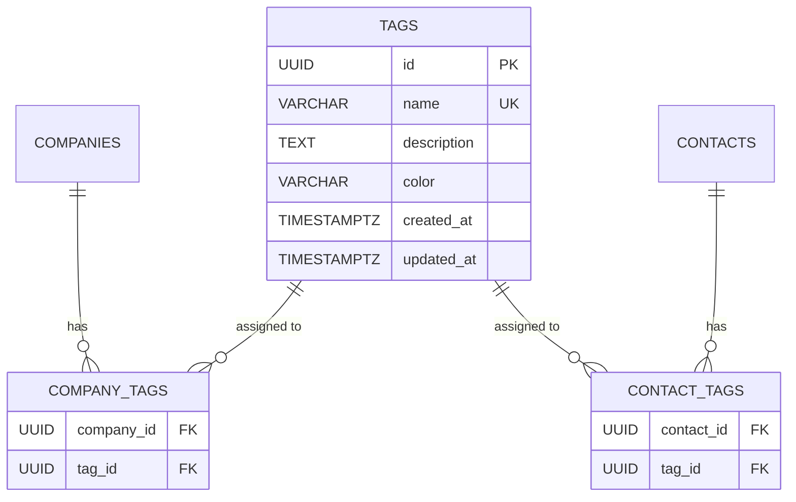

# Design: Tags Backend

## GitHub Issue

—

## Summary

Add a new "Tag" entity for categorizing companies and contacts. Tags have a name (unique), optional description, and a color (hex code). Tags are shared between companies and contacts via many-to-many relationships. This spec covers only the backend: entity, migrations, repository, service, DTOs, and REST API. Frontend integration is a separate spec.

## Goals

- Provide a Tag data type with full CRUD operations
- Allow assigning tags to companies and contacts via their Create/Update DTOs
- Maintain backward compatibility with the existing frontend (no breaking changes)

## Non-goals

- Frontend UI for tag management, assignment, display, or filtering
- Tag-based filtering on company/contact list endpoints
- CSV export of tags
- Print view changes

## Technical Approach

### Data Model

#### Tag Entity

| Field | Type | Constraints |
|-------|------|-------------|
| `id` | UUID | Primary key, auto-generated |
| `name` | VARCHAR(255) | Required, unique |
| `description` | TEXT | Optional (nullable) |
| `color` | VARCHAR(7) | Required (hex code, e.g., `#5CBA9E`) |
| `createdAt` | TIMESTAMPTZ | Auto-populated, immutable |
| `updatedAt` | TIMESTAMPTZ | Auto-populated |

#### Join Tables

**`company_tags`:**

| Column | Type | Constraints |
|--------|------|-------------|
| `company_id` | UUID | FK → companies(id), ON DELETE CASCADE |
| `tag_id` | UUID | FK → tags(id), ON DELETE CASCADE |
| | | Primary key: (company_id, tag_id) |

**`contact_tags`:**

| Column | Type | Constraints |
|--------|------|-------------|
| `contact_id` | UUID | FK → contacts(id), ON DELETE CASCADE |
| `tag_id` | UUID | FK → tags(id), ON DELETE CASCADE |
| | | Primary key: (contact_id, tag_id) |

CASCADE DELETE ensures:
- Deleting a tag removes all assignments (from both join tables)
- Deleting a company removes its tag assignments
- Deleting a contact removes its tag assignments



### Flyway Migration

A single migration creates the `tags` table and both join tables with foreign keys and cascade delete.

### DTOs

#### Tag DTOs

**`TagDto`** (response):
```java
public record TagDto(UUID id, String name, String description, String color,
                     Instant createdAt, Instant updatedAt) {}
```

**`TagCreateDto`** (request for create and update):
```java
public record TagCreateDto(@NotBlank String name, String description,
                           @NotBlank String color) {}
```

#### Company/Contact DTO Changes

**Response DTOs** — add `tagIds`:
- `CompanyDto`: add `List<UUID> tagIds`
- `ContactDto`: add `List<UUID> tagIds`

**Request DTOs** — add optional `tagIds`:
- `CompanyCreateDto`: add `List<UUID> tagIds` (nullable)
- `CompanyUpdateDto`: add `List<UUID> tagIds` (nullable)
- `ContactCreateDto`: add `List<UUID> tagIds` (nullable)
- `ContactUpdateDto`: add `List<UUID> tagIds` (nullable)

#### Null vs. Empty List Semantics for `tagIds` in Update DTOs

This is critical for backward compatibility:
- **`null`** — Do not change tag assignments (field was not sent by the client). This ensures the existing frontend, which doesn't know about tags, doesn't accidentally remove all tags on every update.
- **`[]` (empty list)** — Remove all tag assignments.
- **`[id1, id2]`** — Replace tag assignments with the given set.

**Rationale:** The existing frontend does not send `tagIds` in its update requests. If `null` meant "remove all tags", every company/contact update from the current frontend would wipe all tags. Using `null` as "no change" prevents this.

### REST API

#### Tag CRUD

| Method | Endpoint | Description |
|--------|----------|-------------|
| `GET` | `/api/tags` | List all tags (paginated, sorted by name) |
| `GET` | `/api/tags/{id}` | Get a single tag by ID |
| `POST` | `/api/tags` | Create a new tag |
| `PUT` | `/api/tags/{id}` | Update an existing tag |
| `DELETE` | `/api/tags/{id}` | Delete a tag (hard delete, cascades assignments) |

Pagination follows the existing pattern (`@PageableDefault(size = 20, sort = "name")`).

**Error cases:**
- `POST` / `PUT` with duplicate name → `409 Conflict`
- `GET` / `PUT` / `DELETE` with non-existent ID → `404 Not Found`
- `POST` / `PUT` with missing required fields → `400 Bad Request`

#### Company/Contact Endpoints (unchanged routes, updated DTOs)

The existing company and contact endpoints continue to work as before. The only change is that the request and response DTOs now include `tagIds`. No new endpoints are needed for tag assignment.

### Service Layer

**TagService:**
- Standard CRUD operations
- Name uniqueness validation (throw `ResponseStatusException(409)` on duplicate)

**CompanyService / ContactService:**
- On create: if `tagIds` is not null, resolve tags and assign
- On update: if `tagIds` is null, skip tag assignment (preserve existing). If `tagIds` is an empty list, remove all. If `tagIds` has values, replace with the new set.
- On DTO mapping: load assigned tag IDs for the response

### Files Affected

**Backend (new):**
- `tag/TagEntity.java` — JPA entity
- `tag/TagRepository.java` — Spring Data repository
- `tag/TagService.java` — Business logic
- `tag/TagController.java` — REST controller
- `tag/TagDto.java` — Response DTO
- `tag/TagCreateDto.java` — Request DTO
- Flyway migration — create `tags`, `company_tags`, `contact_tags` tables

**Backend (modified):**
- `company/CompanyEntity.java` — add `@ManyToMany` tags relationship
- `company/CompanyDto.java` — add `tagIds`
- `company/CompanyCreateDto.java` — add `tagIds` (nullable)
- `company/CompanyUpdateDto.java` — add `tagIds` (nullable)
- `company/CompanyService.java` — handle tag assignment on create/update, include tagIds in DTO mapping
- `contact/ContactEntity.java` — add `@ManyToMany` tags relationship
- `contact/ContactDto.java` — add `tagIds`
- `contact/ContactCreateDto.java` — add `tagIds` (nullable)
- `contact/ContactUpdateDto.java` — add `tagIds` (nullable)
- `contact/ContactService.java` — handle tag assignment on create/update, include tagIds in DTO mapping

## Dependencies

None — this is a self-contained backend addition.

## Open Questions

None — all details resolved during design discussion.
