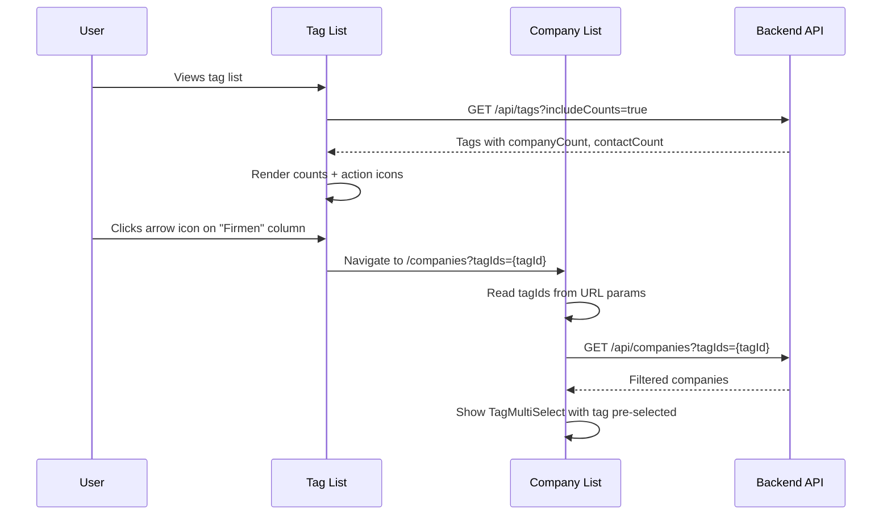
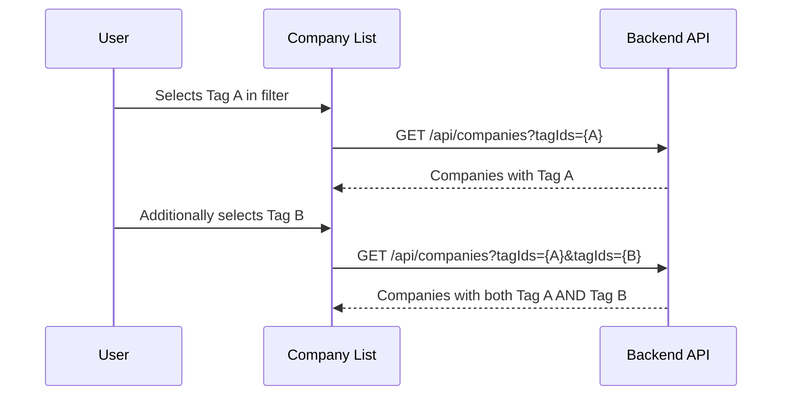

# Design: Tag Count Columns & Filter Navigation

## GitHub Issue

---

## Summary

The tag list table currently shows only name, description, color, and actions. Users have no visibility into how many companies or contacts use each tag, and no way to quickly navigate to those entities.

This feature adds two count columns ("Firmen", "Kontakte") to the tag list table showing live-computed usage counts per tag. Each count cell includes a navigation arrow icon (visible only when count > 0) that links to the company or contact list filtered by that tag. Additionally, the company and contact list pages get a tag multi-select filter (AND semantics) so users can filter by tags directly — not only via navigation from the tag table.

## Goals

- Show company and contact counts per tag in the tag list table
- Enable one-click navigation from tag table to filtered company/contact lists
- Add tag multi-select filter to company and contact list pages
- Support deep-linking via URL query parameters (`?tagIds=uuid1,uuid2`)

## Non-goals

- Sorting tag list by count values
- Server-side caching of counts (deferred to a future spec)
- Tag filter in print view or CSV export column selection
- Error message when a deleted tag ID appears in URL params (filter is silently ignored)

## Technical Approach

### Backend

#### 1. TagDto — Optional count fields

Add two nullable fields to `TagDto`:

```java
public record TagDto(UUID id, String name, String description, String color,
                     Instant createdAt, Instant updatedAt,
                     Long companyCount, Long contactCount) {
    // existing fromEntity stays as-is (counts = null)
    // new factory method for counts:
    public static TagDto fromEntity(TagEntity entity, Long companyCount, Long contactCount) { ... }
}
```

**Rationale:** Nullable fields avoid breaking existing consumers (tag detail, tag multi-select) that don't need counts. A boolean query parameter controls whether counts are computed.

#### 2. TagController.list() — `includeCounts` parameter

Add `@RequestParam(defaultValue = "false") boolean includeCounts` to the list endpoint. Pass through to `TagService.findAll()`.

#### 3. TagRepository — Count queries

```java
@Query("SELECT COUNT(c) FROM CompanyEntity c JOIN c.tags t WHERE t.id = :tagId AND c.deleted = false")
long countActiveCompaniesByTagId(@Param("tagId") UUID tagId);

@Query("SELECT COUNT(c) FROM ContactEntity c JOIN c.tags t WHERE t.id = :tagId")
long countContactsByTagId(@Param("tagId") UUID tagId);
```

**Rationale:** The company count query explicitly filters out soft-deleted companies (`c.deleted = false`). Contact has no soft-delete, so no filter needed.

#### 4. TagService.findAll() — Conditional count computation

When `includeCounts` is true, iterate over the page results and enrich each `TagDto` with counts from the repository queries. When false, return DTOs with null counts (current behavior).

#### 5. CompanyController & CompanyService — `tagIds` filter

Add `@RequestParam(required = false) List<UUID> tagIds` to `CompanyController.list()`. In `CompanyService.list()`, build a Specification that requires the company to have ALL specified tags (AND semantics):

```java
if (tagIds != null && !tagIds.isEmpty()) {
    for (UUID tagId : tagIds) {
        spec = spec.and((root, query, cb) -> cb.isMember(
            tagRepository.getReferenceById(tagId), root.get("tags")));
    }
}
```

**Rationale:** AND semantics was chosen because users want to narrow down results. Each tag adds an additional `isMember` constraint via JPA Criteria API, leveraging the existing `Specification` pattern used throughout the codebase.

#### 6. ContactController & ContactService — `tagIds` filter

Same pattern as company: add `tagIds` parameter and AND-based Specification filter on the tags collection.

### Frontend

#### 1. API client (`api.ts`)

- Add `includeCounts?: boolean` to `TagListParams`
- Add `tagIds?: string[]` to `CompanyListParams` and `ContactListParams`
- Add optional `companyCount` and `contactCount` to `TagDto` type
- Serialize `tagIds` as repeated query params: `&tagIds=uuid1&tagIds=uuid2`

#### 2. Tag list table (`tag-list.tsx`)

Add two columns between "Description" and "Actions":

| Column | Content |
|--------|---------|
| Firmen | `{companyCount}` + `ExternalLink` icon (links to `/companies?tagIds={id}`) |
| Kontakte | `{contactCount}` + `ExternalLink` icon (links to `/contacts?tagIds={id}`) |

- Always visible on mobile (not hidden like description)
- When count is 0: show "0", hide the navigation icon
- When count > 0: show count + arrow/link icon
- Pass `includeCounts: true` when calling `getTags()`

#### 3. Company list (`company-list.tsx`)

- Read `tagIds` from URL search params on mount (`useSearchParams`)
- Add `TagMultiSelect` component to the filter row
- Pass selected tag IDs to `getCompanies()` API call
- Add `tagIds` to the page-reset `useEffect` dependency array
- Update URL when tag selection changes (for deep-link support)

#### 4. Contact list (`contact-list.tsx`)

- Same pattern as company list
- Read `tagIds` from URL search params (already uses `useSearchParams`)
- Add `TagMultiSelect` to filter row
- Pass selected tag IDs to `getContacts()` API call

#### 5. i18n translations

Add tag filter label to both DE and EN translation files for company and contact lists.

## Key Flows

### Navigation from tag table to filtered list



### Multi-tag AND filter



## Data Model

No schema changes required. The existing `company_tags` and `contact_tags` join tables provide the data for count queries and tag-based filtering.

## Dependencies

- Existing `TagMultiSelect` component (reused as filter UI)
- Existing `useSearchParams` pattern in contact list (extended to company list)
- Lucide `ExternalLink` or `ArrowUpRight` icon for navigation action

## Security Considerations

- Tag IDs in URL params are UUIDs — no injection risk
- Count queries use parameterized JPQL — no SQL injection
- Tag filter respects existing authorization (all endpoints already require OIDC)

## Open Questions

None — all design decisions were resolved during the grill session.
