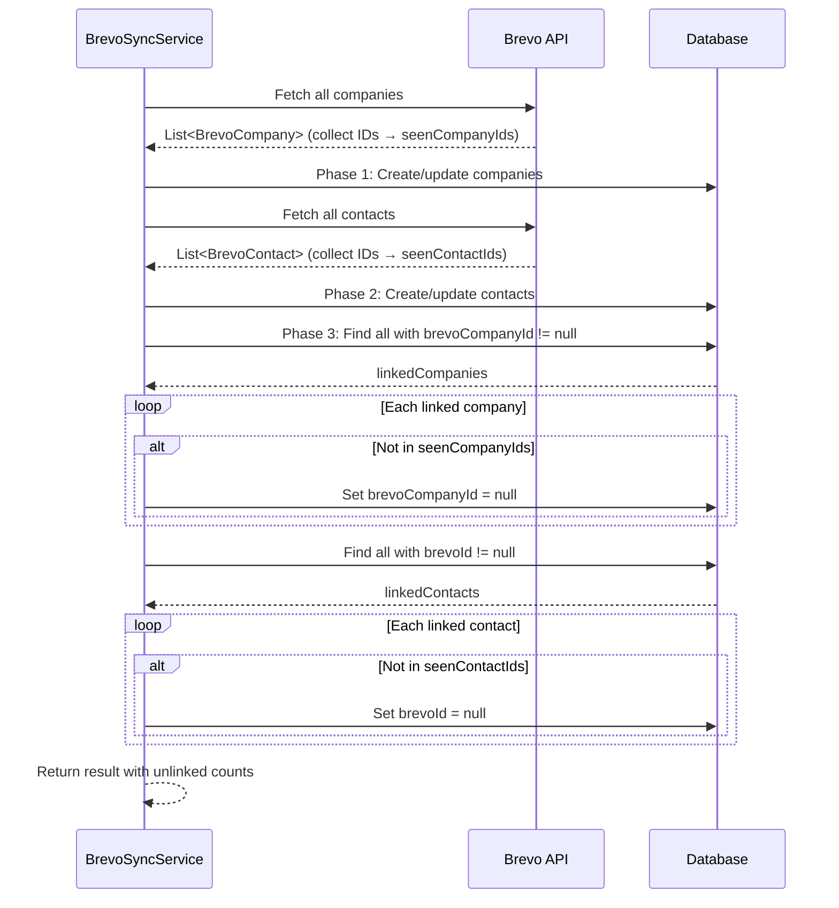

# Design: Brevo Unlink on Deletion

## GitHub Issue

—

## Summary

The Brevo import/sync process currently only creates and updates contacts and companies — it never handles deletions on the Brevo side. When a contact or company is deleted in Brevo, the CRM still shows it as a Brevo-linked entity with the Brevo badge, and Brevo-managed fields remain read-only.

This feature adds an unlinking step after the import phase: after processing all Brevo contacts and companies, the sync identifies CRM entries that have a `brevoId`/`brevoCompanyId` but were not present in the current import batch. For those entries, the Brevo ID is set to null — removing the Brevo badge and making all fields fully editable again. The entry itself remains in the CRM.

## Goals

- Detect contacts and companies that no longer exist in Brevo during sync
- Remove Brevo association (`brevoId` / `brevoCompanyId`) from those entries
- Make previously read-only fields editable again after unlinking
- Report unlinked counts in sync results (frontend and backend)

## Non-goals

- Deleting contacts or companies from the CRM when they are removed from Brevo
- Modifying any field values during unlinking (only the Brevo ID is cleared)
- Protecting against partial Brevo API responses (accepted risk)
- Real-time detection outside of the sync process

## Technical Approach

### 1. Collect Brevo IDs during sync

**File:** `backend/src/main/java/com/openelements/crm/brevo/BrevoSyncService.java`

During the existing sync phases, collect all Brevo IDs that were successfully processed (both created and updated):

- **Phase 1 (companies):** Collect all `brevoCompanyId` values from the Brevo API response into a `Set<String>`
- **Phase 2 (contacts):** Collect all `brevoId` values (converted from `long` to `String`) from the Brevo API response into a `Set<String>`

**Rationale:** Collecting from the API response (not from successfully processed entries) ensures that even entries that failed processing are not falsely unlinked. The IDs come from the Brevo API fetch, which represents the complete state of Brevo at sync time.

### 2. Unlink phase after import

After both import phases complete, add a third phase:

**Phase 3 — Unlink:**

```java
// Companies
List<CompanyEntity> linkedCompanies = companyRepository.findAllByBrevoCompanyIdIsNotNull();
for (CompanyEntity company : linkedCompanies) {
    if (!seenCompanyIds.contains(company.getBrevoCompanyId())) {
        company.setBrevoCompanyId(null);
        companyRepository.save(company);
        companiesUnlinked++;
    }
}

// Contacts
List<ContactEntity> linkedContacts = contactRepository.findAllByBrevoIdIsNotNull();
for (ContactEntity contact : linkedContacts) {
    if (!seenContactIds.contains(contact.getBrevoId())) {
        contact.setBrevoId(null);
        contactRepository.save(contact);
        contactsUnlinked++;
    }
}
```

**Rationale:** Simple set-difference approach. Query all CRM entries with a Brevo ID, check against the collected set, and clear any that weren't in the import batch. Each unlink is its own transaction (consistent with existing per-entity transaction pattern in the sync service).

### 3. New repository methods

**File:** `backend/src/main/java/com/openelements/crm/company/CompanyRepository.java`

```java
List<CompanyEntity> findAllByBrevoCompanyIdIsNotNull();
```

**File:** `backend/src/main/java/com/openelements/crm/contact/ContactRepository.java`

```java
List<ContactEntity> findAllByBrevoIdIsNotNull();
```

### 4. Sync result DTO update

**File:** `backend/src/main/java/com/openelements/crm/brevo/BrevoSyncResultDto.java`

Add two new fields:

```java
int companiesUnlinked
int contactsUnlinked
```

These are not error counts — they represent successful unlinking operations.

### 5. Frontend — Display unlink counts

**File:** `frontend/src/components/brevo-sync.tsx`

Add two new result entries in the sync results grid, following the existing pattern:

- "Companies unlinked: X"
- "Contacts unlinked: X"

**File:** `frontend/src/lib/types.ts`

Add `companiesUnlinked` and `contactsUnlinked` to the sync result type.

### 6. i18n

**Files:** `frontend/src/lib/i18n/en.ts`, `frontend/src/lib/i18n/de.ts`

Add translation keys:

```
brevo.sync.companiesUnlinked: "Companies unlinked" / "Firmen entkoppelt"
brevo.sync.contactsUnlinked: "Contacts unlinked" / "Kontakte entkoppelt"
```

## Key Flows



## Regression Risk

- **Partial API response:** If Brevo returns only a subset of contacts (API error, pagination bug), entries will be falsely unlinked. Accepted risk — next import re-links them via email/name matching.
- **Existing sync behavior:** The create/update phases are unchanged. Only the new Phase 3 is added after them.
- **Read-only field behavior:** Unlinking clears `brevoId`, which causes the frontend to treat all fields as editable (existing logic based on `brevoId` presence). No frontend changes needed for field editability.

## Dependencies

- Spec 026 (Brevo fields readonly) — defines which fields are read-only for Brevo contacts
- Spec 027 (Brevo reimport protect) — defines which fields are preserved on re-import
