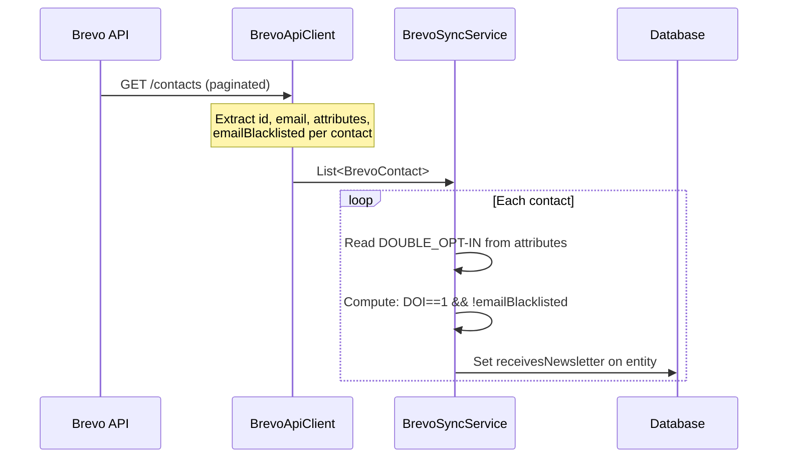
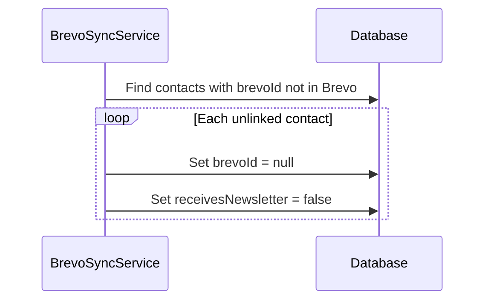

# Design: Newsletter Status on Contact

## GitHub Issue

---

## Summary

The CRM needs to display whether a contact receives the newsletter. This information is derived from two Brevo API fields during sync: the `DOUBLE_OPT-IN` contact attribute (category enum, `1` = Yes) and the top-level `emailBlacklisted` boolean. A new read-only boolean field `receivesNewsletter` is added to the Contact entity and displayed as a "Newsletter" tag with a mail icon in the contact detail view.

## Goals

- Show newsletter subscription status on contacts imported from Brevo
- Derive the status automatically from Brevo data during sync — no manual input
- Display the status as a visual tag in the contact detail view

## Non-goals

- No newsletter status filter on list views
- No newsletter column in the contact list table
- No newsletter field in CSV export or print view
- No manual editing of newsletter status (neither for Brevo nor non-Brevo contacts)
- No GDPR approval field (deferred to a future spec)

## Technical Approach

### Data Mapping

The `receivesNewsletter` boolean is computed from two Brevo fields:

| `DOUBLE_OPT-IN` | `emailBlacklisted` | `receivesNewsletter` |
|------------------|--------------------|----------------------|
| `1` (Yes)        | `false`            | `true`               |
| `1` (Yes)        | `true`             | `false`              |
| `2` (No)         | any                | `false`              |
| missing/null     | any                | `false`              |

**Rationale:** `DOUBLE_OPT-IN` is a Brevo category attribute (not a boolean) with enumeration values `1 = Yes` and `2 = No`. It indicates GDPR-compliant opt-in. `emailBlacklisted` is set to `true` when a contact actively unsubscribes from email campaigns. Both conditions must be met for a contact to be considered a newsletter subscriber.

### Lifecycle

- **Brevo sync (new contact):** Compute and set `receivesNewsletter` from Brevo data.
- **Brevo sync (existing contact):** Recompute and update `receivesNewsletter` on every sync (it is a Brevo-managed field, always overwritten).
- **Unlink phase:** When `brevoId` is set to `null` (contact no longer in Brevo), set `receivesNewsletter` to `false`.
- **Non-Brevo contacts:** Default `false`, never changed.

## Data Model

### ContactEntity — New Field

```java
@Column(name = "receives_newsletter", nullable = false)
private boolean receivesNewsletter = false;
```

### Migration: `V17__add_newsletter_status.sql`

```sql
ALTER TABLE contacts ADD COLUMN receives_newsletter BOOLEAN NOT NULL DEFAULT false;
```

### BrevoContact Record — New Field

The `BrevoContact` record gains a new `emailBlacklisted` field to carry this data from the API client to the sync service:

```java
record BrevoContact(long id, String email, Map<String, Object> attributes, boolean emailBlacklisted)
```

## API Design

### ContactDto — New Field

```java
boolean receivesNewsletter
```

Added as a read-only field in the response. Not present in `ContactCreateDto` or `ContactUpdateDto`.

### Update Protection

The `ContactService.update()` method rejects requests that attempt to change `receivesNewsletter`. Since the field is not part of `ContactUpdateDto`, this is inherently prevented by the DTO design — no additional validation code is needed.

## Key Flows

### Brevo Sync — Contact Import



### Brevo Sync — Unlink Phase



## UI Design

In the contact detail view, a green "Newsletter" tag with a mail icon is displayed next to the existing "Brevo" badge when `receivesNewsletter` is `true`. The tag uses the same layout pattern as the Brevo badge.

```
[Brevo] [Newsletter]
```

The Newsletter tag is only visible when `receivesNewsletter === true`. It is independent of the Brevo badge — though in practice, `receivesNewsletter` can only be `true` for Brevo contacts.

## Dependencies

- Brevo API `GET /contacts` response — `emailBlacklisted` field (already present, not yet extracted)
- Brevo contact attribute `DOUBLE_OPT-IN` (category enum, already present in attributes map)
