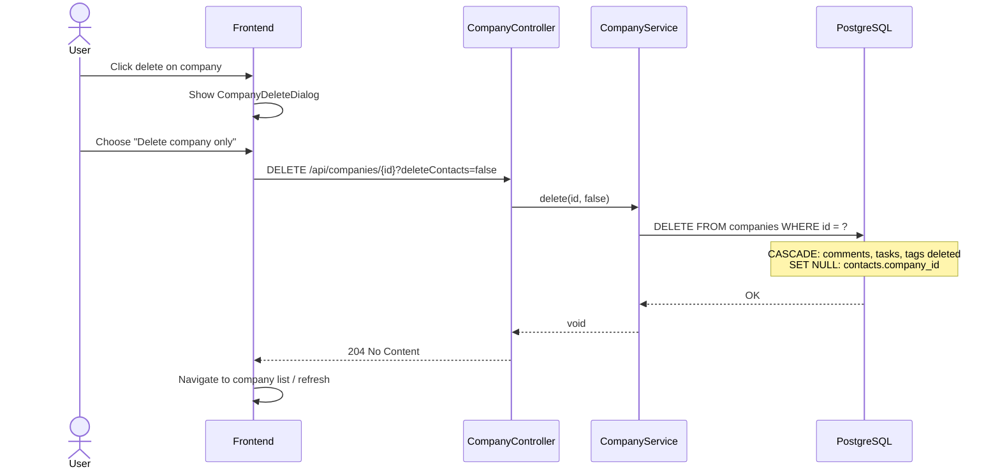
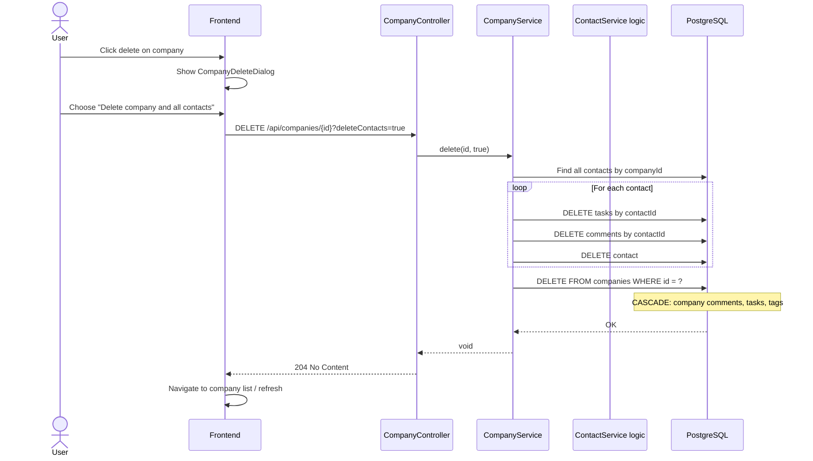

# Design: Remove Company Archive, Introduce Hard Delete

## GitHub Issue

—

## Summary

The soft-delete/archive feature for companies is unused and adds unnecessary complexity. This change removes soft-delete entirely and replaces it with hard deletion. When a user deletes a company, a confirmation dialog offers two options: (1) delete the company and all associated contacts, or (2) delete only the company while keeping contacts (with their company association removed). In both cases, the company's own comments, tasks, tag associations, and logo are deleted.

As a bonus fix, the existing contact delete dialog is updated to mention that tasks will also be deleted (currently it only mentions comments).

## Goals

- Remove all soft-delete/archive infrastructure (DB column, entity field, DTOs, API params, UI toggle, restore endpoint)
- Implement hard delete with a two-option confirmation dialog
- Ensure all cascading deletions are handled correctly
- Fix the contact delete dialog to mention task deletion

## Non-goals

- Undo/trash/recycle bin functionality
- Blocking deletion of Brevo-synced companies (they may be recreated on next sync, which is acceptable)
- Audit log or deletion history

## Technical Approach

### Database Migration (V17)

A new Flyway migration `V17__remove_company_soft_delete.sql`:

1. **Drop the `deleted` column** from the `companies` table
2. **Alter foreign keys** to enable proper cascading:
   - `contacts.company_id` → `ON DELETE SET NULL` (contacts survive company deletion)
   - `comments.company_id` → `ON DELETE CASCADE` (company comments are deleted)
   - `tasks.company_id` → `ON DELETE CASCADE` (company tasks are deleted)
3. `company_tags` already has `ON DELETE CASCADE` from V12 — no change needed
4. `task_tags` already has `ON DELETE CASCADE` on `task_id` from V14 — cascading task deletion automatically cleans up task-tag associations

**Rationale:** Handling cascades at the database level (rather than only in application code) provides a safety net against orphaned records and simplifies the service logic. The application layer still performs explicit deletions for the "delete contacts too" path, but the DB constraints ensure consistency even if application logic is bypassed.

No existing archived companies need handling — the database contains none.

### API Design

**Modified endpoint:**

```
DELETE /api/companies/{id}?deleteContacts=false
```

| Parameter | Type | Default | Description |
|-----------|------|---------|-------------|
| `deleteContacts` | boolean | `false` | When `true`, all contacts associated with this company are also hard-deleted (along with their tasks and comments) |

Returns `204 No Content` on success, `404 Not Found` if company does not exist.

**Rationale:** A query parameter on the existing DELETE endpoint is the simplest approach. A request body on DELETE is technically valid but uncommon and poorly supported by some HTTP clients.

**Removed endpoints:**
- `POST /api/companies/{id}/restore` — no longer needed
- `includeDeleted` query parameter from `GET /api/companies` and `GET /api/companies/export`

### Backend Changes

#### Entity / DTO Layer

- **CompanyEntity**: Remove `deleted` field, getter, setter, and toString reference
- **CompanyDto**: Remove `deleted` field and its mapping in `fromEntity()`
- **ContactDto**: Remove `companyDeleted` field and its mapping in `fromEntity()`

#### Service Layer

**CompanyService.delete(UUID id, boolean deleteContacts):**

```
1. Find company or throw 404
2. If deleteContacts == true:
   a. Find all contacts by companyId
   b. For each contact: delete tasks, delete comments, delete contact
      (reuse existing ContactService deletion pattern)
3. Delete the company
   → DB cascades handle: company comments, company tasks, company-tag joins, logo
```

- Remove `restore()` method entirely
- Remove `includeDeleted` parameter from `list()` and `listAll()` — remove the specification predicate that filters by `deleted`

**ContactService.applyFields():** Remove the guard that blocks assigning contacts to soft-deleted companies (lines 379-382).

#### Controller Layer

- **DELETE endpoint**: Add `@RequestParam(defaultValue = "false") boolean deleteContacts` parameter, pass to service
- **Remove** the restore endpoint entirely
- **Remove** `includeDeleted` from list and export endpoints

### Frontend Changes

#### Types and API

- Remove `deleted` from `CompanyDto` type
- Remove `companyDeleted` from `ContactDto` type
- Update `deleteCompany(id, deleteContacts: boolean)` — append `?deleteContacts=true` when needed
- Remove `restoreCompany()` function
- Remove `includeDeleted` from `getCompanies()` params and `getCompanyExportUrl()`

#### Company Delete Dialog

A new `CompanyDeleteDialog` component (shadcn `AlertDialog`) that always shows two options:

- **Option 1 — "Delete company and all contacts"**: Warns that all associated contacts, tasks, comments, and tags will be permanently deleted
- **Option 2 — "Delete company only"**: Warns that the company is deleted but contacts will be kept (company association removed)
- **Cancel** button

The dialog is shown from both the company list (table row action) and the company detail view.

**Rationale:** A single reusable dialog component avoids duplication between list and detail views.

#### Component Cleanup

- **company-list.tsx**: Remove `includeDeleted` state, archive toggle button, restore handler/button, opacity-50 styling for deleted rows, 409 CONFLICT error handling. Replace delete confirmation with `CompanyDeleteDialog`.
- **company-detail.tsx**: Remove deleted-state conditional rendering (disabled employees button). Replace delete confirmation with `CompanyDeleteDialog`.
- **contact-detail.tsx**: Remove "Archiviert" badge display for `companyDeleted`.

#### i18n Updates

**Remove:** `showArchived`, `hideArchived`, `restore`, `archivedBadge`, `errorConflict` (company delete conflict)

**Add (EN + DE):** New strings for the two-option delete dialog (title, description for each option, button labels)

**Fix:** Contact delete dialog description — mention tasks alongside comments in both languages.

## Key Flows

### Delete Company (keep contacts)



### Delete Company (with contacts)



## Security Considerations

- Hard delete is irreversible — the confirmation dialog with explicit option selection is the safeguard
- No new authentication/authorization concerns — uses existing auth
- GDPR: Hard deletion is preferable to soft-delete from a data minimization perspective

## Open Questions

None — all questions resolved during grill session.
