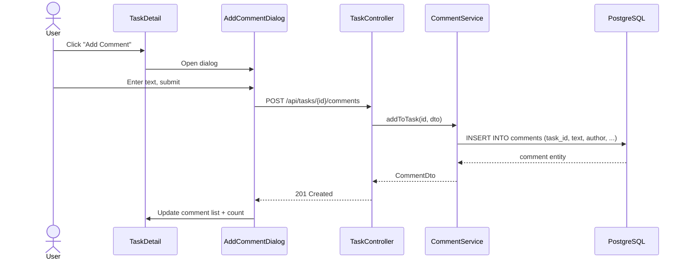
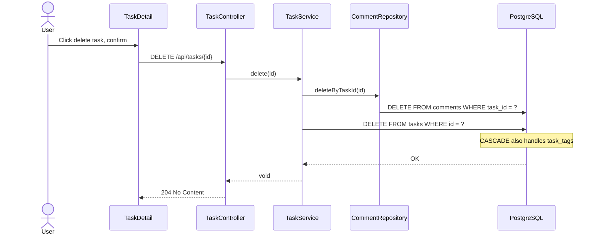

# Design: Task Comments

## GitHub Issue

—

## Summary

Tasks currently have no comment functionality, while companies and contacts both support comments (create, paginated list, delete with confirmation, count display in heading). This change extends the existing shared `CommentEntity` to also support tasks, by adding a `task_id` column and upgrading the XOR constraint from two-way (company/contact) to three-way (company/contact/task). The frontend gets a `TaskComments` component on the task detail view, identical in behavior to the existing company and contact comment components.

## Goals

- Add comment support to tasks using the existing `CommentEntity`
- Extend the database XOR constraint to three-way (exactly one of company_id, contact_id, task_id)
- Add comment list and create endpoints to the TaskController
- Add a `TaskComments` component to the task detail view with count display
- Cascade-delete comments when a task is deleted (dual protection: app layer + DB)

## Non-goals

- Comment count column in the task list table
- Comments in task CSV export or print view
- Editing existing comments (not supported for companies/contacts either, beyond text update via PUT)

## Technical Approach

### Database Migration

A new Flyway migration adds `task_id` to the `comments` table and replaces the CHECK constraint:

```sql
-- Add task_id column with FK and cascade
ALTER TABLE comments ADD COLUMN task_id UUID REFERENCES tasks(id) ON DELETE CASCADE;

-- Drop old two-way XOR constraint
ALTER TABLE comments DROP CONSTRAINT chk_comment_owner;

-- Add new three-way XOR constraint: exactly one owner must be set
ALTER TABLE comments ADD CONSTRAINT chk_comment_owner CHECK (
    (CASE WHEN company_id IS NOT NULL THEN 1 ELSE 0 END +
     CASE WHEN contact_id IS NOT NULL THEN 1 ELSE 0 END +
     CASE WHEN task_id IS NOT NULL THEN 1 ELSE 0 END) = 1
);

-- Index for query performance
CREATE INDEX idx_comments_task_id ON comments(task_id);
```

**Rationale:** The CASE-based CHECK is more readable and extensible than nested OR conditions when more than two columns participate in the XOR. It also makes it trivial to add a fourth entity type in the future.

### Backend Changes

#### Entity / DTO Layer

**CommentEntity** — Add a new `task` field:

```java
@ManyToOne(fetch = FetchType.LAZY)
@JoinColumn(name = "task_id")
private TaskEntity task;
```

Plus getter and setter, following the same pattern as `company` and `contact`.

**CommentDto** — Add `taskId` field:

```java
@Schema(description = "Task ID (null if attached to a company or contact)") UUID taskId
```

Update `fromEntity()` to extract `taskId` from the entity.

#### Repository Layer

**CommentRepository** — Add three new methods (mirroring the existing company/contact pattern):

```java
Page<CommentEntity> findByTaskId(UUID taskId, Pageable pageable);
void deleteByTaskId(UUID taskId);
long countByTaskId(UUID taskId);
```

#### Service Layer

**CommentService** — Add two new methods:

- `addToTask(UUID taskId, CommentCreateDto dto)` — Creates a comment linked to a task. Validates task exists, sets author from current user. Mirrors `addToCompany()` / `addToContact()`.
- `listByTask(UUID taskId, Pageable pageable)` — Returns paginated comments for a task. Validates task exists. Mirrors `listByCompany()` / `listByContact()`.

**TaskService.delete()** — Add `commentRepository.deleteByTaskId(id)` before the existing `taskRepository.delete()` call. This mirrors the pattern in `ContactService.delete()` where both tasks and comments are explicitly deleted before the contact.

#### Controller Layer

**TaskController** — Add two new endpoints (mirroring CompanyController/ContactController pattern):

```
GET  /api/tasks/{id}/comments    — List comments for a task (paginated, sorted by createdAt DESC)
POST /api/tasks/{id}/comments    — Add a comment to a task
```

Both endpoints follow the exact same signature pattern as the existing company comment endpoints in `CompanyController`.

### Frontend Changes

#### API Layer

Add to `api.ts`:

- `getTaskComments(taskId: string, page?: number): Promise<Page<CommentDto>>` — Fetches paginated comments for a task
- `createTaskComment(taskId: string, data: { text: string }): Promise<CommentDto>` — Creates a comment on a task

Both mirror the existing `getCompanyComments()` / `createCompanyComment()` functions.

#### TaskComments Component

A new `TaskComments` component (`frontend/src/components/task-comments.tsx`) that mirrors `CompanyComments`:

- Takes `taskId` and optional `totalCount` props
- Displays paginated comment list with author, date, text
- "Add Comment" button opens `AddCommentDialog` (reused)
- Delete button with `DeleteConfirmDialog` (reused)
- Comment count in heading, updated on create/delete
- "Load more" pagination

**Rationale:** A separate component (rather than a generic parameterized one) follows the existing pattern where `CompanyComments` and `ContactComments` are separate components. This keeps each component simple and avoids over-abstraction.

#### Task Detail View

Add `TaskComments` to `task-detail.tsx` below the action description section. The task detail page needs to provide the comment count — this can come from a `commentCount` field added to `TaskDto`, or fetched separately. Following the existing pattern in company/contact detail views, adding `commentCount` to `TaskDto` is the cleaner approach.

**TaskDto** — Add `commentCount` (long) field, populated via `commentRepository.countByTaskId()` in the service layer.

#### i18n

The existing `companies.comments` namespace is already shared between company and contact comments. Task comments will reuse the same strings since the wording is entity-agnostic ("Kommentare", "Kommentar hinzufügen", etc.).

## Key Flows

### Add Comment to Task



### Delete Task with Comments



## Dependencies

- Existing `AddCommentDialog` component (reused as-is)
- Existing `DeleteConfirmDialog` component (reused as-is)
- Existing `CommentService` (extended with new methods)
- Existing i18n comment strings (reused)

## Security Considerations

- Comment author is set server-side from the authenticated user — cannot be spoofed
- Task existence is validated before comment creation (404 if not found)
- No new authentication/authorization concerns

## Open Questions

None.
