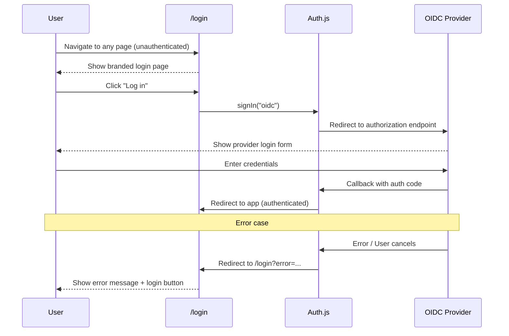

# Design: Custom Branded Login Page

## Summary

Replace the generic Auth.js default sign-in page with a custom branded login page that follows the Open Elements design language. The default page is unstyled and shows a plain "Sign in with OIDC" button, which gives a poor first impression. The custom page will be the first thing users see when accessing Open CRM.

## Goals

- Provide a polished, professional login experience consistent with the app's branding
- Display error messages when authentication fails
- Support both desktop and mobile layouts

## Non-goals

- User registration or password-based login (authentication is fully handled by the OIDC provider)
- Custom error pages beyond the sign-in page
- Remember-me or session persistence settings

## Technical Approach

### Custom Sign-In Page Route

Create a new page at `src/app/login/page.tsx`. Configure Auth.js to use this page by adding `pages: { signIn: "/login" }` to the NextAuth configuration in `src/auth.ts`.

Update the Next.js middleware matcher to exclude `/login` from authentication checks, so unauthenticated users can access the page.

### Page Content

The page shows the following elements, vertically stacked and centered:

1. **Open Elements logo** — `oe-logo-landscape-dark.svg` (dark background variant)
2. **App name** — "Open CRM" in Montserrat heading font
3. **Login button** — styled button that triggers `signIn("oidc")` from Auth.js
4. **Developer credit** — "Developed by" / "Entwickelt von" + Open Elements logo, linking to `https://open-elements.com`

### Layout

**Desktop (md and above):**
- Light background (`bg-oe-white` or similar light tone)
- Centered dark box (`bg-oe-dark`, `#020144`) containing all elements
- Box has rounded corners and comfortable padding
- White/light text inside the box

**Mobile (below md):**
- Full-screen dark background (`bg-oe-dark`)
- Same elements, centered vertically and horizontally
- No floating box — the dark background fills the viewport

**Rationale:** A centered card on desktop gives visual focus; on mobile, the card pattern wastes space, so the dark background fills the screen directly.

### Error Handling

Auth.js redirects to the sign-in page with `?error=...` query parameter when authentication fails (user cancels, provider error, session expired, etc.).

The page reads the `error` search parameter. If present, a styled error message is displayed above the login button:

- **Text (DE):** "Anmeldung fehlgeschlagen. Bitte erneut versuchen."
- **Text (EN):** "Login failed. Please try again."
- **Styling:** Red text or red-tinted banner using `text-oe-red` (`#E63277`) or similar, clearly visible on the dark background
- **Console logging:** The raw `error` value from the query parameter is logged to the browser console for debugging

All error types (provider error, callback error, session expired) show the same generic message.

### Internationalization

The page uses the existing i18n system (`useTranslations()` hook). New translation keys are added to both `de.ts` and `en.ts`:

- `login.title` — "Open CRM"
- `login.button` — "Anmelden" / "Log in"
- `login.error` — "Anmeldung fehlgeschlagen. Bitte erneut versuchen." / "Login failed. Please try again."
- `login.developedBy` — "Entwickelt von" / "Developed by"

**Language detection on login page:** The existing `LanguageProvider` wraps the root layout, so the login page has access to the i18n context. Language detection (localStorage > browser language > English) works as usual.

### Brand Guidelines

- **Background (box/mobile):** OE Dark `#020144`
- **Primary accent:** OE Green `#5CBA9E` for the login button
- **Error text:** OE Red `#E63277`
- **Heading font:** Montserrat
- **Body font:** Lato
- **Logo:** `oe-logo-landscape-dark.svg` from `public/`

### Login Flow

## Files Affected

- `frontend/src/app/login/page.tsx` — **new** — custom sign-in page
- `frontend/src/auth.ts` — add `pages: { signIn: "/login" }`
- `frontend/src/middleware.ts` — exclude `/login` from auth matcher
- `frontend/src/lib/i18n/de.ts` — add login translation keys
- `frontend/src/lib/i18n/en.ts` — add login translation keys

## Security Considerations

- The login page is a public page (no authentication required) — it must not expose any sensitive data
- The `signIn()` call uses Auth.js's built-in CSRF protection
- Error messages are generic to avoid leaking internal error details to the user
