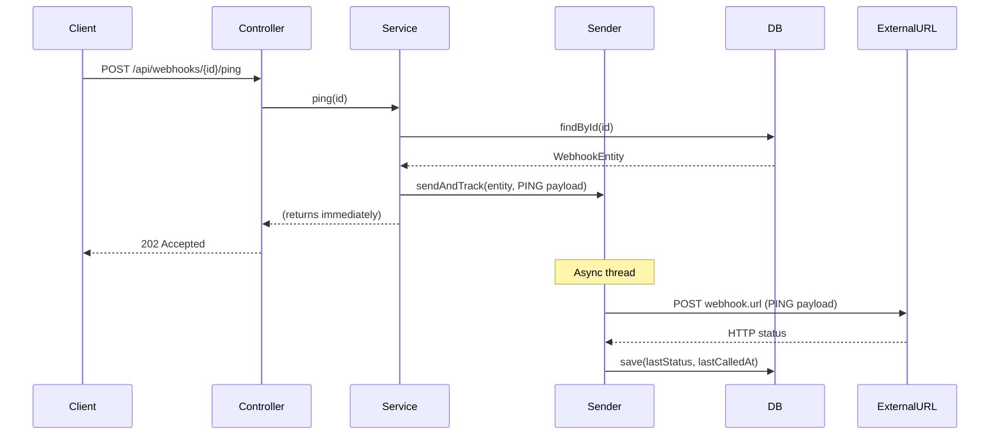
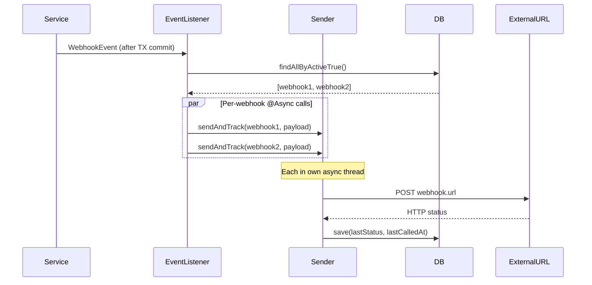

# Design: Webhook PING & Status Tracking

## GitHub Issue

—

## Summary

Users cannot test whether a webhook endpoint is reachable, and there is no visibility into whether webhook calls succeed or fail. This spec adds a PING event to manually test a specific webhook endpoint and persists the last HTTP response status after every webhook call (not just PING). The result is visible via the existing webhook GET API.

## Goals

- Allow manually triggering a PING call to a specific webhook (active or inactive)
- Track the last HTTP response status and timestamp for every webhook call
- Expose the status in the webhook DTO so API consumers can check endpoint health

## Non-goals

- Frontend UI for PING or status display
- Webhook call history / log table (only the last status is persisted)
- Retry logic based on status

## Technical Approach

### PING Event

A new `PING` value is added to the `WebhookEventType` enum (19th value). Unlike domain events, PING is never published via `ApplicationEventPublisher` — it is triggered manually through the REST API.

**API:** `POST /api/webhooks/{id}/ping` returns `202 Accepted` immediately. The actual HTTP call happens asynchronously. The PING result is visible by fetching the webhook via `GET /api/webhooks/{id}` after the call completes.

**PING works for both active and inactive webhooks.** This allows testing an endpoint before activating a webhook.

**PING payload:** Standard `WebhookEventPayload` with `eventType: PING`, `entityId: null`, `data: null`, plus a unique `eventId` and current `timestamp`.

### Status Tracking

Two new columns on the `webhooks` table:

| Column | Type | Constraints |
|--------|------|-------------|
| `last_status` | INTEGER | NULLABLE (null = never called) |
| `last_called_at` | TIMESTAMP | NULLABLE |

**Status values:**

| Value | Meaning |
|-------|---------|
| `null` | Never called |
| `200`, `201`, ... | HTTP success |
| `4xx`, `5xx` | HTTP error |
| `0` | Connection error (DNS failure, connection refused) |
| `-1` | Timeout (10-second limit exceeded) |

The status is updated after **every** webhook call — domain events and PING alike.

### Architecture Refactoring — `WebhookSender`

**Problem:** The current `WebhookEventListener.sendWebhook()` runs inside `CompletableFuture.runAsync()`, which uses the common ForkJoinPool — no Spring transaction context is available. To persist the last status, we need a Spring-managed transactional context.

**Solution:** Extract the HTTP call + status persistence into a new `WebhookSender` component with an `@Async` + `@Transactional` method.

**Rationale:** Spring's `@Async` works via proxy — calling an `@Async` method on `this` bypasses the proxy. A separate bean is required for the proxy to intercept the call.

**New class: `WebhookSender`**

```java
@Component
public class WebhookSender {

    @Async
    @Transactional
    public void sendAndTrack(WebhookEntity webhook, WebhookEventPayload payload) {
        int status;
        try {
            ResponseEntity<Void> response = restClient.post()
                .uri(webhook.getUrl())
                .contentType(MediaType.APPLICATION_JSON)
                .body(payload)
                .retrieve()
                .toBodilessEntity();
            status = response.getStatusCode().value();
        } catch (ResourceAccessException e) {
            status = isTimeout(e) ? -1 : 0;
        } catch (HttpClientErrorException | HttpServerErrorException e) {
            status = e.getStatusCode().value();
        } catch (Exception e) {
            status = 0;
        }
        webhook.setLastStatus(status);
        webhook.setLastCalledAt(Instant.now());
        webhookRepository.save(webhook);
    }
}
```

**Changes to `WebhookEventListener`:**

Replace `CompletableFuture.runAsync()` with individual `webhookSender.sendAndTrack()` calls. Each call runs in its own Spring-managed async thread with transactional context. The `handleEvent` method no longer needs `CompletableFuture.allOf().join()`.

### PING Flow



### Domain Event Flow (updated)



## API Design

### PING Endpoint

```
POST /api/webhooks/{id}/ping

202 Accepted
```

No request body. Returns 202 immediately. Result visible via `GET /api/webhooks/{id}` (check `lastStatus` and `lastCalledAt`).

Returns 404 if the webhook does not exist.

### Updated Webhook DTO

```json
{
  "id": "550e8400-...",
  "url": "https://example.com/webhook",
  "active": true,
  "lastStatus": 200,
  "lastCalledAt": "2026-04-04T15:30:00Z",
  "createdAt": "2026-04-04T10:00:00Z",
  "updatedAt": "2026-04-04T10:00:00Z"
}
```

`lastStatus` and `lastCalledAt` are `null` for webhooks that have never been called.

## Data Model

### Migration `V21__add_webhook_status.sql`

```sql
ALTER TABLE webhooks ADD COLUMN last_status INTEGER;
ALTER TABLE webhooks ADD COLUMN last_called_at TIMESTAMP;
```

Both columns are nullable — existing webhooks will have `null` (never called).

## Dependencies

- No new Maven dependencies
- Uses existing `RestClient` bean (`webhookRestClient`)
- Uses existing Spring `@Async` infrastructure (`@EnableAsync` on `CrmApplication`)

## Security Considerations

- PING endpoint requires OIDC authentication (same as all webhook endpoints)
- PING works on inactive webhooks — this is intentional for testing before activation
- No GDPR impact — PING payload contains no personal data

## Open Questions

None — all questions resolved during the grill session.
