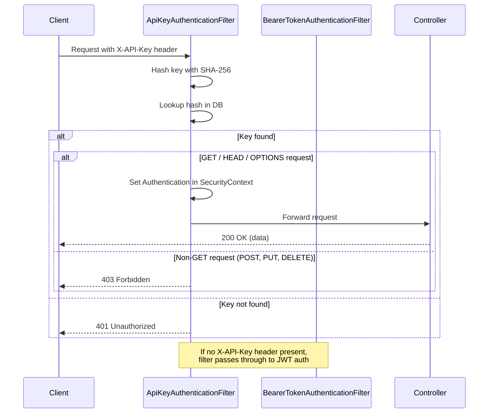
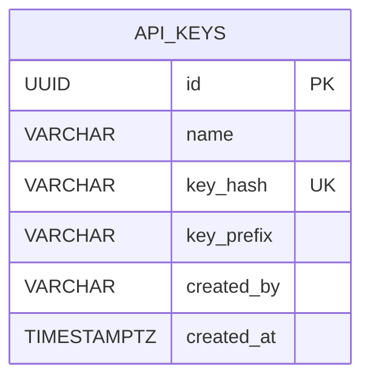

# Design: Read-Only API Key Authentication

## GitHub Issue

_To be created by the user._

## Summary

The CRM currently authenticates all REST API access via OIDC/JWT tokens, which requires a user-interactive login flow. External autonomous services that need to read CRM data cannot use this flow. This spec introduces API keys as a second authentication mechanism, granting **read-only** access to all protected GET endpoints via a simple `X-API-Key` HTTP header.

API keys are system-wide — any logged-in user can create and delete them, and they are not scoped to individual users for authorization purposes. The raw key is shown exactly once at creation time; only a SHA-256 hash is persisted. A stored key prefix allows identification in the management UI.

## Goals

- Allow external services to authenticate against the REST API without OIDC
- Provide a management UI for creating and deleting API keys
- Ensure API keys can only read data (GET endpoints), not modify it
- Store keys securely (hashed) so a database leak does not compromise them

## Non-goals

- **Write access** via API keys (separate follow-up spec)
- **Per-key permission scoping** (e.g. restrict to specific entities or endpoints)
- **Rate limiting** per API key
- **Key expiration** or automatic rotation
- **User roles** or admin-only restrictions on key management
- **Soft-disable** (deactivate without deleting)

## Technical Approach

### Authentication Flow



The `ApiKeyAuthenticationFilter` is a `OncePerRequestFilter` registered **before** Spring Security's `BearerTokenAuthenticationFilter`. This ensures:
- If `X-API-Key` header is present, API key auth is attempted (JWT filter is bypassed)
- If `X-API-Key` header is absent, the request passes through to standard JWT auth unchanged

**Rationale:** Using a dedicated `X-API-Key` header instead of `Authorization: Bearer` avoids ambiguity — Spring Security does not need to distinguish between JWT tokens and API keys on the same header.

### Key Format and Storage

- **Raw key format:** `crm_` + 48 random alphanumeric characters generated via `java.security.SecureRandom` (approximately 285 bits of entropy)
- **Example:** `crm_a1B2c3D4e5F6g7H8i9J0k1L2m3N4o5P6q7R8s9T0u1V2w3X4`
- **Hash:** SHA-256 hex digest of the full raw key (64 characters), stored with a UNIQUE constraint
- **Prefix:** First 8 characters + `...` + last 4 characters for display (e.g. `crm_a1B2...w3X4`)
- The raw key is returned **only once** in the creation response and never stored or retrievable again

**Rationale:** Hashing prevents key compromise from a database leak. The `crm_` prefix makes keys identifiable as belonging to this application (similar to GitHub's `ghp_` prefix). Showing the key only once follows the industry-standard pattern (GitHub, Stripe, AWS).

### Creator Tracking

The `created_by` field stores the user's display name as a plain string at creation time — not a foreign key to the users table. This is intentional:
- The creator name is informational only (for the management UI)
- It survives user deletion without orphan records
- It avoids cascading constraints

## API Design

### Endpoints

| Method | Path | Auth | Description |
|--------|------|------|-------------|
| `POST` | `/api/api-keys` | JWT only | Create a new API key |
| `GET` | `/api/api-keys` | JWT or API key | List all API keys (paginated) |
| `DELETE` | `/api/api-keys/{id}` | JWT only | Delete an API key |

POST and DELETE are only reachable via JWT auth because the `ApiKeyAuthenticationFilter` rejects non-GET requests with 403 when authenticating via API key.

### `POST /api/api-keys`

**Request:**
```json
{
  "name": "CI Pipeline"
}
```

**Response (201 Created):**
```json
{
  "id": "550e8400-e29b-41d4-a716-446655440000",
  "name": "CI Pipeline",
  "keyPrefix": "crm_a1B2...w3X4",
  "key": "crm_a1B2c3D4e5F6g7H8i9J0k1L2m3N4o5P6q7R8s9T0u1V2w3X4",
  "createdBy": "Hendrik Ebbers",
  "createdAt": "2026-04-05T14:30:00Z"
}
```

The `key` field is only present in this response. It is never returned by any other endpoint.

### `GET /api/api-keys`

**Query parameters:** `page`, `size`, `sort` (default: `createdAt,desc`)

**Response (200 OK):**
```json
{
  "content": [
    {
      "id": "550e8400-e29b-41d4-a716-446655440000",
      "name": "CI Pipeline",
      "keyPrefix": "crm_a1B2...w3X4",
      "createdBy": "Hendrik Ebbers",
      "createdAt": "2026-04-05T14:30:00Z"
    }
  ],
  "page": {
    "size": 20,
    "number": 0,
    "totalElements": 1,
    "totalPages": 1
  }
}
```

### `DELETE /api/api-keys/{id}`

**Response:** 204 No Content

**Error:** 404 if the key ID does not exist.

## Data Model

### `api_keys` Table (Migration V22)

| Column | Type | Constraints | Description |
|--------|------|-------------|-------------|
| `id` | `UUID` | PK | Primary key |
| `name` | `VARCHAR(255)` | NOT NULL | User-given name |
| `key_hash` | `VARCHAR(64)` | NOT NULL, UNIQUE | SHA-256 hex digest |
| `key_prefix` | `VARCHAR(20)` | NOT NULL | Display prefix (e.g. `crm_a1B2...w3X4`) |
| `created_by` | `VARCHAR(255)` | NOT NULL | Name of the creating user (plain string) |
| `created_at` | `TIMESTAMPTZ` | NOT NULL | Creation timestamp |



No `updated_at` column because keys are immutable after creation (create or delete only).

No foreign key to the users table — `created_by` is a snapshot of the creator's name.

## Key Flows

### Key Creation

1. Logged-in user submits `POST /api/api-keys` with a name (via JWT auth)
2. Backend generates raw key: `crm_` + 48 `SecureRandom` alphanumeric chars
3. Backend computes SHA-256 hash and key prefix
4. Backend resolves creator name via `UserService.getCurrentUser().getName()`
5. Backend persists entity (hash, prefix, name, creator)
6. Backend returns `ApiKeyCreatedDto` including the raw key
7. Frontend shows the raw key in a "copy now" dialog — this is the only time it is visible

### Key Authentication

1. External service sends request with `X-API-Key: crm_...` header
2. `ApiKeyAuthenticationFilter` intercepts the request
3. Filter computes SHA-256 of the header value
4. Filter queries `ApiKeyRepository.findByKeyHash(hash)`
5. If not found → 401 Unauthorized
6. If found but request method is not GET/HEAD/OPTIONS → 403 Forbidden
7. If found and method is GET → set `Authentication` in SecurityContext, forward to controller

### Key Deletion

1. Logged-in user sends `DELETE /api/api-keys/{id}` (via JWT auth)
2. Backend deletes the entity
3. Any subsequent requests using that key's hash will return 401

## Backend Components

### New Files (package `com.openelements.crm.apikey`)

| File | Description |
|------|-------------|
| `ApiKeyEntity.java` | JPA entity with UUID ID, `@CreationTimestamp` |
| `ApiKeyRepository.java` | `JpaRepository<ApiKeyEntity, UUID>` with `findByKeyHash()` |
| `ApiKeyService.java` | Key generation, hashing, CRUD operations, authentication lookup |
| `ApiKeyController.java` | REST controller with POST/GET/DELETE endpoints |
| `ApiKeyDto.java` | Response record for listing (no raw key) |
| `ApiKeyCreateDto.java` | Request record with `@NotBlank name` |
| `ApiKeyCreatedDto.java` | One-time response record including raw key |
| `ApiKeyAuthenticationFilter.java` | `OncePerRequestFilter` for `X-API-Key` header |

### Modified Files

| File | Change |
|------|--------|
| `SecurityConfig.java` | Register `ApiKeyAuthenticationFilter` before `BearerTokenAuthenticationFilter` |
| `OpenApiConfig.java` | Add `apiKey` security scheme (type: APIKEY, in: HEADER, name: X-API-Key) |

### No Changes Needed

| File | Reason |
|------|--------|
| `UserService.java` | `getCurrentUser()` requires JWT principal — only called from POST/PUT endpoints, which are unreachable via API key auth |
| All existing controllers | No changes — the filter handles auth transparently before requests reach controllers |

## Frontend Components

### New Files

| File | Description |
|------|-------------|
| `frontend/src/app/(app)/api-keys/page.tsx` | Page route, renders `ApiKeyList` |
| `frontend/src/components/api-key-list.tsx` | Table with create/delete dialogs |

### Modified Files

| File | Change |
|------|--------|
| `frontend/src/lib/types.ts` | Add `ApiKeyDto`, `ApiKeyCreateDto`, `ApiKeyCreatedDto` interfaces |
| `frontend/src/lib/api.ts` | Add `getApiKeys()`, `createApiKey()`, `deleteApiKey()` functions |
| `frontend/src/lib/i18n/en.ts` | Add `apiKeys` section and `nav.apiKeys` |
| `frontend/src/lib/i18n/de.ts` | Add `apiKeys` section and `nav.apiKeys` |
| `frontend/src/components/sidebar.tsx` | Add API Keys nav item with `KeyRound` icon |

### UI Design

The API Keys page follows the existing Webhook page pattern:
- Table with columns: Name, Key (prefix), Created By, Created, Actions
- "New API Key" button opens a create dialog (name input only)
- On successful creation, a second dialog shows the raw key with:
  - Monospace display of the full key
  - "Copy" button with clipboard feedback
  - Clear warning: "Copy this key now. It will not be shown again."
- Delete button per row with confirmation dialog
- Pagination with page size selector
- Empty state with icon and "Create API Key" CTA
- Sidebar nav item in the bottom section (alongside Admin and Webhooks)

## Security Considerations

- **Key hashing:** Only SHA-256 hash stored — raw key is never persisted
- **One-time display:** Raw key shown only at creation — cannot be retrieved later
- **Read-only enforcement:** Filter rejects non-GET/HEAD/OPTIONS requests with 403 at the filter level (before controllers)
- **No key in logs:** The raw key must not be logged anywhere in the backend
- **Header separation:** `X-API-Key` header prevents confusion with JWT `Authorization: Bearer` tokens
- **Database index:** UNIQUE constraint on `key_hash` provides fast lookups and prevents duplicates

## Open Questions

None — all decisions resolved during the grill session.
