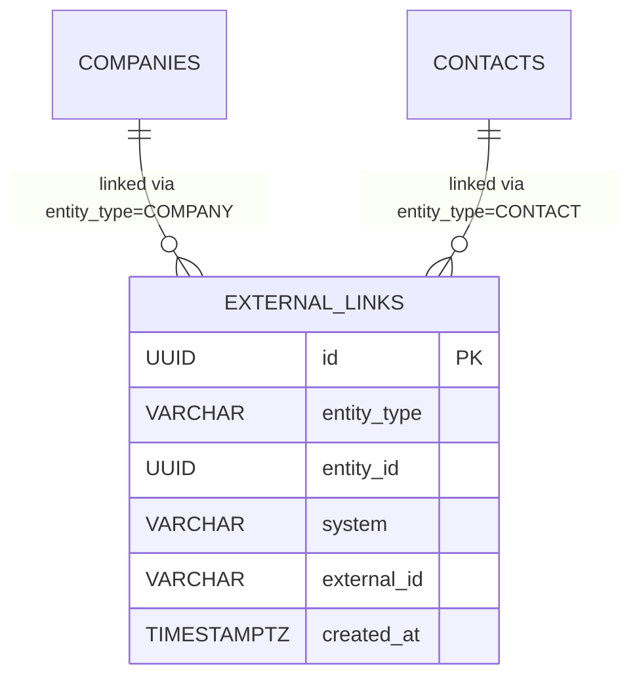
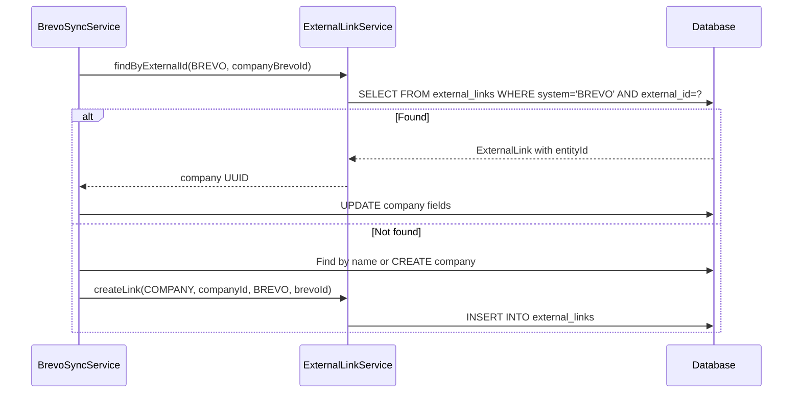

# Design: External Links Table — Generic External System Integration

## GitHub Issue

_To be created by the user._

## Summary

The CRM currently stores Brevo integration IDs directly as columns on `CompanyEntity` (`brevoCompanyId`) and `ContactEntity` (`brevoId`). This approach does not scale to additional external systems (SevDesk, future integrations). This spec introduces a generic `external_links` table that maps any CRM entity to an external system and ID. The existing Brevo data is migrated into this table, and all Brevo-related code is refactored to use the new structure.

This is a **preparatory refactoring** — no new integrations are added. The SevDesk integration will be a follow-up spec that builds on this foundation.

## Goals

- Replace `brevoId` / `brevoCompanyId` columns with a generic `external_links` table
- Migrate all existing Brevo link data into the new table
- Refactor all backend services, repositories, DTOs, and controllers to use the new model
- Update the frontend to work with generic external source information
- Preserve all existing Brevo functionality (import, sync, unlink, filters, badges, readonly fields)

## Non-goals

- Adding SevDesk integration (follow-up spec)
- Changing the Brevo sync logic beyond what is needed for the table migration
- Modifying the `receivesNewsletter` field — it stays on `ContactEntity` (Brevo-specific business field)
- Modifying the `settings` table — API key storage remains unchanged

## Data Model

### New Table: `external_links` (Migration V22)

| Column | Type | Constraints | Description |
|--------|------|-------------|-------------|
| `id` | `UUID` | PK | Primary key |
| `entity_type` | `VARCHAR(50)` | NOT NULL | Entity type: `COMPANY` or `CONTACT` |
| `entity_id` | `UUID` | NOT NULL | Foreign key to the entity |
| `system` | `VARCHAR(50)` | NOT NULL | External system name: `BREVO`, `SEVDESK`, etc. |
| `external_id` | `VARCHAR(255)` | NOT NULL | ID in the external system |
| `created_at` | `TIMESTAMPTZ` | NOT NULL | When the link was created |

**Constraints:**
- `UNIQUE(entity_type, entity_id, system)` — one link per entity per system
- No foreign key constraint to companies/contacts (since `entity_id` references different tables depending on `entity_type`)

**Rationale:** A join table with `entity_type` discriminator is chosen over separate `company_external_links` / `contact_external_links` tables because it keeps the model uniform and the query logic reusable across entity types. The unique constraint per entity per system prevents duplicate links but allows a single entity to be linked to multiple systems if the business rules ever change.



### Migration Strategy

The Flyway migration V22 will:

1. Create the `external_links` table
2. Migrate existing `brevo_company_id` data: `INSERT INTO external_links (...) SELECT ... FROM companies WHERE brevo_company_id IS NOT NULL`
3. Migrate existing `brevo_id` data: `INSERT INTO external_links (...) SELECT ... FROM contacts WHERE brevo_id IS NOT NULL`
4. Drop the old columns and their indexes:
   - `ALTER TABLE companies DROP COLUMN brevo_company_id`
   - `ALTER TABLE contacts DROP COLUMN brevo_id`

**Rationale:** Dropping the old columns in the same migration ensures there is no ambiguous transition period where both storage locations exist.

## Technical Approach

### Backend: New Entity and Repository

**New file:** `com.openelements.crm.external.ExternalLinkEntity`
- JPA entity mapping to `external_links` table
- Fields: `id`, `entityType` (enum: `COMPANY`, `CONTACT`), `entityId`, `system` (enum: `BREVO`, `SEVDESK`), `externalId`, `createdAt`
- Using enums for `entityType` and `system` ensures type safety

**New file:** `com.openelements.crm.external.ExternalLinkRepository`
```java
Optional<ExternalLinkEntity> findByEntityTypeAndEntityIdAndSystem(EntityType type, UUID id, ExternalSystem system);
Optional<ExternalLinkEntity> findBySystemAndExternalId(ExternalSystem system, String externalId);
List<ExternalLinkEntity> findAllByEntityTypeAndSystem(EntityType type, ExternalSystem system);
void deleteByEntityTypeAndEntityId(EntityType type, UUID entityId);
```

**New file:** `com.openelements.crm.external.ExternalLinkService`
- `findLink(EntityType, UUID entityId, ExternalSystem)` → `Optional<ExternalLinkEntity>`
- `findByExternalId(ExternalSystem, String externalId)` → `Optional<ExternalLinkEntity>`
- `createLink(EntityType, UUID entityId, ExternalSystem, String externalId)` → creates or updates link
- `removeLink(EntityType, UUID entityId, ExternalSystem)` → removes the link
- `removeAllLinks(EntityType, UUID entityId)` → removes all links for an entity (used when entity is deleted)
- `findAllLinkedEntityIds(EntityType, ExternalSystem)` → `Set<UUID>` (for unlink phase)
- `isLinked(EntityType, UUID entityId)` → `boolean` (any system)
- `getExternalSources(EntityType, UUID entityId)` → `List<String>` (list of system names)

### Backend: DTO Changes

**CompanyDto:** Replace `boolean brevo` with `List<String> externalSources`
- Example: `[]` (no external link), `["BREVO"]`, `["SEVDESK"]`
- Derived from `ExternalLinkService.getExternalSources(COMPANY, entityId)`

**ContactDto:** Replace `boolean brevo` with `List<String> externalSources`
- Same pattern

**Rationale:** A list of strings (not booleans) is future-proof and tells the frontend exactly which system manages the entity.

### Backend: Service Changes

**CompanyService:**
- `list()` / `listAll()`: Replace `brevo` filter parameter with `externalSource` (String, nullable)
  - `externalSource=BREVO` → only companies linked to Brevo
  - `externalSource=SEVDESK` → only companies linked to SevDesk
  - `externalSource=NONE` → only companies with no external link
  - `null` → all companies
- Filtering uses a subquery on `external_links` table instead of `IS NOT NULL` on entity column
- `delete()`: Also delete associated external links via `ExternalLinkService.removeAllLinks()`

**ContactService:**
- Same filter pattern as CompanyService
- `update()`: Replace `if (entity.getBrevoId() != null)` with `if (externalLinkService.isLinked(CONTACT, id))` to check for readonly fields
- The readonly field set depends on **which** system manages the entity (Brevo locks different fields than SevDesk will)
- Introduce a mapping: `ExternalSystem → Set<String> readonlyFields`

**BrevoSyncService:**
- Replace `entity.setBrevoCompanyId(id)` → `externalLinkService.createLink(COMPANY, entity.getId(), BREVO, id)`
- Replace `entity.getBrevoId()` lookups → `externalLinkService.findByExternalId(BREVO, id)`
- Replace `findByBrevoCompanyId()` → `externalLinkService.findByExternalId(BREVO, id)`
- Replace `findAllByBrevoIdIsNotNull()` → `externalLinkService.findAllLinkedEntityIds(CONTACT, BREVO)`
- Unlink phase: `externalLinkService.removeLink()` instead of setting column to null

### Backend: Controller Changes

**CompanyController / ContactController:**
- Replace `@RequestParam Boolean brevo` with `@RequestParam String externalSource`
- Values: `BREVO`, `SEVDESK`, `NONE`, or omitted for all
- CSV export: Same parameter change

### Backend: Entity Cleanup

**CompanyEntity:** Remove `brevoCompanyId` field, getter, setter
**ContactEntity:** Remove `brevoId` field, getter, setter
**CompanyRepository:** Remove `findByBrevoCompanyId()`, `findAllByBrevoCompanyIdIsNotNull()`
**ContactRepository:** Remove `findByBrevoId()`, `findAllByBrevoIdIsNotNull()`

### Frontend: Type Changes

**types.ts:**
```typescript
// Before
interface CompanyDto { readonly brevo: boolean; ... }
interface ContactDto { readonly brevo: boolean; ... }

// After
interface CompanyDto { readonly externalSources: readonly string[]; ... }
interface ContactDto { readonly externalSources: readonly string[]; ... }
```

### Frontend: Component Changes

**Detail views (contact-detail.tsx, company-detail.tsx):**
- Replace `{entity.brevo && <Badge>Brevo</Badge>}` with rendering a badge per source:
  `{entity.externalSources.map(source => <Badge key={source}>{source}</Badge>)}`

**Contact form (contact-form.tsx):**
- Replace `isBrevoEdit = isEdit && contact?.brevo` with:
  `isExternalEdit = isEdit && contact?.externalSources.length > 0`
- "Managed by Brevo" hint becomes dynamic: `"Managed by {source}"` where source comes from `externalSources[0]`
- Readonly field logic: currently hardcoded for Brevo (firstName, lastName, email, language). This needs to stay Brevo-specific for now; the field mapping will differ per system. Use the source name to determine which fields are readonly.

**List views (contact-list.tsx, company-list.tsx):**
- Replace `brevoFilter` with `externalSourceFilter`
- Filter dropdown options: "All", "From Brevo", "Not from external system" (expandable when SevDesk is added)
- API parameter: `externalSource=BREVO` / `externalSource=NONE` / omitted

**CSV Export:**
- Replace `brevo` column with `externalSources` column (comma-separated values or first source)

**i18n:**
- Replace `brevoFilter.*` keys with `externalSourceFilter.*`
- Add `managedBy` key with placeholder: `"Managed by {source}"` / `"Wird von {source} verwaltet"`
- Keep existing `brevo.*` i18n keys for the Brevo admin page (unchanged)

### Frontend: API Client Changes

**api.ts:**
- Replace `brevo?: boolean` parameter with `externalSource?: string` in `getCompanies()` and `getContacts()`

## Key Flows

### Brevo Sync (unchanged behavior, new storage)



### Entity Deletion

When a company or contact is deleted, all external links for that entity must also be deleted. This is handled by calling `ExternalLinkService.removeAllLinks()` in the delete methods of `CompanyService` and `ContactService`.

## Security Considerations

- No new API endpoints exposed — the external links are an internal concern
- The `externalSource` filter parameter accepts only known enum values (validated in controller)
- No personal data stored in the `external_links` table (only IDs and system names)

## Open Questions

None.
