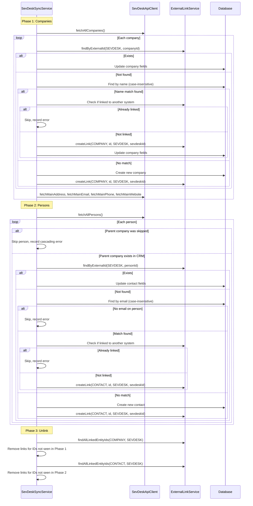

# Design: SevDesk Integration — Company and Contact Import

## GitHub Issue

_To be created by the user._

## Summary

SevDesk is used for invoicing and accounting at Open Elements. Companies and persons (contacts) managed in SevDesk should be importable into the CRM, similar to the existing Brevo integration. This spec adds a SevDesk API client, sync service, and admin page that imports companies and their associated persons into the CRM using the generic `external_links` table introduced in Spec 080.

## Goals

- Import companies and persons from SevDesk into the CRM
- Store SevDesk links via the `external_links` table (system = `SEVDESK`)
- Protect SevDesk-managed fields from manual editing
- Provide a dedicated admin page for SevDesk API key configuration and sync
- Support unlink when entries are removed from SevDesk
- Handle conflicts with entities already imported from other systems (e.g. Brevo)

## Non-goals

- Bidirectional sync (CRM → SevDesk)
- Importing invoices, line items, or financial data
- Importing multiple addresses per entity (only main address)
- Importing contacts not associated with a company (SevDesk persons always belong to a company)

## Dependencies

- **Spec 080 (External Links Table)** must be implemented first — this spec uses `ExternalLinkService` for all external ID storage

## SevDesk API

### Authentication

- **Base URL:** `https://my.sevdesk.de/api/v1`
- **Auth:** API token passed as `Authorization: <token>` header
- Each SevDesk admin account has a 32-character hex API token

### Relevant Endpoints

| Endpoint | Description |
|----------|-------------|
| `GET /Contact?depth=1` | List all contacts (companies + persons). `depth=1` includes both types |
| `GET /Contact/{id}` | Get single contact |
| `GET /Contact/{id}/getMainAddress` | Main address of a contact |
| `GET /Contact/{id}/getMainEmail` | Main email address |
| `GET /Contact/{id}/getMainPhone` | Main phone number |
| `GET /Contact/{id}/getMainWebsite` | Main website |
| `GET /Account` | Validate API key (account info) |

### Contact Type Distinction

SevDesk uses a single `/Contact` endpoint for both companies and persons:
- **Company:** Has a `name` field (organisation name)
- **Person:** Has `familyname` (and optionally `surename`/`titel` fields), plus a `parent` reference to the company contact

### Pagination

SevDesk uses `limit` and `offset` query parameters. Default limit varies; the client should request pages of 100 items.

## Technical Approach

### Backend: SevDesk API Client

**New file:** `com.openelements.crm.sevdesk.SevDeskApiClient`

Follows the `BrevoApiClient` pattern:
- Uses Spring `RestClient` for HTTP calls
- API token injected from `SettingsService` (key: `sevdesk.api-key`)
- **Defensive rate limiting:** 100ms pause between requests (SevDesk limits unknown)
- **Retry logic:** Up to 3 retries with exponential backoff for 5xx errors and 429 (rate limit)
- **Pagination:** Automatic pagination via `limit`/`offset` until no more results

**Methods:**
- `validateApiKey()` → calls `GET /Account` to verify the token
- `fetchAllCompanies()` → `GET /Contact?depth=0` (companies only, depth=0 returns only organisations)
- `fetchAllPersons()` → filters persons from `GET /Contact?depth=1`
- `fetchMainAddress(contactId)` → `GET /Contact/{id}/getMainAddress`
- `fetchMainEmail(contactId)` → `GET /Contact/{id}/getMainEmail`
- `fetchMainPhone(contactId)` → `GET /Contact/{id}/getMainPhone`
- `fetchMainWebsite(contactId)` → `GET /Contact/{id}/getMainWebsite`

**Data records:**

```java
record SevDeskCompany(String id, String name, String description) {}
record SevDeskPerson(String id, String titel, String surename, String familyname,
                     String parentId, String description) {}
record SevDeskAddress(String street, String zip, String city, String country) {}
```

**Rationale:** Building a simple client with `RestClient` is preferred over the abandoned sevdesk-java-client (last updated 2019, not on Maven Central, 1 star).

### Backend: SevDesk Sync Service

**New file:** `com.openelements.crm.sevdesk.SevDeskSyncService`

Follows the `BrevoSyncService` pattern with `AtomicBoolean syncInProgress` for concurrency control.

**Three-phase sync:**



### Field Mapping

**Company:**

| CRM Field | SevDesk Source | Method |
|-----------|---------------|--------|
| `name` | `Contact.name` | Direct |
| `email` | `getMainEmail` | Sub-endpoint |
| `website` | `getMainWebsite` | Sub-endpoint |
| `phoneNumber` | `getMainPhone` | Sub-endpoint |
| `street` | `getMainAddress.street` | Sub-endpoint |
| `houseNumber` | Parsed from street (if present) | Extracted |
| `zipCode` | `getMainAddress.zip` | Sub-endpoint |
| `city` | `getMainAddress.city` | Sub-endpoint |
| `country` | `getMainAddress.country` | Sub-endpoint |
| `description` | `Contact.description` | Direct |

**Person (Contact):**

| CRM Field | SevDesk Source | Method |
|-----------|---------------|--------|
| `title` | `Contact.titel` | Direct |
| `firstName` | `Contact.surename` | Direct |
| `lastName` | `Contact.familyname` | Direct |
| `email` | `getMainEmail` | Sub-endpoint |
| `phoneNumber` | `getMainPhone` | Sub-endpoint |
| `position` | `Contact.description` | Direct (SevDesk has no dedicated position field) |
| `companyId` | Resolved from parent's CRM ID | Via parent company link |

### Readonly Fields

When a contact or company has a SEVDESK external link, the following fields are protected from manual editing:

**Company:** name, email, website, phoneNumber, street, houseNumber, zipCode, city, country (all fields)

**Contact:** title, firstName, lastName, email, phoneNumber, position

This is enforced by the readonly field mapping in `ContactService` and `CompanyService` (introduced in Spec 080 as a per-system mapping).

### Backend: Controller

**New file:** `com.openelements.crm.sevdesk.SevDeskSyncController`

| Method | Path | Description |
|--------|------|-------------|
| `GET` | `/api/sevdesk/settings` | Check if API key is configured |
| `PUT` | `/api/sevdesk/settings` | Set/update API key (validates against SevDesk API) |
| `DELETE` | `/api/sevdesk/settings` | Remove API key |
| `POST` | `/api/sevdesk/sync` | Trigger full sync, returns `SevDeskSyncResultDto` |

**`SevDeskSyncResultDto`:**
```java
record SevDeskSyncResultDto(
    int companiesImported,
    int companiesUpdated,
    int companiesFailed,
    int companiesUnlinked,
    int contactsImported,
    int contactsUpdated,
    int contactsFailed,
    int contactsUnlinked,
    List<String> errors
) {}
```

### Settings Storage

Reuses the existing `settings` table with key `sevdesk.api-key`. No migration needed — the table was created in V7 for Brevo.

### Frontend: Admin Page

**New file:** `frontend/src/app/(app)/admin/sevdesk/page.tsx`

Follows the exact same pattern as the Brevo admin page (`/admin/brevo`):

**Settings Card:**
- API key input (password field)
- Save / Delete buttons
- Status badge (Configured / Not configured)

**Sync Card:**
- "Start Sync" button
- Result grid: Companies (imported, updated, failed, unlinked) + Contacts (imported, updated, failed, unlinked)
- Error list (expandable)
- Disabled until API key is configured

**New component:** `frontend/src/components/sevdesk-sync.tsx` — follows `brevo-sync.tsx` pattern

### Frontend: Sidebar

Add "SevDesk Integration" as a sub-item under the Admin menu (Spec 079):

| Sub-Menu Item | Route | Icon |
|---------------|-------|------|
| SevDesk Integration | `/admin/sevdesk` | `Receipt` (lucide-react) |

### Frontend: API Client

**Add to `api.ts`:**
```typescript
getSevDeskSettings(): Promise<SevDeskSettingsDto>
updateSevDeskSettings(apiKey: string): Promise<SevDeskSettingsDto>
deleteSevDeskSettings(): Promise<void>
startSevDeskSync(): Promise<SevDeskSyncResultDto>
```

### Frontend: Types

**Add to `types.ts`:**
```typescript
interface SevDeskSettingsDto {
  readonly apiKeyConfigured: boolean;
}

interface SevDeskSyncResultDto {
  readonly companiesImported: number;
  readonly companiesUpdated: number;
  readonly companiesFailed: number;
  readonly companiesUnlinked: number;
  readonly contactsImported: number;
  readonly contactsUpdated: number;
  readonly contactsFailed: number;
  readonly contactsUnlinked: number;
  readonly errors: readonly string[];
}
```

### Frontend: i18n

Add `sevdesk` section to both `en.ts` and `de.ts` following the `brevo` pattern:
- `nav.sevdesk`: "SevDesk Integration" / "SevDesk-Integration"
- `sevdesk.settings.*`: API key configuration labels
- `sevdesk.sync.*`: Sync result labels (imported, updated, failed, unlinked)

### Frontend: External Source Filter Update

The filter dropdown in company/contact lists (introduced in Spec 080) gains a new option:
- "From SevDesk" → `externalSource=SEVDESK`

### Frontend: Contact Form

The "Managed by" hint (generalized in Spec 080) will show "Managed by SevDesk" for SevDesk-linked contacts with the SevDesk-specific readonly field set.

## Error Handling

| Scenario | Behavior |
|----------|----------|
| Invalid API key | `PUT /api/sevdesk/settings` returns 400 with validation error |
| SevDesk API unreachable | Sync fails with error message, no partial changes committed |
| Rate limited (429) | Retry with exponential backoff, up to 3 attempts |
| Company already linked to Brevo | Skip, count as failed, log error with company name and conflicting system |
| Contact already linked to Brevo | Skip, count as failed, log error |
| Person without email | Skip, count as failed, log "Contact {name} skipped: no email for matching" |
| Parent company was skipped | Skip person, count as failed, log "Contact {name} skipped: parent company {companyName} could not be imported (cascading error)" |
| Concurrent sync attempt | Return 409 Conflict |

## Security Considerations

- SevDesk API key stored in the `settings` table (same as Brevo) — not in environment variables or code
- API key validated against SevDesk API before saving
- SevDesk endpoints require JWT auth (same as Brevo endpoints)
- No personal data from SevDesk is logged — only IDs and error messages

## Open Questions

None — all decisions resolved during the grill session.
