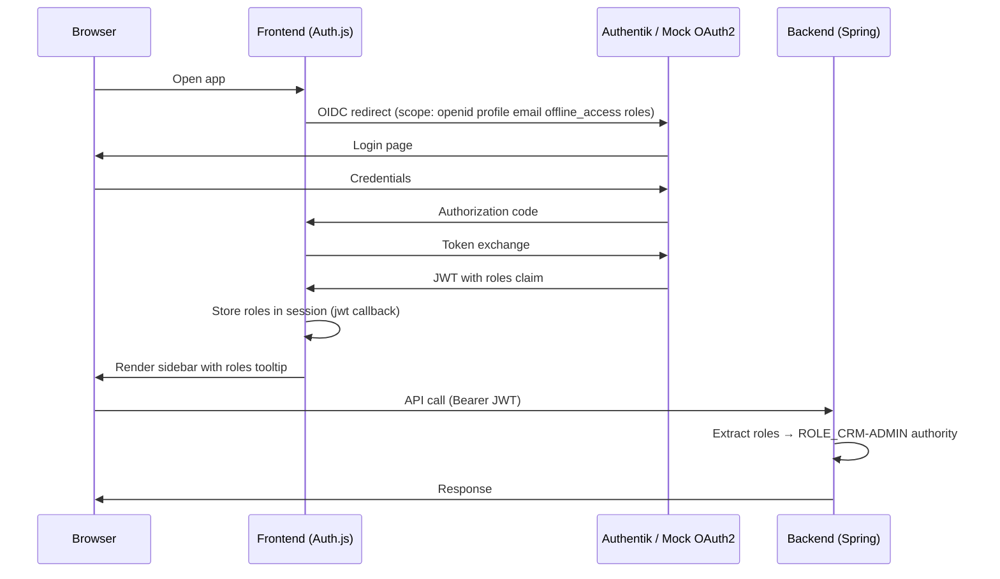

# Design: Role Support

## GitHub Issue

—

## Summary

Add infrastructure to extract and surface OIDC roles in both the frontend and backend of Open CRM. Authentik (or any OIDC provider) can deliver a `roles` claim in the JWT token via a custom scope mapping. This spec makes that claim available throughout the application stack — in the frontend session, in Spring Security authorities, and in the mock OAuth2 server for local development.

No authorization checks or route guards are added. The only user-visible change is a tooltip on the user name in the sidebar that displays the user's roles (or "No roles assigned" if empty). Future specs will build on this to implement role-based access control.

## Goals

- Extract the `roles` claim from the OIDC/JWT token in the frontend and store it in the Auth.js session
- Map the `roles` claim to Spring Security authorities in the backend
- Display roles in a tooltip on the user name in the sidebar
- Include the `roles` claim in the mock OAuth2 server configuration for local development
- Extend test utilities to support roles in mock JWTs

## Non-goals

- Role-based authorization (route guards, endpoint protection, conditional UI) — future spec
- Configurable role names via environment variables (e.g., `CRM_ADMIN_ROLE`) — future spec
- Persisting roles in the database / `UserEntity` — roles are transient, read from the JWT on every request
- Admin-specific UI visibility — future spec

## Technical Approach

### Frontend — Auth.js Session

**File: `frontend/src/auth.ts`**

1. Add `roles` to the requested OIDC scopes: `"openid profile email offline_access roles"`
2. In the `jwt` callback, extract `profile.roles` (as `string[]`) on initial sign-in and store it in the token. If the claim is missing or not an array, default to `[]`.
3. In the `session` callback, pass the `roles` array to the session object.
4. Extend the `Session` type declaration to include `roles: string[]`.

**Rationale:** Requesting the `roles` scope is safe even when the OIDC provider has no such scope mapping — unknown scopes are ignored per the OIDC specification. This means the app works without Authentik configuration; roles will simply be an empty array.

### Frontend — Sidebar Tooltip

**File: `frontend/src/components/sidebar.tsx`**

In the `UserSection` component, add a tooltip on the user name (`<p>` element) that displays the roles:
- If the session contains roles (non-empty array): show each role as a comma-separated list
- If the session has no roles or an empty array: show "No roles assigned" (localized)

The tooltip uses the existing shadcn/ui `Tooltip` component already imported in the sidebar.

### Frontend — i18n

**Files: `frontend/src/lib/i18n/en.ts`, `frontend/src/lib/i18n/de.ts`**

Add translation keys:

```
user: {
  ...existing keys,
  noRoles: "No roles assigned"  // EN
  noRoles: "Keine Rollen zugewiesen"  // DE
}
```

### Backend — JWT Authority Mapping

**File: `backend/src/main/java/com/openelements/crm/SecurityConfig.java`**

Configure a `JwtAuthenticationConverter` that extracts the `roles` claim from the JWT and maps each role to a `SimpleGrantedAuthority` with the prefix `ROLE_`. If the `roles` claim is missing or null, an empty list of authorities is used.

```java
@Bean
public JwtAuthenticationConverter jwtAuthenticationConverter() {
    JwtGrantedAuthoritiesConverter converter = new JwtGrantedAuthoritiesConverter();
    // Default scope-based authorities are kept as well

    JwtAuthenticationConverter authConverter = new JwtAuthenticationConverter();
    authConverter.setJwtGrantedAuthoritiesConverter(jwt -> {
        // Start with default scope-based authorities
        Collection<GrantedAuthority> authorities = new ArrayList<>(converter.convert(jwt));
        // Add role-based authorities from the "roles" claim
        List<String> roles = jwt.getClaimAsStringList("roles");
        if (roles != null) {
            roles.stream()
                .map(role -> new SimpleGrantedAuthority("ROLE_" + role))
                .forEach(authorities::add);
        }
        return authorities;
    });
    return authConverter;
}
```

Wire the converter into the security filter chain:

```java
.oauth2ResourceServer(oauth2 -> oauth2.jwt(jwt -> jwt.jwtAuthenticationConverter(jwtAuthenticationConverter())))
```

**Rationale:** Using the `ROLE_` prefix follows Spring Security conventions and allows future use of both `hasRole("CRM-ADMIN")` and `hasAuthority("ROLE_CRM-ADMIN")`. Default scope-based authorities are preserved so that existing behavior is not affected.

### Mock OAuth2 Server

**File: `mock-oauth2-config.json`**

Add the `roles` claim to the existing test user's claims:

```json
{
  "claims": {
    "name": "John Doe",
    "email": "john@open-elements.com",
    "picture": "https://open-elements.com/team/hendrik.jpg",
    "roles": ["CRM-ADMIN"]
  }
}
```

### Test Utilities

**File: `backend/src/test/java/com/openelements/crm/TestSecurityUtil.java`**

Extend the existing test utility methods to support roles:

- Add overloads that accept a `List<String> roles` parameter
- Add roles to the JWT claims in both `testJwt()` and `setSecurityContext()` methods
- Default (no-arg) methods include `["CRM-ADMIN"]` to match the mock server config

## Key Flows

### Login Flow with Roles



## Dependencies

- No new libraries required
- Uses existing shadcn/ui `Tooltip` component
- Uses existing Spring Security OAuth2 Resource Server classes

## Security Considerations

- Roles are **not validated** against a known list — they are passed through as-is from the OIDC provider. The provider is the single source of truth.
- No authorization decisions are made in this spec. The roles are only displayed and mapped to authorities for future use.
- The `ROLE_` prefix is added server-side, not taken from the token, preventing prefix injection.

## Open Questions

None.
