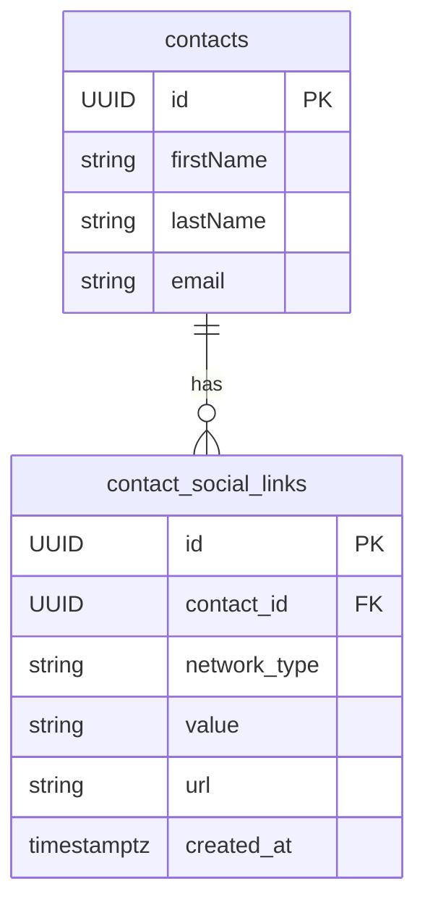

# Design: Contact Social Links

## GitHub Issue

---

## Summary

Contacts currently store a single `linkedInUrl` string field. This feature replaces that with a flexible 0-N social link model supporting 8 networks: GitHub, LinkedIn, X, Mastodon, BlueSky, Discord, YouTube, and Website. Each link stores what the user entered (username or URL) and the resolved full URL. The existing LinkedIn data is migrated to the new structure.

Companies will get the same feature in a separate spec.

## Goals

- Allow contacts to have multiple social network links across 8 supported networks
- Support smart URL construction from usernames/handles (not just full URLs)
- Validate that input matches the selected network's format
- Migrate existing LinkedIn data seamlessly
- Display social links with network-specific icons in the detail view
- Make social links searchable via the existing unified search

## Non-goals

- Social links for companies (separate spec)
- Fetching/verifying that profiles actually exist on the target platform
- Ordering or prioritization of links within a contact
- Custom/user-defined network types beyond the 8 supported ones
- Displaying social links in the print view

## Data Model

### New table: `contact_social_links`

| Column | Type | Constraints |
|--------|------|-------------|
| `id` | UUID | PK, default `gen_random_uuid()` |
| `contact_id` | UUID | FK -> `contacts(id)` ON DELETE CASCADE, NOT NULL |
| `network_type` | VARCHAR(20) | NOT NULL |
| `value` | VARCHAR(500) | NOT NULL |
| `url` | VARCHAR(500) | NOT NULL |
| `created_at` | TIMESTAMPTZ | NOT NULL, default `now()` |

**Rationale:** A separate table (rather than adding 8 columns to `contacts`) is required because contacts can have multiple links per network with no upper bound. The `value` column stores the raw user input (e.g., `hendrikebbers`), while `url` stores the fully constructed link (e.g., `https://github.com/hendrikebbers`). This avoids re-computing URLs on every read and allows the UI to display the human-friendly value.

Links have no `updated_at` — they are immutable. To change a link, delete and re-create it.

### Migration: `V23__contact_social_links.sql`

1. Create `contact_social_links` table
2. Migrate existing `linkedin_url` data: for each contact with a non-null `linkedin_url`, insert a row with `network_type = 'LINKEDIN'`, `value` = the existing URL, `url` = the existing URL
3. Drop `linkedin_url` column from `contacts`

## Backend Design

### `SocialNetworkType` enum

Each enum constant encapsulates its own URL pattern and validation logic:

| Network | Enum Value | Accepted Input | URL Pattern |
|---------|-----------|----------------|-------------|
| GitHub | `GITHUB` | `username`, `@username`, full URL | `https://github.com/{username}` |
| LinkedIn | `LINKEDIN` | `username`, `/in/slug`, full URL | `https://linkedin.com/in/{slug}` |
| X | `X` | `username`, `@username`, full URL | `https://x.com/{username}` |
| Mastodon | `MASTODON` | `@user@instance`, full URL | `https://{instance}/@{user}` |
| BlueSky | `BLUESKY` | `handle.domain` (full handle required), full URL | `https://bsky.app/profile/{handle}` |
| Discord | `DISCORD` | numeric user ID only, full URL | `https://discord.com/users/{id}` |
| YouTube | `YOUTUBE` | `@handle`, `handle`, full URL | `https://youtube.com/@{handle}` |
| Website | `WEBSITE` | full URL only (must include protocol) | as-is |

**Validation rules:**
- If input is a full URL, it must match the expected domain for the selected network
- Discord accepts only numeric IDs (digits only)
- Mastodon requires full `@user@instance` format to identify the instance
- BlueSky requires the full handle including domain part (e.g., `hendrik.bsky.social`)
- Website input must be a valid URL with protocol (`http://` or `https://`)
- Invalid input returns HTTP 400 with a descriptive error message

### Entity: `SocialLinkEntity`

Simple JPA entity managed via `ContactEntity` `@OneToMany(cascade = ALL, orphanRemoval = true)`. No separate repository — lifecycle is fully controlled through the parent contact.

### DTOs

- **`SocialLinkDto`**: `networkType` (String), `value` (String), `url` (String) — read response
- **`SocialLinkCreateDto`**: `networkType` (String), `value` (String) — write request, `url` is computed by backend
- **`ContactDto`**: replace `linkedInUrl` field with `List<SocialLinkDto> socialLinks`
- **`ContactCreateDto`** / **`ContactUpdateDto`**: replace `linkedInUrl` with `List<SocialLinkCreateDto> socialLinks`

### Service Changes

**`ContactService`:**
- `applyFields()` updated: clear existing social links, validate and re-add from DTO (same pattern as tags)
- URL construction and validation delegated to `SocialNetworkType` enum methods
- Search specification (`list()` method): extend the multi-field search to join `socialLinks` and match against the `value` column

**`BrevoSyncService`:**
- When importing contacts from Brevo, the LinkedIn field is written as a `LINKEDIN` social link
- On re-import, existing Brevo-managed LinkedIn social links are replaced (not duplicated)

### Brevo Readonly Protection

Social links imported from Brevo (identified by contact having a `brevoId`) are readonly. The `ContactService.update()` method rejects modifications to social links for Brevo contacts with HTTP 400.

### CSV Export

Replace the `LINKED_IN_URL` column in `ContactExportColumn` with `SOCIAL_LINKS`. The extractor joins all `url` values with commas into a single string.

### Webhook Events

No new event types needed. Social link changes are part of `CONTACT_UPDATED` events — the updated `ContactDto` (which now includes `socialLinks`) is the webhook payload.

## Frontend Design

### Detail View (`contact-detail.tsx`)

Replace the LinkedIn `DetailField` with a social links section in the existing field grid.

**Display order** (fixed): LinkedIn, GitHub, Mastodon, BlueSky, Discord, Website, X, YouTube

**Layout per network group:**
- Network icon displayed only on the first link of that network
- All link values start at the same horizontal position (left-aligned)
- Multiple links of the same network appear directly below each other (line break, no paragraph spacing)
- Each link is clickable (opens the URL) and copyable
- Networks with no links are not shown

### Edit Form (`contact-form.tsx`)

Replace the LinkedIn text input with a dynamic social links editor:

- Each existing link shown as: network dropdown + text input + delete (X) button
- "+" button at the bottom to add a new empty row
- Network dropdown contains all 8 network types
- Placeholder text adapts to selected network (e.g., "username" for GitHub, "@user@instance" for Mastodon)
- Only rows with content are shown — no empty network placeholders
- On save, empty rows are filtered out

### i18n

Add translations for:
- Network names (GitHub, LinkedIn, X, Mastodon, BlueSky, Discord, YouTube, Website)
- Input placeholders per network
- Section label "Social Links" / "Soziale Netzwerke"
- CSV export column header

### Print View

Social links are **not** displayed in the print view.

## Security Considerations

- Input validation prevents injection via URL construction (use allowlists for URL patterns, not string concatenation with user input)
- Social link values are sanitized before being used in URLs
- Backend validation is authoritative — frontend validation is for UX only

## Open Questions

None — all questions resolved during grill session.
