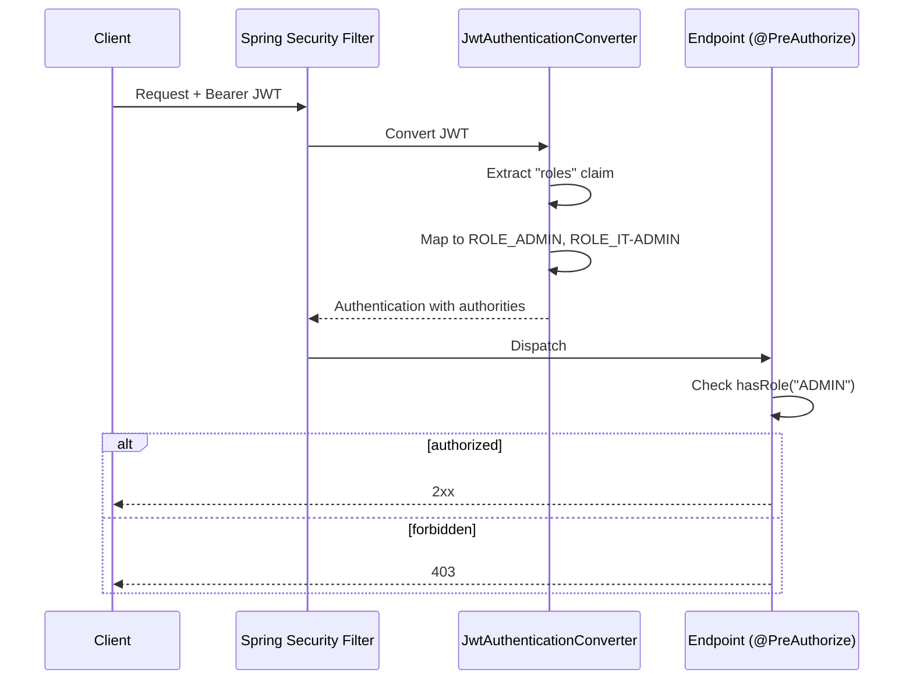

# Design: Role-Based Access Control

## GitHub Issue

— (none)

## Summary

Introduce role-based access control on top of the existing OIDC authentication. Two independent roles from Authentik gate specific actions:

- **`IT-ADMIN`** — required for all admin-area functionality (Server Status, Bearer Token, Brevo Import, API Keys, Webhooks) including every read and write action inside those areas.
- **`ADMIN`** — required for every delete operation in the CRM (companies, contacts, tasks, tags, comments; this also covers deletion of logos/photos and bulk "delete with contacts" on companies).

The role infrastructure (extraction from OIDC token into frontend session and backend JWT) was established in Spec 083 but no authorization checks exist yet. This spec adds the enforcement layer on both frontend (menu filtering, disabled buttons, 403 page, 403 error display) and backend (method-level `@PreAuthorize` checks, 403 responses).

## Goals

- Enforce `IT-ADMIN` role on all admin-area routes and endpoints.
- Enforce `ADMIN` role on all delete endpoints across the entire CRM.
- Provide consistent and predictable UX for users without the required role.
- Cover the enforcement with automated tests on backend and frontend.

## Non-goals

- **No new roles.** Only `ADMIN` and `IT-ADMIN` are introduced by this spec.
- **No hierarchy.** The two roles are fully independent; a user who needs both sets of permissions must have both roles assigned in Authentik.
- **No baseline role.** Any authenticated user can continue to read and edit (except delete) companies, contacts, tasks, tags and write comments.
- **No live role refresh.** Role changes in Authentik only take effect after the user signs out and signs in again. This is documented but not auto-refreshed.
- **No changes to the API-key authentication path.** API keys remain read-only and do not participate in role-based authorization.
- **No UI for role management.** Roles are managed entirely in Authentik.

## Technical approach

### Roles and naming

| Role        | Purpose                                                             |
|-------------|---------------------------------------------------------------------|
| `ADMIN`     | Allowed to delete any entity in the CRM.                            |
| `IT-ADMIN`  | Allowed to access every admin-area feature and action.              |

Roles are exposed by Authentik via the existing `roles` claim in the JWT (implemented in Spec 083). The exact role strings written to the claim are `ADMIN` and `IT-ADMIN`.

Rationale: the hyphenated form `IT-ADMIN` is the canonical form configured in Authentik. The backend authority mapping must tolerate hyphens in role strings (Spring's default `ROLE_` prefix plus the raw role name).

### Backend — Authority mapping and enforcement

A custom `JwtAuthenticationConverter` is wired into the Spring Security chain so that the `roles` claim is mapped to granted authorities using the `ROLE_` prefix expected by `@PreAuthorize("hasRole(...)")`. The base module `com.openelements.spring.base` (`FullSpringServiceConfig`) does not currently provide a role-aware converter, so the configuration is added in a new `SecurityConfig` class in the CRM backend.



Missing or malformed `roles` claim → no authorities are granted → every `@PreAuthorize`-guarded endpoint returns 403. No 500 error is raised for a missing claim.

The following endpoints are annotated with `@PreAuthorize("hasRole('ADMIN')")`:

- `DELETE /api/companies/{id}` (`CompanyController.delete`, line 223)
- `DELETE /api/companies/{id}/logo` (`CompanyController.deleteLogo`, line 280)
- `DELETE /api/contacts/{id}` (`ContactController.delete`, line 231)
- `DELETE /api/contacts/{id}/photo` (`ContactController.deletePhoto`, line 283)
- `DELETE /api/tasks/{id}` (`TaskController.delete`, line 95)
- `DELETE /api/tags/{id}` (`TagController.delete`, line 110)
- `DELETE /api/comments/{id}` (`CommentController.delete`, line 80)

The following endpoints (every method of the admin controllers, not just DELETE) are annotated with `@PreAuthorize("hasRole('IT-ADMIN')")` — class-level annotation is used where every method in the controller is admin-only:

- `ApiKeyController` — `POST /api/api-keys`, `GET /api/api-keys`, `DELETE /api/api-keys/{id}`
- `WebhookController` — `GET`, `GET /{id}`, `POST`, `PUT /{id}`, `POST /{id}/ping`, `DELETE /{id}`
- `BrevoSyncController` — `GET /api/brevo/settings`, `PUT /api/brevo/settings`, `DELETE /api/brevo/settings`, `POST /api/brevo/sync`

Rationale for class-level `@PreAuthorize` on admin controllers: every method in these controllers is part of the admin area, so a single class-level annotation is less error-prone than per-method annotations.

The `GET /api/health` endpoint (`HealthController`) remains unauthenticated (liveness probe) and is not affected.

Method-level security is enabled with `@EnableMethodSecurity` on the new `SecurityConfig` class.

Rationale: `@PreAuthorize` at method/class level keeps the role rules co-located with the controller code, which is easier to reason about than matcher-based rules spread across `HttpSecurity` configuration.

### Frontend — Session roles and enforcement

Roles are already available on `session.roles: string[]` (Spec 083). Two small helpers are added to centralize role checks:

```ts
// frontend/src/lib/roles.ts
export function hasRole(session: Session | null, role: string): boolean {
  return !!session?.roles?.includes(role);
}
export const ROLE_ADMIN = "ADMIN";
export const ROLE_IT_ADMIN = "IT-ADMIN";
```

#### Sidebar — menu filtering

The admin sub-menu in `frontend/src/components/sidebar.tsx` is rendered only when `hasRole(session, ROLE_IT_ADMIN)` is true. On both desktop (collapsible group) and mobile (flat list), all admin items are hidden in full if the role is missing — the collapsed-state chevron is not shown either, so there is no visual hint of the feature's existence.

Rationale: "menu items show only what the user can use" (explicit user decision). This differs from in-view actions, which are disabled with a tooltip.

#### Admin routes — 403 page

Direct navigation to any admin route without `IT-ADMIN` renders a 403 page. Implementation: each admin route (`/admin/status`, `/admin/token`, `/admin/brevo`, `/api-keys`, `/webhooks`) performs a server-side session check via `auth()`; if the role is missing, the page renders the shared `ForbiddenPage` component.

A new component `frontend/src/components/forbidden-page.tsx` is added, rendering a branded page with:

- Heading: i18n key `errors.forbidden.title` ("Keine Berechtigung" / "Access denied")
- Message: i18n key `errors.forbidden.description` (explains that the required role is missing)
- Link back to the home page: i18n key `errors.forbidden.backToHome`

Rationale: a dedicated 403 page gives clear feedback, is linkable, and follows the existing branded-login pattern from Spec 073.

#### In-view delete buttons — disabled with tooltip

Every delete trigger in the UI is rendered *always visible* but `disabled` when the user does not have `ADMIN`. A shadcn/ui `Tooltip` wraps the button and displays the i18n text `errors.roleRequired.admin` ("ADMIN-Rolle erforderlich" / "ADMIN role required").

Affected components:

- `company-detail.tsx` (line 85) — delete button
- `company-list.tsx` — row delete action
- `contact-detail.tsx` (line 64) — delete button
- `contact-list.tsx` (line 149) — row delete action
- `task-detail.tsx` (line 57) — delete button
- `tag-list.tsx` (line 62) — row delete action
- `company-comments.tsx`, `contact-comments.tsx`, `task-comments.tsx` — comment delete buttons

Inside admin views that are already `IT-ADMIN`-gated, delete buttons (API keys, webhooks) follow the same rule: they are guarded by `IT-ADMIN` at the route level, so they are always active when the view is reachable. No per-button role check is needed for these.

Rationale for the disabled-with-tooltip pattern: "inside a dialog/view, actions should remain visible so users can see what is possible, but disabled when unavailable" (explicit user decision).

#### 403 handling from backend

When a backend DELETE returns 403 (e.g. because the user's role was revoked but the UI still had the button enabled due to stale session), the existing delete dialog surfaces a specific permission error. The `DeleteConfirmDialog` already supports an `error` prop (see `delete-confirm-dialog.tsx` line 41). The calling code maps HTTP 403 to the new i18n key `errors.forbidden.deleteNoPermission` ("Löschen nicht erlaubt — ADMIN-Rolle erforderlich"). For company delete (`CompanyDeleteDialog`), the same error surface is added.

The `apiFetch` wrapper in `frontend/src/lib/api.ts` is extended so that each delete function throws a typed `ForbiddenError` on HTTP 403. The calling component distinguishes this from generic errors and picks the right i18n key.

Rationale: reusing the existing dialog error surface avoids introducing a toast library just for one error case.

### i18n

New keys added to `frontend/src/lib/i18n/en.ts` and `de.ts`:

```ts
errors: {
  forbidden: {
    title: "Access denied" / "Keine Berechtigung",
    description: "You don't have the required role to access this page." / "Du hast nicht die erforderliche Rolle für diese Seite.",
    backToHome: "Back to home" / "Zur Startseite",
    deleteNoPermission: "Delete not allowed — ADMIN role required." / "Löschen nicht erlaubt — ADMIN-Rolle erforderlich.",
  },
  roleRequired: {
    admin: "ADMIN role required" / "ADMIN-Rolle erforderlich",
    itAdmin: "IT-ADMIN role required" / "IT-ADMIN-Rolle erforderlich",
  },
},
```

## Security considerations

- **Defense in depth.** Frontend role checks are for UX only; every authorization decision is re-enforced on the backend.
- **Role revocation.** If a user's role is removed in Authentik during an active session, the UI might still show enabled actions until the next sign-in. The backend still rejects the request with 403, and the UI surfaces a specific "Delete not allowed" error. Documented in the Admin documentation.
- **Missing claim tolerance.** A JWT without the `roles` claim is treated as "no roles", not as an error. This prevents a misconfigured Authentik from causing a 500 while still preventing unauthorized access.
- **API keys unchanged.** API keys continue to cover only GET endpoints (read-only) and are not assigned roles. No role check runs on API-key-authenticated requests.

## Documentation

A short note is added to the admin/operational docs (location: `README.md` or the Authentik configuration section of the admin documentation — existing doc to be extended rather than a new file):

> Role changes in Authentik (`ADMIN`, `IT-ADMIN`) take effect the next time the user signs in. To apply new roles immediately, the user must sign out and sign in again.

## Testing

### Backend

- **Unit test `JwtAuthenticationConverter`** — given a JWT with `roles: ["ADMIN"]`, expect authorities `ROLE_ADMIN`. Edge cases: missing claim, empty list, unknown role, hyphenated role `IT-ADMIN`.
- **Controller integration tests** (MockMvc / `@WebMvcTest` or full Spring context with mocked JWT) for each affected endpoint × each of the four role combinations (none / `ADMIN` / `IT-ADMIN` / both). Assert 2xx for allowed combinations, 403 for forbidden ones.
- **Regression test** — non-protected endpoints (e.g. `GET /api/companies`) remain accessible to users without `ADMIN` and `IT-ADMIN`.

### Frontend

- **Sidebar component tests** — given a session with each of the four role combinations, assert that admin sub-menu items are visible or not. Extend existing `sidebar.test.tsx`.
- **Delete button component tests** — for each component listed above, assert that the button is disabled and shows the tooltip when the session has no `ADMIN` role, and is enabled otherwise.
- **403 page test** — unauthorized user hitting an admin route renders the forbidden page.
- **Delete error path test** — when a DELETE returns 403, the dialog shows the `errors.forbidden.deleteNoPermission` message.

## Open questions

- Which existing documentation page hosts the operational note about signing out after a role change? (Likely the admin/operations README section from Spec 072 or 074 — decide during implementation.)

## Dependencies

- Existing OIDC infrastructure (Spec 047–049) and role extraction (Spec 083).
- `com.openelements.spring.base:spring-services` v0.5.0 — no change required; the new `SecurityConfig` supplements rather than replaces its configuration.
- shadcn/ui `Tooltip` (already used in Spec 068) — no new dependency.
