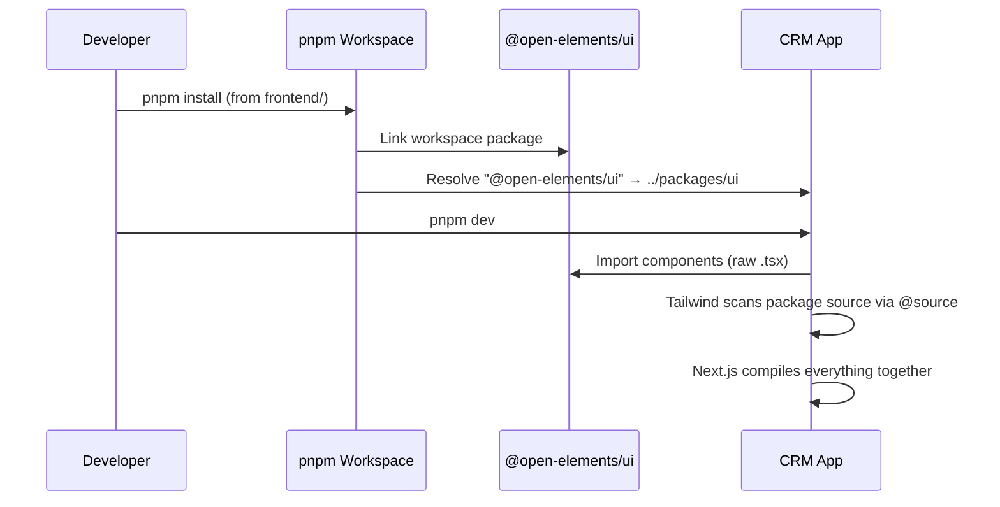

# Design: Frontend UI Package Extraction

## GitHub Issue

—

## Summary

Extract reusable UI components, shared domain types, brand styling, and translation strings from the Open CRM frontend
into a local `@open-elements/ui` pnpm workspace package. This mirrors the backend's `spring-services` extraction and
establishes a foundation for sharing frontend code across Open Elements projects.

The first iteration is intentionally minimal — Combobox (with its dependency chain) and TagMultiSelect — to prove the
workspace wiring, build integration, and import patterns before extracting more components.

## Goals

- Create a pnpm workspace package `@open-elements/ui` that contains reusable UI components
- Establish clean package boundaries with a barrel export and peer dependencies
- Extract Open Elements brand colors, fonts, and Tailwind theme tokens into the package
- Refactor TagMultiSelect to be backend-agnostic (no hardcoded API calls)
- Ship DE/EN translation strings for extracted components within the package
- Maintain full build and test functionality for the existing app

## Non-goals

- Publishing to npm (deferred until the package moves to its own repository)
- Extracting all UI components (only the minimal set for this iteration)
- Adding a build/compile step to the package (raw `.tsx` source distribution)
- Creating a separate LanguageProvider in the package (app merges translations)
- Extracting authentication, API client, or domain-specific components

## Technical Approach

### Distribution Model: Raw Source

The package ships raw `.tsx` source files. The consuming app's Tailwind CSS scans the package source to discover utility
classes. This avoids duplicating Tailwind theme configuration and is the same pattern shadcn/ui uses.

**Rationale:** Pre-compiled CSS would require maintaining brand colors/theme tokens in two places (package build config +
app config). Since all consumers are Open Elements Next.js projects with the same Tailwind setup, source distribution
eliminates this duplication.

### Package Structure

```
frontend/
├── pnpm-workspace.yaml          # NEW — declares workspace packages
├── packages/
│   └── ui/                       # NEW — @open-elements/ui
│       ├── package.json
│       ├── tsconfig.json
│       ├── vitest.config.ts
│       ├── eslint.config.mjs
│       ├── .prettierrc
│       ├── src/
│       │   ├── components/       # UI components
│       │   │   ├── button.tsx
│       │   │   ├── input.tsx
│       │   │   ├── textarea.tsx
│       │   │   ├── input-group.tsx
│       │   │   ├── combobox.tsx
│       │   │   └── tag-multi-select.tsx
│       │   ├── lib/
│       │   │   └── utils.ts      # cn() helper
│       │   ├── types/
│       │   │   └── index.ts      # TagDto
│       │   ├── i18n/
│       │   │   ├── de.ts         # German strings for package components
│       │   │   └── en.ts         # English strings for package components
│       │   ├── styles/
│       │   │   └── brand.css     # Open Elements brand colors + fonts + semantic tokens
│       │   └── index.ts          # Barrel export (public API)
│       └── README.md
├── app/                          # RENAMED from current root (or stays as-is, see below)
│   ├── package.json              # Updated: adds "@open-elements/ui": "workspace:*"
│   └── src/
│       ├── components/
│       │   └── ui/               # Remaining non-extracted components
│       └── ...
```

**Important structural decision:** The current frontend code lives directly in `frontend/`. With pnpm workspaces, we
have two options:

1. **Keep the app at `frontend/` root** — add `pnpm-workspace.yaml` at `frontend/` level, the app's `package.json`
   stays at `frontend/package.json`, and the new package lives at `frontend/packages/ui/`.
2. **Move the app into `frontend/apps/web/`** — cleaner monorepo structure but more disruptive.

**Decision: Option 1.** Keep the app at the root to minimize disruption. The `pnpm-workspace.yaml` at `frontend/` level
declares `packages/*` as workspace packages. The root `package.json` (the app) is implicitly the workspace root.

### Components to Extract

The minimal set, driven by the Combobox dependency chain:

| Component | Source | Internal Dependencies |
|-----------|--------|----------------------|
| `Button` | `components/ui/button.tsx` | `cn()`, radix-ui Slot |
| `Input` | `components/ui/input.tsx` | `cn()` |
| `Textarea` | `components/ui/textarea.tsx` | `cn()` |
| `InputGroup` | `components/ui/input-group.tsx` | `cn()`, Button, Input, Textarea |
| `Combobox` | `components/ui/combobox.tsx` | `cn()`, Button, InputGroup |
| `TagMultiSelect` | `components/tag-multi-select.tsx` | Combobox, TagDto |

### TagMultiSelect Refactoring

Current implementation has two hardcoded dependencies that must be removed:

1. **`getTags` from `@/lib/api`** — fetches tags directly from the CRM backend
2. **`useTranslations` from `@/lib/i18n`** — reads from the app's translation context

Refactored interface:

```typescript
interface TagMultiSelectProps {
  readonly selectedIds: readonly string[];
  readonly onChange: (ids: string[]) => void;
  readonly loadTags: () => Promise<TagOption[]>;
  readonly translations: TagMultiSelectTranslations;
}

interface TagOption {
  readonly value: string;
  readonly label: string;
  readonly color: string;
}

interface TagMultiSelectTranslations {
  readonly placeholder: string;
  readonly empty: string;
}
```

The component receives a `loadTags` callback and pre-resolved translation strings as props. The consuming app provides
the implementation:

```typescript
// In the app:
<TagMultiSelect
  selectedIds={selectedIds}
  onChange={setSelectedIds}
  loadTags={async () => {
    const result = await getTags({ size: 1000 });
    return result.content.map(tag => ({
      value: tag.id,
      label: tag.name,
      color: tag.color,
    }));
  }}
  translations={{ placeholder: t.tags.label + "...", empty: t.tags.empty }}
/>
```

**Rationale:** Callbacks for data fetching (inversion of control) keep the component backend-agnostic. Translation
strings as props (instead of a package-internal context) allow the app to merge them into its existing i18n system
without needing a second LanguageProvider.

### TagDto

The package defines and exports `TagDto` as the canonical type:

```typescript
export interface TagDto {
  readonly id: string;
  readonly name: string;
  readonly description: string | null;
  readonly color: string;
  readonly createdAt: string;
  readonly updatedAt: string;
  readonly companyCount: number | null;
  readonly contactCount: number | null;
  readonly taskCount: number | null;
}
```

The app imports `TagDto` from `@open-elements/ui` instead of defining it locally. The app's `types.ts` removes its
`TagDto` definition.

### Translation Strings

The package exports translation objects that the app merges into its own i18n files:

```typescript
// packages/ui/src/i18n/en.ts
export const en = {
  tagMultiSelect: {
    placeholder: "Tags...",
    empty: "No tags yet. Create your first tag to organize companies and contacts.",
  },
};
```

```typescript
// packages/ui/src/i18n/de.ts
export const de = {
  tagMultiSelect: {
    placeholder: "Tags...",
    empty: "Noch keine Tags. Erstellen Sie Ihr erstes Tag.",
  },
};
```

The app's `de.ts` / `en.ts` import and spread these:

```typescript
import { de as uiDe } from "@open-elements/ui";
// ...
export const de = {
  // ... app-specific translations
  ...uiDe,
};
```

### Brand Styling

The package owns Open Elements brand colors, fonts, and semantic token mappings. These are extracted from the app's
`globals.css` into `packages/ui/src/styles/brand.css`:

```css
@theme {
  /* Open Elements Brand Colors */
  --color-oe-dark: #020144;
  --color-oe-black: #000000;
  --color-oe-white: #ffffff;
  --color-oe-gray-mid: #b0aea5;
  --color-oe-gray-light: #e8e6dc;
  --color-oe-green: #5CBA9E;
  /* ... all brand colors ... */

  /* Semantic tokens mapped to brand */
  --color-primary: #5CBA9E;
  --color-destructive: #E63277;
  /* ... all semantic tokens ... */

  --font-heading: "Montserrat", sans-serif;
  --font-body: "Lato", sans-serif;
}
```

The app's `globals.css` imports it:

```css
@import "@open-elements/ui/src/styles/brand.css";
@import "tailwindcss";

/* App-specific styles (print, layout, etc.) */
body { ... }
```

The app can override any brand token after the import if needed.

### Barrel Export

`packages/ui/src/index.ts` is the single public API:

```typescript
// Components
export { Button, buttonVariants } from "./components/button";
export { Input } from "./components/input";
export { Textarea } from "./components/textarea";
export {
  InputGroup, InputGroupAddon, InputGroupButton,
  InputGroupText, InputGroupInput, InputGroupTextarea,
} from "./components/input-group";
export {
  Combobox, ComboboxInput, ComboboxContent, ComboboxList, ComboboxItem,
  ComboboxGroup, ComboboxLabel, ComboboxCollection, ComboboxEmpty,
  ComboboxSeparator, ComboboxChips, ComboboxChip, ComboboxChipsInput,
  ComboboxTrigger, ComboboxValue, useComboboxAnchor,
} from "./components/combobox";
export { TagMultiSelect } from "./components/tag-multi-select";
export type { TagMultiSelectProps, TagMultiSelectTranslations, TagOption } from "./components/tag-multi-select";

// Types
export type { TagDto } from "./types";

// Utilities
export { cn } from "./lib/utils";

// Translations
export { de } from "./i18n/de";
export { en } from "./i18n/en";
```

### Dependencies

All external dependencies are `peerDependencies` — the consuming app must have them installed:

```json
{
  "peerDependencies": {
    "react": "^19.0.0",
    "react-dom": "^19.0.0",
    "@base-ui/react": "^1.3.0",
    "radix-ui": "^1.4.0",
    "lucide-react": "^0.500.0",
    "class-variance-authority": "^0.7.0",
    "clsx": "^2.1.0",
    "tailwind-merge": "^3.0.0"
  }
}
```

**Rationale:** All these libraries must share a single instance with the app (React for hooks, Radix for context,
lucide for tree-shaking). Peer dependencies avoid version conflicts and duplication.

### Tailwind Content Scanning

The app's `postcss.config.mjs` or Tailwind config must include the package source in its content paths. With
Tailwind v4, this is handled by adding a source directive. The app's `globals.css` already imports the brand CSS from
the package; Tailwind v4 automatically scans imported files. For component `.tsx` files, the app needs to ensure
Tailwind scans the package's source directory. This can be done via a `@source` directive in the app's CSS:

```css
@import "@open-elements/ui/src/styles/brand.css";
@import "tailwindcss";
@source "../packages/ui/src";
```

### Import Updates

All imports of extracted components in the app change from:

```typescript
import { Button } from "@/components/ui/button";
import { cn } from "@/lib/utils";
import type { TagDto } from "@/lib/types";
```

To:

```typescript
import { Button, cn } from "@open-elements/ui";
import type { TagDto } from "@open-elements/ui";
```

The original files (`components/ui/button.tsx`, `lib/utils.ts`, etc.) are deleted from the app after migration.

### Package Tooling

The package has its own development tooling for clean extraction later:

- **TypeScript:** Own `tsconfig.json` with `@ui/*` path alias pointing to `./src/*`
- **Vitest:** Own `vitest.config.ts` with jsdom environment
- **ESLint:** Own `eslint.config.mjs`
- **Prettier:** Own `.prettierrc`

### Testing Strategy

- Combobox and sub-components: Rendering tests with Testing Library
- TagMultiSelect: Tests with mocked `loadTags` callback, verify chip rendering, selection behavior
- `cn()`: Unit tests for class merging

Existing tests for extracted components move from the app to the package. The app keeps tests for domain-specific
components that consume the package.

## Key Flows

### Developer Workflow (Local Development)



### Future: Extract to Own Repository

1. Copy `packages/ui/` to new repository
2. Add build step (compile `.tsx` → `.js` + `.d.ts`, bundle CSS)
3. Publish to npm as `@open-elements/ui`
4. In consuming apps: change `"workspace:*"` to `"^1.0.0"` in `package.json`
5. Imports remain unchanged: `import { Button } from "@open-elements/ui"`

## Open Questions

- **npm publishing format** — When extracting to own repo: publish raw source or compiled JS + CSS? Deferred.
