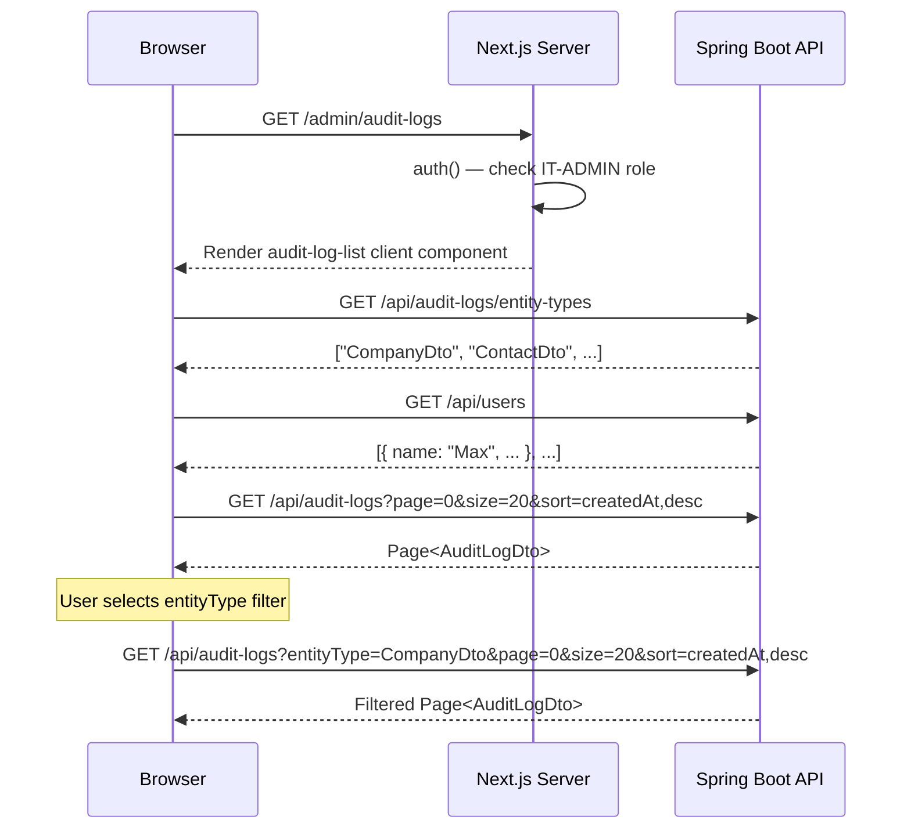

# Design: Audit Log View

## GitHub Issue

—

## Summary

A read-only admin page that displays audit log entries in a paginated table. The audit log records every INSERT, UPDATE, and DELETE operation on entities in the system. IT-ADMINs can browse the log and filter by entity type and user. There is no detail view, no editing, and no actions on individual entries.

## Goals

- Give IT-ADMINs visibility into data lifecycle events (who changed what, when)
- Provide filtering by entity type and user to narrow down relevant entries
- Follow the same pagination and UI patterns as existing list views

## Non-goals

- Editing or deleting audit log entries from the UI
- Detail view for individual audit entries
- Sorting controls (fixed `createdAt DESC`)
- Action filter (filtering by INSERT/UPDATE/DELETE)
- Export (CSV, print)

## Technical Approach

### Backend

A new `AuditLogController` exposes the existing `AuditLogDataService` (from `com.open-elements:spring-services`) via REST. No new entities or migrations are needed — the audit infrastructure already exists in the dependency.

### Frontend

A new admin sub-page at `/admin/audit-logs` with a client component rendering a paginated table. Two `Select` dropdowns for filtering. Follows the same patterns as the API Keys list and other admin pages.

## API Design

### `GET /api/audit-logs`

Paginated list of audit log entries with optional filters.

**Query parameters:**

| Parameter    | Type   | Required | Description                        |
|--------------|--------|----------|------------------------------------|
| `entityType` | String | no       | Filter by entity type (exact match)|
| `user`       | String | no       | Filter by user name (exact match)  |
| `page`       | int    | no       | Page number (0-indexed, default 0) |
| `size`       | int    | no       | Page size (default 20)             |

**Sorting:** Fixed `createdAt DESC` (newest first), not configurable.

**Filter logic:**
- No filters → `auditLogDataService.findAll(pageable)` (inherited, note: no default ordering — the controller must pass a `Pageable` with `Sort.by(DESC, "createdAt")`)
- `entityType` only → `auditLogDataService.findByEntityType(entityType, pageable)`
- `user` only → `auditLogDataService.findByUser(user, pageable)`
- Both → `auditLogDataService.findByEntityTypeAndUser(entityType, user, pageable)`

**Response:** `Page<AuditLogDto>` (standard Spring Data page wrapper)

```json
{
  "content": [
    {
      "id": "uuid",
      "entityType": "CompanyDto",
      "entityId": "uuid",
      "action": "INSERT",
      "user": "Max Mustermann",
      "createdAt": "2026-04-25T14:30:00Z"
    }
  ],
  "page": {
    "size": 20,
    "number": 0,
    "totalElements": 142,
    "totalPages": 8
  }
}
```

### `GET /api/audit-logs/entity-types`

Returns distinct entity type values for the filter dropdown.

**Response:** `List<String>`

```json
["CompanyDto", "ContactDto", "TagDto", "TaskDto"]
```

### User list for dropdown

The user filter dropdown is populated from the existing user list. A new `GET /api/users` endpoint needs to be added to `UserController` (currently only `/api/users/me` exists). This endpoint returns all registered users and is restricted to IT-ADMIN.

**Response:** `List<UserDto>` — the dropdown displays user names and sends the `name` field as the filter value.

**Note:** Audit entries with `user = "System"` are not selectable in the dropdown. They are only visible when no user filter is applied.

### Security

Both endpoints are annotated with `@RequiresItAdmin` (class-level on the controller). The user list endpoint also requires `@RequiresItAdmin`.

## Frontend Structure

### Files

| File | Purpose |
|------|---------|
| `frontend/src/app/(app)/admin/audit-logs/page.tsx` | Server component — role check, renders client |
| `frontend/src/components/audit-log-list.tsx` | Client component — table, filters, pagination |

### Sidebar

New entry in the Admin collapsible group in `layout.tsx`:

- Label: `nav.auditLogs` ("Audit Log" / "Audit Log")
- Icon: `FileText` from lucide-react (or similar log/history icon)
- Path: `/admin/audit-logs`
- Position: after the last existing admin entry

### Table Columns

| Column     | Field        | Notes                                    |
|------------|--------------|------------------------------------------|
| Type       | `entityType` | Raw class name string                    |
| Entity ID  | `entityId`   | UUID string                              |
| Action     | `action`     | INSERT / UPDATE / DELETE                 |
| User       | `user`       | User name or "System"                    |
| Date       | `createdAt`  | Formatted as localized date-time string  |

### Filters

Two `Select` dropdowns in a row above the table:

1. **Entity Type** — Options loaded from `GET /api/audit-logs/entity-types`. First option "All" clears the filter.
2. **User** — Options loaded from `GET /api/users` (name values). First option "All" clears the filter.

Changing a filter resets the page to 0 and re-fetches data.

### Pagination

Same pattern as other list views:
- Page-size selector: `[10, 20, 50, 100, 200]`, default 20, persisted in `localStorage` key `pageSize.auditLogs`
- Previous / Next buttons, shown only when `totalPages > 1`
- Total count display (e.g., "142 Einträge" / "142 Entries")

### States

- **Loading:** 5 skeleton rows
- **Empty (no data):** Icon + translated message ("No audit log entries." / "Keine Audit-Log-Einträge.")
- **Empty (filter no match):** Same empty state
- **Error:** Standard error handling via thrown errors in API functions

### i18n Keys

```
nav.auditLogs: "Audit Log" / "Audit Log"

auditLog.title: "Audit Log" / "Audit Log"
auditLog.empty: "No audit log entries." / "Keine Audit-Log-Einträge."
auditLog.filter.entityType: "Entity Type" / "Entity-Typ"
auditLog.filter.entityTypeAll: "All types" / "Alle Typen"
auditLog.filter.user: "User" / "Benutzer"
auditLog.filter.userAll: "All users" / "Alle Benutzer"
auditLog.columns.entityType: "Type" / "Typ"
auditLog.columns.entityId: "Entity ID" / "Entity-ID"
auditLog.columns.action: "Action" / "Aktion"
auditLog.columns.user: "User" / "Benutzer"
auditLog.columns.createdAt: "Date" / "Datum"
auditLog.pagination.perPage: "per page" / "pro Seite"
auditLog.pagination.previous: "Previous" / "Zurück"
auditLog.pagination.next: "Next" / "Weiter"
```

## Key Flows



## Dependencies

- `com.open-elements:spring-services:0.10.0-SNAPSHOT` — provides `AuditLogDataService`, `AuditLogDto`, `AuditAction`
- Existing `UserService` — provides user list for dropdown
- Existing frontend patterns — `Page<T>` type, `apiFetch`, shadcn/ui components, i18n system
