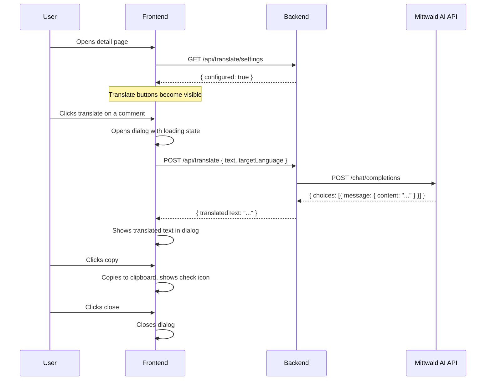

# Design: Translation Action for Descriptions and Comments

## GitHub Issue

—

## Summary

The CRM contains bilingual content (German and English). Users need a quick way to translate company/contact descriptions and comments into their currently selected UI language without leaving the application.

A new "Translate" action button is added to description fields (company, contact) and to all comments (company, contact, task). Clicking it sends the text to an OpenAI-compatible API endpoint via the backend (which acts as a proxy to keep the API key server-side) and displays the translation in a popup dialog.

The translation API is hosted by Mittwald, a German provider with EU-based hosting and DSGVO-compliant infrastructure.

## Goals

- Allow users to translate any description or comment into their current UI language (DE or EN) with one click
- Keep the API key secure on the backend — the frontend never touches it
- Gracefully degrade when translation is not configured (buttons hidden, warning logged)

## Non-goals

- Automatic language detection to skip translation when text is already in the target language — the button is always shown
- Persisting translations — the result is displayed once in a popup and not stored
- Rate limiting or cost control — not needed at this stage
- Role-based restrictions — all authenticated users can translate

## Technical Approach

### Backend

Three environment variables control the feature:

| Variable | Purpose | Example |
|----------|---------|---------|
| `TRANSLATION_API_URL` | Base URL of the OpenAI-compatible API | `https://llm.aihosting.mittwald.de/v1` |
| `TRANSLATION_API_KEY` | Bearer token for API authentication | `sk-...` |
| `TRANSLATION_MODEL` | Model identifier for chat completions | `oss-120b` |

A new `translation` package contains:

**`TranslationService`** — Spring `@Service` that:
- Checks at construction time whether all three env vars are set; logs a warning if not
- Exposes `isConfigured()` for the controller
- Exposes `translate(String text, String targetLanguage)` which calls the OpenAI-compatible chat completions API

The OpenAI-compatible call:
```
POST {TRANSLATION_API_URL}/chat/completions
Authorization: Bearer {TRANSLATION_API_KEY}
Content-Type: application/json

{
  "model": "{TRANSLATION_MODEL}",
  "messages": [
    {
      "role": "system",
      "content": "You are a translator. Translate the following text to {German|English}. Return only the translated text, no explanations."
    },
    {
      "role": "user",
      "content": "{text}"
    }
  ]
}
```

Response parsing: extract `choices[0].message.content` from the JSON response.

**Rationale:** Using Spring's `RestClient` (same pattern as `BrevoApiClient`) keeps the implementation consistent. Environment variables (not database settings) are chosen because the translation endpoint is infrastructure-level configuration that rarely changes at runtime.

**`TranslationController`** — REST controller with two endpoints:

| Method | Path | Description |
|--------|------|-------------|
| `GET` | `/api/translate/settings` | Returns `{ "configured": true/false }` |
| `POST` | `/api/translate` | Accepts `{ "text": "...", "targetLanguage": "de" or "en" }`, returns `{ "translatedText": "..." }` |

The `POST` endpoint returns **503 Service Unavailable** if translation is not configured.

**DTOs (Java records):**
- `TranslationConfigDto(boolean configured)`
- `TranslateRequestDto(String text, String targetLanguage)` — with `@NotBlank` on text, `@Pattern` for language
- `TranslateResponseDto(String translatedText)`

### Frontend

**Settings check:** Each detail page (company, contact, task) fetches `GET /api/translate/settings` once on load. The `configured` flag is passed to description and comment sections to control button visibility.

**Translate button placement:**

1. **Descriptions** (company-detail, contact-detail): A `Languages` icon (from lucide-react) in detail-field-action style (`text-oe-gray-light hover:text-oe-dark`, `h-3.5 w-3.5`) placed inline after the description text. Only shown when text is non-empty and translation is configured.

2. **Comments** (company-comments, contact-comments, task-comments): A `Languages` icon (`h-4 w-4`) placed next to the existing delete button, same color scheme. Only shown when comment text is non-empty and translation is configured.

**`TranslateDialog` component:** A new dialog component that:
- Shows a loading state (spinner) while the API call is in progress
- Displays the translated text with `whitespace-pre-line` formatting
- Provides a "Copy" button (copies translation to clipboard with check feedback)
- Provides a "Close" button
- Shows an error message if the API call fails

**API functions** added to `api.ts`:
- `getTranslationSettings(): Promise<{ configured: boolean }>`
- `translateText(text: string, targetLanguage: string): Promise<{ translatedText: string }>`

**i18n keys** added to `de.ts` and `en.ts`:
- `translation.translate` — tooltip for the translate button
- `translation.title` — dialog title
- `translation.copy` — copy button label
- `translation.copied` — copy success feedback
- `translation.close` — close button label
- `translation.loading` — loading message
- `translation.error` — error message

## Key Flows



## Dependencies

- **Mittwald AI Hosting** — OpenAI-compatible API (`https://llm.aihosting.mittwald.de/v1`)
- **lucide-react** — `Languages` icon (already a project dependency)
- **shadcn/ui Dialog** — already available via `@open-elements/ui`

## Security Considerations

- API key stays on the backend, never exposed to the frontend
- Translation endpoint requires authentication (same as all `/api/*` endpoints)
- No user input is stored — translations are ephemeral (displayed in popup only)

## GDPR / DSGVO

Descriptions and comments may contain personal data (names, contact details, notes about individuals). The text is sent to Mittwald's AI Hosting for translation.

- Mittwald is a German company with hosting in German data centers
- Mittwald states that no training data is stored from API calls
- **Open question:** Verify that the existing Auftragsverarbeitungsvertrag (AVV) with Mittwald explicitly covers the AI Hosting product. This is a legal/organizational task, not a technical blocker.

## Open Questions

- [ ] Confirm AVV coverage for Mittwald AI Hosting
- [ ] Create GitHub issue for this feature
