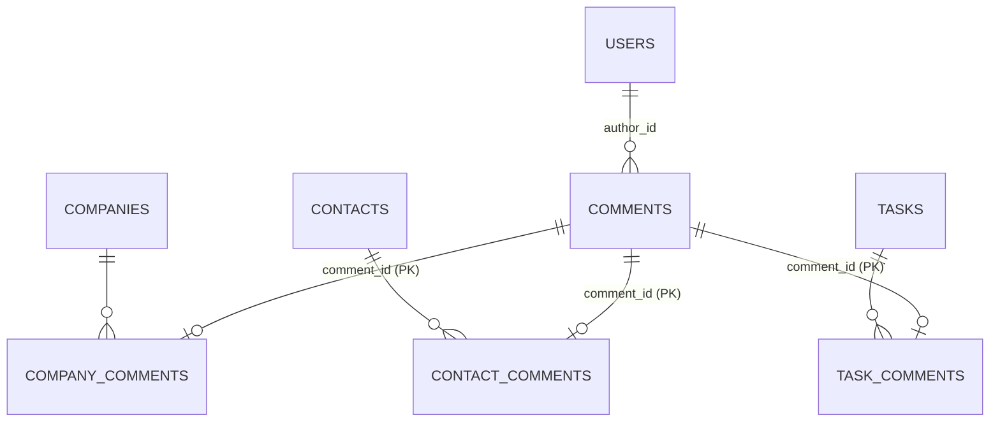
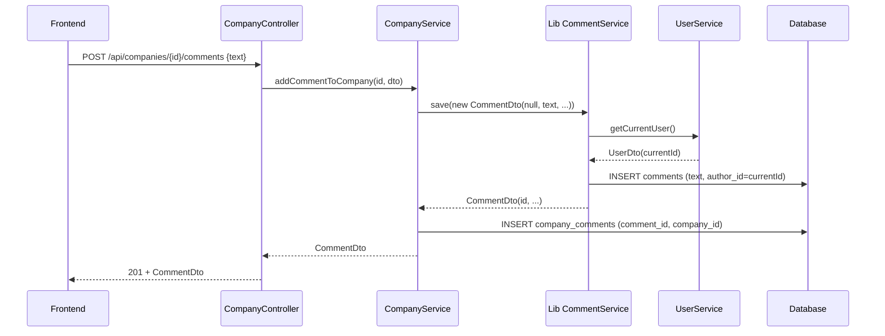
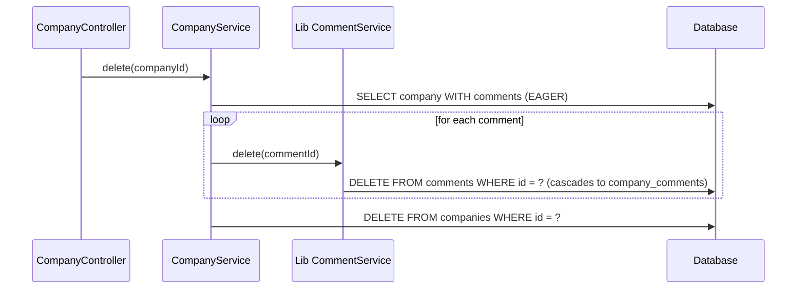

# 094 — Comment refactor to spring-services

## GitHub Issue

[#9 — Refactor comments to use standalone CommentEntity from spring-services](https://github.com/OpenElementsLabs/open-crm/issues/9)

## Summary

The local `com.openelements.crm.comment.CommentEntity` couples a comment to its owner via three nullable foreign keys (`company_id`, `contact_id`, `task_id`) and a `CHECK` constraint that forces exactly one to be set. This refactor replaces the local entity by the standalone `com.openelements.spring.base.services.comment.CommentEntity` shipped by `spring-services` 0.13.0. The owner relationship moves out of the comment row and into three new join tables. The author column changes from a free-text user name to a typed `authorId` (UUID into `users`), with all historical comments rewritten to point to a new SYSTEM-USER.

After the refactor, the lib `CommentService` is injected directly (no CRM-side wrapper service), and `CompanyService` / `ContactService` / `TaskService` orchestrate creation, update, deletion of comments together with the owner-side join row in the same transaction.

## Goals

- Remove the dependency from `CommentEntity` on `CompanyEntity` / `ContactEntity` / `TaskEntity`.
- Use the lib `CommentEntity` / `CommentService` / `CommentRepository` / `CommentDto` / `CommentCreateDto` 1:1.
- Preserve every existing comment in production (no data loss).
- Establish a SYSTEM-USER as a first-class concept usable for future automated processes.
- Move all comment endpoints to nested-resource style, owned by the respective owner controller.

## Non-goals

- Audit-log integration for comment events.
- Webhook events for comment CRUD.
- Pagination of comments per owner (returns flat list).
- Performance work for very large comment volumes (current assumption: counts stay small).
- Preserving the old `author` string identity (always replaced by SYSTEM-USER on migration).

## Technical approach

### Entity model

- The lib's `CommentEntity` (only `text` + `authorId`) replaces the local one. The local class is deleted along with the local `CommentService`, `CommentRepository`, `CommentDto`, `CommentCreateDto`, `CommentUpdateDto`, and `CommentController`.
- Each owner entity (`CompanyEntity`, `ContactEntity`, `TaskEntity`) holds:

```java
@OneToMany(fetch = FetchType.EAGER)
@JoinTable(
    name = "company_comments",
    joinColumns = @JoinColumn(name = "company_id"),
    inverseJoinColumns = @JoinColumn(name = "comment_id", unique = true)
)
private Set<CommentEntity> comments = new HashSet<>();
```

Variable names mirror the owner type. EAGER is chosen on purpose: pagination of comments is removed, the count is derived from `comments.size()`, and the working assumption is that comment counts stay small.

**Rationale:** A `@OneToMany` with `@JoinTable` keeps the lib `CommentEntity` unchanged (no back-reference to owner types) and lets each owner expose a clean, typed collection. The alternative (polymorphic `comment_owner` table) would need a discriminator and forfeit per-type FK integrity — rejected for this reason.

### Owner uniqueness

Each join table uses `PRIMARY KEY (comment_id)`. This guarantees no comment can be attached to more than one owner of the same type. The cross-table invariant ("a comment is attached to exactly one owner across all three tables") is enforced at the **service layer** — every creation pathway runs through `CompanyService.addCommentToCompany` / `ContactService.addCommentToContact` / `TaskService.addCommentToTask`, which always insert the comment and the join row in the same transaction.

**Rationale:** PostgreSQL has no clean cross-table constraint. A trigger would work but adds operational cost. The lib `CommentService.save()` is technically callable in isolation (would create an orphan), but no controller exposes that path — accepted risk.

### Service layout

Lib `CommentService` (`com.openelements.spring.base.services.comment.CommentService`) is registered as a Spring bean (already auto-configured by `spring-services`) and injected directly. The CRM owner services delegate to it:

```java
// CompanyService
@Transactional
public CommentDto addCommentToCompany(UUID companyId, CommentCreateDto request) {
    CompanyEntity company = companyRepository.findByIdOrThrow(companyId);
    CommentDto saved = commentService.save(new CommentDto(null, request.text(), null, null, null));
    CommentEntity entity = commentRepository.findByIdOrThrow(saved.id());
    company.getComments().add(entity);
    companyRepository.save(company);
    return saved;
}

@Transactional
public CommentDto updateCommentOfCompany(UUID companyId, UUID commentId, CommentCreateDto request) {
    assertCommentBelongsToCompany(companyId, commentId);
    CommentDto current = commentService.findById(commentId).orElseThrow();
    return commentService.save(new CommentDto(commentId, request.text(), current.author(), current.createdAt(), current.updatedAt()));
}

@Transactional
public void deleteCommentOfCompany(UUID companyId, UUID commentId) {
    CompanyEntity company = companyRepository.findByIdOrThrow(companyId);
    CommentEntity comment = commentRepository.findByIdOrThrow(commentId);
    company.getComments().remove(comment);
    companyRepository.save(company);
    commentService.delete(commentId);
}
```

`ContactService` and `TaskService` follow the same shape.

### Cascade

- **Owner deletion** (e.g. `CompanyService.delete(id)`): service-side. The service iterates `entity.getComments()`, calls `commentService.delete(commentId)` for each (which removes the comment row and — via FK `ON DELETE CASCADE` on the join's `comment_id` — the join row), then deletes the owner.
- **Comment deletion** (`deleteCommentOf*`): service-side. The owner's `comments` collection is mutated and saved (removes the join row), then `commentService.delete(commentId)` removes the comment row.

### REST API

| Method | Path | Body | Response |
|--------|------|------|----------|
| `GET`    | `/api/companies/{id}/comments` | — | `List<CommentDto>` |
| `POST`   | `/api/companies/{id}/comments` | `CommentCreateDto` | `CommentDto` (201) |
| `PUT`    | `/api/companies/{id}/comments/{commentId}` | `CommentCreateDto` | `CommentDto` |
| `DELETE` | `/api/companies/{id}/comments/{commentId}` | — | 204 (`@RequiresAdmin`) |

Identical for `/api/contacts/...` and `/api/tasks/...`. The standalone endpoints `PUT/DELETE /api/comments/{id}` are **removed**. `CommentController` is deleted entirely.

`GET` returns a flat `List<CommentDto>` (lib record, with `UserDto author`). Pagination is dropped because comments are EAGER-loaded with the owner anyway.

### DTOs

- Response: lib `com.openelements.spring.base.services.comment.CommentDto` used 1:1.
- Create / Update request: lib `com.openelements.spring.base.services.comment.CommentCreateDto(text)` used for both.

No CRM-side comment DTO classes are introduced.

### `commentCount` on owner DTOs

`CompanyDto.commentCount` / `ContactDto.commentCount` / `TaskDto.commentCount` continue to exist. They are now derived from `entity.getComments().size()` in the respective service mapping methods. The `commentRepository.countBy*Id()` calls disappear together with the local repository.

### SYSTEM-USER

A new row is inserted into `users` by the migration:

| Column | Value |
|--------|-------|
| `id` | `00000000-0000-0000-0000-000000000000` |
| `sub` | `system` |
| `name` | `System` |
| `email` | `NULL` |
| `avatar_url` | `NULL` |
| `created_at` / `updated_at` | `now()` |

A constant `SystemUser.ID` (in `com.openelements.crm.user`) holds the UUID for code-side references. The admin user list query in the existing user service is updated to filter `WHERE sub <> 'system'` so SYSTEM-USER does not appear in `Admin → Users`.

The SYSTEM-USER is intended for future automated authoring (Brevo import, webhook handlers, scheduled jobs). This refactor uses it only for the migration backfill — the broader use cases come in follow-up specs.

## Data model

### Before

```
comments
  id          UUID PK
  text        TEXT
  author      VARCHAR(255)
  company_id  UUID? FK → companies
  contact_id  UUID? FK → contacts (ON DELETE CASCADE)
  task_id     UUID? FK → tasks    (ON DELETE CASCADE)
  CHECK exactly-one-of(company_id, contact_id, task_id)
  created_at, updated_at
```

### After

```
comments
  id          UUID PK
  text        TEXT
  author_id   VARCHAR(255)  -- holds the user UUID as string (matches lib mapping)
  created_at, updated_at

company_comments
  comment_id  UUID PK         FK → comments(id) ON DELETE CASCADE
  company_id  UUID NOT NULL   FK → companies(id) ON DELETE CASCADE

contact_comments
  comment_id  UUID PK         FK → comments(id) ON DELETE CASCADE
  contact_id  UUID NOT NULL   FK → contacts(id) ON DELETE CASCADE

task_comments
  comment_id  UUID PK         FK → comments(id) ON DELETE CASCADE
  task_id     UUID NOT NULL   FK → tasks(id) ON DELETE CASCADE
```

`ON DELETE CASCADE` on the FKs is a safety net: the service layer is responsible for cleanup, but if a comment row is deleted directly (or an owner is deleted by another future path) the join row goes too.

### ER diagram



## Migration

Single Flyway script `V30__refactor_comments.sql`. Downtime is accepted — the app is stopped, Flyway runs, the new build starts.

```sql
-- 1. Insert SYSTEM-USER (idempotent guard so existing dev DBs don't trip)
INSERT INTO users (id, sub, name, email, created_at, updated_at)
VALUES ('00000000-0000-0000-0000-000000000000', 'system', 'System', NULL, now(), now())
ON CONFLICT (sub) DO NOTHING;

-- 2. Create join tables
CREATE TABLE company_comments (
    comment_id UUID PRIMARY KEY REFERENCES comments(id) ON DELETE CASCADE,
    company_id UUID NOT NULL    REFERENCES companies(id) ON DELETE CASCADE
);
CREATE INDEX idx_company_comments_company_id ON company_comments(company_id);

CREATE TABLE contact_comments (
    comment_id UUID PRIMARY KEY REFERENCES comments(id) ON DELETE CASCADE,
    contact_id UUID NOT NULL    REFERENCES contacts(id) ON DELETE CASCADE
);
CREATE INDEX idx_contact_comments_contact_id ON contact_comments(contact_id);

CREATE TABLE task_comments (
    comment_id UUID PRIMARY KEY REFERENCES comments(id) ON DELETE CASCADE,
    task_id    UUID NOT NULL    REFERENCES tasks(id) ON DELETE CASCADE
);
CREATE INDEX idx_task_comments_task_id ON task_comments(task_id);

-- 3. Backfill join tables from existing FK columns
INSERT INTO company_comments (comment_id, company_id)
SELECT id, company_id FROM comments WHERE company_id IS NOT NULL;

INSERT INTO contact_comments (comment_id, contact_id)
SELECT id, contact_id FROM comments WHERE contact_id IS NOT NULL;

INSERT INTO task_comments (comment_id, task_id)
SELECT id, task_id FROM comments WHERE task_id IS NOT NULL;

-- 4. Schema change on comments: drop CHECK + FK columns + author, add author_id
ALTER TABLE comments DROP CONSTRAINT chk_comment_owner;

DROP INDEX IF EXISTS idx_comments_company_id;
DROP INDEX IF EXISTS idx_comments_contact_id;
DROP INDEX IF EXISTS idx_comments_task_id;

ALTER TABLE comments DROP COLUMN company_id;
ALTER TABLE comments DROP COLUMN contact_id;
ALTER TABLE comments DROP COLUMN task_id;

ALTER TABLE comments ADD COLUMN author_id VARCHAR(255);
UPDATE comments SET author_id = '00000000-0000-0000-0000-000000000000';
ALTER TABLE comments ALTER COLUMN author_id SET NOT NULL;
ALTER TABLE comments DROP COLUMN author;
```

Rollback strategy: forward-only. If something goes wrong in production, a follow-up migration restores the old shape; no compensation script is bundled.

## Key flows

### Add a comment to a Company



### Delete a Company



## Frontend changes

- `frontend/src/lib/api.ts`:
  - `getCompanyComments` / `getContactComments` / `getTaskComments` switch return type from `Page<CommentDto>` to `CommentDto[]`.
  - `updateComment(commentId, ...)` and `deleteComment(commentId, ...)` are removed; in their place: `updateCompanyComment(companyId, commentId, ...)` / `deleteCompanyComment(companyId, commentId, ...)` and equivalents for contacts/tasks.
- Comment list components on company / contact / task detail views drop pagination controls and consume a flat array.
- The shared `CommentDto` type definition follows the lib record shape: `{ id, text, author: UserDto, createdAt, updatedAt }` — `companyId` / `contactId` / `taskId` fields disappear.
- Existing tests under `frontend/src/app/(app)/{contacts,companies}/__tests__/` are updated for the new mock signatures.

## Testing

- New JUnit tests for `CompanyService`, `ContactService`, `TaskService`:
  - `addCommentTo*` creates comment + join row in one transaction.
  - `updateCommentOf*` rejects update if comment is not attached to the given owner (mismatched IDs → 404).
  - `deleteCommentOf*` removes join row and comment.
  - Owner-`delete()` cascades to comments (no orphans, no leftover join rows).
- A migration smoke test (`@Sql` or Flyway test container) verifies that pre-migration comments survive with `author_id = SYSTEM_USER_ID`.

## Regression risk

- **Breaking API**: any external consumer hitting `PUT/DELETE /api/comments/{id}` or expecting `Page<CommentDto>` from `GET .../comments` will break. No deprecation period.
- **EAGER loading**: every load of a Company / Contact / Task fetches all its comments. Acceptable under the assumption that comment volume per owner stays small. If the assumption breaks later, the fix is to switch to LAZY + a pageable query — straightforward.
- **Author identity loss**: the original `author` strings are dropped on migration. SYSTEM-USER is shown for every legacy comment.
- **SYSTEM-USER visibility**: the admin user list filter relies on `sub <> 'system'`. If a future admin feature forgets the filter, SYSTEM-USER will leak into the UI.

## GDPR / data protection

Comments may contain personal data, but the data model change does not alter what is stored — only how it is linked. The author identity loss for legacy comments is an internal change, not a regression in data subject rights. No new categories of personal data are introduced.

## Open questions

None.
