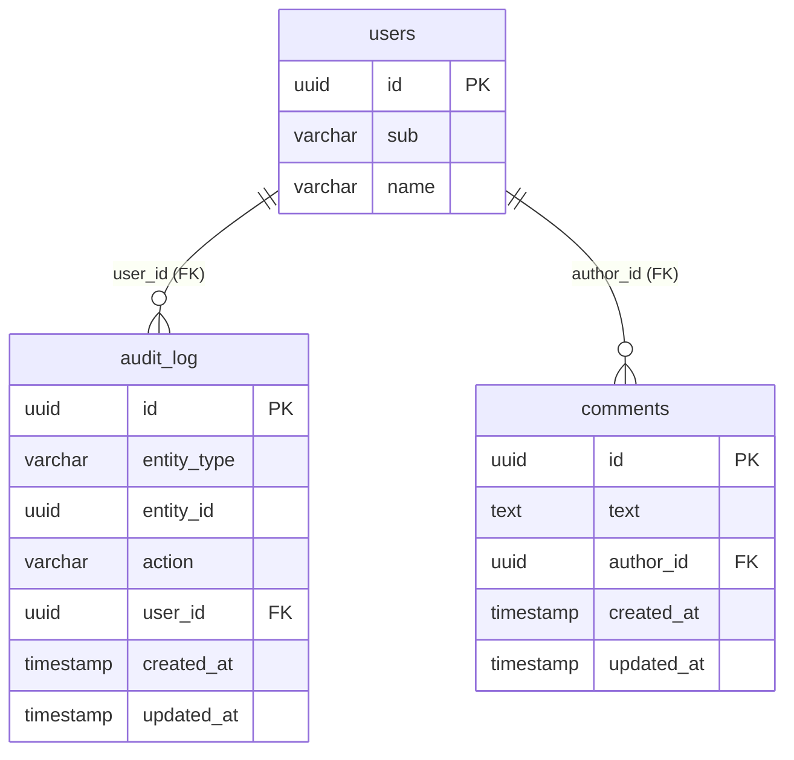

# Design: spring-services 0.14 upgrade

## GitHub Issue

[#11](https://github.com/OpenElementsLabs/open-crm/issues/11)

## Summary

Upgrade the `spring-services` dependency from 0.13.0 to 0.14.0 and adapt open-crm to the breaking changes the new version introduces. In 0.14 the library replaces two free-text VARCHAR columns (`audit_log.user_name`, `comments.author`) with real JPA associations to `UserEntity`, exposed via `UserDto` in the public DTO surface. open-crm currently relies on the old `String`-based contract in three places: an admin endpoint, two integration tests, and a Flyway migration. The frontend audit-log filter has to switch from sending the user's name to sending the user's UUID.

The upgrade also brings in a new `SystemUser` constants class and a `SystemUserInitializer` `ApplicationRunner` from the library. open-crm already has a near-identical local `SystemUser` class that is removed as part of this spec.

## Goals

- Compile and run open-crm against `spring-services` 0.14.0
- Migrate the existing `audit_log` and `comments` tables to the new FK-based schema, preserving the rows (with intentional loss of historical attribution on `audit_log`)
- Keep the audit log admin view functional after the API contract change
- Remove the duplicated local `SystemUser` class

## Non-goals

- Filtering audit logs by System User actions (deferred — `/api/users` excludes the System User by design, and the filter will be re-introduced by a future spec)
- Auditing rows created outside the existing event listener (no other `createEntry` callers exist today)
- Switching the test suite from H2 to Testcontainers — only done if H2 cannot accept the PostgreSQL-flavored migration SQL
- Backwards-compatibility shims for the old String-based API

## Technical approach

The work splits into four areas: dependency bump, Flyway migration, backend code adaptation, frontend code adaptation. They ship together in one PR because the backend cannot be deployed without all of its pieces in sync.

### Library changes that affect us

| Surface | 0.13.0 | 0.14.0 |
|---|---|---|
| `AuditLogDto.user` | `String` | `UserDto` |
| `AuditLogDataService.findByUser(...)` | `(String user, Pageable)` | `(UUID userId, Pageable)` |
| `AuditLogDataService.findByEntityTypeAndUser(...)` | `(String, String, Pageable)` | `(String, UUID, Pageable)` |
| `AuditLogDataService.createEntry(...)` | `(..., String user)` | `(..., UserEntity user)` |
| `AuditLogEntity` | `getUserName()/setUserName(String)`, col `user_name` | `getUser()/setUser(UserEntity)`, col `user_id` UUID FK |
| `CommentEntity` | `getAuthorId()/setAuthorId(String)`, col `author` | `getAuthor()/setAuthor(UserEntity)`, col `author_id` UUID FK |
| `UserService.getCurrentUserEntity()` | not public | public — returns managed entity |
| `SystemUser` | not present | new (ID = `00000000-0000-0000-0000-000000000000`, SUB = `"system"`) |
| `SystemUserInitializer` | not present | new `ApplicationRunner` |

### Data model

V32 is the new Flyway migration. It runs against PostgreSQL in production and (per the open question) is expected to run against H2 in tests; if H2 rejects the SQL we deal with it as a follow-up.



`audit_log` migration steps:

1. Add `user_id UUID NULL`.
2. Backfill every row with `SystemUser.ID` (`'00000000-0000-0000-0000-000000000000'`). All historical attribution is intentionally lost.
3. Set `user_id NOT NULL` and add FK constraint to `users(id)`.
4. Drop `user_name`.

`comments` migration steps:

1. Rename `author` to `author_id` and change the type from `VARCHAR(255)` to `UUID` (using `USING author::uuid` — V30 already stored UUID strings, so the cast is lossless).
2. Add FK constraint `author_id → users(id)`.
3. Set `author_id NOT NULL`.

**Rationale — why blind remap on `audit_log`:** The free-text `user_name` values come from JWT `name` claims and are not unique, not stable, and not reliably matchable to a user row by name. Trying to look them up would produce a partial mapping with no auditable rationale for which rows got mapped where. A single remap to System User is reproducible, auditable, and acceptable because prod has no meaningful audit history yet.

**Rationale — why no NULL handling for `audit_log.user_name`:** V28 declared the column nullable, so prod could in theory contain NULL rows. Step 2 backfills every row unconditionally, so NULLs are handled by the same code path.

### System User bootstrapping

V30 already inserts the System User row with `INSERT ... ON CONFLICT (sub) DO NOTHING`, so the FK constraint added by V32 is always satisfied when the migration runs. The library's new `SystemUserInitializer` runs as an `ApplicationRunner` *after* Flyway has finished — at that point the row already exists, so the initializer's `existsById` short-circuits and the runner is effectively a no-op safety net. We keep both: V30 covers the migration ordering, the runner covers any hypothetical edge case (e.g., a future migration that drops and recreates the table).

### Backend code changes

- **`backend/pom.xml`** — version bumped from 0.13.0 to 0.14.0 (already in the working tree).
- **`AuditLogController.java`** — the `user` query parameter type changes from `String` to `UUID`. Filter logic stays identical. Method signatures on `AuditLogDataService` already accept UUIDs.
- **`AuditLogControllerTest.java`** — tests must seed `UserEntity` rows ("Alice", "Bob", "Charlie") before each test that calls `createEntry`. The String arguments become managed `UserEntity` instances obtained from `UserRepository`. JSON assertions on `$.content[].user` move to `$.content[].user.name`. The user-filter test (`listAuditLogsFiltersByUser`) sends the picked user's UUID as the param value.
- **`CommentEndpointsIntegrationTest.java`** — `entity.setAuthorId(SystemUser.ID.toString())` becomes `entity.setAuthor(userRepository.getReferenceById(SystemUser.ID))`. The `seedSystemUser` block stays for now (idempotent, also runs in tests because `@SpringBootTest` triggers the runner).
- **`UserController.java`** — switch the import from `com.openelements.crm.user.SystemUser` to `com.openelements.spring.base.security.user.SystemUser`.
- **Delete** `backend/src/main/java/com/openelements/crm/user/SystemUser.java`.

### Frontend code changes

The existing audit-log admin view (`audit-logs-client.tsx`) already renders a user dropdown. The changes are mechanical rewires:

- `AuditLogDto.user` type changes from `string` to `UserDto` in `lib/types.ts`.
- Table cell render: `entry.user` → `entry.user.name`.
- Dropdown options: `<SelectItem value={u.id}>{u.name}</SelectItem>` (was `value={u.name}`).
- The hard-coded `SYSTEM_USER = "System"` filter (used to exclude the System User from the dropdown) is removed — `/api/users` already excludes the System User on the backend side via `findBySubNot`.
- `getAuditLogs(...)` param `user?: string` is now a UUID — the type stays `string` in TypeScript but the value flowing in is a UUID. The state variable in `AuditLogsClient` is renamed from `user` to `userId` for clarity.
- `audit-logs-client.test.tsx` — fixture data and assertions move to the `UserDto` shape.

The user-picker is a small change to an existing admin view, not a new component. Open Elements brand classes (`text-oe-gray`, `text-oe-dark`, etc.) are already in place; no additional brand work needed.

### Key flow — V32 on a fresh DB

```mermaid
sequenceDiagram
    participant App
    participant Flyway
    participant DB
    participant Runner as SystemUserInitializer

    App->>Flyway: migrate
    Flyway->>DB: V1..V29 (schema)
    Flyway->>DB: V30 INSERT System User ON CONFLICT DO NOTHING
    Flyway->>DB: V31 rename author_id -> author
    Flyway->>DB: V32 add audit_log.user_id, backfill, FK; comments.author -> author_id UUID, FK
    Flyway-->>App: done
    App->>Runner: ApplicationRunner.run
    Runner->>DB: existsById(SystemUser.ID)?
    DB-->>Runner: true
    Runner-->>App: no-op
```

## Security considerations

- The audit log endpoint stays gated by `@RequiresItAdmin`. No exposure change.
- The user dropdown calls `/api/users`, which is already gated by IT-ADMIN.
- No new personal data is collected; the change is structural. The user's name/email/avatar were already exposed via `UserDto` in spec 089.

## Dependencies

- `spring-services` 0.14.0 (already published)
- Pulls in Spring Boot 3.5.14 transitively (was 3.5.13 in 0.13.0). open-crm pins Spring Boot 3.5.13 directly in `dependencyManagement`. **Decision:** keep open-crm's pin at 3.5.13 for now to avoid scope creep — the upgrade does not require Spring Boot 3.5.14, and the library's own BOM import in our pom is a sub-component, not the project's effective Spring Boot version. If a compatibility issue surfaces during implementation, bump to 3.5.14 as a small follow-up.

## Rollback

V32 is one-way. The team relies on database backups for recovery. No DOWN migration is written.

## Open questions

- H2 may reject the PostgreSQL `ALTER COLUMN ... TYPE UUID USING ...` syntax. If tests fail on the migration during implementation, the fallback is to switch the integration tests to Testcontainers/PostgreSQL — out of scope for this spec but flagged so the implementer knows to look for it.
