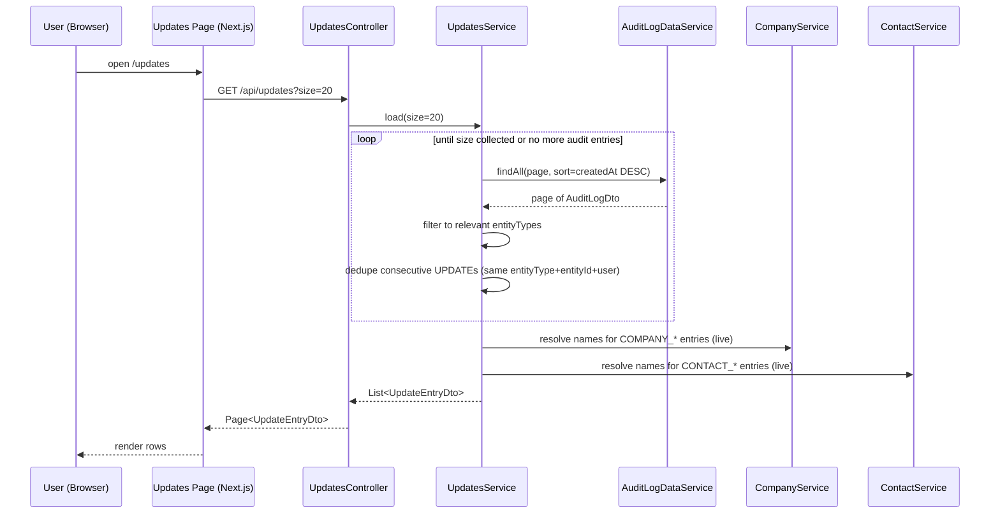

# Design: Updates View

## GitHub Issue

[#13 — Updates view: user-facing activity feed for company / contact / comment changes](https://github.com/OpenElementsLabs/open-crm/issues/13)

## Summary

Introduce a new top-level "Updates" view in the CRM that shows the most recent data
changes across companies, contacts and their comments. The view is available to every
authenticated user (not only IT admins) and provides a user-friendly read of the
existing audit-log infrastructure. The existing IT-ADMIN-only audit-log view at
`/admin/audit-logs` remains unchanged.

The view shows up to a user-selectable number of entries (20/50/100/200) ordered
newest-first. Each entry describes one of twelve event types — create / update / delete
for companies, contacts, company comments and contact comments — along with the user
who performed the action and the timestamp. Where the affected entity still exists,
the entry text links to its detail page.

## Goals

- Give every authenticated user visibility into recent activity in the CRM without
  IT-ADMIN access.
- Reuse the existing audit-log data; do not duplicate the recording infrastructure.
- Close a current gap: comment CRUD operations must emit audit-log entries in a shape
  that fits the Updates view (parent ID as `entityId`).
- Provide bilingual texts (German + English) for all event types.

## Non-goals

- No real-time push (WebSocket / SSE). Manual reload only.
- No additional filtering UI (no per-user, per-entity-type, per-date filters). The
  admin audit-log view covers that use case for IT admins.
- No coalescing of bulk imports / Brevo sync floods. Entries are shown one-per-event.
  A later spec will address flood reduction.
- No display of *what* changed inside an UPDATE (no field diffs). The audit log does
  not store a diff payload.
- No display of the entity name for deleted companies/contacts (the audit log does not
  retain it). A later spec may extend the audit-log payload.
- No establishment of the legal basis (Betriebsvereinbarung / AV) for employee activity
  transparency — tracked separately in `TODO.md`.

## Technical approach

### Data source

The existing `AuditLogDataService` (from `com.openelements.spring.base.services.audit`)
already records create / update / delete operations on companies and contacts with the
fields `id`, `entityType` (string), `entityId` (UUID), `action` (`INSERT|UPDATE|DELETE`),
`user` (`UserDto`), `createdAt`. The Updates view reads exclusively from this service.

Four `entityType` values are relevant:

| `entityType`     | Source                                             |
|------------------|----------------------------------------------------|
| `CompanyDto`     | Already emitted by `CompanyService` (existing)     |
| `ContactDto`     | Already emitted by `ContactService` (existing)     |
| `CompanyComment` | **New — emitted by this spec** on comment CRUD     |
| `ContactComment` | **New — emitted by this spec** on comment CRUD     |

For comment events, `entityId` stores the **parent company / contact UUID**, not the
comment's own UUID. Rationale: the comment itself is not navigable, the user-visible
link target is always the parent entity, and storing the parent ID makes the delete
case (where the comment row no longer exists) renderable without requiring a payload.

### Backend endpoint

New REST controller `UpdatesController` mounted at `/api/updates`.

- **Authentication:** OIDC, same as all other controllers (`@SecurityRequirement(name = "oidc")`).
- **Authorization:** Any authenticated user. No `@RequiresItAdmin` / `@RequiresAppAdmin`.
- **Method:** `GET`
- **Query parameters:**
  - `size` — integer, allowed values `20 | 50 | 100 | 200`. Default `20`. Other values
    → HTTP 400.
  - `page` — accepted for Spring `Pageable` compatibility; only `0` is meaningful.
    Values > 0 produce an empty content page (no error).
- **Response:** `Page<UpdateEntryDto>` (Spring Data page shape, consistent with all
  other paginated endpoints).
  - `page.size` = requested `size`
  - `page.number` = `0`
  - `page.totalPages` = `1` (no further pagination by design)
  - `page.totalElements` = `content.size()` (no expensive count over the whole audit
    log)
  - `content` = up to `size` `UpdateEntryDto` entries

The Page-wrapper is used **for shape consistency only**; the endpoint is semantically a
"latest N" feed, not a paginated list. Rationale: matches the existing convention for
list endpoints; reuses frontend page-shape parsers.

#### `UpdateEntryDto`

```java
public record UpdateEntryDto(
    UUID id,                  // audit-log entry id (or id of the latest entry in a merged run)
    UpdateType type,          // see enum below
    UUID entityId,            // company/contact id; null for COMPANY_DELETED / CONTACT_DELETED
    String entityName,        // current name; null for *_DELETED of company/contact, or if entity no longer found
    UserDto user,             // actor (from audit log)
    Instant createdAt         // timestamp of the (latest) underlying audit entry
) {}
```

```java
public enum UpdateType {
    COMPANY_CREATED, COMPANY_UPDATED, COMPANY_DELETED,
    CONTACT_CREATED, CONTACT_UPDATED, CONTACT_DELETED,
    COMPANY_COMMENT_CREATED, COMPANY_COMMENT_UPDATED, COMPANY_COMMENT_DELETED,
    CONTACT_COMMENT_CREATED, CONTACT_COMMENT_UPDATED, CONTACT_COMMENT_DELETED
}
```

Mapping from audit log to `UpdateType`:

| `entityType`     | `INSERT`                  | `UPDATE`                  | `DELETE`                  |
|------------------|---------------------------|---------------------------|---------------------------|
| `CompanyDto`     | `COMPANY_CREATED`         | `COMPANY_UPDATED`         | `COMPANY_DELETED`         |
| `ContactDto`     | `CONTACT_CREATED`         | `CONTACT_UPDATED`         | `CONTACT_DELETED`         |
| `CompanyComment` | `COMPANY_COMMENT_CREATED` | `COMPANY_COMMENT_UPDATED` | `COMPANY_COMMENT_DELETED` |
| `ContactComment` | `CONTACT_COMMENT_CREATED` | `CONTACT_COMMENT_UPDATED` | `CONTACT_COMMENT_DELETED` |

#### Read flow



#### Server-side processing

The `UpdatesService` performs four steps:

1. **Iterative fetch.** Page through `AuditLogDataService.findAll(Pageable)` sorted by
   `createdAt` desc. The iteration continues until either `size` entries have been
   collected (after filter + dedupe) or no more audit entries exist.
2. **Filter.** Only entries with `entityType ∈ {CompanyDto, ContactDto, CompanyComment,
   ContactComment}` are considered. Other entity types are skipped.
3. **Dedupe consecutive UPDATEs.** While walking the (already filtered, time-sorted)
   stream, if the immediately preceding **kept** entry has the **same `entityType` +
   `entityId` + `user.id` + `action == UPDATE`**, the previous entry is replaced by the
   newer one (newest timestamp wins, oldest dropped). `INSERT` and `DELETE` are never
   merged with anything. The dedupe window is strictly adjacency in the kept-list — no
   time window.
4. **Name resolution.** For each kept entry:
   - `COMPANY_CREATED / COMPANY_UPDATED` → look up company by `entityId`. Found:
     `entityName` = current company name. Not found: `entityName = null` (race or
     unexpected state).
   - `CONTACT_CREATED / CONTACT_UPDATED` → look up contact by `entityId` similarly.
     Display name is built per existing contact-display convention (first + last name).
   - `COMPANY_COMMENT_*` → look up company by `entityId` (parent). Found: `entityName`
     = current company name. Not found: `entityName = null`.
   - `CONTACT_COMMENT_*` → look up contact by `entityId` (parent) analogously.
   - `COMPANY_DELETED / CONTACT_DELETED` → both `entityId` and `entityName` are set to
     `null` on the DTO (no name in payload, no link possible).
   - For `*_COMMENT_DELETED` the parent is expected to still exist; `entityId` and
     `entityName` are populated as in the create/update case.

Iterative fetch is required because dedupe and filtering can drop a large fraction of
raw entries (e.g. during Brevo sync); fetching a single Spring page of size N can
therefore yield fewer than N final entries.

Implementation note: a sensible internal page size for the iterative fetch is `2 * size`
(bounded between 50 and 400) to balance round-trips against over-fetching. This is an
implementation detail, not part of the API contract.

### Comment audit emission (new)

Spec 094 (Comment refactor) moved comments into a shared `CommentEntity`. To support
this view, comment CRUD must emit audit-log entries.

Three places in the backend trigger comment CRUD:

- `CompanyController` → `addComment` / `updateComment` / `deleteComment`
- `ContactController` → equivalent endpoints
- (Task comments from Spec 071 — explicitly out of scope for this view; not emitted.)

For each operation, the service layer (`CompanyService` / `ContactService`) writes an
audit entry with:

- `entityType = "CompanyComment"` / `"ContactComment"`
- `entityId = ` parent company / contact UUID
- `action = INSERT` / `UPDATE` / `DELETE`
- `user = ` current authenticated user (same resolution used elsewhere)

Rationale for not using `entityType = "CommentDto"`:

- The link target is always the parent. Encoding the parent kind in `entityType`
  removes the need for a join lookup to determine the link target.
- On DELETE, the comment is gone, but the parent reference must still be discoverable
  without consulting the comment row. Storing the parent ID directly as `entityId`
  guarantees this.

### Dedupe correctness corner cases

- **Different users, same entity, consecutive UPDATEs** → not merged (user differs).
- **Same user, same entity, consecutive UPDATEs with other entries between them in the
  raw stream that get filtered out** → after filtering, they become adjacent in the
  kept-list and are merged. Intentional: the user does not see the filtered events, so
  from the user's perspective the UPDATEs are consecutive.
- **CREATE then UPDATE** → not merged (different action). Both visible.
- **UPDATE then DELETE** → not merged (different action). Both visible.
- **Two different comments on the same parent, edited by the same user back-to-back**
  → both have the same `entityType` + `entityId` (= parent) + user + action, and **will
  be merged into one** `*_COMMENT_UPDATED` entry. This is an acceptable approximation:
  from the user's perspective "the parent had its comments edited" is the right level
  of granularity. Documented as a known semantic.

### Frontend

New Next.js route `frontend/src/app/(app)/updates/`:

- `page.tsx` — server entry, mirrors the structure of `companies/page.tsx`. No role
  check required (any authenticated user).
- `updates-client.tsx` — client component:
  - Fetches `GET /api/updates?size={N}` on mount and when `size` changes.
  - Page-size combobox with values 20 / 50 / 100 / 200; persists selection in
    `localStorage` under key `updates.pageSize` (analogous to the admin audit-logs
    view).
  - Renders a list (table or stacked rows) ordered newest first.
  - Per row:
    - Localized event text built from `type` + `entityName` (see i18n section).
    - When `entityId` is non-null: the entity-name portion of the text is a link to
      `/companies/{id}` or `/contacts/{id}` accordingly.
    - When `entityId` is null: plain text, no link.
    - Right side: user display name + relative time (existing time helper).
  - Empty state: `updates.empty` (`"Noch keine Änderungen"` / `"No changes yet"`).
  - Loading: skeleton rows (same pattern as audit-log view).
  - Error: error banner with `updates.loadError`.

Navigation entry: new `NavItem` in `frontend/src/app/(app)/layout.tsx`, placed as the
**first** item in the main section (before Companies / Contacts / Tags). Visible to
every authenticated user. Icon: a clock / activity icon from the existing icon set
(implementation choice).

### i18n

Add a new top-level `updates` block to `frontend/src/lib/i18n/de.ts` and `en.ts`:

```ts
updates: {
  title: "Updates" / "Updates",
  empty: "Noch keine Änderungen" / "No changes yet",
  perPage: "Pro Seite" / "Per page",
  loadError: "Updates konnten nicht geladen werden." / "Failed to load updates.",
  by: "von {{user}}" / "by {{user}}",
  events: {
    company: {
      created: "Neue Firma {{name}} wurde angelegt" / "New company {{name}} was created",
      updated: "Firma {{name}} wurde aktualisiert" / "Company {{name}} was updated",
      deleted: "Eine Firma wurde gelöscht" / "A company was deleted"
    },
    contact: {
      created: "Neue Person {{name}} wurde angelegt" / "New person {{name}} was created",
      updated: "Person {{name}} wurde aktualisiert" / "Person {{name}} was updated",
      deleted: "Eine Person wurde gelöscht" / "A person was deleted"
    },
    companyComment: {
      created: "Firma {{name}} hat einen neuen Kommentar" / "Company {{name}} has a new comment",
      updated: "Firma {{name}} hat einen aktualisierten Kommentar" / "Company {{name}} has an updated comment",
      deleted: "Kommentar von Firma {{name}} wurde gelöscht" / "Comment of company {{name}} was deleted"
    },
    contactComment: {
      created: "Person {{name}} hat einen neuen Kommentar" / "Person {{name}} has a new comment",
      updated: "Person {{name}} hat einen aktualisierten Kommentar" / "Person {{name}} has an updated comment",
      deleted: "Kommentar von Person {{name}} wurde gelöscht" / "Comment of person {{name}} was deleted"
    }
  }
}
```

Also add `nav.updates` for the sidebar label.

When rendering, the `{{name}}` placeholder is substituted with `entityName`. For
`COMPANY_DELETED` / `CONTACT_DELETED` the message has no `{{name}}` placeholder.

## API design

### `GET /api/updates`

- **Auth:** OIDC (any authenticated user)
- **Query:**
  - `size` (optional, default `20`, allowed `20 | 50 | 100 | 200`)
  - `page` (optional, default `0`; > 0 returns empty content)
- **Responses:**
  - `200 OK` — `Page<UpdateEntryDto>` JSON, sorted newest first
  - `400 Bad Request` — invalid `size`
  - `401 Unauthorized` — not authenticated

### Example response

```json
{
  "content": [
    {
      "id": "9a4f3e7c-...",
      "type": "COMPANY_COMMENT_CREATED",
      "entityId": "1b9d...",
      "entityName": "Open Elements GmbH",
      "user": { "id": "...", "name": "Hendrik Ebbers", "email": "...", "avatarUrl": null },
      "createdAt": "2026-05-16T08:42:11.123Z"
    },
    {
      "id": "...",
      "type": "COMPANY_DELETED",
      "entityId": null,
      "entityName": null,
      "user": { "id": "...", "name": "Some Admin", ... },
      "createdAt": "2026-05-16T08:40:00.000Z"
    }
  ],
  "page": { "size": 20, "number": 0, "totalElements": 2, "totalPages": 1 }
}
```

## Data model

No new tables. The feature reads from the existing audit-log table and the existing
company / contact tables. The only data-shape change is the **convention** that comment
CRUD emits audit entries with `entityType ∈ {CompanyComment, ContactComment}` and
`entityId =` parent ID. This convention is enforced in `CompanyService` and
`ContactService`; no migration is required.

## Key flows

### Flow 1 — User opens the Updates view

1. Authenticated user clicks the "Updates" entry in the main sidebar.
2. Browser navigates to `/updates`.
3. The page-size combobox initial value is read from `localStorage` (`updates.pageSize`)
   or defaults to `20`.
4. Frontend calls `GET /api/updates?size=20`.
5. Backend iteratively reads from `AuditLogDataService`, filters, dedupes, resolves
   names, returns up to 20 entries.
6. Frontend renders the rows, or the empty state if `content.length === 0`.

### Flow 2 — User changes page size

1. User selects "100" in the combobox.
2. Frontend stores `100` in `localStorage`.
3. Frontend calls `GET /api/updates?size=100`.
4. Backend returns up to 100 entries.
5. Frontend replaces the list contents.

### Flow 3 — A user adds a comment to a company

1. User submits `POST /api/companies/{id}/comments`.
2. `CompanyService.addCommentToCompany` writes the comment.
3. Service emits an audit-log entry with `entityType="CompanyComment"`, `entityId=id`,
   `action=INSERT`, `user=current`.
4. The next caller of `GET /api/updates` sees a `COMPANY_COMMENT_CREATED` entry at the
   top of the list (until newer events arrive).

## Dependencies

- **Existing:** `com.openelements.spring.base.services.audit.AuditLogDataService`,
  `CompanyService`, `ContactService`, `UserDto`.
- **Frontend:** existing API client conventions (`/api/[...path]` proxy),
  `@open-elements/ui` Sidebar component, existing i18n hook.

## Security considerations

- **Authentication:** the endpoint requires a valid OIDC session, same as all other
  list endpoints.
- **Authorization:** the endpoint is intentionally **not** restricted to IT-ADMIN. It
  exposes audit-log data — narrowed to four entity types — to every authenticated user.
  This is a deliberate, scoped relaxation of the existing IT-ADMIN-only audit-log
  visibility. The full audit log (including users, API keys, webhooks, etc.) remains
  IT-ADMIN-only.
- **Data exposure:** the response includes the actor's user name. No additional PII
  beyond what is already visible on company / contact detail pages is added.
- **Rate limiting / abuse:** no special handling. The endpoint reuses the standard
  controller infrastructure.

## GDPR considerations

The Updates view shows a record of who did what across the CRM, visible to every
authenticated user. This constitutes employee activity transparency for other
employees and requires a clear legal basis (e.g. a Betriebsvereinbarung or an
equivalent clause in the employment / AV contract). The audit data itself is already
collected today; this spec only widens its visibility.

The required organizational/legal step is **not** part of this technical spec. It is
tracked in `TODO.md` under "GDPR-Abdeckung für Updates-View". Implementation of the
spec assumes that this basis will be established before or shortly after rollout.

Data subject rights (access, rectification, erasure) on audit data are inherited from
the existing audit-log implementation and are unchanged by this spec.

## Brand / UI

The view follows the Open Elements brand guidelines (existing palette, typography,
spacing) and reuses the established list-page patterns from companies / contacts /
admin audit-logs (header, page-size combobox, skeleton, empty state, link styling).
No new visual primitives are introduced.

## Open questions

- **Sort tie-breaker:** two audit entries with identical `createdAt` timestamps (rare,
  but possible under high-throughput bulk import). The audit log sorts by `createdAt`
  desc only; ties are then implementation-defined. Acceptable for v1.
- **Icon choice for the nav entry:** the spec leaves the concrete icon to
  implementation. Suggested: `Activity` / clock-arrow / pulse icon from the existing
  icon library.
- **Telemetry / metrics:** none planned for v1.
