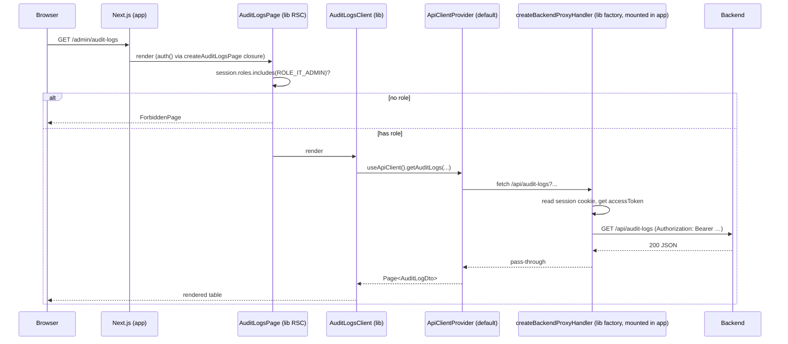

# Design: Extract @open-elements/nextjs-app-layer

## GitHub Issue

[#17](https://github.com/OpenElementsLabs/open-crm/issues/17)

## Summary

A new in-repo pnpm workspace package `@open-elements/nextjs-app-layer` is extracted from `open-crm-frontend`. It contains the Next.js-specific foundation that every Open Elements app of the Open-CRM family needs: OIDC auth (with refresh-token handling), the backend proxy, the auth middleware, the admin pages (audit logs, users, server status, bearer token, API keys, webhooks), the login page, the forbidden page, the root layout (Open Elements branding hardcoded), and a small set of helper components and types.

Open CRM consumes the package via pnpm `workspace:*` and references it from its per-route `page.tsx` files as 2-line default-export re-exports. The package is consumed in source mode via `transpilePackages` in `next.config.ts` so the lib does not need a separate build step in this phase.

This spec covers **phase 1** of a three-phase plan:

1. **This spec:** Extract into an in-repo workspace package; validate the boundary by running Open CRM unchanged against it.
2. (later, no spec needed) Switch the package to a built-output consumption mode (`tsc -b`, drop `transpilePackages`).
3. (later, separate decision) Publish to npm or move to its own repository.

The design intentionally keeps the lib's public surface narrow and closed: hardcoded role names, hardcoded branding, no extension hooks on the auth factory, no slot/extension API on the pages. Each of these constraints has a designated follow-up spec when concrete need arises.

## Goals

- Move all listed files from `frontend/src/` into `frontend/packages/nextjs-app-layer/src/`.
- Keep Open CRM working bit-for-bit identically — same routes, same behavior, same i18n, same auth.
- Establish a clean public API surface (`index.ts` for client-safe exports, `server.ts` for server-only exports) that internals do not leak through.
- Document the supported integration patterns (proxy + `ApiClientProvider`, OE branding, role conventions) in a lib `README.md`.
- Normalize existing inconsistencies in the migrated client components (api-keys-client and webhooks-client gain the `Table` component and `AlertCircle` error state, matching audit-logs-client and users-client).
- Add component/unit tests for migrated pages and factories inside the lib package.

## Non-goals

- Publishing to npm (phase 3).
- Building the lib to `dist/` (phase 2).
- Extracting Open-CRM-specific pages: companies, contacts, projects, updates, tags, `admin/brevo`.
- Adding a second consuming app to prove reusability.
- Backend API contract changes.
- Customization slots, role configurability, auth-factory extensibility, per-string translation overrides — each becomes a follow-up spec when a concrete consumer requests it.

## Technical Approach

### 1. Workspace setup

`frontend/` becomes a pnpm workspace root that also contains an app package (the existing Next.js application) and one package under `packages/`.

```
frontend/
├── pnpm-workspace.yaml              # NEW
├── package.json                     # existing, name: open-crm-frontend
├── next.config.ts                   # extended: transpilePackages
├── src/                             # existing app sources, files migrated out
└── packages/
    └── nextjs-app-layer/            # NEW
        ├── package.json             # name: @open-elements/nextjs-app-layer
        ├── tsconfig.json
        ├── vitest.config.ts
        ├── README.md
        └── src/
            ├── index.ts             # public client-safe exports
            ├── server.ts            # public server-only exports
            ├── server/
            ├── pages/
            ├── layout/
            ├── components/
            ├── hooks/
            ├── api/
            ├── lib/
            └── translations/
```

**`frontend/pnpm-workspace.yaml`:**

```yaml
packages:
  - "."
  - "packages/*"
```

**`frontend/next.config.ts`** adds:

```ts
transpilePackages: ["@open-elements/nextjs-app-layer"],
```

**Tailwind v4 `@source`** in `frontend/src/app/globals.css`:

```css
@source "../../packages/nextjs-app-layer/src/**/*.{ts,tsx}";
```

**Rationale:** A workspace inside `frontend/` (rather than at the repo root) keeps the JavaScript world bounded; the Java backend is not a pnpm consumer. `transpilePackages` removes the need for a build step in phase 1 — fastest iteration. We pay the build-step cost only once the boundary is stable (phase 2).

### 2. Package structure and public exports

The lib has two public entry points to keep client and server code separable:

- **`@open-elements/nextjs-app-layer`** (from `src/index.ts`) — client-safe React components, hooks, providers, DTO types, role constants.
- **`@open-elements/nextjs-app-layer/server`** (from `src/server.ts`) — factories that import `next-auth`, `next/server`, file-system facing code.

`package.json` `exports` field:

```jsonc
{
  "name": "@open-elements/nextjs-app-layer",
  "private": true,
  "exports": {
    ".": "./src/index.ts",
    "./server": "./src/server.ts",
    "./server/next-auth.d": "./src/server/next-auth.d.ts"
  }
}
```

Internals (e.g., individual page implementation files) are not re-exported. Anything not in `index.ts` / `server.ts` is non-public.

### 3. Auth factory

`createAppLayerAuth` is **closed**: it accepts only the OIDC credentials and returns the four pieces NextAuth produces. Extension hooks (custom claims, additional providers, sign-in validation) are not supported in this phase.

```ts
// src/server/auth.ts
export function createAppLayerAuth(config: {
  readonly issuer: string | undefined;
  readonly clientId: string | undefined;
  readonly clientSecret: string | undefined;
}): {
  readonly handlers: { GET: AppRouteHandler; POST: AppRouteHandler };
  readonly auth: () => Promise<Session | null>;
  readonly signIn: typeof signIn;
  readonly signOut: typeof signOut;
  readonly oidcIssuer: string | undefined;
};
```

The factory contains the logic currently in `frontend/src/auth.ts` 1:1: OIDC provider config, JWT strategy, the jwt callback (initial sign-in + refresh-token flow), the session callback (populates `accessToken`, `idToken`, `expiresAt`, `roles`, `user.{name,email,image}`).

The `declare module "next-auth"` augmentation lives in `src/server/next-auth.d.ts`. The consuming app activates it via a side-effect import in its own `auth.ts`:

```ts
// frontend/src/auth.ts
import "@open-elements/nextjs-app-layer/server/next-auth.d";
import { createAppLayerAuth } from "@open-elements/nextjs-app-layer/server";
export const { handlers, auth, signIn, signOut, oidcIssuer } = createAppLayerAuth({
  issuer: process.env.OIDC_ISSUER_URI,
  clientId: process.env.OIDC_CLIENT_ID,
  clientSecret: process.env.OIDC_CLIENT_SECRET,
});
```

**Rationale:** Open CRM is the only consumer today. Every concern that could justify extension hooks is hypothetical. Adding them now would freeze a shape we have no real workload to validate against. When the second app demands a custom claim, that need drives the extension API in a follow-up spec.

### 4. Proxy and logout factories

```ts
// src/server/route-handlers.ts
export function createBackendProxyHandler(config: {
  readonly backendUrl: string;
  readonly auth: () => Promise<Session | null>;
}): AppRouteHandler;

export function createLogoutHandler(config: {
  readonly auth: () => Promise<Session | null>;
  readonly oidcIssuer: string | undefined;
  readonly authUrl: string;
}): AppRouteHandler;
```

Each factory returns a single handler function the app uses to fill the GET/POST/PUT/DELETE exports of its catch-all route files.

`frontend/src/app/api/[...path]/route.ts` becomes:

```ts
import { auth } from "@/auth";
import { createBackendProxyHandler } from "@open-elements/nextjs-app-layer/server";

const handler = createBackendProxyHandler({
  backendUrl: process.env.BACKEND_URL ?? "http://localhost:8080",
  auth,
});
export { handler as GET, handler as POST, handler as PUT, handler as DELETE };
```

The proxy code is the existing logic in `frontend/src/app/api/[...path]/route.ts`: copy `Content-Type` and `Accept` headers, attach `Authorization: Bearer <accessToken>`, forward the body as `arrayBuffer`, return the upstream response unchanged.

The logout handler keeps the existing OIDC end-session discovery + chunked-cookie deletion logic.

### 5. Middleware

The middleware is generic. The lib exports the existing 1-liner and the matcher:

```ts
// src/server/middleware.ts
export { auth as middleware } from "<consumer's auth>";  // see below
export const middlewareConfig = {
  matcher: ["/((?!api/auth|api/logout|login|_next/static|_next/image|favicon\\.ico|.*\\.svg$|.*\\.png$|.*\\.jpg$|.*\\.ico$).*)"],
};
```

Because Next.js requires `middleware.ts` to live in the app's `src/`, the lib cannot fully encapsulate it. The consuming app keeps a tiny `frontend/src/middleware.ts`:

```ts
export { auth as middleware } from "@/auth";
export { middlewareConfig as config } from "@open-elements/nextjs-app-layer/server";
```

### 6. API client interface and provider

The lib defines the `AppLayerApiClient` interface and ships a **default provider** that calls the standard OE proxy paths. The consuming app uses the default unchanged or replaces it with an alternative implementation of the full interface — no per-method override props.

```ts
// src/api/types.ts
export interface PageRequest {
  readonly page: number;
  readonly size: number;
}

export interface AppLayerApiClient {
  readonly getAuditLogs: (params: PageRequest & {
    readonly entityType?: string;
    readonly user?: string;
  }) => Promise<Page<AuditLogDto>>;
  readonly getAuditLogEntityTypes: () => Promise<readonly string[]>;
  readonly getUsers: (params: PageRequest) => Promise<Page<UserDto>>;
  readonly getApiKeys: (params: PageRequest) => Promise<Page<ApiKeyDto>>;
  readonly createApiKey: (input: { readonly name: string }) => Promise<ApiKeyCreatedDto>;
  readonly deleteApiKey: (id: string) => Promise<void>;
  readonly getWebhooks: (params: PageRequest) => Promise<Page<WebhookDto>>;
  readonly createWebhook: (input: { readonly url: string }) => Promise<void>;
  readonly updateWebhook: (id: string, input: {
    readonly url: string;
    readonly active: boolean;
  }) => Promise<void>;
  readonly deleteWebhook: (id: string) => Promise<void>;
  readonly pingWebhook: (id: string) => Promise<void>;
  readonly getTranslationSettings: () => Promise<{ readonly configured: boolean }>;
  readonly getCurrentUser: () => Promise<UserDto>;
}
```

```tsx
// src/hooks/api-client.tsx
export function ApiClientProvider(props: {
  readonly client?: AppLayerApiClient;  // defaults to defaultApiClient
  readonly children: React.ReactNode;
}): JSX.Element;

export function useApiClient(): AppLayerApiClient;  // throws if no provider
```

`defaultApiClient` is a frozen object of functions, each calling `fetch` against a hardcoded `/api/...` path. Apps that don't use the proxy pattern provide their own `client` prop to `ApiClientProvider`.

**Rationale:** Two interaction modes (use-default vs. replace-fully) is much narrower than three (default + replace + per-method override). The narrower API surface is easier to keep stable into phase 2/3. Per-method override is a feature we can add later non-breakingly if a real need shows up.

### 7. Translation provider

The lib does **not** merge into the app's translation tree. Instead, it ships an `<AppLayerTranslationProvider>` that:

1. Reads the active language from the existing `LanguageProvider` of `@open-elements/ui` (via that package's `useLanguage()` hook).
2. Resolves to its own bundle internally (`appLayerTranslations[lang]`).
3. Exposes the resolved bundle to lib-internal hooks.

```tsx
// src/translations/provider.tsx
export function AppLayerTranslationProvider(props: {
  readonly children: React.ReactNode;
}): JSX.Element;

export function useAppLayerTranslations(): AppLayerTranslations;  // throws if no provider
```

The app wraps once in its root layout:

```tsx
<LanguageProvider translations={appTranslations}>
  <AppLayerTranslationProvider>
    {children}
  </AppLayerTranslationProvider>
</LanguageProvider>
```

Lib-strings are fixed in this phase. Any consumer that wants to rename a lib-string must fork or wait for a follow-up spec that introduces per-key overrides.

**Rationale:** Zero app-side merge work, zero typing risk, zero forgetting risk. The trade-off is loss of per-string override flexibility — acceptable because the branding (logo, fonts, login layout) is already non-overridable in the lib, so per-string overrides would be inconsistent with the broader design.

### 8. Pages and navigation metadata

Each migrated page is exported as a default-export-ready React Server Component that:

- Calls `auth()` (the app's auth, passed implicitly via Next.js's RSC boundary), checks the role, returns `<ForbiddenPage />` on failure.
- Renders the corresponding client component.

```tsx
// src/pages/admin/audit-logs/page.tsx
import { auth } from "<consumer>";  // see note below

export async function AuditLogsPage(): Promise<JSX.Element> {
  const session = await auth();
  if (!session?.roles?.includes(ROLE_IT_ADMIN)) return <ForbiddenPage />;
  return <AuditLogsClient />;
}
```

**Auth injection for server components.** The lib's pages need to call `auth()`. Because `auth()` is created in the consuming app via `createAppLayerAuth(...)` and bound to that app's environment, the lib cannot construct it. Two options were considered:

1. **(chosen)** A lib-internal server function `getSession()` that re-uses NextAuth's cookie-based session lookup. Since `next-auth`'s `auth()` is itself a wrapper, the lib can call the underlying logic directly using its own `createAppLayerAuth` invocation reused inside the lib. *To keep the design simple: the app re-exports its `auth` via a known module path the lib reads, or* — preferred — the page components are higher-order functions that take `auth` as an argument and the app's `page.tsx` does:

```ts
// frontend/src/app/(app)/admin/audit-logs/page.tsx
import { auth } from "@/auth";
import { createAuditLogsPage } from "@open-elements/nextjs-app-layer/pages/admin/audit-logs";
export default createAuditLogsPage({ auth });
```

This `createAuditLogsPage({ auth })` pattern is applied uniformly across all admin pages and the login redirect. It avoids any magic import paths and keeps the lib free of consumer-specific bindings.

**Navigation metadata.** Each page module also exports a `*PageMeta` object the app uses to render its sidebar:

```ts
// src/pages/admin/audit-logs/meta.ts
import { FileText } from "lucide-react";
export const auditLogsPageMeta = {
  readonly defaultRoute: "/admin/audit-logs",
  readonly icon: FileText,
  readonly label: (t: AppLayerTranslations) => t.nav.auditLogs,
  readonly requiredRole: ROLE_IT_ADMIN,
} as const;
```

The app imports these metas in its own sidebar code and uses them as the source of label/icon/route hints. The app may override any of them; it must always supply the actual `href` in its `<NavItem>` because Next.js routing is file-system based.

### 9. Layout & components

`OERootLayout` replaces `frontend/src/app/layout.tsx`. It accepts `children`, optional `metadata`, optional `homeRoute` (default `/`), and the translations object the app passes to `LanguageProvider`:

```tsx
// src/layout/root-layout.tsx
export function OERootLayout(props: {
  readonly children: React.ReactNode;
  readonly translations: AppTranslations;        // app's full translations tree
  readonly apiClient?: AppLayerApiClient;        // defaults to defaultApiClient
}): JSX.Element;
```

It internally renders: `<html>` with Montserrat + Lato font variables, `<body>`, `SessionProvider`, `LanguageProvider`, `AppLayerTranslationProvider`, `ApiClientProvider`, then `children`.

`frontend/src/app/layout.tsx` becomes:

```tsx
import { OERootLayout } from "@open-elements/nextjs-app-layer";
import { translations } from "@/lib/i18n";
export const metadata = { title: "Open CRM", description: "CRM system by Open Elements" };
export default function RootLayout({ children }: { readonly children: React.ReactNode }) {
  return <OERootLayout translations={translations}>{children}</OERootLayout>;
}
```

`SessionProvider`, `ForbiddenPage`, `BearerTokenCard`, and `AddCommentDialog` move into the lib unchanged in behavior. `ForbiddenPage` takes a `homeRoute` prop (defaulting to `/`) instead of hardcoding `/companies`.

### 10. Roles, errors, hooks, types

- `ROLE_ADMIN`, `ROLE_IT_ADMIN`, `hasRole(session, role)` move into `src/lib/roles.ts` and are re-exported from `index.ts`. The strings are hardcoded OE convention. The consuming app's `frontend/src/lib/roles.ts` is deleted; existing imports are re-pointed.
- `ForbiddenError` moves into `src/lib/forbidden-error.ts`.
- `useTranslationConfig` moves into `src/hooks/use-translation-config.ts`. The module-scope cache stays as-is; it is per-tab and that is fine.
- DTOs (`AuditLogDto`, `UserDto`, `ApiKeyDto`, `ApiKeyCreatedDto`, `WebhookDto`, `Page<T>`) move into `src/api/types.ts` and are re-exported. The app's `lib/types.ts` keeps only CRM-specific DTOs (companies, contacts, comments, projects, updates, tags) and re-imports the migrated ones from the lib for backwards compatibility of existing imports during migration.

### 11. Normalization during migration

The `api-keys-client.tsx` and `webhooks-client.tsx` currently use raw `<table>` elements and have no error state, while `audit-logs-client.tsx` and `users-client.tsx` use the `Table` component from `@open-elements/ui` and have an explicit `AlertCircle` error block. During migration, the API-keys and webhooks clients are aligned with the audit-logs/users style: `Table` / `TableHeader` / `TableRow` / `TableHead` / `TableBody` / `TableCell` components, explicit `error: string | null` state, and the `AlertCircle` error UI.

### 12. Tests

The lib has its own `vitest.config.ts` mirroring `frontend/vitest.config.ts` (jsdom, testing-library, jest-dom). Tests live under `packages/nextjs-app-layer/src/**/__tests__/`. Coverage at minimum:

- One component test per migrated client component (renders, shows loading, shows empty, shows error, shows data).
- Unit tests for `roles.ts`, `forbidden-error.ts`, `useTranslationConfig`.
- A test that `useAppLayerTranslations()` throws when used outside `<AppLayerTranslationProvider>`.
- A test that `useApiClient()` throws when used outside `<ApiClientProvider>`.

CI runs `pnpm -r test` so both app and lib tests are exercised.

### 13. README

`packages/nextjs-app-layer/README.md` documents:

- The two public entry points (`@open-elements/nextjs-app-layer` and `/server`).
- The required app-side wiring: `auth.ts`, middleware, the two proxy/logout route files, the layout, and the per-page 2-line re-exports.
- The OE conventions the lib assumes: OIDC role names `IT-ADMIN` / `ADMIN`, the `/api/...` proxy pattern, Montserrat/Lato fonts, the OE logo asset path.
- The explicit list of follow-up specs that the design defers (role configurability, auth extensibility, customization slots, per-string translation overrides, phase-2 build mode).

## Key flows

### Migration order

The migration proceeds in dependency order so the app stays buildable between commits:

1. Workspace setup: `pnpm-workspace.yaml`, lib `package.json` skeleton, `transpilePackages`, Tailwind `@source`, lib `tsconfig.json` and `vitest.config.ts`.
2. Pure utilities: `roles.ts`, `ForbiddenError`, DTO types. App re-imports from lib.
3. Translations: `appLayerTranslations`, `AppLayerTranslationProvider`, app layout wires it.
4. Server factories: `createAppLayerAuth`, `createBackendProxyHandler`, `createLogoutHandler`, middleware config. App's `auth.ts`, proxy route, logout route, middleware are rewritten to thin shells.
5. Components: `SessionProvider`, `BearerTokenCard`, `AddCommentDialog`, `ForbiddenPage`.
6. API client: interface + `defaultApiClient` + provider/hook.
7. Pages: one page at a time — audit-logs, users, status, token, api-keys, webhooks, login. Each migration: lib gains `createXyzPage({auth})`, lib adds tests, app's `page.tsx` becomes a 2-line re-export, original app files deleted, normalize where needed (api-keys/webhooks).
8. `OERootLayout`: app's `app/layout.tsx` becomes a 4-line shell.
9. `README.md` written, `index.ts` / `server.ts` audited for accidental internals.

### Page render flow (example: `/admin/audit-logs`)



## Dependencies

- `@open-elements/ui` (existing) — `LanguageProvider`, `Sidebar` building blocks, table/dialog/input primitives, `TablePagination`, `TooltipIconButton`, `Skeleton`, `Button`, etc.
- `next-auth` 5.x (beta) — OIDC provider, JWT strategy, session.
- `next` 15.x — App Router, route handlers, middleware.
- `react` 19.x, `react-dom` 19.x.
- `lucide-react` — icons consumed by both pages and exported per-page metas.
- Internal: `frontend/`'s existing `@open-elements/ui` version, Tailwind v4, vitest 4.

## Security considerations

- The proxy continues to attach the bearer token from the session cookie. Cookie attributes (`httpOnly`, `secure` under HTTPS, `sameSite: lax`) remain unchanged. The lib's logout handler keeps the existing chunked-cookie deletion logic introduced in spec 072.
- The role guard remains server-side (in the page's RSC), so unauthorized users never receive the client component bundle for the protected pages.
- `declare module "next-auth"` extends `Session` with `accessToken`, `idToken`, `roles`, `expiresAt`, `error`. The lib's `.d.ts` is identical to the current app-side declaration; no broader surface is exposed.
- No personal data flows through the lib in ways it does not already flow through the app — the lib is structural, not behavioral. GDPR posture is unchanged.

## Open questions

None blocking. The following are explicitly deferred to follow-up specs and listed in the lib README:

- Configurable role names (per-app role mapping).
- Auth-factory extensibility hooks (custom claims, additional providers, signIn validation).
- Page-level customization (sub-component exports, slot props).
- Per-string translation overrides.
- Phase-2 transition to a built lib (`tsc -b`, drop `transpilePackages`).
- Phase-3 publishing decision (npm or own repo).
