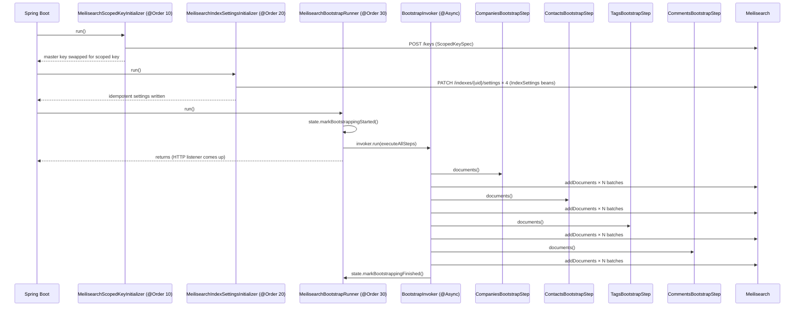

# Search Package Split

## GitHub Issue

[#32 — Split com.openelements.crm.search into reusable lib sub-package and CRM-specific code](https://github.com/OpenElementsLabs/open-crm/issues/32)

## Summary

Spec 104 introduced Meilisearch-based global search in `com.openelements.crm.search`. The package now mixes app-agnostic
infrastructure (HTTP client, startup runners, batch writer, highlighter) with CRM-specific glue (controller, four-index
bootstrap, owner resolution). [ADR-0001](../../adr/0001-meilisearch-client.md) records the decision to keep this code
in-house rather than depending on the `meilisearch-java` SDK; the long-term plan is to move the generic parts into
`com.open-elements:spring-services` so other Open Elements applications can reuse them.

This spec performs the split **in-repo as a preparation step**. The reusable code lives in a transitional sub-package
`com.openelements.crm.search.lib`, which will later be moved to `com.openelements.spring.meilisearch` in
`spring-services` as a mechanical rename. No Spring Boot starter, no `META-INF/spring/.../AutoConfiguration.imports` —
plain `@Configuration` + `@Import` only.

## Goals

- Cleanly separate app-agnostic from CRM-specific code along the boundary `com.openelements.crm.search.lib` ↔
  `com.openelements.crm.search`.
- Introduce a `SearchIndexBootstrapStep` SPI so the lib drives bootstrap without knowing CRM domain types.
- Replace the four hardcoded index accessors on `MeilisearchProperties` with two beans: lib-side connection properties (
  data only) + CRM-side `CrmIndexNames` component.
- Rename the `@ConfigurationProperties` prefix from `openelements.search.meilisearch.*` to `openelements.meilisearch.*`
  now (one migration, not two).
- Keep Spec 104's existing tests green without inhalt changes; allow signature changes (imports, bean lookups).

## Non-goals

- **No move into `spring-services`.** That is a follow-up. The `.lib` sub-package is the transitional home.
- **No Spring Boot starter, no autoconfiguration.** CRM-side config uses `@Import(MeilisearchConfiguration.class)`.
- **No new tests required.** Spec 104's behaviors are the regression contract.
- **No fix for the unused `requestTimeout`.** It is already ignored by `RestClient`; pre-existing, out of scope.
- **No change to the operator-visible env-var contract** (`MEILI_HOST`, `MEILI_MASTER_KEY`, `MEILI_INDEX_PREFIX`). Only
  the internal Spring property prefix is renamed.

## Intentional behavior changes

This refactor is *not* purely behavior-preserving in two narrow edge cases. Both are intentional and documented here for
honest record-keeping.

1. **Per-step error isolation in the bootstrap.**
   Today (Spec 104, `SearchIndexBootstrap.doBootstrap()`): a `RuntimeException` while indexing any one of the four
   entity types is caught at the top level — remaining entity types are *not* attempted. Result on failure in step 1 of
   4: 0 documents indexed for steps 2–4.
   After this spec: each `SearchIndexBootstrapStep` runs inside its own `try/catch` in the lib. Failure in one step does
   not stop the others. Result on failure in step 1 of 4: steps 2–4 still run.
   In both old and new behavior, `SearchReadinessState` is marked finished and search returns its (partial) results.
   Logging changes accordingly: the lib's bootstrap runner emits a per-step success/failure summary.

2. **`@ConfigurationProperties` prefix rename: `openelements.search.meilisearch.*` → `openelements.meilisearch.*`.**
   Operator-visible env vars are unchanged (they are mapped via `${MEILI_HOST:...}` placeholders in `application.yml`).
   Only the internal Spring property name changes. Any external deployment that overrides Spring properties directly (
   rather than via the `MEILI_*` env vars) must update its keys.

## Technical approach

### Target package layout

```
com.openelements.crm.search.lib                  (reusable; future: com.openelements.spring.meilisearch)
├── MeilisearchConfiguration                     @Configuration + @ComponentScan("com.openelements.crm.search.lib")
├── MeilisearchProperties                        @ConfigurationProperties("openelements.meilisearch")
├── MeilisearchClient                            @Component (HTTP wrapper)
├── MeilisearchException                         top-level (lifted from nested)
├── TaskOutcome                                  top-level enum (lifted from nested)
├── SearchReadinessState                         @Component (renamed from SearchIndexState)
├── ScopedKeySpec                                record(List<String> indexes, List<String> actions)
├── IndexSettings                                record(String uid, String primaryKey, List<String> searchable, List<String> filterable, List<String> sortable)
├── SearchIndexBootstrapStep                     SPI interface
├── MeilisearchScopedKeyInitializer              @Component @Order(10)
├── MeilisearchIndexSettingsInitializer          @Component @Order(20)
├── MeilisearchBootstrapRunner                   @Component @Order(30)
├── BootstrapInvoker                             @Component (@Async indirection, unchanged shape)
├── BatchWriter                                  helper used by BootstrapRunner
└── Highlighter                                  utility (safeHighlight + PRE_MARK/POST_MARK)

com.openelements.crm.search                      (CRM-specific glue)
├── SearchConfiguration                          @Configuration @Import(MeilisearchConfiguration.class), declares ScopedKeySpec + 4 IndexSettings beans + searchIndexExecutor
├── CrmIndexNames                                @Component (the four index-name accessors)
├── SearchController                             @RestController (uses Highlighter from lib)
├── GlobalSearchResultDto                        record (unchanged)
├── SearchHitDto                                 record (unchanged — no lib-side SearchHit)
├── SearchIndexService                           @Service (domain mappers + JDBC owner resolution)
├── SearchIndexEventListener                     @Component (CRM DTO dispatch)
├── CompaniesBootstrapStep                       @Component @Order(10) implements SearchIndexBootstrapStep
├── ContactsBootstrapStep                        @Component @Order(20) implements SearchIndexBootstrapStep
├── TagsBootstrapStep                            @Component @Order(30) implements SearchIndexBootstrapStep
└── CommentsBootstrapStep                        @Component @Order(40) implements SearchIndexBootstrapStep
```

### The `SearchIndexBootstrapStep` SPI

The single new abstraction introduced by this spec.

```java
package com.openelements.crm.search.lib;

import java.util.Map;
import java.util.stream.Stream;

public interface SearchIndexBootstrapStep {

    /** Target index UID (already prefixed). Used for the Meilisearch write and for log identity. */
    String indexUid();

    /**
     * Lazy stream of documents to push. The lib batches into groups of
     * {@link MeilisearchBootstrapRunner#BATCH_SIZE} and flushes via
     * {@link MeilisearchClient#addDocuments}. The lib closes the stream
     * via try-with-resources.
     */
    Stream<Map<String, Object>> documents();
}
```

Design rules:

- **The lib never sees domain types.** Steps deliver `Map<String, Object>` documents only.
- **The step is the source.** The lib does the transport (batching, task polling, error isolation).
- **Order is Spring `@Order` on the bean** — no `int order()` method polluting the interface.
- **Per-step isolation.** The lib wraps each step in its own `try/catch`; one failing step does not stop the others.

### The `MeilisearchBootstrapRunner`

Replaces `SearchIndexBootstrap`. Lives in the lib. Discovers all `SearchIndexBootstrapStep` beans (in `@Order`
sequence), runs them on `searchIndexExecutor` via the existing `BootstrapInvoker` indirection.

```java

@Component
@Order(30)
public class MeilisearchBootstrapRunner implements ApplicationRunner {

    static final int BATCH_SIZE = 500;
    static final Duration TASK_WAIT = Duration.ofSeconds(10);

    private final List<SearchIndexBootstrapStep> steps;   // Spring orders these by @Order
    private final MeilisearchClient client;
    private final SearchReadinessState state;
    private final BootstrapInvoker invoker;

    public void run(ApplicationArguments args) {
        if (!client.isHealthy()) { /* WARN + mark ready, return */ }
        state.markBootstrappingStarted();
        invoker.run(this::executeAllSteps);    // dispatched on searchIndexExecutor
    }

    private void executeAllSteps() {
        int succeeded = 0, failed = 0;
        try {
            for (SearchIndexBootstrapStep step : steps) {
                try (Stream<Map<String, Object>> docs = step.documents()) {
                    BatchWriter.write(client, step.indexUid(), docs, BATCH_SIZE, TASK_WAIT);
                    succeeded++;
                } catch (RuntimeException e) {
                    failed++;
                    log.error("Bootstrap step '{}' failed; remaining steps will still run.",
                        step.indexUid(), e);
                }
            }
            log.info("Bootstrap finished: {} step(s) succeeded, {} failed.", succeeded, failed);
        } finally {
            state.markBootstrappingFinished();
        }
    }
}
```

### `MeilisearchProperties` after the split

```java

@ConfigurationProperties("openelements.meilisearch")
public record MeilisearchProperties(
    String host, String masterKey, String indexPrefix, Duration requestTimeout) {

    public MeilisearchProperties { /* same defaults as today */ }

    public String resolveIndex(String suffix) {
        return indexPrefix + suffix;
    }
}
```

The four `*Index()` accessors are removed. CRM-side `CrmIndexNames` reads them:

```java

@Component
public class CrmIndexNames {

    private final MeilisearchProperties props;

    public String companies() {
        return props.resolveIndex("companies");
    }

    public String contacts() {
        return props.resolveIndex("contacts");
    }

    public String tags() {
        return props.resolveIndex("tags");
    }

    public String comments() {
        return props.resolveIndex("comments");
    }
}
```

All current callers of `props.companiesIndex()` etc. switch to injecting `CrmIndexNames` instead.

### Settings & ScopedKey: plain data records

```java
public record ScopedKeySpec(List<String> indexes, List<String> actions) {
}

public record IndexSettings(
    String indexUid,
    String primaryKey,
    List<String> searchableAttributes,
    List<String> filterableAttributes,
    List<String> sortableAttributes) {
}
```

Lib injects `Optional<ScopedKeySpec>` (no-op when absent) and `List<IndexSettings>` (no-op when empty). CRM declares one
`ScopedKeySpec` bean and four `IndexSettings` beans in `SearchConfiguration`. Hardcoded `SCOPED_INDEXES` /
`SCOPED_ACTIONS` and the four CRM-specific settings blocks move there from the lib.

### Configuration wiring

```java
// Lib
package com.openelements.crm.search.lib;

@Configuration
@ComponentScan("com.openelements.crm.search.lib")
@EnableConfigurationProperties(MeilisearchProperties.class)
public class MeilisearchConfiguration {
}
```

```java
// CRM
package com.openelements.crm.search;

@Configuration
@Import(MeilisearchConfiguration.class)
@EnableAsync
public class SearchConfiguration {

    @Bean(name = "searchIndexExecutor")
    public Executor searchIndexExecutor() { /* same pool as today */ }

    @Bean
    public ScopedKeySpec crmScopedKey() {
        return new ScopedKeySpec(
            List.of("crm_*"),
            List.of("search", "documents.add", "documents.get", "documents.delete",
                "indexes.create", "indexes.get", "indexes.update",
                "settings.update", "settings.get", "tasks.get"));
    }

    @Bean
    public IndexSettings companiesSettings(CrmIndexNames names) {
        return new IndexSettings(names.companies(), "id",
            List.of("name", "email", "website", "address", "phoneNumber",
                "description", "bankName", "vatId", "tagNames"),
            List.of("brevo", "tagNames"),
            List.of());
    }
    // … contactsSettings, tagsSettings, commentsSettings …
}
```

Rationale for `@EnableAsync` on the CRM side: the lib does not need to take a stance on async; the app that uses it
does. Keeps the lib smaller.

### Highlighter extraction

The `safeHighlight`, `PRE_MARK`, `POST_MARK` constants from `SearchController` move to
`com.openelements.crm.search.lib.Highlighter` as `public static` members. `SearchController` calls
`Highlighter.safeHighlight(...)` instead. No behavior change.

### Property file migration

| File                                                                        | Change                                                                                                                                |
|-----------------------------------------------------------------------------|---------------------------------------------------------------------------------------------------------------------------------------|
| `backend/src/main/resources/application.yml`                                | `openelements.search.meilisearch:` → `openelements.meilisearch:` (4 keys: `host`, `master-key`, `index-prefix`, `request-timeout`)    |
| `backend/src/test/java/com/openelements/crm/search/AbstractSearchTest.java` | `registry.add("openelements.search.meilisearch.host", ...)` → `registry.add("openelements.meilisearch.host", ...)` (and `master-key`) |

No changes to `docker-compose.yml`, `docker-compose.override.yml`, README, `application-local.yml` — they use `MEILI_*`
env vars or do not reference these keys.

### Test impact

Test files in `backend/src/test/java/com/openelements/crm/search/`:

- `AbstractSearchTest.java` — updates property keys, swaps `MeilisearchProperties.companiesIndex()` etc. for
  `CrmIndexNames.companies()` etc. (or moves the four-index loop to use `MeilisearchProperties.resolveIndex(...)`
  directly).
- `MeilisearchClientTest.java` — possibly updates imports (`MeilisearchClient.TaskOutcome` → `TaskOutcome`, etc.).
- `SearchIntegrationTest.java`, `SearchIndexEventListenerTest.java`, `SearchIndexServiceTest.java`,
  `SearchControllerSafeHighlightTest.java` — likely just imports / package changes; no scenario changes.

All scenarios from Spec 104 must remain green.

## Key flows

### Bootstrap orchestration



### Per-step error isolation


## Dependencies

- No new Maven dependencies. Pure refactor inside `backend/`.

## Open questions

None. All design decisions resolved in the grill session preceding this spec.

## References

- [ADR-0001 — Do not use the `meilisearch-java` SDK](../../adr/0001-meilisearch-client.md)
- [Spec 104 — Meilisearch global search](../104-meilisearch-global-search/design.md)
- [GitHub issue #32](https://github.com/OpenElementsLabs/open-crm/issues/32)
