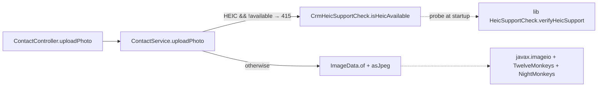

# spring-services 0.16.0 Upgrade

## GitHub Issue

[#33 — Upgrade to spring-services 0.16.0](https://github.com/OpenElementsLabs/open-crm/issues/33)

## Summary

`com.open-elements:spring-services` 0.16.0 ships three changes that affect open-crm: a new mandatory `name` field on `AuditLogEntity`/`AuditLogDto`/`AuditLogDataService` (with optional `@NameSupplier` DTO annotation), a raise of the image-upload size limit from 2 MB to 20 MB, and a built-in `ImageData.asJpeg(...)` transcoder for PNG/WebP/HEIC → JPEG that subsumes the local `ContactPhotoTranscoder` from Spec 101/102. There are no Spring Boot or Testcontainers BOM bumps.

This spec performs the version bump, migrates `audit_log` for the new schema, replaces the local image transcoder with the library version, raises multipart limits, and adopts `@NameSupplier` on the four audit-relevant DTOs. The frontend display of the new `name` field is intentionally **out of scope** — the admin Audit Log view lives in `@open-elements/nextjs-app-layer` and requires a separate release of that library; a follow-up issue is filed for that work.

## Goals

- Bump `spring-services` 0.15.0 → 0.16.0 cleanly, no other BOM moves.
- Migrate `audit_log` for the new `entity_name NOT NULL` column with a `"UNKNOWN"` backfill.
- Delete ~400 LOC of local image-format code (`ContactPhotoTranscoder.java`, the CRM-side `HeicSupportCheck.java`) now superseded by the library.
- Keep the Spec 102 contract that HEIC uploads return HTTP 415 (not 400) when libheif is unavailable at runtime.
- Raise the multipart and per-file upload ceiling to 20 MB to match the library's new `MAX_IMAGE_SIZE`.
- Adopt `@NameSupplier` on `CompanyDto`, `ContactDto`, `TagDto`, `CommentDto` so audit entries carry meaningful names instead of the `"UNKNOWN"` sentinel.

## Non-goals

- **No frontend changes.** The admin Audit Log view (`@open-elements/nextjs-app-layer/.../audit-logs-client.tsx`) keeps its current five-column layout. After this spec the new `name` field is in the `/api/audit-logs` JSON but the UI does not surface it yet. Tracked as a follow-up.
- **No backfill of historical `audit_log` rows from current entity state.** All pre-migration rows get `"UNKNOWN"`. Backfilling from `companies.name` / `contacts.first_name+last_name` would (a) require cross-table writes in the migration, (b) silently lie about rows where the entity has since been renamed or deleted.
- **No Spring Boot or Testcontainers bump.** 0.16 ships against the same BOMs as 0.15. Touching them here would muddy the upgrade.
- **No removal of `imageio-heif` / `imageio-webp` Maven dependencies or Dockerfile `libheif` install.** The library does *not* pull these in transitively (per the 0.16 upgrade doc); the consumer still owns the ImageIO readers.

## Intentional behavior changes

1. **Audit-log records `name` for new events.** Before: nothing. After: each new `audit_log` row has a non-null `entity_name` field — populated from the DTO's `@NameSupplier`-annotated method for our four annotated DTOs, or `"UNKNOWN"` for any other event whose DTO has no such method. Historical rows carry `"UNKNOWN"` from the migration backfill. `AuditLogController` returns this field unchanged in `/api/audit-logs` responses.
2. **Image upload limit rises from 2 MB to 20 MB.** Multipart layer accepts up to 20 MB; `ImageData.MAX_IMAGE_SIZE` is 20 MB inside the library; the rejection error message changes from `"Photo exceeds 2 MB"` to `"Photo exceeds 20 MB"`.
3. **`ContactService.uploadPhoto` delegates transcoding to the library.** Before: `ContactPhotoTranscoder.{pngToJpeg,webpToJpeg,heicToJpeg}` static methods. After: `ImageData.of(file).asJpeg()`. Inputs, outputs, EXIF-orientation handling, alpha-flatten-onto-white, metadata strip — all unchanged in semantics. Implementation moves to the library.
4. **`CompanyDto`/`ContactDto`/`TagDto`/`CommentDto` gain a no-arg `String`-returning method annotated `@NameSupplier`.** The library's `AuditLogEventListener` reflects on these on every persistence event. The methods are pure (no I/O, no Spring context access).

## Technical approach

### Maven version bump

Single line in `backend/pom.xml`:

```xml
<dependency>
    <groupId>com.open-elements</groupId>
    <artifactId>spring-services</artifactId>
    <version>0.16.0</version>          <!-- was 0.15.0 -->
</dependency>
```

The HEIC/WebP dependencies (`com.github.gotson.nightmonkeys:imageio-heif`, `com.twelvemonkeys.imageio:imageio-webp`) and the Dockerfile native-library install (`libheif1`, `libheif-plugin-libde265`, `--enable-native-access=ALL-UNNAMED`) stay exactly as they are.

### Flyway V33 — audit_log.entity_name

```sql
-- V33__add_audit_log_entity_name.sql
ALTER TABLE audit_log
    ADD COLUMN entity_name VARCHAR(255);

UPDATE audit_log
    SET entity_name = 'UNKNOWN'
    WHERE entity_name IS NULL;

ALTER TABLE audit_log
    ALTER COLUMN entity_name SET NOT NULL;
```

Three statements in one migration file. Postgres acquires an `ACCESS EXCLUSIVE` lock on `audit_log` for the `ADD COLUMN` and `SET NOT NULL`; for the CRM's expected audit-log volume (low thousands of rows in v1) this is well under a second.

Rationale for the 3-step add-nullable / backfill / set-not-null pattern: Hibernate `ddl-auto=validate` checks the schema once at boot. The library's `AuditLogEntity` declares the column with `nullable = false`. A direct `ADD COLUMN entity_name VARCHAR(255) NOT NULL` would fail because existing rows have no value; adding it nullable, backfilling, then constraining is the standard safe pattern.

### `@NameSupplier` adoption

Four DTOs gain one method each. All methods are pure and bounded.

```java
// com/openelements/crm/company/CompanyDto.java
@NameSupplier
public String displayName() {
    return name == null ? "" : name;
}

// com/openelements/crm/contact/ContactDto.java
@NameSupplier
public String displayName() {
    final String f = firstName == null ? "" : firstName;
    final String l = lastName == null ? "" : lastName;
    return (f + " " + l).trim();
}
```

**Tag and comment events stay at `"UNKNOWN"`.** `TagDto` and `CommentDto` live in `spring-services` itself (under `com.openelements.spring.base.services.tag` / `…services.comment`); they are records and cannot be annotated from outside the library. The library listener's automatic `"UNKNOWN"` fallback applies, and `audit_log` rows for tag/comment events read `"UNKNOWN"` until upstream `spring-services` adopts `@NameSupplier` on those records. This is a deliberate scope cut — filing upstream issues, waiting on a 0.16.1, and doing a second bump in this repo would expand the spec beyond a single coordinated upgrade.

For the two DTOs we *do* own (`CompanyDto`, `ContactDto`): the method is non-null and never blank for valid entities (companies must have a name; contacts have at least one of first/last name in practice). The library's listener treats a `null` return as a fallback to `"UNKNOWN"`, so even the defensive cases degrade gracefully.

Rationale for plain `displayName()` over a generic `getName()` or `name()`: the method name is documentation. Future readers see "this is the audit-log display name", not "what is this field?". Records already have an auto-generated `name()` accessor on `CompanyDto`; using the same method name as the annotation target would shadow it.

### Multipart and error-message updates

`backend/src/main/resources/application.yml`:

```yaml
spring:
  servlet:
    multipart:
      max-file-size: 20MB                # was 2MB
      max-request-size: 20MB             # was 2MB
```

`backend/src/main/java/com/openelements/crm/contact/ContactService.java` line 269:

```java
throw new ResponseStatusException(HttpStatus.BAD_REQUEST, "Photo exceeds 20 MB");   // was "Photo exceeds 2 MB"
```

`backend/src/main/java/com/openelements/crm/contact/ContactController.java` line 192 — Swagger description:

```java
@Parameter(description = "The photo image file (JPEG, PNG, WebP, or HEIC; max 20 MB)")
```

The `@Column(length = ImageData.MAX_IMAGE_SIZE)` declarations on `ContactEntity.photo` and `CompanyEntity.logo` automatically pick up the new 20 MB constant. Postgres `bytea` ignores `length`, so the underlying schema is unchanged — Hibernate will *not* generate an `ALTER COLUMN` for these. No migration required for the size raise.

### Image-format cleanup

**Delete:**
- `backend/src/main/java/com/openelements/crm/contact/ContactPhotoTranscoder.java` (~316 LOC)
- `backend/src/main/java/com/openelements/crm/contact/HeicSupportCheck.java` (~73 LOC, the CRM-side standalone bean)
- `backend/src/test/java/com/openelements/crm/contact/ContactPhotoTranscoderTest.java`
- `backend/src/main/resources/heic-probe/sample.heic` (no longer referenced — library has its own probe)

**Add (new, replaces the deleted standalone `HeicSupportCheck`):**

```java
// com/openelements/crm/contact/CrmHeicSupportCheck.java
@Component
public class CrmHeicSupportCheck {

    private static final Logger log = LoggerFactory.getLogger(CrmHeicSupportCheck.class);

    private volatile boolean heicAvailable = false;

    @PostConstruct
    void verify() {
        heicAvailable = HeicSupportCheck.verifyHeicSupport();   // library static helper
        if (!heicAvailable) {
            log.warn("HEIC support is not available in this deployment. "
                + "HEIC uploads will be rejected with 415 until libheif1 + "
                + "libheif-plugin-libde265 are installed in the runtime image.");
        }
    }

    public boolean isHeicAvailable() {
        return heicAvailable;
    }
}
```

The new bean is intentionally thin — it wraps the library's static `boolean` helper in a Spring-managed `@PostConstruct` probe so `ContactService` can short-circuit HEIC uploads with HTTP 415 (Spec 102 contract). Rationale for keeping a CRM-side wrapper rather than calling `HeicSupportCheck.verifyHeicSupport()` directly from `ContactService`: the probe involves loading a sample and registering readers — doing that on every upload is wasteful, and a `@PostConstruct` once-per-startup probe matches our Spec 102 behavior.

**Modify** `ContactService.uploadPhoto`:

```java
public void uploadPhoto(final UUID id, final byte[] data, final String contentType) {
    Objects.requireNonNull(id, "id must not be null");
    Objects.requireNonNull(data, "data must not be null");

    final String type = contentType == null ? "" : contentType;

    // HEIC short-circuit stays before the lib call so we can return 415 with
    // a clear operator message when libheif is missing at runtime.
    if (("image/heic".equals(type) || "image/heif".equals(type))
        && !crmHeicSupportCheck.isHeicAvailable()) {
        throw new ResponseStatusException(HttpStatus.UNSUPPORTED_MEDIA_TYPE,
            "HEIC support is not available in this deployment");
    }

    // Library handles size cap, content-type validation, PNG/WebP/HEIC transcoding,
    // EXIF orientation, alpha flatten, metadata strip, JPEG q=0.9 encode.
    final ImageData source = ImageData.of(data, type);
    final ImageData jpeg = "image/jpeg".equals(type) ? source : source.asJpeg();

    final ContactEntity entity = contactRepository.findByIdOrThrow(id);
    entity.setPhoto(jpeg.bytes());
    entity.setPhotoContentType("image/jpeg");
    contactRepository.saveAndFlush(entity);
}
```

The size check (`data.length > ImageData.MAX_IMAGE_SIZE`) is removed — `ImageData.of(...)` enforces it, with the new 20 MB message.

Rationale for keeping the explicit `"image/jpeg"` branch instead of always calling `asJpeg()`: an already-JPEG file does not need to be decoded and re-encoded; the result would be a strict-loss recompression for no benefit. The library's `asJpeg()` would re-encode unconditionally.

### Test updates

| File | Change |
|---|---|
| `UpdatesServiceTest.java` | 8× `auditLogDataService.createEntry(type, id, action, user)` → `…(type, id, "Test Name", action, user)`. Use a stable string per test so assertions on the returned `AuditLogDto.name()` are deterministic. |
| `CommentAuditEmissionTest.java` | Same pattern as above where applicable. |
| `ContactPhotoHeicWebpIntegrationTest.java` | Two `containsString("2 MB")` assertions → `containsString("20 MB")`. |
| `ContactPhotoTranscoderTest.java` | **Deleted.** Library covers transcoding; coverage of the wrapper is via the existing integration tests. |
| `AbstractDbTest`-derived tests that load fixtures | Sanity-check the `audit_log` truncation chain still works after the schema change — `TRUNCATE ... CASCADE` is unaffected by adding a new column. |

### Call graph after the cleanup



Compare with status quo, where `ContactService` reaches into `ContactPhotoTranscoder` static methods directly and a CRM-side `HeicSupportCheck` duplicates the lib's startup probe.

## Implementation order

PR-level atomicity is acceptable (the user confirmed) — intermediate commits may be red, only the merged PR has to be green. Recommended commit sequence for readable history:

1. Add V33 migration (no other change).
2. Bump `spring-services` to 0.16.0; fix the `createEntry` 5-arg signature in tests; fix the `AuditLogDto` constructor call sites in tests; pass `"UNKNOWN"` for the `name` argument where no name is available.
3. Raise multipart to 20 MB; update Swagger and error-message text.
4. Replace `ContactPhotoTranscoder` + local `HeicSupportCheck` with `ImageData.asJpeg()` + `CrmHeicSupportCheck` wrapper; delete the deleted files and tests.
5. Add `@NameSupplier displayName()` to `CompanyDto` and `ContactDto`.

The follow-up issue for the `@open-elements/nextjs-app-layer` "Name" column is filed separately at the start of the PR work and linked from the PR description.

## Dependencies

- No new Maven dependencies.
- No new npm dependencies.
- No new Docker layers.

## Open questions

None. All open questions resolved during planning.

## References

- [spring-services 0.16 upgrade guide](https://github.com/OpenElementsLabs/spring-services/blob/main/docs/upgrade-to-0.16.md)
- [GitHub issue #33](https://github.com/OpenElementsLabs/open-crm/issues/33)
- [Spec 090 — Audit Log view (frontend follow-up will touch this)](../090-audit-log-view/design.md)
- [Spec 095 — spring-services 0.14 upgrade (template for migration pattern)](../095-spring-services-upgrade/design.md)
- [Spec 101 — Contact photo PNG support (replaced by library)](../101-contact-photo-png/design.md)
- [Spec 102 — Contact photo HEIC & WebP support (replaced by library)](../102-contact-photo-heic-webp/design.md)
