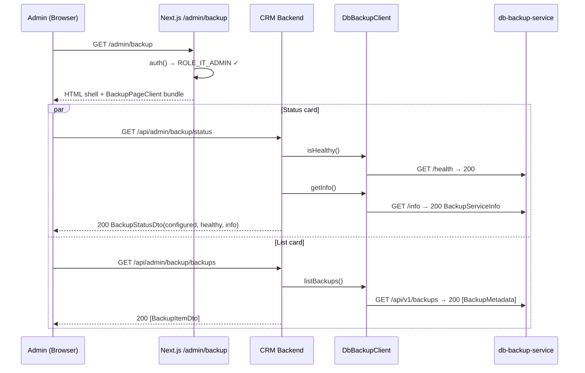
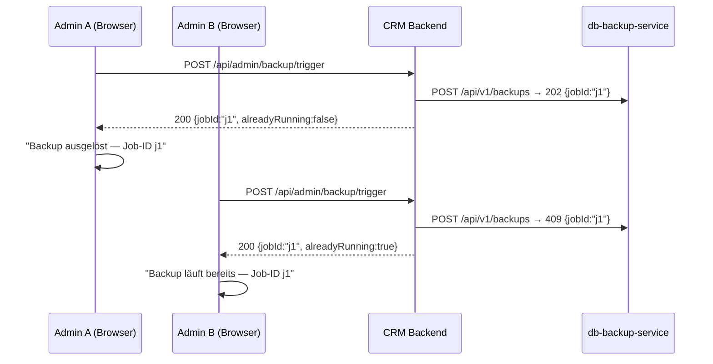
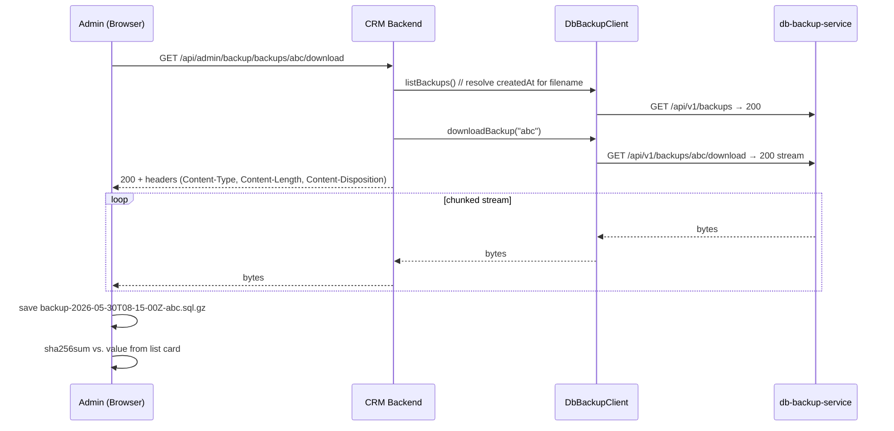

# Backup Admin Dialog

## GitHub Issue

— (no issue; tracked only by this spec)

## Summary

`com.open-elements:spring-services` 1.0.0-SNAPSHOT ships a `DbBackupClient` for the
[db-backup-service](https://github.com/OpenElementsLabs/db-backup-service). This spec adds an
admin-only page in open-crm that exposes the four high-level operations the client offers — show
service health and metadata, trigger a backup, list existing backups, and download a backup file —
so that an IT admin can verify the backup strategy end-to-end during the current testing phase.

The CRM backend acts as a thin RBAC-gating proxy in front of the backup service: the
`DbBackupClient` is injected into a new controller under `/api/admin/backup/*` that restricts
access to the `IT-ADMIN` role (Spec 085 convention) and forwards each call. The frontend page lives
at `/admin/backup` alongside the existing admin sub-pages (`brevo`, `audit-logs`, `webhooks`, …)
and follows the same server-side-role-check + client-component pattern.

This is an intentionally minimal v1. Pagination of the backup list, hardening the download path in
production, and migrating from human download to a server-side restore trigger are explicit
follow-up specs.

## Goals

- Bump `com.open-elements:spring-services` from `0.17.0` to `1.0.0-SNAPSHOT` so `DbBackupClient`
  and its DTOs are on the classpath.
- Add backend config keys `openelements.db-backup.base-url` and `openelements.db-backup.api-token`
  wired from env vars `DB_BACKUP_BASE_URL` and `DB_BACKUP_API_TOKEN`.
- Expose four backend endpoints under `/api/admin/backup/*`, each gated by `IT-ADMIN`, mapping
  one-to-one to the four user-facing functions (health+info, trigger, list, download).
- Add a frontend page at `/admin/backup` with four independent sections that each handle their own
  loading / error / "not configured" state.
- Add a new sub-menu entry in the admin sidebar (`frontend/src/app/(app)/layout.tsx`) and
  translation keys (`nav.backup`, `backup.*`) in `frontend/src/lib/i18n/{de,en}.ts`.

## Non-goals

- **No pagination, sorting, or filtering of the backup list.** v1 renders the full list as
  returned by the service. A follow-up spec will address this once realistic retention numbers
  (e.g. 90 / 365 daily entries) become relevant.
- **No production-only hardening of the download endpoint.** The download is available in every
  environment (dev / staging / prod). Restricting or removing it in prod is deferred to a follow-up
  spec, after the testing phase concludes.
- **No server-side restore trigger.** Long-term the right primitive is "trigger a restore from
  backup X on the recovery host", not "download backup X to a laptop". Not in scope here.
- **No separate audit log entry in open-crm for downloads.** The db-backup-service's own logging
  is the source of truth for backup-access events; duplicating it in open-crm's `audit_log` is
  out of scope.
- **No live polling, no SSE, no auto-refresh.** The page re-fetches its data only on manual reload.
- **No distinct error states for "auth failed" vs "service unreachable".** All upstream failure
  modes collapse to a single generic message in the UI. The backend log retains the distinction.
- **No granular RBAC.** A single role — `IT-ADMIN` — gates all four endpoints. No separation
  between "may trigger" and "may download".
- **No backwards-compat shim for the `0.17.0` → `1.0.0-SNAPSHOT` jump.** The bump is a side
  effect, not a separate spec. If 1.0.0-SNAPSHOT introduces unrelated breaking changes outside
  the search and backup areas, those are caught at build time and addressed inline.

## Intentional behavior changes

1. **A new admin sub-page appears in the sidebar (`IT-ADMIN` only).** Users without the role see
   no menu entry; direct navigation to `/admin/backup` renders `ForbiddenPage` (Spec 085 pattern).
2. **A backup trigger is no longer "fire-and-pray".** The UI surfaces the resulting job ID *and*
   distinguishes between "ausgelöst" (HTTP 202 from the service, fresh job) and "läuft bereits"
   (`alreadyRunning=true`, returns the in-flight job's ID).
3. **A new `/api/admin/backup/*` URL space exists.** No existing routes change.
4. **`spring-services` 1.0.0-SNAPSHOT replaces 0.17.0.** The major-version jump is required to
   pick up the backup client. Any incidental breaking changes between the two versions are
   surfaced at build/test time.

## Technical approach

### Maven version bump

Single line in `backend/pom.xml`:

```xml
<dependency>
    <groupId>com.open-elements</groupId>
    <artifactId>spring-services</artifactId>
    <version>1.0.0-SNAPSHOT</version>          <!-- was 0.17.0 -->
</dependency>
```

`FullSpringServiceConfig` (already imported from `CrmApplication`) picks up the new
`DbBackupConfig` automatically once the version is bumped. No additional `@Import` is needed in
open-crm.

### Configuration

`application.yml` gains a new block under `openelements`:

```yaml
openelements:
  meilisearch:
    # … existing keys …
  db-backup:
    base-url: ${DB_BACKUP_BASE_URL:http://localhost:8081}
    api-token: ${DB_BACKUP_API_TOKEN:}
    request-timeout: 30s
```

Defaults match the `DbBackupProperties` record in spring-services. The empty default for
`api-token` is intentional: a deployment without that env var must still start (see
"Graceful degradation" below), and a default of `""` causes the client to throw
`DbBackupException` only at the point a request is made, not at boot.

No `docker-compose.yml` change is required for the open-crm repo: the backup service is operated
out-of-tree and is reached via the env-var-supplied URL.

### Backend REST API

A new controller `com.openelements.crm.backup.BackupAdminController` lives in
`backend/src/main/java/com/openelements/crm/backup/`. It is annotated
`@RestController @RequestMapping("/api/admin/backup") @RequiresItAdmin`
(same `RequiresItAdmin` meta-annotation used by `BrevoSyncController`). It depends only on
`DbBackupClient`.

Four endpoints, each backed by exactly one client call:

| Method | Path                       | Returns                | Source                                            |
|--------|----------------------------|------------------------|---------------------------------------------------|
| `GET`  | `/api/admin/backup/status` | `BackupStatusDto`      | `client.isHealthy()` + `client.getInfo()`         |
| `POST` | `/api/admin/backup/trigger`| `BackupTriggerDto`     | `client.triggerBackup()`                          |
| `GET`  | `/api/admin/backup/backups`| `List<BackupItemDto>`  | `client.listBackups()`                            |
| `GET`  | `/api/admin/backup/backups/{id}/download` | streamed file | `client.downloadBackup(id)`             |

#### `GET /api/admin/backup/status`

Returns a single DTO that combines health and info so the frontend renders both in one section
with one fetch:

```java
public record BackupStatusDto(
    boolean configured,           // false when api-token is blank
    boolean healthy,              // result of client.isHealthy(); false if !configured
    BackupServiceInfo info        // null when !configured or info call fails
) {}
```

- If `apiToken` is blank: returns `new BackupStatusDto(false, false, null)`. No upstream call.
- Otherwise: returns `new BackupStatusDto(true, healthy, info)`. If the *info* fetch throws but
  the health probe succeeded, `info` is `null` and `healthy` stays `true` — the controller
  catches `DbBackupException` around the info call only, so the partial-render contract from
  the grill (Branch F1) is preserved.

Always returns HTTP 200, even on partial failure. The frontend distinguishes the four resulting
shapes (`!configured`, `configured && !healthy`, `configured && healthy && info==null`,
`configured && healthy && info!=null`) and renders accordingly.

#### `POST /api/admin/backup/trigger`

```java
public record BackupTriggerDto(String jobId, boolean alreadyRunning) {}
```

Direct passthrough of `client.triggerBackup()` → `BackupTriggerResult`. The UI uses
`alreadyRunning` to pick between "Backup ausgelöst" and "Backup läuft bereits".

`DbBackupException` from the client (auth, network, mis-config at call time) is mapped to
HTTP 503 with body `{ "error": "Backup-Service nicht verfügbar" }` — a single generic message,
per grill Branch C2.

#### `GET /api/admin/backup/backups`

Returns `List<BackupItemDto>` — direct map of `List<BackupMetadata>`:

```java
public record BackupItemDto(
    String id,
    Instant createdAt,
    long sizeBytes,
    String sha256,
    String pgVersion,
    long durationMs,
    String triggeredBy
) {}
```

No pagination, no filtering. Order is whatever the service returns (newest-first, per the
client's documented contract). `DbBackupException` → 503 with the same generic body.

#### `GET /api/admin/backup/backups/{id}/download`

Streams the backup file straight from `BackupDownload` to the HTTP response. The controller
returns a `ResponseEntity<StreamingResponseBody>`. Headers:

- `Content-Type: application/gzip`
- `Content-Length: <BackupDownload.sizeBytes()>` (so the browser can show a progress bar)
- `Content-Disposition: attachment; filename="backup-<createdAt>-<id>.sql.gz"`

The filename uses the backup's `createdAt` formatted as
`yyyy-MM-dd'T'HH-mm-ss'Z'` (colons replaced by hyphens to keep the name filesystem-safe on
Windows) plus the id suffix — combining both per grill Branch E1. The controller calls
`client.listBackups()` once to resolve the timestamp for the filename (cheap; same upstream the
list view already hits). If the metadata cannot be resolved, the controller falls back to
`backup-<id>.sql.gz` so the download still works.

The streaming uses try-with-resources on `BackupDownload`. A network failure mid-stream
propagates as a closed TCP connection; the browser sees a truncated file. The list view shows
the `sha256` so the admin can verify integrity locally with `sha256sum` (grill Branch E2).

`DbBackupException` raised *before* the first byte goes out (e.g. 404 from the service) → 503
with the generic body. After bytes have started flowing, the response is half-written and the
backend can only close the stream; the browser handles the truncation.

### Frontend

The page follows the exact pattern of `frontend/src/app/(app)/admin/brevo/`:

```
frontend/src/app/(app)/admin/backup/
├── page.tsx                  # server component: auth + IT-ADMIN gate, renders client
└── backup-page-client.tsx    # client component with the four sections
```

`page.tsx` is a copy of the brevo page with one import swap:

```tsx
import { auth } from "@/auth";
import { ForbiddenPage, ROLE_IT_ADMIN } from "@open-elements/nextjs-app-layer";
import { BackupPageClient } from "./backup-page-client";

export default async function BackupPage() {
  const session = await auth();
  if (!session?.roles?.includes(ROLE_IT_ADMIN)) {
    return <ForbiddenPage />;
  }
  return <BackupPageClient />;
}
```

`backup-page-client.tsx` renders four cards stacked vertically on desktop, one per
backend section:

1. **Status card** — shows the four shapes from `GET /status`:
   - `!configured` → "Backup-Service ist nicht konfiguriert."
   - `configured && !healthy` → red dot + "Backup-Service nicht verfügbar."
   - `configured && healthy && info==null` → green dot + "Verbunden." + "Service-Info konnte
     nicht geladen werden."
   - `configured && healthy && info!=null` → green dot + version, pg_dump-Version, retention,
     interval (iso8601 form), age of the last successful backup as relative time.
2. **Trigger card** — single button "Backup auslösen". On click, POSTs to `/trigger`. On 200,
   renders the result: "Backup ausgelöst — Job-ID `<id>`" or "Backup läuft bereits — Job-ID
   `<id>`". On 503, shows the generic error. The button stays enabled — concurrent clicks
   are protected by the upstream service via `alreadyRunning`.
3. **Backup list card** — table with columns: Erstellt am, Größe, pg-Version, Dauer,
   Trigger, SHA-256 (in a monospace, copy-to-clipboard chip), Aktion (Download button). On
   empty list: "Noch keine Backups vorhanden." On 503: generic error message in place of
   the table.
4. **Download** — the download is initiated from the row's Download button by setting
   `window.location.href` to `/api/admin/backup/backups/<id>/download`. The auth cookie is
   sent automatically by the Next.js proxy at `frontend/src/app/api/[...path]/route.ts`. No
   client-side fetch is needed — the browser handles the response as a save-as.

Each card fetches its own data independently via `fetch` in a `useEffect` (or
`useSWRImmutable` if a helper is already in use elsewhere). A failure in one card does not
block the others (grill Branch F1).

#### Sidebar entry

`frontend/src/app/(app)/layout.tsx` gains one new `<NavItem>` in the admin sub-menu, placed
after the existing `audit-logs` entry:

```tsx
<NavItem
  href="/admin/backup"
  icon={<DatabaseBackup className="h-5 w-5" />}
  label={t.nav.backup}
  active={pathname.startsWith("/admin/backup")}
  indented
/>
```

`DatabaseBackup` is imported from `lucide-react` (already a dependency of `@open-elements/ui`).
The whole admin sub-menu is only rendered for users with `ROLE_IT_ADMIN`, so the new entry
inherits the existing visibility logic without an extra guard.

#### i18n

New keys in `frontend/src/lib/i18n/{de,en}.ts`:

```ts
nav: {
  backup: "Backup",                        // EN
  backup: "Backup",                        // DE (same word, kept for consistency)
},
backup: {
  title: "Backup",
  status: {
    title: "Service-Status",
    notConfigured: "Backup-Service ist nicht konfiguriert.",
    unavailable: "Backup-Service nicht verfügbar.",
    healthy: "Verbunden.",
    infoUnavailable: "Service-Info konnte nicht geladen werden.",
    version: "Version",
    pgDumpVersion: "pg_dump-Version",
    retention: "Aufbewahrung",
    interval: "Intervall",
    lastBackupAge: "Letztes Backup",
  },
  trigger: {
    title: "Manuelles Backup",
    button: "Backup auslösen",
    triggered: "Backup ausgelöst — Job-ID {jobId}",
    alreadyRunning: "Backup läuft bereits — Job-ID {jobId}",
  },
  list: {
    title: "Vorhandene Backups",
    columns: {
      createdAt: "Erstellt am",
      sizeBytes: "Größe",
      pgVersion: "pg-Version",
      durationMs: "Dauer",
      triggeredBy: "Trigger",
      sha256: "SHA-256",
      action: "Aktion",
    },
    empty: "Noch keine Backups vorhanden.",
    download: "Herunterladen",
    sha256Copy: "Hash kopieren",
    sha256Copied: "Hash kopiert.",
  },
}
```

DE/EN mirrored. Keys live in `frontend/src/lib/i18n/`, not in the
`@open-elements/nextjs-app-layer` package — they are CRM-specific and follow the same scoping
as `brevo.*` and `nav.brevo`.

### Graceful degradation when `DB_BACKUP_API_TOKEN` is not set

Per grill Branch C1, the backend must boot even without the env var. `DbBackupProperties` accepts
a `null`/blank `apiToken`; the client throws `DbBackupException` only when a request is made.
The controller's `/status` endpoint checks for blank `apiToken` *before* calling the client and
returns `BackupStatusDto(false, false, null)` directly. The three other endpoints
(`/trigger`, `/backups`, `/backups/{id}/download`) do not pre-check — they just call the
client; a blank token results in a `DbBackupException` → HTTP 503 generic body. The frontend
trigger / list / download buttons remain visible but each returns the generic error, which is
acceptable because the status card already tells the admin the service is not configured.

### Sidebar visibility

The new menu entry is rendered inside the `admin` collapse of `layout.tsx`. That whole
collapse is already conditional on `session?.roles?.includes(ROLE_IT_ADMIN)`. No additional
role check is added to the sidebar — the existing one is sufficient.

## Key flows

### Page load (happy path)



### Trigger with alreadyRunning collision



### Download



### Backup-service down (partial render)

```mermaid
sequenceDiagram
    participant U as Admin (Browser)
    participant BE as CRM Backend
    participant DC as DbBackupClient

    par Status card
        U->>BE: GET /status
        BE->>DC: isHealthy() → false
        BE-->>U: 200 {configured:true, healthy:false, info:null}
        U->>U: red dot, "Backup-Service nicht verfügbar."
    and List card
        U->>BE: GET /backups
        BE->>DC: listBackups() → DbBackupException
        BE-->>U: 503 {error:"Backup-Service nicht verfügbar"}
        U->>U: list area shows generic error
    end
    Note over U: Trigger button still enabled;<br/>click would return same 503.
```

## Dependencies

- New transitive: `com.open-elements:spring-services` `1.0.0-SNAPSHOT` brings `DbBackupClient`,
  `DbBackupConfig`, `DbBackupProperties`, and the related DTOs into the classpath.
- `lucide-react` (already a dependency of `@open-elements/ui`) provides the `DatabaseBackup`
  icon.
- No new Maven test deps. The controller tests use `@WebMvcTest` + `@MockBean DbBackupClient`
  in line with existing controller-test conventions.

## Security considerations

- **Role gate.** `@RequiresItAdmin` (Spec 085 meta-annotation expanding to
  `@PreAuthorize("hasRole('IT-ADMIN')")`) is applied at the controller class level. Every
  endpoint inherits it. The frontend page additionally checks the role server-side
  and renders `ForbiddenPage` on miss.
- **Token confidentiality.** `DB_BACKUP_API_TOKEN` is supplied via env var only; it never
  appears in `application.yml`, `docker-compose.yml`, or committed configuration. The
  controller never echoes the token in responses or logs.
- **Personal data exposure via download.** Backups contain the full CRM database including
  contact personal data. Per the grill session this is accepted for the testing phase, with
  the understanding that a follow-up spec will restrict the download surface in production.
  No audit log entry is created in open-crm for downloads; the db-backup-service's own
  request log is the system of record.
- **CSRF.** `POST /trigger` is gated by Spring Security like every other state-changing
  endpoint in the project; no additional handling.
- **Open redirect / SSRF.** The `id` path parameter is a service-provided UUID/ULID, opaque
  to open-crm. The controller does not parse or transform it; it is passed through to the
  client which constructs the upstream URL.

## Open questions

None. All design decisions resolved during the grill session.

## References

- [Grill session — Backup Admin Dialog](#) (in-conversation; recorded in this spec)
- [Spec 074 — Admin page rework](../074-admin-page-rework/design.md)
- [Spec 079 — Admin sub-menu](../079-admin-submenu/design.md)
- [Spec 085 — Role-based access control](../085-role-based-access-control/design.md)
- [Spec 105 — Search package split](../105-search-package-split/design.md) — precedent for
  `spring-services` lib adoption + `FullSpringServiceConfig` activation
- [db-backup-service](https://github.com/OpenElementsLabs/db-backup-service) — upstream service
