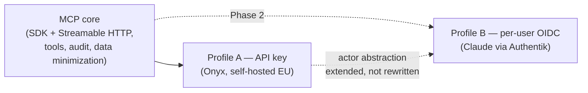
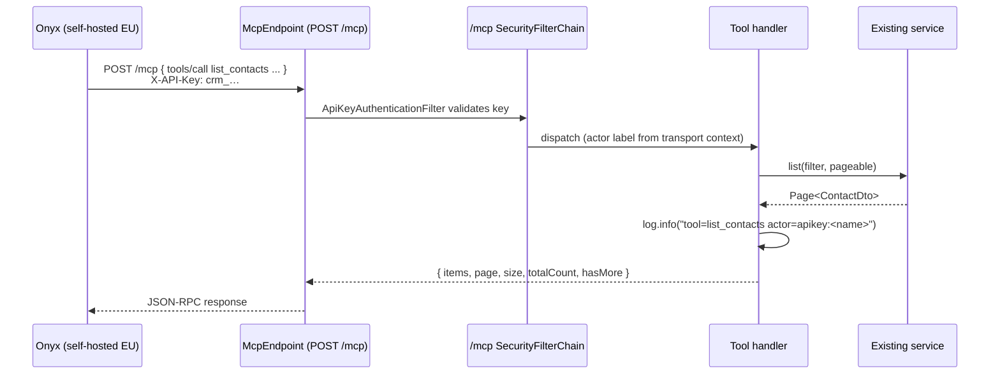

# Design: MCP Server for Open CRM (client-agnostic)

## GitHub Issue

— (no issue; spec drives the work)

## Summary

Open CRM exposes a new **read-only Model Context Protocol (MCP) HTTP endpoint** under `/mcp`, built on the official Java MCP SDK with the **Streamable HTTP** transport. The endpoint is **client-agnostic** — any compliant MCP client can connect — and the tool catalog covers the natural read use cases over companies, contacts, tags, and comments, plus a global search.

Because the protocol surface is identical for every client, the only thing that differs per client is **authentication**. The design therefore defines two **auth profiles** behind one shared MCP/tool/audit core, and ships them in two phases:

- **Phase 1 — Profile A (API key):** a self-hosted, EU-hosted **Onyx AI** instance connects to `/mcp` using the existing CRM API-key scheme (`X-API-Key`). This is the immediate driver and the smallest viable slice.
- **Phase 2 — Profile B (per-user OIDC):** **Anthropic Claude** connects as a "Custom Connector", authenticating each employee through the existing Authentik SSO via a dedicated `open-crm-mcp` OAuth client, so RBAC and per-user audit attribution apply end-to-end.

The first release is **read-only**; write tools are an explicit follow-up. Phase 2 is additive: it adds an auth profile and a per-user actor resolution on top of the Phase 1 core, without restructuring the tool layer, transport, or audit model.

## Goals

- Expose CRM data to MCP clients (Onyx now, Claude later) through a properly implemented, read-only MCP server.
- Keep the MCP/tool/transport/audit core **client-agnostic**; isolate per-client differences to a pluggable auth profile.
- Phase 1: let a self-hosted EU Onyx consume CRM data with the **existing** API-key infrastructure — no new auth scheme, minimal new code.
- Phase 2: preserve per-user identity end-to-end for Claude via Authentik OIDC, so audit and RBAC are meaningful per employee.
- Ship a small, well-scoped tool catalog: search, list, get, comments over companies/contacts/tags/comments.
- Be strictly additive to the existing backend — a new endpoint, a new security chain for `/mcp/**`, and a thin tool adapter over existing services.

## Non-goals

- **Write operations.** Creating, updating, or deleting CRM entities through MCP is out of scope for v1. The architecture must allow adding them later without restructuring auth, audit, or transport.
- **Tasks and Users tools in Phase 1.** The Onyx scope is companies, contacts, tags, comments. `list_tasks`/`get_task` and a reduced `list_users` projection are **deferred** to a later increment (the original design is retained below under *Deferred tool catalog* so it is not lost).
- **Per-request scoping / rate limiting on `/mcp`.** API keys have no scopes today; both scoping and rate limiting arrive with the planned future API-key capability (see *Dependencies* and *Open questions*). Phase 1 relies on the page-size cap only.
- **Exposing administrative resources** (API keys, webhooks, audit log) via MCP.
- **A dedicated frontend UI.** The connector is configured inside the MCP client (Onyx admin panel / Claude connector dialog).
- **MCP "Resources"** (`crm://...` URIs). The tool model is sufficient for v1.
- **Internationalization of tool responses.** Tool names/descriptions are English; payloads carry data as stored.
- **Strict `aud` validation** on the OIDC profile (Phase 2) — deferred (see TODO.md § "Strikte Audience-Prüfung für JWT-Validierung").

## Phasing



Phase 1 delivers the core + Profile A. Phase 2 adds Profile B. The seam between them is the **actor label** (see *Access logging*): Phase 1 derives an `apikey:<name>` label from the API key; Phase 2 additionally derives a per-user label/identity from the JWT subject. No Phase-1 code is rewritten for Phase 2.

## Technical approach

### Building blocks

- **MCP server runtime:** the **official Java MCP SDK** — `io.modelcontextprotocol.sdk:mcp` plus the Spring WebMVC transport `io.modelcontextprotocol.sdk:mcp-spring-webmvc`. It provides JSON-RPC framing, schema generation, the **Streamable HTTP** transport, and programmatic tool registration (via the SDK's tool-specification builders). The version is pinned (the SDK is young — see *Open questions*).
  - **Rationale (Spring AI rejected):** the Spring AI MCP starter wraps the *same* official SDK but transitively pulls ~12–15 MCP-irrelevant jars (StringTemplate/ANTLR prompt templating, a `victools` JSON-schema-generator stack, the `jtokkit` LLM tokenizer, and an outdated `javax.validation:validation-api:1.1.0` that risks clashing with the project's Jakarta validation). The only upside is `@McpTool` annotation sugar. The official SDK keeps the footprint to the two MCP jars + `reactor-core` + Jackson (already present). Measured during this spec's grill session.
- **Transport:** Streamable HTTP. Stateful vs. stateless mode and exact interop with Onyx's MCP client are verified at implementation time (see *Open questions*).
- **Read backend:** existing services (`CompanyService`, `ContactService`, `TagService`, `CommentService`, `SearchService`) are reused as-is. The MCP layer is a thin adapter — it does not duplicate filtering or query logic.
- **Tool dispatch:** each tool method calls the backing service, emits one structured access log line (`tool=… actor=…`), and returns the mapped payload (or a mapped JSON-RPC error).

### Auth profiles

The `/mcp/**` path gets its **own** `SecurityFilterChain` owned by the CRM (`McpSecurityConfig`), registered with a precedence ahead of the spring-services default chain and scoped via `securityMatcher("/mcp/**")`.

**Profile A — API key (Phase 1):**

- Reuses the spring-services `ApiKeyAuthenticationFilter` bean. That filter is **HTTP-method-agnostic** — it reads the `X-API-Key` header, validates it via `ApiKeyDataService`, and sets the authentication. (The GET-only restriction in spring-services lives in the *default external chain's* `authorizeHttpRequests`, **not** in the filter — verified by bytecode inspection — so reusing the filter on a POST endpoint is correct.)
- The `/mcp/**` chain: runs the API-key filter, requires an authenticated request for all methods on `/mcp/**`, disables CSRF (machine-to-machine API), and uses a stateless session policy.
- **Any valid API key** authenticates. There are no per-key scopes today (see *Security considerations* → privilege expansion).

**Profile B — per-user OIDC (Phase 2):**

- Adds JWT resource-server validation to the `/mcp/**` chain (same Authentik JWKS as `/api/**`), plus **Protected Resource Metadata** (`/.well-known/oauth-protected-resource`, RFC 9728) advertising Authentik as the authorization server. A dedicated `open-crm-mcp` OAuth client is created once in Authentik.
- The two profiles can coexist on the same chain (API key *or* Bearer JWT). Phase 1 ships only Profile A; the JWT path and the well-known endpoint are added in Phase 2.



### Access logging (not audit)

MCP tool calls are **reads**. The CRM `audit_log` records **mutations** (`INSERT`/`UPDATE`/`DELETE`), and read access — like viewing a record in the frontend — is **not** audited there. MCP reads are treated the same way: they are **not** written to `audit_log`. Forcing them in would be both inconsistent (the frontend isn't audited) and semantically wrong (there is no read action in the audit model — an `INSERT` for a read is a misnomer).

Instead, each tool call emits one **structured INFO log line** for operational visibility: `tool=<name> actor=<label>` — never the arguments (search queries / ids can be sensitive). The actor label is `apikey:<key-name>` for the Phase 1 API-key profile, captured on the request thread by the transport context extractor (see below) and read in the tool dispatcher via `McpActorLabel`.

> A future, queryable **read-access audit** for machine consumers (MCP and API-key clients) is intentionally deferred and tracked in `docs/TODO.md`. It should be a dedicated access log hung off API keys / controller endpoints — not the mutation `audit_log` — and is best built together with scoped API keys (which give per-key identity). Phase 2 (Claude) additionally introduces per-user identity, at which point per-employee access logging becomes meaningful.

## API design

### MCP endpoint

| Method | Path | Phase | Purpose |
|--------|------|-------|---------|
| `POST` | `/mcp` | 1 | Streamable HTTP transport (JSON-RPC 2.0). `tools/list` and `tools/call` flow through here. |
| `GET`  | `/mcp` | 1 | Streamable HTTP server→client channel (as required by the transport/SDK). |
| `GET`  | `/.well-known/oauth-protected-resource` | 2 | RFC 9728 metadata advertising Authentik (OIDC profile only; open, no auth). |

Phase 1: `/mcp` requires a valid `X-API-Key`. Phase 2: `/mcp` additionally accepts a Bearer JWT; the well-known endpoint is added and is publicly reachable.

### Tool catalog (Phase 1)

All tools are read-only and namespaced under the MCP server name "Open CRM" (clients display e.g. `open-crm.list_contacts`). Tool names are snake_case (MCP idiom); parameters are camelCase (matching existing DTO fields). Collection tools accept `page` (default `0`) and `size` (default from config, hard-capped) and return a **paginated envelope** (see below).

| Tool name | Parameters | Returns | Backing service |
|-----------|------------|---------|-----------------|
| `search` | `q: string`, `limit?: int (≤ max)` | `GlobalSearchResultDto` (companies, contacts, tags, comments groups; each hit `id`, `label`, `snippet`, `score`, `ownerType`, `ownerId`) | `SearchService.search()` |
| `list_companies` | `name?`, `brevo?`, `tagIds?`, `page?`, `size?` | `Paginated<CompanyDto>` (incl. finance fields) | `CompanyService.list()` |
| `get_company` | `id: UUID` | `CompanyDto` | `CompanyService.findById()` |
| `list_contacts` | `search?`, `companyId?`, `language?`, `brevo?`, `tagIds?`, `page?`, `size?` | `Paginated<ContactDto>` | `ContactService.list()` |
| `get_contact` | `id: UUID` | `ContactDto` | `ContactService.findById()` |
| `list_tags` | `page?`, `size?` | `Paginated<TagDto>` | `TagService.list()` |
| `get_tag` | `id: UUID` | `TagDto` | `TagService.findById()` |
| `list_company_comments` | `companyId: UUID`, `page?`, `size?` | `Paginated<CommentDto>` (full text) | `CompanyService.listComments()` |
| `list_contact_comments` | `contactId: UUID`, `page?`, `size?` | `Paginated<CommentDto>` (full text) | `ContactService.listComments()` |

### Paginated envelope (completeness signal)

To prevent silent truncation, every collection tool returns an explicit envelope rather than a bare array:

```json
{
  "items": [ /* ≤ size DTOs */ ],
  "page": 0,
  "size": 20,
  "totalCount": 200,
  "hasMore": true
}
```

`totalCount`/`hasMore` map directly onto the existing `Page<T>` (`getTotalElements()`, `!page.isLast()`). Tool **descriptions** instruct the model to paginate when `hasMore` is `true`, so a large match (e.g. "all contacts of company X") is not answered from a truncated first page. Comment-list tools follow the same envelope instead of the old "cap at 50" mismatch hint.

### What is *not* exposed

- **API keys, webhooks, audit log** — administrative / monitoring data.
- **Tasks and Users** — deferred (see *Deferred tool catalog*).
- Newsletter-consent fields are part of `ContactDto` and therefore included; the GDPR checklist covers them.

### Deferred tool catalog (from original 108, not in Phase 1)

Retained for the later increment: `list_tasks`, `get_task` (over `TaskService`), `list_task_comments`, and a **reduced** `list_users` returning only `{ id, displayName }` (never email/avatar). These are out of the Onyx scope and ship after Phase 1.

## Data model

No schema changes. Purely additive:

- No new entities, tables, or Flyway migration.
- MCP reads write nothing to the database — access is recorded only as structured INFO logs. (A future read-access log would add its own table; see `docs/TODO.md`.)

## Configuration

```yaml
openelements:
  mcp:
    enabled: true                 # master switch — removes all MCP endpoints/beans when false
    server-name: "Open CRM"
    server-version: "0.1.0"
    max-page-size: 50
    default-page-size: 20
    auth:
      api-key:
        enabled: true             # Profile A (Phase 1)
      oidc:
        enabled: false            # Profile B (Phase 2)
    authorization-server-issuer:  # Profile B only; populates protected-resource-metadata
      ${spring.security.oauth2.resourceserver.jwt.issuer-uri:}
```

`enabled: false` removes all MCP endpoints and skips bean registration. The per-profile switches let Phase 1 run with no OIDC code path active.

## Dependencies

### New Maven dependencies

- `io.modelcontextprotocol.sdk:mcp` and `io.modelcontextprotocol.sdk:mcp-spring-webmvc` — official Java MCP SDK + Spring WebMVC transport (Streamable HTTP). **Version pinned** (reproducible builds). Transitively adds `reactor-core`; Jackson/Web are already present.

### Existing dependencies reused

- `spring-services:1.2.0` — provides `ApiKeyAuthenticationFilter`, `ApiKeyDataService`, the `api_keys` store, audit, users, RBAC.
- `spring-boot-starter-oauth2-resource-server` — JWT validation (Phase 2).
- `springdoc-openapi-starter-webmvc-ui` — surfaces the metadata endpoint in Swagger UI (Phase 2, optional).

### Future dependency (not in this spec)

- **Scoped API keys + rate limiting.** Planned for a future API-key capability (likely in spring-services). Broad production rollout of MCP is gated on it. Until then, MCP is **internal-use only** and every existing key has full MCP read access.

### Onyx configuration (Phase 1, one-time, manual)

- Onyx is **self-hosted in the EU/on-prem** and configured with an **EU-hosted, GDPR-compliant LLM**.
- In the Onyx admin panel, add an MCP server with URL `https://<crm-host>/mcp`, HTTP/Streamable transport, **Shared-Key** auth sending the custom header `X-API-Key: crm_…` (a CRM API key created at `/admin/api-keys`).
- README gains an "MCP Server (Onyx)" section mirroring the existing API-key docs.

### Authentik configuration (Phase 2, one-time, manual)

A dedicated confidential OAuth client `open-crm-mcp` (scopes `openid`, `profile`, `email`; same `roles` claim as `open-crm`; redirect URI = Anthropic's published Claude-connector callback). Client ID/secret are pasted into Claude's "Add Custom Connector" dialog. Documented in the deployment runbook.

## Security considerations

- **Authentication:** Phase 1 — `X-API-Key` validated against `api_keys`; Phase 2 — JWT signature via Authentik JWKS. The `/mcp/**` chain is CRM-owned and separate from the spring-services chains.
- **Privilege expansion (must be owned by operators):** enabling MCP expands the effective reach of **every existing API key** from "GET `/api/external`" to "all personal CRM data via MCP", because keys have no scopes yet. This is mitigated **organizationally**, not technically: MCP stays **internal-only** until scoped keys exist, and broad production rollout is gated on them. The README must warn operators to review/rotate existing keys before enabling MCP.
- **Authorization:** v1 tools require any authenticated caller (matches the existing read policy). `@PreAuthorize` hooks remain available for future tools.
- **Access logging:** one structured INFO line per tool call (success and failure), `tool=<name> actor=<label>`, never the arguments. MCP reads are not written to `audit_log` (consistent with unaudited frontend reads). A queryable read-access audit is deferred (see `docs/TODO.md`).
- **Data minimization:** administrative entities are never exposed; the deferred `list_users` is a reduced projection. Page size is hard-capped.
- **Most-sensitive data:** comment **full text** is exposed in Phase 1 by explicit decision — it is the most sensitive, least-structured data. Mitigated by the self-hosted EU Onyx + EU GDPR-compliant LLM + signed AVV (pending) + internal-only use.
- **Logging:** tool arguments (search queries, IDs) must **not** be logged at INFO. INFO logs only `tool=<name> actor=<label>`; argument-level logging is behind an explicit debug flag.

## GDPR / DSGVO

The processing profile differs sharply between the two phases; each carries its own pre-production checklist. The technical feature **must not be enabled in a given environment until that phase's checklist is complete.**

### Phase 1 — Onyx (self-hosted EU) + EU-hosted LLM

CRM personal data (names, e-mail, addresses, phone, birthdays, **free-text comments**) is retrieved by the self-hosted Onyx and forwarded to the configured EU-hosted LLM. There is **no third-country transfer**, which removes the heavy DPF/SCC/DPIA-for-US burden — but processors and documentation are still required:

1. **AVV / DPA with the LLM provider** covering CRM-category personal data. *(Status: open — will be done before rollout.)*
2. **Legal basis documented** — typically Art. 6 (1) lit. f (internal CRM use) with a balancing test; lit. b for prospect/customer data.
3. **Privacy notice updated** — public policy and internal employee notice mention that CRM data may be sent to the LLM provider on request.
4. **Onyx chat-log retention** — Onyx persists chat history including retrieved CRM data in its own datastore; a retention/deletion policy for those logs must exist (data-subject erasure must reach them).
5. **Works council** — Onyx logs which employee asked what; if a works council exists, an agreement on this monitoring may be required (the CRM side only logs key-level access, not per-employee).

### Phase 2 — Claude (Anthropic, USA)

Sending CRM data to Anthropic makes Anthropic an Art. 28 processor in a third country. The original 108 checklist applies in full: signed DPA with Anthropic; Zero-Data-Retention confirmed in writing; legal basis + balancing test; **DPIA** referencing Anthropic's EU-US DPF certification (or SCCs); privacy-notice update; works-council agreement (per-employee audit makes this monitoring concrete).

Both checklists are reproduced in `behaviors.md` as manual production-readiness checks.

## Open questions

- **Streamable HTTP mode.** Stateful (session id + GET channel) vs. stateless, and exact interop between Onyx's MCP client and the Java SDK transport — verified at implementation. Prefer the simplest mode that Onyx validates against.
- **MCP SDK release line.** The official Java MCP SDK is young; pin a specific version and upgrade deliberately.
- **Scoped keys / rate limiting.** Tracked as a future API-key capability; this spec assumes its absence and compensates organizationally.
- **Anthropic's published redirect URI** for Claude connectors (Phase 2) — looked up and registered in Authentik at rollout.

## Rationale for key choices

- **Why one client-agnostic server with two auth profiles instead of two servers?** MCP tools, transport, and audit are identical for every client; only auth differs. A single core with a pluggable auth profile avoids duplicating the tool layer and keeps behavior consistent across clients.
- **Why API key first (Onyx) and OIDC later (Claude)?** Onyx is the immediate need, self-hosted EU keeps GDPR light, and the API-key path reuses existing infrastructure with no OAuth-metadata work — the smallest viable slice. OIDC is heavier (RFC 9728 + a second Authentik client) and serves the later Claude use case.
- **Why a dedicated `/mcp` security chain instead of extending the spring-services external chain?** The spring-services external chain is locked to GET on `/api/external/**`. A CRM-owned chain for `/mcp/**` cleanly allows POST and composes both auth profiles without forking the library.
- **Why not audit MCP reads in `audit_log`?** That table records mutations; reads (including frontend record views) are not audited. Logging MCP reads there would be inconsistent and would require a non-existent "read" action (an `INSERT` for a read is wrong). Access is logged operationally instead; a proper read-access audit is deferred to a dedicated mechanism (see `docs/TODO.md`).
- **Why the official Java MCP SDK and not Spring AI?** Measured: Spring AI adds ~12–15 MCP-irrelevant transitive jars (templating, tokenizer, JSON-schema stack, a stale validation API) for only annotation sugar. The official SDK keeps the footprint minimal.
- **Why page-based pagination with an explicit `hasMore`?** All services already return `Page<T>`; reusing it costs nothing, and the explicit envelope prevents the model from answering off a silently truncated first page.
