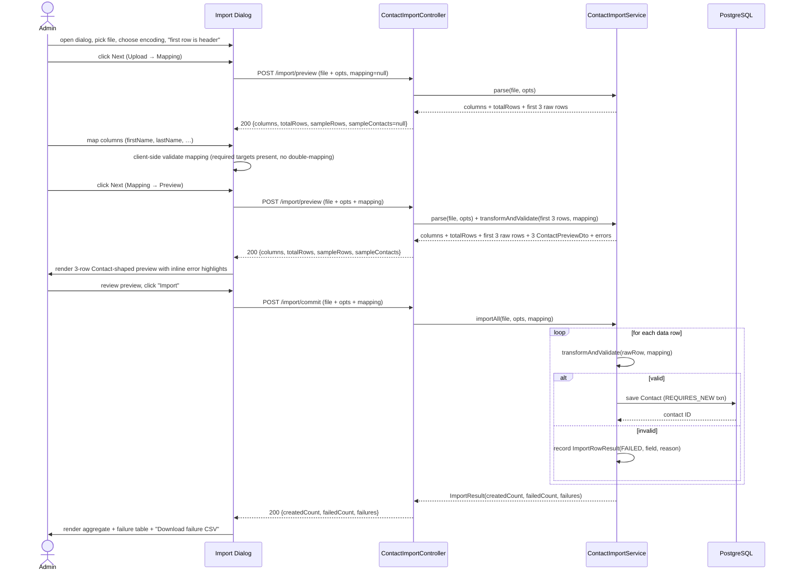

# CSV Import for Contacts

## GitHub Issue

[#39 — Add CSV import for contacts](https://github.com/OpenElementsLabs/open-crm/issues/39)

## Summary

Today contacts are created one-by-one through the UI or through the existing Brevo sync. When a
user comes back from a trade show, conference, or sales event with dozens of business-card scans
exported as a CSV, the only ingestion path is manual entry. This spec adds a CSV import flow that
lets `APP-ADMIN` and `IT-ADMIN` users upload a CSV file, map its columns onto a fixed set of
`ContactEntity` attributes, preview the first three rows, and commit a partial-success import that
reports per-row failures.

The shape of incoming CSVs is not fixed — different sources (a card-scan app, a LinkedIn export, a
hand-rolled spreadsheet) produce different column layouts. The feature is therefore built around a
**dynamic column-to-attribute mapping** UI rather than a fixed file schema. The example CSV that
motivated the work (columns `Vorname, Nachname, Position, Firma, Land, Email, Typ, Owner, Notiz`)
is one of many possible inputs; columns the user does not map are dropped on import.

This is an intentionally minimal v1. Company resolution, tag mapping, deduplication, mapping
templates, asynchronous job handling, and other socials beyond LinkedIn/Website are explicit
follow-ups.

## Goals

- Provide a single multi-step dialog in the contacts view that walks an admin through upload →
  mapping → preview → commit → result.
- Accept CSV files up to 20 MB and up to 5 000 data rows, with comma- or semicolon-delimited
  values and a user-selected encoding.
- Let the user map any source column onto one of eight target attributes
  (`title, firstName, lastName, email, position, phoneNumber, linkedIn-URL, website-URL`),
  with `firstName` and `lastName` enforced as required mappings before the import can run.
- Persist successfully mapped rows as new `ContactEntity` rows via the existing
  `ContactService.save(...)` path — re-using the per-contact audit-log entry that already records
  who created the contact.
- Run the import synchronously; commit rows one by one with partial success so that a single
  invalid row does not block the rest of the file.
- Return a structured result with aggregate counts plus a per-failure list (row number, offending
  field, reason) and let the frontend offer a downloadable failure CSV for re-upload after
  correction.

## Non-goals

- **No deduplication.** `contacts.email` is not unique today and stays non-unique. The import does
  not check for matching emails in the database or within the file; every row that passes
  validation creates a new `ContactEntity`. Cleaning up duplicates is the user's responsibility.
- **No new database schema.** No `owner_id` column, no `source`/`type` column, no unique index on
  `email`. The latest migration stays `V33__add_audit_log_entity_name.sql`.
- **No Company or Tag mapping in v1.** A CSV's `Firma` / `Company` / `Tags` columns cannot be
  mapped to anything in v1 — they are dropped. Linking imported contacts to companies and tags is
  a follow-up.
- **No mapping templates.** Each import sets up its mapping from scratch. Saving a mapping under a
  name for reuse on the next import is deferred.
- **No file persistence.** The uploaded CSV is parsed in memory and discarded after the response
  is returned. No copy is written to disk, object storage, or the database; no retention window;
  no re-import-from-audit feature.
- **No bulk import audit entry.** The per-contact audit-log entries that
  `ContactService.save(...)` already produces are sufficient. No additional aggregated
  "import operation" row.
- **No asynchronous job, no progress polling, no SSE.** Synchronous request/response is
  intentional given the 5 000-row hard cap.
- **No `Owner` field per row.** The example CSV's `Owner` column is ignored on import; the
  importing user is the de-facto owner via the existing audit log.
- **No other socials than LinkedIn and Website.** GitHub, X, Mastodon, etc. are not exposed as
  mapping targets in v1, even though `SocialNetworkType` defines them.

## Intentional behavior changes

1. **A new "Import" button appears on the contacts list page** next to the existing CSV-export
   button, but only for users with `APP-ADMIN` or `IT-ADMIN`. Non-admin users see no button.
2. **A new `/api/contacts/import` URL space exists** with two endpoints (`/preview` and
   `/commit`). No existing routes change.
3. **A successful import commits each contact in its own transaction.** A failed row therefore
   does not roll back earlier rows. The per-row commit pattern is new for contacts (single-write
   endpoints today wrap the whole request in one transaction).
4. **Every imported contact emits the same audit-log entry that a manual create produces.** No
   new audit-log entity type is introduced.

## Technical approach

### Backend

A new package `com.openelements.crm.contact.csvimport` holds:

- `ContactImportController` — REST endpoints under `/api/contacts/import` (see API design).
- `ContactImportService` — parses, validates, and writes contacts row by row. Exposes one private
  package-level method `transformAndValidate(rawRow, mapping) → (ContactCreateDto, List<RowError>)`
  that is the **only** place where a `Map<String, String>` raw row becomes a
  `ContactCreateDto`. Both the preview endpoint (for the first three rows) and the commit
  endpoint (for every data row) call this method. No alternative transformation path exists.
- `CsvParseOptions` — record carrying user-chosen encoding (`Charset`) and an optional explicit
  delimiter (otherwise auto-detect).
- `ColumnMapping` — record carrying the `Map<String, ImportTarget>` from CSV column header (or
  generic `"Spalte N"`) to one of the eight `ImportTarget` enum values.
- `ImportTarget` — enum of the eight target attributes:
  `TITLE`, `FIRST_NAME`, `LAST_NAME`, `EMAIL`, `POSITION`, `PHONE_NUMBER`, `LINKEDIN_URL`,
  `WEBSITE_URL`. `FIRST_NAME` and `LAST_NAME` carry a `required = true` flag.
- `RowError` — record `(field, reason)` shared between preview and commit responses.
- `ContactPreviewDto` — record `(row, contact: ContactPreviewFields, errors: List<RowError>)`
  returned in the `sampleContacts` field of `/preview` when a mapping is supplied. `contact`
  carries the same eight target fields the importer can write to.
- `ImportRowResult` — record `(rowNumber, status, field, reason, contactId)` where `status` is
  `CREATED` or `FAILED`. Used in commit response only.
- `ImportResult` — record `(createdCount, failedCount, failures: List<ImportRowResult>)`.

Parsing uses the already-vendored `org.apache.commons.commons-csv:1.12.0`:

- The user-selected `Charset` (UTF-8 or Windows-1252 in v1, both exposed as `StandardCharsets`
  / `Charset.forName("windows-1252")`) wraps the multipart input stream.
- Delimiter detection: read the first non-empty line, count `,` vs `;` outside quoted regions;
  pick the higher count. Tie defaults to `,`. The result is fed into
  `CSVFormat.DEFAULT.builder().setDelimiter(c).setHeader(...).build()` (or the headerless variant
  if the user unchecked "first row is header").
- Header mode is controlled by the frontend via a request boolean. When `false`, column names are
  synthesized as `"Spalte 1", "Spalte 2", …` and used as mapping keys.

Validation per row:

1. **Required mappings present:** if no column maps to `FIRST_NAME` (or `LAST_NAME`), the import
   never reaches the row loop — the request is rejected with HTTP `400` and a structured error.
2. **Required values non-blank:** `firstName` and `lastName` cell values must be non-blank after
   trimming. Blank → `FAILED` with `field=firstName|lastName`, `reason=required`.
3. **Email syntax:** if mapped, the value is validated against Jakarta `@Email` semantics via the
   existing validator pipeline (`ContactCreateDto` already declares `@Email`). Failure → `FAILED`
   with `field=email`, `reason=invalid`.
4. **URL syntax for socials:** if `LINKEDIN_URL` / `WEBSITE_URL` is mapped, the value is accepted
   as-is and stored as `SocialLinkCreateDto(networkType, value)`; the existing URL normalization
   in `SocialLinkEntity` runs server-side as for the manual create path.
5. **Length limits:** the JPA `@Column(length = ...)` constraints on `ContactEntity` are
   pre-checked (`title ≤ 255`, `email ≤ 255`, `phoneNumber ≤ 50`, etc.). Overlong values → `FAILED`
   with `field=<name>`, `reason=too_long`.

Per-row commit:

- Each successful row is built into a `ContactCreateDto` and saved via
  `contactService.save(dto)` in its own `REQUIRES_NEW` transaction (a new
  `@Transactional(propagation = REQUIRES_NEW)` method on `ContactImportService`).
- Any exception escaping `save(...)` is caught, converted to `ImportRowResult(FAILED, ...)`, and
  the loop continues.
- The aggregated `ImportResult` is returned at the end. The response is sized to the failure list
  only (success rows carry no detail), so 5 000 successful rows produce a small response body.

Row cap is enforced before the row loop: the parser counts rows during the first pass and rejects
the request with HTTP `413` (Payload Too Large) and a structured error if the count exceeds 5 000.

### Authorization

`POST /api/contacts/import/preview` and `POST /api/contacts/import/commit` are gated by the
combination *App-Admin OR IT-Admin*. Since the existing `@RequiresAppAdmin` / `@RequiresItAdmin`
annotations both use `hasRole(...)` with a single role, this spec uses an inline
`@PreAuthorize("hasRole('APP-ADMIN') or hasRole('IT-ADMIN')")` on the controller class. A future
follow-up may introduce a combined `@RequiresAnyAdmin` annotation in spring-services; v1 does not.

### Frontend

A new component `frontend/src/components/csv-import-dialog.tsx` mirrors the structure of the
existing `csv-export-dialog.tsx`, but is a stateful multi-step wizard rather than a one-shot
form.

Steps:

1. **Upload.** File picker, encoding dropdown (default `UTF-8`, second option `Windows-1252`),
   "first row is header" checkbox (default checked), "Next" button disabled until a file is
   chosen.
2. **Mapping.** On "Next" from step 1, the frontend POSTs the file to `/preview` with
   `mapping=null`; the backend returns the detected column list, the auto-detected delimiter,
   the total row count, and the first three rows as raw `Map<String, String>` cells. The user
   sees one dropdown per source column, listing the eight `ImportTarget` values plus an
   "ignore" sentinel. The "Next" button is disabled until both `FIRST_NAME` and `LAST_NAME` are
   mapped exactly once and no target is mapped twice.
3. **Preview.** On "Next" from step 2, the frontend POSTs the file *again* to `/preview`, this
   time with the chosen `mapping` set. The backend re-parses the file (no copy is kept between
   calls), runs the **same** `transformRow(...)` / `validateRow(...)` code path that `/commit`
   uses, and returns the first three rows as `ContactPreviewDto` objects plus their per-field
   validation results. The frontend renders the three Contact-shaped previews with invalid
   fields highlighted inline. The user can go back to step 2 or confirm.
4. **Result.** Confirm triggers a POST to `/commit` with the same file plus the chosen mapping.
   The response renders as: header line `"52 created, 3 failed"`, a table of the failed rows
   (`row, field, reason`), and a "Download failure CSV" button. The dialog closes on user
   click; the contacts list reloads.

**Single source of truth for transformation and validation.** The frontend never transforms a
CSV row into a `Contact`-shaped object on its own. Step 3's preview is rendered from the
**backend's** transformation output, computed by the same code that `/commit` runs. The
backend exposes a private package-level method `transformAndValidate(rawRow, mapping)`
returning `(contactCreateDto, List<RowError>)`, called once per row in both endpoints. This
guarantees that a row which passes the preview cannot fail in commit for a transformation-
or validation-related reason (database/infrastructure failures excepted), and vice versa.

The dialog is opened by a new "Import" button placed in the contacts toolbar next to the existing
"Export" button (`contacts-client.tsx` around line 165). The button is rendered only if
`session.roles` includes `APP-ADMIN` or `IT-ADMIN`.

i18n keys go into `frontend/src/lib/i18n/{de,en}.ts` under a new `csvImport` namespace mirroring
the existing `csvExport` namespace (`button`, `dialog.*`, `steps.*`, `mapping.*`, `result.*`).

### Failure CSV format

The downloadable failure CSV is generated client-side from the JSON response of `/commit`. It
mirrors the structure the user originally uploaded (same column headers, same encoding choice)
and contains only the failed rows, plus two trailing columns `_error_field` and `_error_reason`
appended on the right. The user can correct the rows and re-upload the resulting file. The file
is generated in the browser; no server endpoint is added for it.

## API design

Both endpoints require `APP-ADMIN` or `IT-ADMIN`. Both expect `multipart/form-data` with a `file`
part plus a `request` JSON part.

### `POST /api/contacts/import/preview`

This endpoint is called **twice** during a single import flow: once after the upload step to
discover columns, and once after the user has set up the mapping to render a transformed
preview. Both calls go to the same endpoint; the difference is whether `mapping` is supplied.

Request parts:

- `file`: the CSV bytes.
- `request`: JSON body. The `mapping` field is optional.
  ```json
  {
    "encoding": "UTF-8",
    "hasHeader": true,
    "mapping": null
  }
  ```
  or, after the user has chosen a mapping:
  ```json
  {
    "encoding": "UTF-8",
    "hasHeader": true,
    "mapping": {
      "Vorname": "FIRST_NAME",
      "Nachname": "LAST_NAME",
      "Email": "EMAIL",
      "Position": "POSITION"
    }
  }
  ```

Response `200` — call **without** mapping (column-discovery call):

```json
{
  "delimiter": ",",
  "columns": ["Vorname", "Nachname", "Email", "Typ", "Owner"],
  "totalRows": 55,
  "sampleRows": [
    {"Vorname": "Holger", "Nachname": "Dyroff", "Email": "dyroff@b1-systems.de", "Typ": "scan", "Owner": "Hendrik Ebbers"},
    {"Vorname": "Sandra", "Nachname": "Parsick", "Email": "sandra@open-elements.com", "Typ": "scan", "Owner": "Sebastian Tiemann"},
    {"Vorname": "Sebastian", "Nachname": "Tiemann", "Email": "sebastian@open-elements.com", "Typ": "scan", "Owner": "Sebastian Tiemann"}
  ],
  "sampleContacts": null
}
```

Response `200` — call **with** mapping (transformed-preview call):

```json
{
  "delimiter": ",",
  "columns": ["Vorname", "Nachname", "Email", "Typ", "Owner"],
  "totalRows": 55,
  "sampleRows": [
    {"Vorname": "Holger", "Nachname": "Dyroff", "Email": "dyroff@b1-systems.de", "Typ": "scan", "Owner": "Hendrik Ebbers"},
    {"Vorname": "Sandra", "Nachname": "Parsick", "Email": "sandra@open-elements.com", "Typ": "scan", "Owner": "Sebastian Tiemann"},
    {"Vorname": "Sebastian", "Nachname": "Tiemann", "Email": "sebastian@open-elements.com", "Typ": "scan", "Owner": "Sebastian Tiemann"}
  ],
  "sampleContacts": [
    {
      "row": 1,
      "contact": {"firstName": "Holger", "lastName": "Dyroff", "email": "dyroff@b1-systems.de", "position": null, "title": null, "phoneNumber": null, "linkedInUrl": null, "websiteUrl": null},
      "errors": []
    },
    {
      "row": 2,
      "contact": {"firstName": "Sandra", "lastName": "Parsick", "email": "sandra@open-elements.com", "position": null, "title": null, "phoneNumber": null, "linkedInUrl": null, "websiteUrl": null},
      "errors": []
    },
    {
      "row": 3,
      "contact": {"firstName": "Sebastian", "lastName": "Tiemann", "email": "not-an-email", "position": null, "title": null, "phoneNumber": null, "linkedInUrl": null, "websiteUrl": null},
      "errors": [{"field": "email", "reason": "invalid"}]
    }
  ]
}
```

`sampleContacts` is produced by feeding each of the first three raw rows through the same
`transformAndValidate(rawRow, mapping)` method that the `/commit` row loop uses. There is no
client-side transformation. `sampleContacts.length` equals `min(3, totalRows)`.

Errors:

- `400` — file unreadable in the chosen encoding, or no rows present, or parser failure on the
  header line, or `mapping` is non-null but invalid (required target missing, target mapped
  twice, target value not in the `ImportTarget` enum, mapping references an unknown column
  name). Body: `{ "error": "...", "detail": "..." }`.
- `413` — `totalRows > 5000` or file size > 20 MB.
- `415` — encoding not supported (anything other than the two whitelisted ones).
- `403` — caller lacks both roles.

### `POST /api/contacts/import/commit`

Request parts:

- `file`: the CSV bytes (re-uploaded; the backend does not retain the preview file).
- `request`: JSON body
  ```json
  {
    "encoding": "UTF-8",
    "hasHeader": true,
    "mapping": {
      "Vorname": "FIRST_NAME",
      "Nachname": "LAST_NAME",
      "Email": "EMAIL",
      "Position": "POSITION"
    }
  }
  ```

Response `200`:

```json
{
  "createdCount": 52,
  "failedCount": 3,
  "failures": [
    {"row": 17, "field": "lastName", "reason": "required"},
    {"row": 23, "field": "email",    "reason": "invalid"},
    {"row": 41, "field": null,       "reason": "malformed_row"}
  ]
}
```

Errors:

- `400` — required target `FIRST_NAME` or `LAST_NAME` is missing from the mapping; or a target is
  mapped twice. Body identifies the problem.
- `413` — `totalRows > 5000` or file > 20 MB (re-checked).
- `415` — encoding not supported.
- `403` — caller lacks both roles.
- `500` — only for non-row-level failures (e.g. database down before the first row commit). A
  row-level exception does **not** produce a 500; it becomes a `FAILED` entry in the response.

## Data model

No schema changes. No new entity, no new column, no new index, no new migration. The latest
migration remains `V33`.

The existing `ContactEntity` columns relevant here:

| Column / Target                                       | Source CSV target | Notes                                                            |
|-------------------------------------------------------|-------------------|------------------------------------------------------------------|
| `title`                                               | `TITLE`           | optional, ≤ 255 chars                                            |
| `first_name`                                          | `FIRST_NAME`      | required, ≤ 255 chars                                            |
| `last_name`                                           | `LAST_NAME`       | required, ≤ 255 chars                                            |
| `email`                                               | `EMAIL`           | optional, ≤ 255 chars, syntax-checked                            |
| `position`                                            | `POSITION`        | optional, ≤ 255 chars                                            |
| `phone_number`                                        | `PHONE_NUMBER`    | optional, ≤ 50 chars                                             |
| `contact_social_links` (`network_type=LINKEDIN`)      | `LINKEDIN_URL`    | one `SocialLinkEntity` row per contact if mapped and non-blank   |
| `contact_social_links` (`network_type=WEBSITE`)       | `WEBSITE_URL`     | one `SocialLinkEntity` row per contact if mapped and non-blank   |

All other `ContactEntity` columns (`gender`, `birthday`, `language`, `description`,
`receives_newsletter`, `company_id`, `brevo_id`, `photo`, etc.) are left at their default values
on import.

## Key flows



## Dependencies

- `org.apache.commons:commons-csv:1.12.0` — already in `backend/pom.xml`. No new dependency.
- `com.openelements.spring.base.security.roles.*` — already used elsewhere in the codebase.
- No new frontend dependency. The failure-CSV generation uses standard `Blob` / `URL.createObjectURL`.

## Security considerations

- **RBAC.** Both endpoints require `APP-ADMIN` or `IT-ADMIN`. Verified at the controller level via
  `@PreAuthorize`. The frontend additionally hides the "Import" button for users without the role,
  but defence-in-depth lives on the backend.
- **Size limits.** 20 MB multipart cap (already enforced by Spring config from spec 106) plus a
  5 000-row hard cap inside `ContactImportService`. Rows are counted before the row loop so a
  malicious 4 GB CSV padded to look small never reaches the insert loop.
- **Encoding allowlist.** Only `UTF-8` and `Windows-1252` are accepted. Anything else is rejected
  with `415`. This avoids surprises from `UTF-16` / `GB18030` / etc. and keeps the dropdown
  honest.
- **Parser hardening.** `CSVFormat.DEFAULT.builder()` is used as the base; quoted fields with
  embedded delimiters are correctly handled. Malformed rows are caught per row and recorded as
  `FAILED` without aborting the import.
- **No SQL injection surface.** All writes go through JPA/Hibernate via `ContactService.save(...)`.
- **Audit.** Per-contact audit-log entries continue to be produced by `ContactService.save(...)`
  — no change.

## GDPR / DSGVO

The CSV will commonly contain personal data (names, business emails, phone numbers,
LinkedIn/website URLs). The design addresses GDPR concerns as follows:

- **Data minimization at the file layer.** The uploaded CSV is processed in memory and discarded
  at the end of the request. No copy is persisted to disk, object storage, the database, or
  application logs. Failed-row contents are returned to the calling browser only — once the
  response leaves the backend, the backend retains no copy.
- **Legal basis.** Out of scope for the application — the importing user is responsible for
  having a legal basis for processing the contacts they upload (Art. 6 DSGVO). The feature does
  not make a record of the legal basis; this is consistent with the existing manual-create flow.
- **Data subject rights.** Imported contacts are indistinguishable from manually created ones.
  Right-to-access, right-to-erasure, right-to-rectification, and portability work via the
  existing contact endpoints. Since no `import_batch_id` is stored, deleting an entire import as
  one unit is not possible — the user identifies the contacts to delete manually or via the
  per-contact audit-log entries (`createdBy = <importing user>, createdAt = within the import
  window`).
- **Retention.** The data inherits the existing `contacts` retention rules (none today; manual
  deletion only). The import does not introduce a new retention category.
- **Audit trail.** The existing per-contact audit-log row is the system's record that the contact
  came from this user at this time. No additional logging.

## Open questions

- **Internationalization of failure reasons.** `reason` strings in the response (`"required"`,
  `"invalid"`, `"too_long"`, `"malformed_row"`) are machine codes; the frontend maps them to
  localized strings via the i18n dictionary. The list of codes is locked at design time; new
  reasons added during implementation need a corresponding i18n key.
- **Mapping UI ergonomics for required fields.** The mapping screen disables the "Import" button
  until `FIRST_NAME` and `LAST_NAME` are both mapped exactly once. The exact placement of the
  validation hint (toast vs. inline vs. helper text) is an implementation detail and will be
  finalized during the frontend build.
- **Drag-and-drop on the upload step.** The export dialog uses a plain file picker; the import
  dialog will start the same way, with drag-and-drop as a possible polish step.
