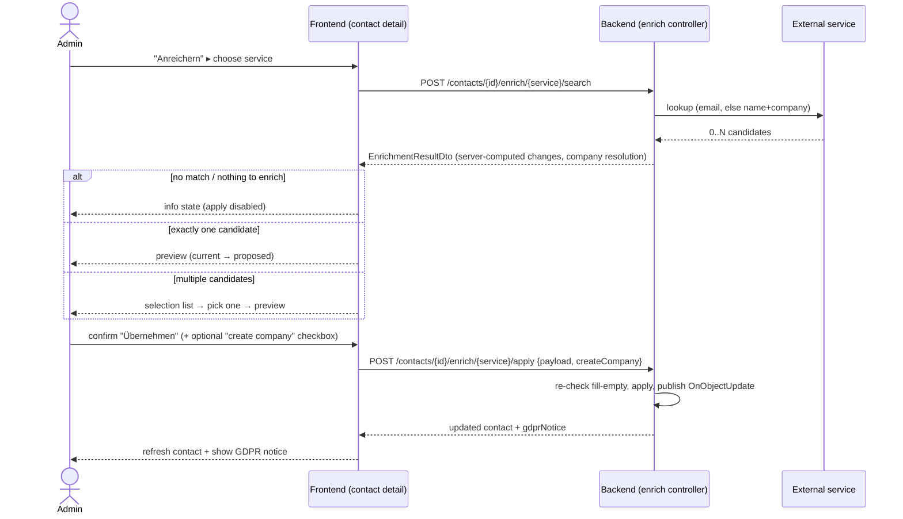

# Design: Contact Enrichment via Gravatar, Dropcontact & Cognism

**GitHub Issue:** _to be created (draft prepared in `/spec-create` session)_

## Summary

Contacts in the CRM are often incomplete — a frequent case is a contact without a photo, and
sometimes without an email, job position, LinkedIn link, or company association. This feature lets an
administrator **explicitly** enrich a single contact from one of three concrete external services and
**apply** the result only after reviewing a **preview**.

Three concrete integrations are built — **Gravatar**, **Dropcontact**, and **Cognism**. There is
deliberately **no generic provider abstraction/SPI**: each service has its own concrete client,
service class, DTOs, and endpoints. The only intentionally shared piece is the *frontend* enrichment
dialog (a presentation concern) and a small contact-domain helper that computes the "fill-empty" diff
and applies it — neither is a pluggable-provider framework.

Enrichment is a **read-only operation until the user explicitly confirms**. Nothing on the contact
changes before the user presses "Übernehmen". Only **empty** contact fields are ever filled; existing
values are never overwritten.

## Goals

- Let an admin enrich one contact at a time from Gravatar, Dropcontact, or Cognism.
- Always show a **preview** of the proposed field changes before anything is written.
- Apply changes **all-or-nothing** (one exception: creating a *new* company requires a separate opt-in checkbox).
- Fill **only empty** fields; never overwrite existing data.
- Add the **photo** for contacts that have none (Gravatar only).
- Keep the feature safe by default (admin-only, configured-gated, generic error handling, GDPR notice).

## Non-goals

- **No generic `ContactEnrichmentService` / provider SPI.** Concrete integrations only.
- **No bulk enrichment.** One contact, one service, one explicit action at a time.
- **No provenance persistence** in this step (which field came from which service/when) — see TODO backlog.
- **No automated GDPR data-subject notification** (Art. 14 info mail / reminders / flags) — see TODO backlog.
- **No lawful-basis automation.** The Legitimate-Interest-Assessment (Art. 6(1)(f)), the data-processing
  agreements (Art. 28) with Dropcontact/Cognism, and the actual Art. 14 information of data subjects are
  **operational/legal prerequisites outside the software**. ⚠️ This feature must not be switched on for
  Dropcontact/Cognism before those are in place.
- **No live verification of the Cognism API.** Cognism ships "configured-but-inactive" (see below).

## Actors & permissions

| Action | Who |
|--------|-----|
| Configure Dropcontact / Cognism API keys | **IT-Admin** (`@RequiresItAdmin`, mirrors Brevo settings) |
| Trigger an enrichment action on a contact | **APP-ADMIN or IT-ADMIN** |

There is no combined "app-or-it-admin" annotation in `spring-services` (only `@RequiresAppAdmin` /
`@RequiresItAdmin` exist). The enrichment action endpoints therefore use an explicit
`@PreAuthorize("hasRole('APP-ADMIN') or hasRole('IT-ADMIN')")`.

> **Frontend dependency:** the button is admin-gated in the UI via `hasRole(...)` from
> `@open-elements/nextjs-app-layer`. That library currently defines `ROLE_ADMIN = "ADMIN"` while the
> real role is `APP-ADMIN` (see issue `OpenElementsLabs/nextjs-app-layer#3`). The gating for this
> feature depends on that mismatch being fixed, otherwise the "Anreichern" menu never appears for real
> admins.

## The three services

| Service | Auth | Match input | Provides | Notably not |
|---------|------|-------------|----------|-------------|
| **Gravatar** | none (keyless) | email only | photo (avatar), and best-effort from public profile: position (`job_title`), company, social links | requires email → skipped if contact has no email |
| **Dropcontact** | API key (IT-admin) | email, else name+company | verified email, LinkedIn URL, company name, position; possibly phone | no photo |
| **Cognism** | API key (IT-admin) | email, else name+company | position, company name, phone, LinkedIn | no photo; ships configured-but-inactive |

### Field mapping (all subject to the fill-empty rule)

| Contact field | Gravatar | Dropcontact | Cognism |
|---------------|----------|-------------|---------|
| `photo` + `photoContentType` | ✅ avatar (only if contact has none) | — | — |
| `email` | — (email is the key) | ✅ | ✅ |
| `position` | ✅ (`job_title`, best-effort) | ✅ | ✅ |
| `phoneNumber` | — | ✅ (if provided) | ✅ |
| `socialLinks` (per network) | ✅ verified accounts | ✅ LinkedIn | ✅ LinkedIn |
| `company` (association) | ✅ (name → resolve) | ✅ (name → resolve) | ✅ (name → resolve) |

**Gravatar note:** the profile photo is guaranteed keyless via the avatar URL. Structured profile
fields (job title, company, verified accounts) are best-effort via Gravatar's public profile JSON; if a
field is absent it is simply not proposed. Richer/guaranteed profile data may later require a Gravatar
API key — tracked as an open question, not built now.

**Gravatar placeholder:** the implementation should request the avatar with `d=404` so a missing avatar
returns 404 rather than a generic mystery-person/identicon image (recommended, not mandatory). Even
without it, the human preview step is the backstop: the user visually rejects a placeholder.

## Matching & candidate flow

1. **Input selection:** match by **email** if the contact has one; otherwise by **name + company**.
   Without an email, **Gravatar is skipped** (Dropcontact/Cognism still run on name+company).
2. The external call returns **0..N candidates**:
   - **0 candidates** → `NO_MATCH` info state, no further action.
   - **exactly 1 candidate** (typical for email match) → skip the selection list, go straight to preview.
   - **> 1 candidate** → show a **selection list**; the user confirms exactly one, then sees the preview.
3. Candidate list shows **minimal identifying info** only (e.g. `Max Müller @ Firma X`). This is an
   accepted limitation: two identically-named people at the same company are indistinguishable and the
   user may pick wrong. Cost for revealing/listing candidates is accepted.
4. The **preview** for the chosen candidate shows the proposed changes (current → proposed) for
   **empty fields only**. If there is nothing to fill, it shows the same info state as `NO_MATCH`
   ("Nichts anzureichern – alle Felder bereits gefüllt") with the apply button disabled.

> ⚠️ **Accuracy risk (GDPR Art. 5(1)(d)):** name+company matching can attach the wrong person's data.
> This is consciously accepted for step 1 and mitigated only by the mandatory human confirmation.

## Merge / apply rules

- **Fill-empty only.** A field is proposed only if the contact's current value is empty. Existing
  values are **never** overwritten.
- **All-or-nothing.** The user accepts the whole proposed set at once; there is no per-field selection.
- **`socialLinks` are evaluated per network.** If the contact has a GitHub link but no LinkedIn and the
  service returns LinkedIn, LinkedIn is added; the existing GitHub link is untouched.
- **Company (the one exception to all-or-nothing):**
  - Resolve the returned company **name** against existing companies (case-insensitive name match).
  - **Match found** → link the contact to that existing company (part of the all-or-nothing set).
  - **No match** → offer a **checkbox** "Neue Firma «X» anlegen". Only if checked is a new company
    created and linked; if unchecked, `company` stays empty and the rest still applies.
- **Brevo-managed fields** (`firstName`, `lastName`, `email`, `language` on Brevo contacts, specs
  026/027) are protected implicitly: they are almost always already filled, so the fill-empty rule never
  touches them. No special-casing. (Implementation note: the apply path must not route through logic that
  rejects writes to Brevo-managed fields — since the enrichable fields effectively avoid them, this is a
  non-issue in practice.)

## API design

`{service}` ∈ `gravatar` | `dropcontact` | `cognism`. Endpoints are concrete per service (separate
controllers/services), but share a uniform URL shape.

### Settings (Dropcontact & Cognism only — Gravatar is keyless)

Mirrors the Brevo settings controller; class-level `@RequiresItAdmin`. Keys stored in
`SettingsDataService` under `dropcontact.api-key` / `cognism.api-key` (DB only, no env override).

| Method | Path | Body / Result |
|--------|------|---------------|
| `GET`  | `/api/{service}/settings` | → `{ configured: boolean }` |
| `PUT`  | `/api/{service}/settings` | `{ apiKey }` → validates key against the service, stores it, → `{ configured: true }`; `400` on invalid key |
| `DELETE` | `/api/{service}/settings` | → `204`, removes the key |

The frontend uses `GET /api/{service}/settings` to gate the menu entries (like the translate button
uses `GET /api/translate/settings`). Gravatar has no settings and is always available.

### Enrichment action (contact sub-resource)

`@PreAuthorize("hasRole('APP-ADMIN') or hasRole('IT-ADMIN')")` on both.

**1. Search — the (only) external call; may incur provider cost:**

```
POST /api/contacts/{id}/enrich/{service}/search
```
→ `EnrichmentResultDto`:
```jsonc
{
  "status": "MATCH" | "NO_MATCH",
  "candidates": [
    {
      "candidateId": "opaque-id",
      "label": "Max Müller @ Open Elements GmbH",
      "changes": [
        { "field": "position", "currentValue": null, "proposedValue": "CTO" },
        { "field": "socialLinks.LINKEDIN", "currentValue": null, "proposedValue": "https://linkedin.com/in/…" }
      ],
      "companyResolution": { "kind": "MATCHED" | "NEW" | "NONE", "companyId": "…", "companyName": "…" },
      "nothingToEnrich": false,
      "payload": { /* the service's raw enrichable values, echoed back on apply */ }
    }
  ]
}
```
- `changes` is computed **server-side** against the contact's current (empty) fields, so the preview is
  authoritative. For the single-candidate case this returns the preview immediately (one round-trip).
- `503` if the service is not configured (Dropcontact/Cognism) — should not happen because the menu is
  gated, but defended anyway.
- On any downstream failure (timeout, 5xx, invalid/expired key, quota exhausted) → **generic** error
  (`502`/`503`) with a generic message; **details only in server logs**.

**2. Apply — pure local write, no external call:**

```
POST /api/contacts/{id}/enrich/{service}/apply
```
body `EnrichmentApplyDto { payload, createCompany: boolean }` → re-validates the fill-empty rule against
the **current** contact state (guards against races), applies, publishes `OnObjectUpdate<ContactDto>`
(so audit/search/webhooks react), and returns:
```jsonc
{ "contact": { /* ContactDto */ }, "gdprNotice": "Basierend auf DSGVO-Recht muss …" }
```

**Rationale for echoing `payload` back on apply** (instead of server-side session state): keeps the API
stateless and avoids a cache/TTL. Since the action is admin-only and equivalent to a manual edit the
admin could perform anyway, and the server re-enforces fill-empty, accepting the echoed values is safe
for step 1.

## Data model

**No schema migration is required for step 1.** All enriched fields already exist on `ContactEntity`
(`email`, `position`, `phoneNumber`, `photo`/`photoContentType`, `socialLinks`, `company`). New company
creation reuses the existing company-creation path. The only persisted new state is two settings-table
keys (`dropcontact.api-key`, `cognism.api-key`) via `SettingsDataService`.

## Key flow



## Frontend / UX

- **Placement:** a single **"Anreichern" button with a dropdown menu** in the contact detail actions
  (`contact-detail.tsx`), visible only to admins.
  - Menu entries: **Gravatar** (always), **Dropcontact** and **Cognism** (only when their
    `GET /api/{service}/settings` reports `configured: true`).
- **Dialog states** (shared dialog component, reused across the three services):
  1. **Loading** while `/search` is in flight.
  2. **Selection list** (only when > 1 candidate) → user picks one.
  3. **Preview** — read-only list of `current → proposed` changes; if `companyResolution.kind == NEW`, a
     checkbox "Neue Firma «X» anlegen"; a single **"Übernehmen"** button (all-or-nothing).
  4. **Info state** — same visual for `NO_MATCH` and `nothingToEnrich`; apply disabled.
  5. **Error state** — generic message ("Anreicherung derzeit nicht möglich").
  6. **Success** — apply the change, refresh the contact view, and show the **GDPR notice**.
- **Styling / brand:** reuse existing shadcn/ui primitives and Open-Elements colors, consistent with the
  existing Translate dialog (specs 091/092). New i18n strings (DE/EN) for all labels, states, and the
  GDPR notice.
- **Admin settings page:** add Dropcontact and Cognism API-key panels mirroring the existing Brevo key
  panel (enter/replace/remove key, "configured" indicator).

## Dependencies

- **External:** Gravatar (avatar + public profile JSON), Dropcontact API, Cognism API.
- **Internal:** `SettingsDataService` (key storage), existing company-creation/lookup, `OnObjectUpdate`
  event pipeline (audit/search/webhooks), the contact photo storage (`EntityWithImage`), the frontend
  auth layer (`hasRole`), the Translate dialog pattern as UX precedent.
- **HTTP clients** follow the Brevo precedent: Spring `RestClient`, defensive rate-limit + retry
  (exponential backoff on 5xx/429).

## Security considerations

- Settings endpoints IT-admin only; enrichment actions APP-ADMIN/IT-ADMIN only.
- API keys stored via `SettingsDataService`, never returned to the client (only a `configured` boolean).
- Read-only until explicit apply; apply re-enforces fill-empty server-side.
- Generic error messages to the client; sensitive details (upstream status, key problems) only in server logs.

## GDPR (DSGVO)

- **Data minimization / accuracy:** only empty fields are filled; the mandatory human confirmation is the
  accuracy safeguard for name+company matches (residual wrong-match risk accepted, Art. 5(1)(d)).
- **Art. 14 information obligation:** after a successful apply the UI shows a notice reminding the admin
  that, per GDPR, the affected person may need to be informed that data was obtained from an external
  source. Automated notification is **out of scope** (TODO backlog).
- **Lawful basis (Art. 6(1)(f)) & DPAs (Art. 28):** operational/legal prerequisites outside the software
  for Dropcontact/Cognism. ⚠️ Must be in place before enabling those services in production.
- **Provenance (Art. 14(2)(f) source disclosure):** not persisted in step 1 (TODO backlog).

## Testing

- **Backend:** client/service/controller layer tests per Java-backend conventions. External HTTP is
  mocked (WireMock or a stubbed `RestClient`). Repository/integration tests on Postgres via Testcontainers
  (spec 103). Coverage ≥ 80%.
- **Gravatar & Dropcontact:** additionally verified manually against the real APIs with a real
  account/key during acceptance.
- **Cognism:** verified **only** against mocked responses (expected JSON) and shipped
  "configured-but-inactive"; the real Cognism API contract is verified later, when it is switched on.

## Open questions

- Does structured Gravatar profile data (job title, company, verified accounts) need a Gravatar API key
  to be reliable, or is the keyless public profile JSON sufficient? Photo is keyless regardless.
- Exact company name-matching normalization (legal-form suffixes like "GmbH", punctuation, casing) — how
  aggressive should the match be before offering "create new company"?
