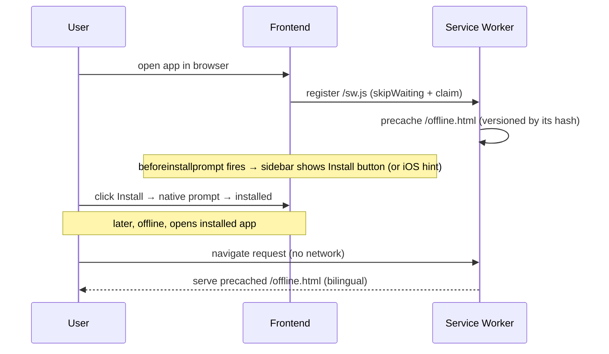

# Design: PWA Support (installable frontend)

**GitHub Issue:** _to be created (draft prepared in `/spec-create` session)_
**Source TODO:** `docs/TODO.md` → "Frontend mit PWA erweitern"

## Summary

Make the open-crm Next.js frontend **installable as a PWA** — its own window, an icon on the
homescreen/dock, no browser chrome. The goal is **installability / app-like launch only**; there is
**no real offline capability** for CRM data.

Everything is built in `open-crm` first, but the **generic pieces are isolated and documented as
extraction targets** for the shared libraries (`@open-elements/ui`, `@open-elements/nextjs-app-layer`).
The libraries are published npm packages (no local checkout in this repo), so "extraction" here means:
build the generic parts behind a clean, props-driven API in isolated files, so a later library release
can absorb them with minimal change. Until then they live in `open-crm`.

## Goals

- The app is installable on Chrome/Edge/Android and on desktop (Lighthouse installability green).
- Installed app launches standalone (own window, app icon, no address bar).
- A branded, bilingual **offline fallback page** is shown when the installed app is opened without network.
- After every deploy users get the **fresh** app (no stale cached app shell).
- An in-app **install affordance** (sidebar footer) on browsers that support it, plus an **iOS-Safari
  instruction hint**.
- Generic parts are cleanly separated and documented as library-extraction targets.

## Non-goals

- **No real offline** — CRM data is not available without network. Only a static offline page is cached.
- **No caching of app chunks, navigation HTML, API responses, or auth** — everything but the offline
  page is network-first / uncached.
- **No push notifications, background sync, or other advanced PWA capabilities.**
- **No actual library release** in this spec — generic code is isolated + documented, not published.
- **No persistent install-prompt dismissal** (no "don't show again").

## Actors

Any user of the frontend (authenticated). No role gating — installability is available to everyone.

## Technical approach

### Service worker (hand-written, minimal)

A hand-written service worker (no `next-pwa` / `serwist` dependency) with the smallest surface that
satisfies installability:

- **Precache exactly one file:** `/offline.html` (self-contained — inline CSS, embedded logo as
  data-URI/SVG, no external references). Nothing else is precached.
- **`fetch` handler scope:** handles **only navigation requests** (`request.mode === "navigate"`):
  network-first, and on a network error serves the precached `/offline.html`. **Everything else**
  (`/api/[...path]`, `/api/auth/*`, JS/CSS/images, OIDC redirects) is passed through to the network
  untouched — never intercepted, never cached.
- **Cache versioning:** the cache name carries a version derived from the **content hash of
  `offline.html`**. The cache is only refreshed when `offline.html` itself changes — not on every
  deploy. Because nothing else is cached, deploys always serve the fresh app.
- **Update lifecycle:** `self.skipWaiting()` + `clients.claim()` → a new SW activates immediately. This
  is safe because there is no app-shell cache that could flip mid-session; only the offline page is
  affected.

**Rationale:** the app explicitly does not want offline data. A hand-written SW is a few dozen lines,
carries no build-time magic or dependency, is trivial to unit-test, and is the cleanest thing to extract
into a library. `serwist`/`next-pwa` would add build integration and a precache-manifest we do not need.

### Offline page

`offline.html` is fully self-contained (inline CSS, embedded logo). It shows a **bilingual (DE + EN)**
"you are offline" message. Because it never references the app's hashed chunks, a deploy can never break
it (the classic precached-HTML-points-at-missing-asset problem cannot occur).

### Manifest & `<head>`

- Manifest generated via Next.js `app/manifest.ts` (`MetadataRoute.Manifest`), producing
  `/manifest.webmanifest`. Built from a generic `createManifest({...})` helper (see boundary below).
- `name` / `short_name` / `description` are **English** (single-language; the browser reads the manifest
  once at install time — no runtime i18n).
- `display: "standalone"`, `start_url: "/"`, `scope: "/"`.
- `theme_color` / `background_color`: **white** (`#ffffff`). App icon sits on the **green** brand
  background (`--color-oe-green` `#5cba9e`).
- `<head>` additions (manifest link, `apple-touch-icon`, `theme-color`, `appleWebApp`) via the app's own
  root-layout `metadata` export (Next.js Metadata API) — this composes with `OERootLayout` without
  changing the library.
- The SW is registered by a small client component rendered in the app layout.

### Icons

A **square brand mark is created** (the landscape logo centered on a brand background) and committed as
static assets in `public/`:
- `192×192`, `512×512`, a **maskable** variant (with safe-zone padding), `apple-touch-icon` (180×180),
  and a favicon.
- Background: green (`--color-oe-green`); mark centered.

### Install affordance

- **Install button** in the **sidebar footer**, shown **only** when the `beforeinstallprompt` event has
  fired (installable AND not yet installed). Clicking it triggers the saved native prompt.
- **iOS Safari** does not fire `beforeinstallprompt`. When running on iOS Safari and not already in
  standalone mode, the same sidebar-footer slot shows an **instruction hint** ("Teilen → Zum
  Home-Bildschirm" / "Share → Add to Home Screen") instead of the native-prompt button.
- **No persistent dismissal:** the affordance reappears **every session** while the app is not installed.
- "Installed" is detected via `display-mode: standalone` / `navigator.standalone` / the `appinstalled`
  event; when installed, the affordance is hidden.

## Generic vs. app-specific boundary

This is the core requirement. The split (confirmed in the grill):

| Piece | Home | Notes |
|-------|------|-------|
| SW registration client component | **`nextjs-app-layer`** | registers `/sw.js`; Next.js/client concern |
| Generic SW mechanism (navigation-only + offline fallback + versioning) | **`nextjs-app-layer`** | emitted to `/public/sw.js` at build (see below) |
| `createManifest({name, shortName, description, themeColor, backgroundColor, icons})` | **`nextjs-app-layer`** | app calls it from `app/manifest.ts` |
| Presentational install button / iOS-hint component | **`ui`** | props: `onInstall`, `visible`, `variant`, translation strings |
| `beforeinstallprompt` capture hook + iOS detection | **`ui`** | returns install state + `promptInstall()` |
| `buildOfflineHtml({appName, primaryColor, backgroundColor, logoSvg, messages})` generator | **`ui`** | returns a self-contained HTML string; **ships default DE/EN copy** |
| Concrete icons / square brand mark | **app (`open-crm`)** | committed in `public/` |
| `offline.html` branding (logo, colors, app name); overrides only branding | **app** | text defaults come from the `ui` generator |
| Concrete manifest values ("Open CRM", colors) | **app** | passed into `createManifest` |
| i18n strings, sidebar-footer placement | **app** | |

> **Important:** because the libs are published packages, none of the "generic" code is *physically*
> moved in this spec. It is written in isolated files inside `open-crm` with the exact API shape above,
> and this table is the extraction contract for a future library release.

## Build & deployment

`output: "standalone"` requires the PWA files to be present in `public/` at build time and copied into
the image (the Dockerfile already copies `public/`).

- **Icons:** generated once and **committed** as static files in `public/`.
- **`offline.html`:** **generated at build** by a prebuild script that calls `buildOfflineHtml(...)` with
  the app's branding — so it stays in sync when the `ui` template changes on a lib upgrade.
- **`sw.js`:** **generated at build** by the prebuild script (the generic SW code from the lib, with the
  `offline.html` content-hash injected as the cache version) → emitted to `/public/sw.js` at the stable
  root URL so it controls the whole origin.
- The prebuild script is wired into `pnpm build` (a `prebuild` npm script) so it runs inside the Docker
  build stage before `next build`.

```mermaid
flowchart LR
    A[prebuild script] -->|buildOfflineHtml(branding)| B[public/offline.html]
    A -->|generic SW + hash(offline.html)| C[public/sw.js]
    D[committed square icons] --> E[public/icons/*]
    B & C & E --> F[next build -- output: standalone]
    F --> G[Docker image copies public/]
```

## Key flow (install + offline)



## Security & GDPR

- **GDPR: uncritical.** The SW caches **no** personal/CRM data and no API/auth responses; no analytics or
  tracking is added. The offline page is static branding only.
- **Auth safety:** the SW never intercepts `/api/*`, `/api/auth/*`, or OIDC redirects; navigation is
  network-first so authenticated pages always come fresh from the server, and a logged-out navigation
  still hits the server (which redirects to login).

## Testing

- **Unit tests (CI):**
  - SW navigation logic: navigation request offline → returns `offline.html`; non-navigation request →
    passthrough (not intercepted); network success → network response (no caching).
  - `beforeinstallprompt` hook: captures the event, exposes install availability, `promptInstall()`
    triggers the saved prompt, hides when installed / on unsupported browsers; iOS detection returns the
    hint state.
- **Manual / Lighthouse:** Lighthouse installability check green; install verified on Chrome/Android and
  desktop; iOS-Safari hint appears; offline page renders when network is cut.

## Open questions

- None outstanding from the grill. (Exact icon artwork/padding for the maskable safe zone is a
  production-asset detail handled during implementation.)
