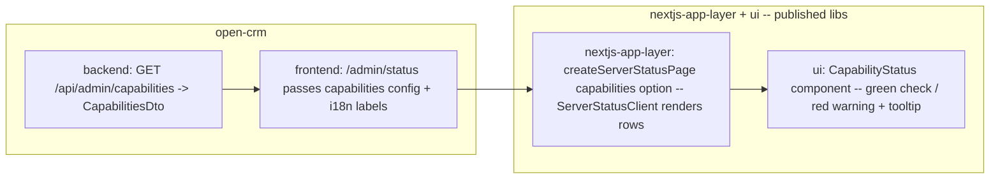

# Design: HEIC support status indicator in the admin area

**GitHub Issues:** _to be created — one for the library, one for open-crm (drafts prepared in the `/spec-create` session)_
**Source TODO:** `docs/TODO.md` → "HEIC-Support-Status im Admin-Bereich anzeigen"
**Prerequisite:** Spec 102 (HEIC & WebP image format support) must be merged.

## Summary

After a deploy, an operator has no easy way to tell whether HEIC decoding is actually available in the
running container (`libheif` / `libheif-plugin-libde265` present) — today the only signal is a startup
log line from `CrmHeicSupportCheck`. This feature surfaces that result in the admin area as a visual
status: a green indicator when HEIC decoding is available, and a red warning with a tooltip
("HEIC uploads will be rejected with 415 — check Dockerfile") when it is not.

**Decision (chosen by the user):** the indicator is added by **extending the shared library's admin
status page** (`createServerStatusPage` in `@open-elements/nextjs-app-layer`) with a **generic
capabilities mechanism**, rather than building a separate open-crm page. This keeps the familiar
`/admin/status` route and gives every Open-Elements app the same "runtime capabilities" panel. Because
the library is a published npm package (no local checkout in this repo), this spec spans **two repos**
and is sequenced accordingly.

## Goals

- On `/admin/status`, show a **HEIC-decoding** status row (green = available, red = unavailable + hint).
- Reflect the value the backend already computes at startup (`CrmHeicSupportCheck.isHeicAvailable()`).
- Build the capabilities mechanism **generically** in the library so it extends to future runtime
  capabilities (WebP, PDF rendering, …) without further library changes.
- IT-admin only (consistent with the existing status page).

## Non-goals

- **No live re-probing.** The indicator reflects the value determined **at startup**; `libheif`
  availability does not change during the container's lifetime.
- **No auto-remediation** — purely informational.
- **No new capabilities beyond HEIC** in this spec (WebP/PDF are future consumers of the same mechanism).
- **No change to the 415 upload behavior** from spec 102.

## Architecture & cross-repo scope

Three layers across two repos:



### Sequencing (important — library is published)

1. **Library PR + release** (`@open-elements/ui` + `@open-elements/nextjs-app-layer`): add the generic
   capabilities support, publish new versions.
2. **open-crm**: add the backend endpoint, bump the two lib versions, wire the status page config + i18n.

Until step 1 is released, open-crm cannot consume the new option. This is the same cross-repo pattern as
the `ROLE_ADMIN` fix (`OpenElementsLabs/nextjs-app-layer#3`).

## Library API contract

### `@open-elements/ui` — new `CapabilityStatus` component

A generic presentational status row (reuses the existing `Card` + `Tooltip` primitives; mirrors the look
of `HealthStatus`):

```ts
interface CapabilityStatusProps {
  readonly available: boolean;
  readonly label: string;          // e.g. "HEIC image decoding"
  readonly availableText: string;  // e.g. "Available"
  readonly unavailableText: string;// e.g. "Not available"
  readonly hint?: string;          // shown as a tooltip, esp. when unavailable
}
```

Rendering: a row with a **green check** icon when `available`, a **red warning** icon when not; the
`hint` (if present) is a tooltip on the row/icon. Brand colors: `--color-oe-green` (available),
`--color-oe-red` (unavailable). Fonts/spacing consistent with `HealthStatus`.

### `@open-elements/nextjs-app-layer` — extend `createServerStatusPage`

Current signature:
```ts
createServerStatusPage({ auth, homeRoute })
```
Extended (backwards-compatible — new field optional):
```ts
createServerStatusPage({
  auth,
  homeRoute,
  capabilities?: {
    endpoint: string;                 // e.g. "/api/admin/capabilities"
    items: ReadonlyArray<{
      id: string;                     // matches a key returned by the endpoint
      label: string;
      availableText: string;
      unavailableText: string;
      hint?: string;
    }>;
  };
})
```

`ServerStatusClient` behavior:
- Still fetches `/api/health` and renders `HealthStatus` (unchanged).
- If `capabilities` is provided, additionally **client-side fetches** `capabilities.endpoint` (via the
  existing Next proxy, so the IT-admin session token is forwarded), receives a map/list of
  `{ id → available }`, and renders one `CapabilityStatus` row per configured `items` entry.
- If the capabilities fetch fails, the rows render as **unavailable** (fail-safe) — an operator should
  not see a false "available".

**Rationale for client-side fetch + app-supplied labels:** keeps consistency with the existing
health fetch, keeps the library app-agnostic (it knows nothing about "HEIC" — only generic ids +
display strings the app passes in), and keeps all serializable strings flowing from app → lib. This is
the generic "optional-features panel" the TODO envisioned.

## Backend (open-crm)

New endpoint, following the `BackupAdminController` precedent:

```
GET /api/admin/capabilities
```
- `@RequiresItAdmin`, `@SecurityRequirement(name = "oidc")`, always HTTP 200.
- Returns `CapabilitiesDto`:
  ```java
  record CapabilitiesDto(boolean heicAvailable) {}
  ```
  (extensible: future `webpAvailable`, `pdfRenderingAvailable`, …)
- Reads `CrmHeicSupportCheck.isHeicAvailable()` (already a `@Component` with a `volatile` cached value).
- Lives in a small `CapabilitiesAdminController` (package `com.openelements.crm.admin` or `contact`;
  final placement per code conventions).

**Rationale:** the value is already computed and cached at startup; the endpoint is a thin read. No DB,
no migration.

## Frontend (open-crm)

- `frontend/src/app/(app)/admin/status/page.tsx` changes from:
  ```tsx
  export default createServerStatusPage({ auth });
  ```
  to passing the capabilities config with i18n-resolved strings, e.g.:
  ```tsx
  export default createServerStatusPage({
    auth,
    capabilities: {
      endpoint: "/api/admin/capabilities",
      items: [{
        id: "heicAvailable",
        label: t.admin.capabilities.heic.label,
        availableText: t.admin.capabilities.heic.available,
        unavailableText: t.admin.capabilities.heic.unavailable,
        hint: t.admin.capabilities.heic.hint, // "HEIC uploads will be rejected with 415 — check Dockerfile"
      }],
    },
  });
  ```
  (exact i18n access from a server component follows the existing app pattern.)
- New i18n keys under `admin.capabilities.heic` in `de.ts` / `en.ts`.
- No nav change — the row appears on the existing `/admin/status` page.

## Generic vs. app-specific boundary

| Piece | Home |
|-------|------|
| `CapabilityStatus` presentational component (check/warning + tooltip) | **`ui`** |
| `createServerStatusPage` capabilities option + generic row rendering + fail-safe | **`nextjs-app-layer`** |
| `GET /api/admin/capabilities` + `CapabilitiesDto` (concrete: `heicAvailable`) | **app (open-crm)** |
| Concrete capability ids, labels, hint text, i18n | **app (open-crm)** |

## Security

- Endpoint and status page are **IT-admin only** (`@RequiresItAdmin` / `ROLE_IT_ADMIN`), same as today.
- The response exposes only boolean capability flags — no sensitive data.

## Testing

- **Backend:** controller test for `GET /api/admin/capabilities` — returns `heicAvailable` reflecting the
  bean; 403 for non-IT-admin. (Unit-level; the bean's probe itself is spec 102's concern.)
- **Frontend / library:** unit test the `CapabilityStatus` component (available vs unavailable rendering,
  tooltip presence) and the `ServerStatusClient` capabilities logic (renders rows from fetched data;
  fail-safe → unavailable on fetch error). Library tests live in the library repo.
- **Manual:** deploy with and without `libheif`; confirm the row flips green/red and the tooltip shows
  the Dockerfile hint.

## Open questions

- Final package/naming for the backend controller (`admin` vs `contact` package).
- Whether to seed the mechanism with WebP immediately as a second row (currently a future consumer;
  kept out of scope to keep this spec small).
