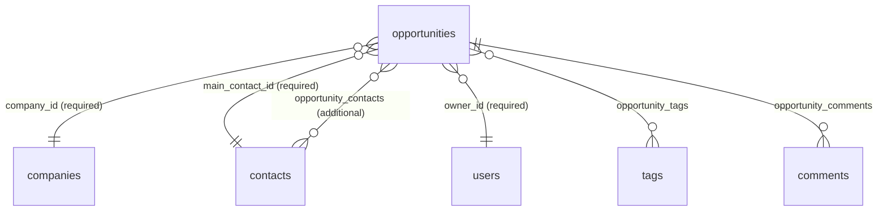

# Design: Opportunity (Deal) — Backend

## GitHub Issue

*To be created — issue draft exists; number will be added here once the issue is on GitHub.*

## Summary

Open CRM gets a new **Opportunity** entity representing one concrete sales opportunity ("Deal") — e.g.
"Muster-Bank – CRA Support & Care". An opportunity is linked to exactly one company (required), exactly one
main contact (required), and 0–N additional contacts. It carries the standard sales fields: title, pipeline
stage, product/offering, an optional estimated value in EUR, a status, and a responsible owner (user).

This spec covers the **backend only**: entity, Flyway migration, CRUD REST API, tags, comments, delete-blocking
rules on company/contact, and integration into the global search, the updates feed, and the MCP tools. The
frontend is spec `114-opportunity-frontend`. CSV export, print view, Kanban integration, and
anonymization-based deletion are explicitly deferred (see `docs/TODO.md`).

## Goals

- `Opportunity` entity following the established Company/Contact pattern (`AbstractEntity`,
  `EntityRepository`, `AbstractDbBackedDataService`, DTO records, OpenAPI-documented controller).
- Tags and comments on opportunities, wired exactly like companies and contacts.
- Opportunities appear in the Meilisearch global search, the updates feed, and as read-only MCP tools.
- Deleting a company or a contact that an opportunity depends on is blocked.
- A reduced user-list endpoint so any authenticated user can pick an owner.

## Non-goals

- Frontend UI (spec 114).
- CSV export and print view for opportunities (TODO entry).
- Kanban integration — no external Kanban ID field, no guaranteed webhook events (TODO entry; own issue).
- Anonymization instead of hard delete (TODO entry; **must land before production go-live**).
- Forecast aggregation/reporting over estimated values.
- Multi-currency support — values are implicitly EUR.

## Key design decisions

| Decision | Choice | Rationale |
|---|---|---|
| `stage` type | **Free-text string, nullable** — no enum, backend accepts any value | The external Kanban app will later supply the stage values; a hard-coded enum would have to change with every Kanban configuration. The current value list (Lead, Erstkontakt, Qualifiziert, Angebot, Gewonnen, Verloren) lives only in the frontend combobox. |
| `status` type | **Fixed enum `OPEN` / `WON` / `LOST`, required, default `OPEN`** | The status value set is stable and drives future reporting. It is *not* derived from the stage — stage and status are independent fields, both manually maintained until Kanban takes over. Contradictory combinations (stage "Gewonnen", status `OPEN`) are accepted by design. |
| `product` type | **Free-text string, nullable** | Consistent with `stage`: the offering list (currently "Support & Care", "Digital Trust") will grow as the company evolves; a code-level enum would require a release per new offering. The frontend offers the current values as combobox suggestions. |
| `estimatedValue` | **`NUMERIC(12,2)`, `BigDecimal`, `>= 0`, nullable, implicitly EUR** | First monetary field in the codebase; sets the precedent. Two decimal places suffice for forecasting; null means "no forecast". A currency column can be added later if ever needed. |
| Owner | **Required `@ManyToOne` to `UserEntity`, defaults to the current user on create** | First user-assignment on a business entity. Any user may be assigned as owner. Represented in the DTO as a nested `UserDto` (same convention as `CommentDto.author` and `UpdateEntryDto.user`). |
| Main contact | **Exactly one, required `@ManyToOne`** | Deliberate simplification of the ambiguous "Hauptkontakt(e)" requirement; additional contacts cover the N case. |
| Contact/company consistency | **Not validated in the backend** | Contacts linked to an opportunity may belong to a different company (or none). The frontend shows a non-blocking warning (spec 114). |
| Delete semantics | **Block company/main-contact deletion with `409 CONFLICT`; silently unlink additional contacts** | Interim rule until the anonymization spec lands. No veto pattern exists yet in the codebase; this introduces it explicitly in `CompanyService.delete` / `ContactService.delete`. |
| "Last activity" | **`updatedAt` from `AbstractEntity`** | Comments do not bump it; automatic timestamps are sufficient for follow-up tracking. |

## Data model



### Migration `V35__create_opportunities.sql`

```sql
CREATE TABLE opportunities (
    id              UUID PRIMARY KEY DEFAULT gen_random_uuid(),
    title           TEXT NOT NULL,
    stage           TEXT,
    status          VARCHAR(20) NOT NULL DEFAULT 'OPEN',
    product         TEXT,
    estimated_value NUMERIC(12,2) CHECK (estimated_value >= 0),
    company_id      UUID NOT NULL REFERENCES companies(id),
    main_contact_id UUID NOT NULL REFERENCES contacts(id),
    owner_id        UUID NOT NULL REFERENCES users(id),
    created_at      TIMESTAMPTZ NOT NULL DEFAULT now(),
    updated_at      TIMESTAMPTZ NOT NULL DEFAULT now()
);

CREATE TABLE opportunity_contacts (
    opportunity_id UUID NOT NULL REFERENCES opportunities(id) ON DELETE CASCADE,
    contact_id     UUID NOT NULL REFERENCES contacts(id) ON DELETE CASCADE,
    PRIMARY KEY (opportunity_id, contact_id)
);

CREATE TABLE opportunity_tags (
    opportunity_id UUID NOT NULL REFERENCES opportunities(id) ON DELETE CASCADE,
    tag_id         UUID NOT NULL REFERENCES tags(id) ON DELETE CASCADE,
    PRIMARY KEY (opportunity_id, tag_id)
);

CREATE TABLE opportunity_comments (
    comment_id     UUID PRIMARY KEY REFERENCES comments(id) ON DELETE CASCADE,
    opportunity_id UUID NOT NULL REFERENCES opportunities(id)
);
```

Notes:

- `company_id` and `main_contact_id` deliberately have **no** `ON DELETE` action — the default `RESTRICT`
  backs up the service-level 409 blocking rule at the DB level.
- `opportunity_contacts.contact_id ON DELETE CASCADE` implements "additional contacts are silently
  unlinked when the contact is deleted" at the DB level.
- `opportunity_comments` follows the per-owner comment join-table pattern from `V30__refactor_comments.sql`
  (`comment_id` as PK enforces one owner per comment).

### Entity

`com.openelements.crm.opportunity.OpportunityEntity` extends `AbstractEntity`:

- `title` (`String`, not null), `stage` (`String`, nullable), `product` (`String`, nullable)
- `status` (`OpportunityStatus` enum `OPEN`/`WON`/`LOST`, `@Enumerated(EnumType.STRING)`, not null)
- `estimatedValue` (`BigDecimal`, nullable, column `NUMERIC(12,2)`)
- `company` — `@ManyToOne(fetch = LAZY, optional = false)` → `CompanyEntity`
- `mainContact` — `@ManyToOne(fetch = LAZY, optional = false)` → `ContactEntity`
- `owner` — `@ManyToOne(fetch = LAZY, optional = false)` → `UserEntity`
- `additionalContacts` — `@ManyToMany` via `opportunity_contacts`
- `tags` — `@ManyToMany` via `opportunity_tags` with `@OnDelete(CASCADE)` (mirrors `CompanyEntity.tags`)
- `comments` — `@OneToMany(fetch = EAGER)` via `@JoinTable opportunity_comments` (mirrors
  `CompanyEntity.comments`)

## API design

Base path `/api/opportunities`, `@SecurityRequirement(name = "oidc")`, page serialization `VIA_DTO` as
everywhere else.

| Method & path | Purpose | Status codes |
|---|---|---|
| `GET /api/opportunities` | Paginated list; filters: `search` (title, case-insensitive contains), `status`, `stage`, `companyId`, `contactId` (main **or** additional), `ownerId`, `tagIds` | 200 |
| `GET /api/opportunities/{id}` | Single opportunity | 200, 404 |
| `POST /api/opportunities` | Create | 201, 400 |
| `PUT /api/opportunities/{id}` | Full update | 200, 400, 404 |
| `DELETE /api/opportunities/{id}` | Delete (removes its comments; join rows cascade) | 204, 403, 404 — `@RequiresAppAdmin` |
| `GET /api/opportunities/{id}/comments` | List comments | 200, 404 |
| `POST /api/opportunities/{id}/comments` | Add comment (author = current user, set by library) | 201, 400, 404 |
| `PUT /api/opportunities/{id}/comments/{commentId}` | Update comment | 200, 400, 404 |
| `DELETE /api/opportunities/{id}/comments/{commentId}` | Delete comment | 204, 403, 404 — `@RequiresAppAdmin` |
| `GET /api/users/options` | **New:** reduced user list (`id`, `name`, `avatarUrl`) for owner selection, any authenticated user | 200 |

### DTOs

`OpportunityDto` (record, `implements WithId`, all fields `@Schema`-annotated):

```java
public record OpportunityDto(
    UUID id, String title, String stage, OpportunityStatus status, String product,
    BigDecimal estimatedValue,
    UUID companyId, String companyName,          // id + denormalized name (ContactDto convention)
    UUID mainContactId, String mainContactName,
    List<UUID> additionalContactIds,
    UserDto owner,                                // nested, like CommentDto.author
    List<UUID> tagIds, long commentCount,
    Instant createdAt, Instant updatedAt) implements WithId {

    @NameSupplier
    public String displayName() { return title; }   // feeds audit log & updates feed
}
```

`OpportunityCreateDto` / `OpportunityUpdateDto` (records with Jakarta validation):

- `title` — `@NotBlank @Size(max = 255)`
- `stage`, `product` — nullable strings (`@Size(max = 255)`), **any value accepted**
- `status` — nullable in create (`null` → `OPEN`); `@NotNull` in update
- `estimatedValue` — nullable, `@PositiveOrZero @Digits(integer = 10, fraction = 2)`
- `companyId`, `mainContactId` — `@NotNull`
- `additionalContactIds`, `tagIds` — nullable lists (`null`/empty → none)
- `ownerId` — nullable in create (`null` → current user via `UserService.getCurrentUserEntity()`);
  `@NotNull` in update

Validation beyond annotations (service level, `400 Bad Request`):

- `mainContactId` contained in `additionalContactIds` → 400 ("main contact must not be listed as
  additional contact").
- Unknown `companyId` / `mainContactId` / `ownerId` / `additionalContactIds` / `tagIds` entries → 400
  (invalid reference in the payload; 404 is reserved for path IDs).

New user endpoint: `UserOptionDto(UUID id, String name, String avatarUrl)`. Rationale: `GET /api/users` is
IT-ADMIN-only (spec 089), but every user must be able to assign an owner. The reduced DTO exposes no email
and follows the precedent of the reduced MCP users view (spec 108). The SYSTEM-USER is excluded.

## Service layer

`OpportunityService extends AbstractDbBackedDataService<OpportunityEntity, OpportunityDto>` — inherits CRUD,
lifecycle events (`OnObjectCreate/Update/Delete` → audit log, search indexing, updates feed, webhooks) for
free. Implements the four template hooks plus:

- Comment methods (`addComment`, `updateComment`, `deleteComment`, `listComments`) mirroring
  `CompanyService`, including `assertCommentBelongsToOpportunity` (404 on cross-owner access) and the
  hand-rolled `recordCommentAudit` with `COMMENT_ENTITY_TYPE = "OpportunityComment"`.
- `delete` collects and deletes its comments first (pattern from `CompanyService.delete`), then
  `super.delete(...)` so lifecycle events fire.
- `countWithTag(UUID tagId)` for the tag list counts.
- `existsByCompany(UUID companyId)` / `existsByMainContact(UUID contactId)` for the blocking rules.
- List filtering via `JpaSpecificationExecutor` specifications (pattern from `ContactService`).

### Delete blocking (new veto pattern)

- `CompanyService.delete`: before deleting, if any opportunity references the company →
  `409 CONFLICT` ("Company is referenced by opportunities"). With `deleteContacts=true`, additionally
  blocked if any of the company's contacts is the main contact of **any** opportunity.
- `ContactService.delete`: if the contact is the main contact of any opportunity → `409 CONFLICT`.
  Additional-contact links do not block; the DB cascade removes the join rows.
- Rationale: no delete-veto pattern exists yet in the codebase; an explicit service-level check with a
  clear 409 message is simpler and more testable than the library's `Pre...DeleteEvent` listener mechanism,
  and the DB `RESTRICT` FKs guarantee integrity even if a code path is missed.

## Search integration

Following the checklist established by specs 104/105:

1. New index `opportunities` in `CrmIndexNames` + `IndexSettings` bean in `SearchConfiguration`
   (searchable: `title`, `stage`, `product`, `companyName`, `mainContactName`, `ownerName`, `tagNames`).
2. `OpportunitiesBootstrapStep` (`@Component @Order(...) implements SearchIndexBootstrapStep`).
3. `SearchIndexService`: `opportunityDocument(dto)` (fields above + `id`, `status`),
   `upsertOpportunity`, `deleteOpportunity`; extend `resolveCommentOwner` to also query
   `opportunity_comments` (owner label = opportunity title).
4. Dispatch branches for `OpportunityDto` in `SearchIndexEventListener` (upsert + delete).
5. `GlobalSearchResultDto` gets an `opportunities` section; `CrmSearchService` adds the multi-search
   query entry and an `opportunityHit` mapper.

## Updates feed

- Add `"OpportunityDto"` and `OpportunityService.COMMENT_ENTITY_TYPE` to
  `UpdatesService.RELEVANT_ENTITY_TYPES`.
- New `UpdateType` constants: `OPPORTUNITY_CREATED/UPDATED/DELETED`,
  `OPPORTUNITY_COMMENT_CREATED/UPDATED/DELETED`; extend `toUpdateType` and `resolveNames`
  (display name = opportunity title; no image).

## MCP tools

Extend `McpToolFactory` (read-only, same patterns as companies):

- `list_opportunities` — pagination + filters `search`, `status`, `stage`, `companyId`, `contactId`,
  `ownerId`, `tagIds`; returns `McpPage` of `OpportunityDto`.
- `get_opportunity` — by ID, `NoSuchElementException` → MCP not-found.
- `list_opportunity_comments` — in-memory pagination via `support.paginate(...)`.

## Tag counts

Extend the tag list/detail aggregation (`TagController`) with an opportunity count per tag via
`opportunityService.countWithTag`, alongside the existing company/contact counts. (Displaying the new
count column is part of spec 114.)

## GDPR (DSGVO) considerations

Opportunities link natural persons (contacts, owner) with sales-process data (stage, status, deal value).

- **Legal basis:** legitimate interest (Art. 6(1)(f)) — B2B sales-relationship management, same basis as
  the existing contact records. No new data categories about the persons themselves are stored; the
  opportunity fields describe the deal, not the person.
- **Data minimization:** contact linkage is by reference (UUID) only. The reduced `/api/users/options`
  endpoint exposes only `id`, `name`, `avatarUrl` — no email — to non-admin users.
- **Art. 17 erasure:** deleting a contact is now *blocked* while it is a main contact of an opportunity.
  Interim manual process for an erasure request: delete or re-assign the affected opportunities first,
  then delete the contact. **The anonymization spec (see `docs/TODO.md`) must land before the system goes
  into production operation** — this is a hard prerequisite decided in the grill session.
- **Employee activity transparency:** opportunity changes appear in the updates feed and audit log
  attributed to users; the owner field additionally attributes deals to employees. This is covered by the
  existing open TODO entry "GDPR-Abdeckung für Updates-View" (Betriebsvereinbarung / AV clause) — the
  owner assignment adds no new mechanism beyond what companies/contacts already have, but should be named
  in that same organizational measure.
- **Retention:** opportunities live as long as the business relationship; deletion is manual (admin).

## Testing

Layered tests per the Open Elements backend convention (Postgres via Testcontainers, spec 103):

- **Repository:** persistence round-trip, FK constraints (RESTRICT on company/main contact, cascades on
  join tables), spec-based filtering.
- **Service:** create defaults (status `OPEN`, owner = current user), validation rules
  (main-in-additional 400, invalid references 400), delete with comments, blocking rules in
  `CompanyService`/`ContactService`, `countWithTag`.
- **Controller:** full CRUD + comment endpoints with status codes, `@RequiresAppAdmin` on deletes,
  `/api/users/options` access for non-admin users.
- **Integration:** search indexing (bootstrap + event-driven), updates feed entries, MCP tool round-trips.

## Dependencies

- `spring-services` (current version) — `AbstractEntity`, `AbstractDbBackedDataService`, `CommentEntity`/
  `CommentService`, `TagEntity`, `UserEntity`/`UserService`, audit/event infrastructure, MCP support.
- Meilisearch sidecar (existing, specs 104/105).
- No new external dependencies.

## Open questions

- None — all design decisions were resolved in the grill session (2026-07-28). Deferred items are tracked
  in `docs/TODO.md` (CSV export & print view, Kanban integration, anonymization before go-live).
