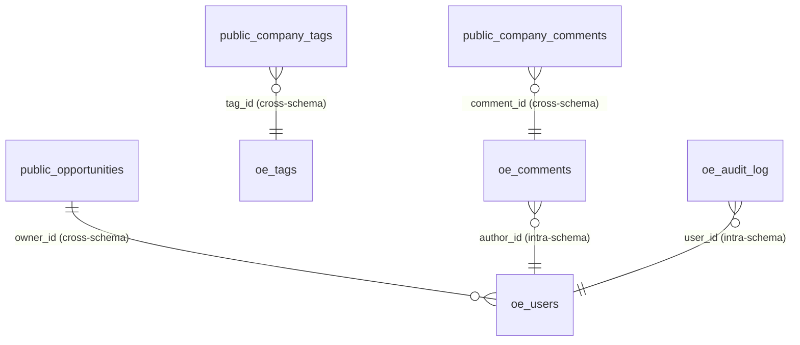
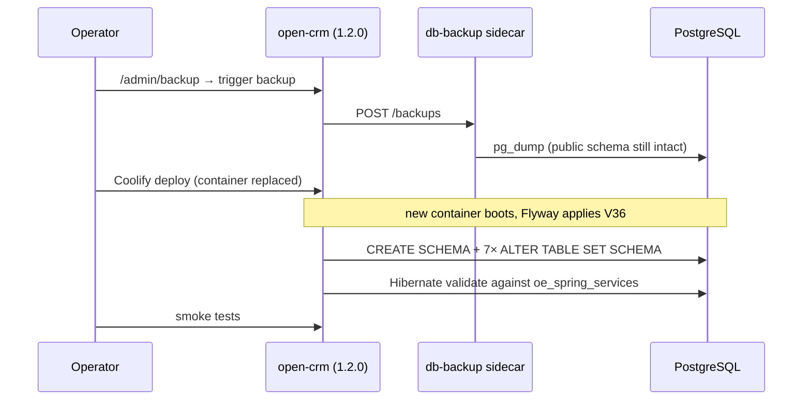

# Design: Dependency Updates (java-parent, spring-services, nextjs-app-layer)

## GitHub Issue

_To be created — see the drafted issue text at the end of this document._

## Summary

Three Open Elements dependencies of `open-crm` have newer releases. Two of them are routine version
bumps; the third, `com.open-elements:spring-services` 1.2.0 → 1.3.1, is a coordinate-breaking and
database-breaking release that turns the library into a Maven reactor and moves its seven tables into
a dedicated `oe_spring_services` PostgreSQL schema.

This spec covers all three updates in one change, sequenced so that the risky part sits in the middle
with a verified build on either side:

| # | Dependency | From | To | Nature |
|---|------------|------|----|--------|
| 1 | `com.open-elements:java-parent` | 1.0.0 | 1.2.1 | Build-only, inert for CI |
| 2 | `com.open-elements:spring-services` | 1.2.0 | 1.3.1 | Coordinate + schema break |
| 3 | `@open-elements/nextjs-app-layer` | 0.7.0 | 0.7.1 | Behavioural (session/OIDC) |

`@open-elements/ui` is already at the latest published version (0.9.0) and is not touched.

Note that `spring-services` **1.3.0 was never published to Maven Central** — only 1.3.1 exists. The
change therefore applies the full `upgrade-to-1.3.md` migration in one jump, followed by the no-op
1.3.1 delta.

## Goals

- Bring all three dependencies to their latest published releases.
- Move the seven `spring-services` tables into `oe_spring_services` without data loss.
- Keep the production deploy recoverable: a committed, rehearsed rollback path.
- Prevent the schema split from silently rotting: qualify library tables explicitly, and enforce that
  for future migrations with a guard test.

## Non-goals

- **Adopting `spring-services-mcp`.** CRM ships its own MCP implementation in the library's package;
  replacing it is a separate spec (see _Deferred_ below).
- **Upgrading anything else.** No Spring Boot, Testcontainers, `next`, `next-auth`, React, or
  `@open-elements/ui` bump rides along. `java-parent` 1.2.1 keeps `spring-boot.version` at 3.5.14 and
  `testcontainers.version` at 2.0.5, so nothing moves transitively either.
- **Running Spotless.** `java-parent` 1.2.1 pre-configures `spotless-maven-plugin` with
  `googleJavaFormat`, but binds no execution to a lifecycle phase. `mvn spotless:apply` would reformat
  the entire codebase into a style it does not currently use. It must not be run as part of this change.
- **Adding `<scm>` to `backend/pom.xml`.** The new `pomchecker-maven-plugin` runs only in the
  `full-build` profile, which neither CI (`./mvnw clean verify`) nor the Dockerfile
  (`./mvnw clean package -DskipTests -B`) activates.
- **Zero-downtime deployment.** Explicitly out of scope — see _Deployment_.

## Part 1 — `java-parent` 1.0.0 → 1.2.1

### What actually changes

A full POM diff of 1.0.0 against 1.2.1 shows every added plugin — `git-commit-id-maven-plugin`,
`pomchecker-maven-plugin`, the git metadata in the jar manifest — lives inside the `full-build`
profile, whose `defaultGoal` moved from `package` to `verify`. CI runs `./mvnw clean verify` without
that profile, and the backend Dockerfile runs `./mvnw clean package -DskipTests -B`. Neither activates
it, so none of the new machinery executes in this project.

Three things do reach the backend build:

1. `maven.compiler.parameters=true` is now a property rather than plugin configuration. The
   `-parameters` flag was briefly lost in 1.2.0 and restored in 1.2.1 — the sole reason 1.2.1 exists.
   Spring relies on it for constructor injection by name and for `@RequestParam`/`@PathVariable`
   binding without explicit names. Net effect versus 1.0.0: unchanged.
2. `spotless-maven-plugin` moved from `pluginManagement` into `<build><plugins>` with a
   `googleJavaFormat` configuration — but **without `<executions>`**, so no goal binds to a phase.
3. `springdoc` (2.8.17) and `jspecify` (1.0.0) joined `dependencyManagement`.

The parent also dropped its surefire `--add-opens` `argLine`. This is a non-event here:
`backend/pom.xml` already overrides surefire's `<argLine>` with `-Dnet.bytebuddy.experimental=true`,
and a child `<configuration>` element replaces the parent's rather than merging, so the backend has
been building without those `--add-opens` flags since before this change.

### Change

- `backend/pom.xml`: parent version `1.0.0` → `1.2.1`.
- Remove the `<springdoc.version>` property and the explicit `<version>` on the
  `springdoc-openapi-starter-webmvc-ui` dependency, inheriting 2.8.17 from the parent.

**Rationale for inheriting springdoc:** the parent manages exactly the version the backend pins today,
so the removal is a no-op now and keeps the two in step later. The trade-off — a future `java-parent`
bump can move springdoc without a visible diff in `backend/pom.xml` — is accepted; that is what a
managed parent is for.

## Part 2 — `spring-services` 1.2.0 → 1.3.1

### 2.1 Dependency coordinates

The bare `com.open-elements:spring-services` coordinate is now the reactor parent
(`packaging=pom`) and ships no classes. The upstream guide offers two paths; this spec takes **Path B**
(BOM + à la carte modules), and it is not a free choice.

**`spring-services-all` cannot be used here.** Unpacking `spring-services-mcp-1.3.1.jar` shows it
contains twelve classes in `com.openelements.spring.base.mcp` — `McpConfiguration`, `McpPage`,
`McpPaging`, `McpProperties`, `McpSecurityConfig`, `McpServerConfig`, `McpToolLogic`,
`McpToolProvider`, `McpTools`, `McpToolSupport`, `McpActorLabel`, `McpUnavailableException` — every
one of which **also exists** under `backend/src/main/java/com/openelements/spring/base/mcp/`. Spec 108
deliberately wrote CRM's MCP implementation into the library's package as an extraction target. Pulling
`spring-services-all` would place duplicate fully-qualified class names on the classpath, where
resolution order decides which wins. Path B lets us simply not take that module.

The modules CRM actually needs, derived from its imports:

| Package used by CRM | Module |
|---|---|
| `…base`, `…base.data`, `…base.data.image`, `…base.events`, `…base.security.*`, `…base.services.{user,comment,tag,audit,settings,apikey,webhook,translation}` | `spring-services-core` |
| `…base.services.search` | `spring-services-search` |
| `…base.services.dbbackup` | `spring-services-dbbackup` |
| `…base.mcp` | **CRM's own source** — no module |

`spring-services-slack` and `spring-services-email` are unused and are not added; this also drops
`slack-api-client` and `spring-boot-starter-mail` from the transitive classpath.

```xml
<dependencyManagement>
    <dependencies>
        <dependency>
            <groupId>com.open-elements</groupId>
            <artifactId>spring-services-bom</artifactId>
            <version>1.3.1</version>
            <type>pom</type>
            <scope>import</scope>
        </dependency>
    </dependencies>
</dependencyManagement>

<dependencies>
    <dependency>
        <groupId>com.open-elements</groupId>
        <artifactId>spring-services-core</artifactId>
    </dependency>
    <dependency>
        <groupId>com.open-elements</groupId>
        <artifactId>spring-services-search</artifactId>
    </dependency>
    <dependency>
        <groupId>com.open-elements</groupId>
        <artifactId>spring-services-dbbackup</artifactId>
    </dependency>
</dependencies>
```

Module versions come from the BOM only — no explicit `<version>` on the module dependencies.

### 2.2 Application wiring — starter-only

`spring-services-core` now registers
`com.openelements.spring.base.SpringServicesCoreAutoConfiguration` via
`META-INF/spring/org.springframework.boot.autoconfigure.AutoConfiguration.imports`. It is annotated
`@AutoConfigureBefore(HibernateJpaAutoConfiguration, JpaRepositoriesAutoConfiguration)`, imports
`FullSpringServiceConfig`, and carries a nested `PackageRegistrar` that adds the library's entity and
repository packages **additively** to Boot's default scan.

`CrmApplication` therefore sheds three annotations:

```java
// before
@EntityScan(basePackages = "com.openelements")
@EnableJpaRepositories(basePackages = "com.openelements")
@Import({FullSpringServiceConfig.class, McpConfiguration.class})

// after
@Import(McpConfiguration.class)
```

**`@Import(McpConfiguration.class)` stays.** That is CRM's own class, not the library's; nothing
auto-configures it.

**Rationale.** An explicit `@EntityScan` makes `EntityScanPackages` non-empty and suppresses Boot's
additive default scan, so leaving it in place would work only by coincidence of the shared
`com.openelements` root. Removing it lets the documented mechanism do the job. This is safe here
because a scan of the codebase confirms **no CRM JPA entity or repository lives outside
`com.openelements.crm`** — the only CRM code under `com.openelements.spring.base` is the MCP package,
which contains no entities and is wired by explicit `@Import`. It is also safe for tests: the backend
has exactly two `@SpringBootTest` usages and **no slice tests** (`@DataJpaTest`, `@WebMvcTest`, …),
which would have loaded a reduced auto-configuration set.

This cleanup is optional per the upstream guide, which warns against bundling cleanups into a risky
upgrade. It is taken deliberately, with the trade-off accepted: it widens the blast radius of a
boot-time wiring failure, which the rollback plan already covers.

`SearchAutoConfiguration` and `DbBackupAutoConfiguration` carry **no `@ConditionalOnProperty`** —
verified on the bytecode. Module presence alone activates them, so no new `enabled` flags are needed
and the existing `openelements.meilisearch.*` / `openelements.db-backup.*` configuration keeps working
unchanged. `FullSpringServiceConfig` in 1.3.x imports only the core configurations; the search and
db-backup configurations arrive through their modules' auto-configurations instead. CRM's
`SearchConfiguration` javadoc, which currently claims `FullSpringServiceConfig` activates the
Meilisearch lib, needs correcting.

The `LanguageConfig` → `TranslationConfig` rename has no impact: CRM never imported `LanguageConfig`
directly.

### 2.3 Data model — the schema move

All seven library entities now declare `@Table(schema = "oe_spring_services")` — verified on the
bytecode of `UserEntity`, `TagEntity`, `AuditLogEntity`, `CommentEntity`, `ApiKeyEntity`,
`SettingsEntity` and `WebhookEntity`. The library ships **no runtime migrations**; CRM's own Flyway
timeline created those tables (`V3`, `V7`, `V12`, `V16`, `V20`, `V22`, `V28`), so CRM must move them.

New migration `V36__move_spring_services_to_dedicated_schema.sql`:

```sql
CREATE SCHEMA IF NOT EXISTS oe_spring_services;

ALTER TABLE users     SET SCHEMA oe_spring_services;
ALTER TABLE api_keys  SET SCHEMA oe_spring_services;
ALTER TABLE audit_log SET SCHEMA oe_spring_services;
ALTER TABLE comments  SET SCHEMA oe_spring_services;
ALTER TABLE settings  SET SCHEMA oe_spring_services;
ALTER TABLE tags      SET SCHEMA oe_spring_services;
ALTER TABLE webhooks  SET SCHEMA oe_spring_services;
```

No conditional branching between "fresh" and "existing" databases is needed: on a fresh database
(CI, tests, dev) `V1`–`V35` create the tables in `public` first and `V36` then moves them, exactly as
in production. Every environment follows one path. PostgreSQL runs DDL transactionally and Flyway wraps
a migration in a transaction, so `V36` is atomic.

#### Cross-schema foreign keys

Eleven foreign keys point from CRM-owned tables into the moving tables:

| From (stays in `public`) | To (moves) | Migration |
|---|---|---|
| `company_tags.tag_id`, `contact_tags.tag_id` | `tags(id)` | V12 |
| `task_tags.tag_id` | `tags(id)` | V14 |
| `company_comments.comment_id`, `contact_comments.comment_id`, `task_comments.comment_id` | `comments(id)` | V30 |
| `audit_log.user_id`, `comments.author_id` | `users(id)` | V32 |
| `opportunities.owner_id` | `users(id)` | V35 |
| `opportunity_tags.tag_id` | `tags(id)` | V35 |
| `opportunity_comments.comment_id` | `comments(id)` | V35 |

`ALTER TABLE … SET SCHEMA` moves each table together with its constraints and indexes, and PostgreSQL
resolves foreign keys by object identity rather than by qualified name. All eleven constraints survive
the move intact and become cross-schema references. The CRM's own tables and join tables stay in
`public`; the library schema is library-owned and no CRM entity is pointed at it.



Flyway's own `flyway_schema_history` is unaffected: `spring.flyway` sets no `schemas` property, so the
history table stays in the connection's default schema (`public`).

`ddl-auto` is already `validate` in both `application.yml` and `application-test.yml`, which is the
required setting — under `update`/`create` Hibernate would create fresh empty tables in the new schema
and orphan the existing data. No configuration change is needed, but the value must not be touched.

The production role is the database owner (same role as in `docker-compose.yml`), so no separate
`CREATE SCHEMA` / `USAGE` grants are required.

### 2.4 Tests

Roughly ten test files reach library tables through `JdbcTemplate` with unqualified SQL, and
`AbstractDbTest.TABLES_TO_TRUNCATE` lists all seven unqualified. Every one of those references is
**explicitly schema-qualified** — `oe_spring_services.users`, `oe_spring_services.tags`, and so on.

**Rationale.** The alternative — setting `search_path` on the test datasource so existing SQL keeps
working — was rejected. It would hide the schema split exactly where developers write new SQL, produce
tests that pass under a configuration production does not use, and leave the next unqualified statement
undetected until deployment. Explicit qualification makes the library-owned schema visible at every
call site.

Affected files: `AbstractDbTest`, `OpportunityEndpointsIntegrationTest`, `OpportunityRepositoryTest`,
`OpportunityServiceTest`, `OpportunitySearchIntegrationTest`, `UpdatesServiceTest`,
`UpdatesControllerTest`, `AuditLogControllerTest`, `McpSecurityIntegrationTest`,
`McpEndpointIntegrationTest`.

A single `TRUNCATE TABLE` statement may name tables across two schemas, so the truncate stays one
statement.

#### Migration guard test

A new test enforces the convention for the future: it reads every file in
`backend/src/main/resources/db/migration`, and for any migration with **version > 35** fails if the SQL
references one of the seven library table names without the `oe_spring_services.` qualifier. `V1`–`V35`
are exempt — they legitimately created and manipulated those tables in `public` before the move.

**Rationale.** Without it, the failure mode of the schema split is a migration that runs green on a
fresh database (where `public` may still be on the `search_path`) and fails or silently targets the
wrong object later. The version boundary is the honest way to express "everything before the move is
history".

### 2.5 Local development note

`AbstractDbTest` starts its PostgreSQL container with `.withReuse(true)`. A reused container that has
already applied `V36` will fail Flyway validation if a developer checks out a pre-115 branch. The fix
is to remove the reused container; this belongs in the release note.

## Part 3 — `@open-elements/nextjs-app-layer` 0.7.0 → 0.7.1

No public API changed, but runtime behaviour does:

- The session cookie drops from the Auth.js default of 30 days to **8 hours**, with a rolling
  `updateAge` of 15 minutes. This is the point of the release: previously the cookie outlived the OIDC
  refresh token, so middleware reported "authenticated" while every proxied API call returned 401.
- Token refresh is clamped to `max(5, min(configuredSkew, tokenLifetime / 2))`, concurrent refreshes of
  the same refresh token share one token-endpoint call, discovery is cached for 10 minutes, and both
  HTTP calls use `AbortSignal.timeout()`. A 4xx sets `error: "RefreshTokenError"`; 5xx, network errors
  and timeouts keep the token and retry.
- `authorized()` now also rejects a session carrying `RefreshTokenError`, so a user with a dead refresh
  token is redirected to `/login` instead of landing in a shell whose API calls all 401.

### Change

- `frontend/package.json`: `@open-elements/nextjs-app-layer` `^0.7.0` → `^0.7.1`, `pnpm install` to
  update the lockfile (currently pinned at 0.7.0). No other dependency moves.
- `frontend/src/auth.ts` is **unchanged**: the 8-hour default is accepted deliberately. Users
  re-authenticate roughly once per working day, normally a silent Authentik SSO round-trip. Restoring a
  long-lived cookie would reinstate the defect this release fixes.
- **Verify Authentik's access-token lifetime** for the `open-crm` client. The client session poll
  defaults to 120 s; if the token lives less than two minutes, the browser will not notice expiry
  promptly. If so, pass `refetchInterval` (roughly half the lifetime, minimum ~15 s) through
  `OERootLayout` in `frontend/src/app/layout.tsx` — CRM has no app-level `SessionProvider` of its own.
  This fix is in scope for this spec, conditional on the finding.

CRM has no custom `jwt` or `authorized` callback and no manual refresh workaround, so there is nothing
to remove.

## Deployment

The upgrade is **stop-the-world** and not safe for rolling deploys against a shared database: the
instant `ALTER TABLE … SET SCHEMA` runs, `public.<table>` is gone and any still-running 1.2.0 instance
breaks. Coolify replaces the backend container outright rather than starting the new one alongside the
old, so the existing deploy model already satisfies this — but it must not be changed to a rolling
strategy for this release.



Order matters: the backup is taken through the running 1.2.0 application **before** the container is
replaced, so its dump reflects the pre-migration `public` layout — and, because it is a full-database
dump, it also carries a `flyway_schema_history` that is consistent with that layout.

### Rollback

If 1.3.1 fails to boot after `V36` has run:

1. Roll the app image back to 1.2.0 in Coolify.
2. Run `rollback.sql` from this spec folder: move the seven tables back to `public` and drop the empty
   `oe_spring_services` schema.
3. **Delete the `V36` row from `flyway_schema_history`.** Without this, the 1.2.0 jar — which has no
   `V36__*.sql` on its classpath — aborts at startup with "Detected applied migration not resolved
   locally".
4. Start 1.2.0 and re-run the smoke checks.

`rollback.sql` is a deliverable of this spec, committed alongside `design.md`, and is rehearsed on the
Coolify dev instance before the production deploy.

Restoring the pre-migration dump is the fallback of last resort, since it discards anything written
after the backup.

The dev rehearsal has a known limit: dev holds independent throwaway data, not a production copy, so
it validates the DDL and the rollback mechanics but not the migration's duration or behaviour against
production row counts.

## Verification

CI (`./mvnw clean verify` plus the frontend vitest run) covers compilation, the migration on a fresh
Testcontainers database, and the guard test. Production additionally needs a manual smoke pass, because
the failure modes of this change (missing beans, unqualified SQL, a schema the runtime role cannot
see) surface at runtime rather than at build time:

1. **Login** — OIDC round-trip against Authentik with the new 8-hour session.
2. **Search** — global search returns results, i.e. the Meilisearch bootstrap ran under the
   module-provided `SearchAutoConfiguration`.
3. **Comments** — create and read a comment (`oe_spring_services.comments` plus a cross-schema join
   table).
4. **Audit log** — the audit view lists entries and a new action is recorded.
5. **`/admin/backup`** — the page reports the sidecar healthy and lists backups.
6. **MCP** — the connector still answers; MCP is enabled in production and runs on CRM's local
   implementation, which the upgrade does not touch.
7. **Post-migration backup** — trigger a fresh backup *after* the migration and confirm the dump
   contains the seven `oe_spring_services` tables. The sidecar
   (`ghcr.io/openelementslabs/db-backup-service:0.1.1`) is configured with `DB_NAME`/`DB_USER`, which
   indicates a database-wide `pg_dump`, but this must be confirmed rather than assumed: a schema-scoped
   dump would silently stop backing up users, comments, tags and the audit log.

The db-backup sidecar is the one component besides the application that talks to the database directly;
nothing else (BI tool, cron script, import job) queries it.

## Security considerations

No change to authentication, authorisation or data exposure. Two indirect effects:

- The shorter session (8 h instead of 30 days) and the middleware's rejection of `RefreshTokenError`
  both **tighten** the frontend's security posture — a stale cookie no longer grants access to the app
  shell.
- Dropping `spring-services-slack` and `spring-services-email` removes `slack-api-client` and
  `spring-boot-starter-mail` from the transitive classpath, reducing unused attack surface.

## GDPR

No new personal data is collected, processed, or exposed. The seven tables — including `users`,
`comments` and `audit_log`, which hold personal data — change location, not content, retention, or
access path. Data subject rights and deletion behaviour are unaffected. The pre-migration dump created
via `/admin/backup` follows the existing backup retention policy and introduces no new copy outside it.

## Dependencies

- `com.open-elements:java-parent` 1.2.1, `spring-services-bom`/`-core`/`-search`/`-dbbackup` 1.3.1 —
  all verified present on Maven Central.
- `@open-elements/nextjs-app-layer` 0.7.1 — verified present on the npm registry.
- Upstream guides: `OpenElementsLabs/spring-services` → `docs/releases/upgrade-to-1.3.md` and
  `upgrade-to-1.3.1.md`; `OpenElementsLabs/nextjs-app-layer` → `docs/releases/upgrade-to-0.7.1.md`.

## Deferred

**Adopting `spring-services-mcp`.** The right end state is for CRM to consume the library's MCP module
and delete its twelve local copies. It is blocked: `McpImageLogic` (spec 109) exists only in CRM and is
not in the library jar, and any drift between the two copies must be reconciled first. Recorded in
`docs/TODO.md`.

Until then there is **no automated protection** against someone adding `spring-services-mcp` and
shadowing the local classes — no enforcer rule, no guard test. This is an accepted, deliberately short
window.

## Open questions

- Authentik's access-token lifetime for the `open-crm` client is unknown until checked; the outcome
  decides whether `refetchInterval` is passed to `OERootLayout`.
- Whether the db-backup sidecar's `pg_dump` is database-wide is inferred from its configuration and
  confirmed by the post-migration verification step, not before.

## Accepted trade-offs

- **One PR for all three parts.** Once `V36` has run in production, `git revert` is not a real revert
  for any part of the change, including the frontend bump — recovery always goes through
  `rollback.sql`. Bundling was chosen with that understood.
- **Starter-only wiring cleanup** rides along with a risky upgrade, against the upstream guide's
  "minimal change" advice. Justified by the verified absence of entities, repositories and test slices
  that could break, and covered by the rollback plan.

---

## Drafted GitHub issue

> **Title:** Update java-parent 1.2.1, spring-services 1.3.1 and nextjs-app-layer 0.7.1
>
> **Description**
>
> Three Open Elements dependencies have newer releases:
>
> - `com.open-elements:java-parent` 1.0.0 → 1.2.1 — build-only; all new plugins live in the
>   `full-build` profile, which this project does not activate. Also lets the backend inherit the
>   managed `springdoc` version.
> - `com.open-elements:spring-services` 1.2.0 → 1.3.1 — **breaking.** The bare coordinate is now a
>   reactor pom with no classes, and the seven library tables move into a dedicated
>   `oe_spring_services` schema. Requires a Flyway migration, a downtime window, and test changes.
>   (1.3.0 was never published; 1.2.0 → 1.3.1 is a single jump.)
> - `@open-elements/nextjs-app-layer` 0.7.0 → 0.7.1 — no API change, but the session drops from 30 days
>   to 8 hours and OIDC token refresh becomes clamped, de-duplicated and fail-soft.
>
> `@open-elements/ui` is already at the latest version (0.9.0).
>
> **Acceptance criteria**
>
> - [ ] `backend/pom.xml` uses `java-parent` 1.2.1 and inherits the springdoc version.
> - [ ] The backend depends on `spring-services-bom` 1.3.1 plus `-core`, `-search` and `-dbbackup`; the
>       bare `spring-services` coordinate is gone and `spring-services-mcp` is deliberately not added.
> - [ ] `CrmApplication` uses starter-only wiring (`@EntityScan`, `@EnableJpaRepositories` and
>       `@Import(FullSpringServiceConfig.class)` removed; `@Import(McpConfiguration.class)` kept).
> - [ ] Migration `V36` creates `oe_spring_services` and moves all seven library tables; all eleven
>       cross-schema foreign keys stay intact.
> - [ ] All test SQL against library tables is schema-qualified, and a guard test fails the build when a
>       migration with version > 35 references a library table unqualified.
> - [ ] `frontend/package.json` and the lockfile are on `@open-elements/nextjs-app-layer` 0.7.1.
> - [ ] `rollback.sql` is committed in the spec folder and rehearsed on Coolify dev.
> - [ ] A release note under `docs/releases/` documents the downtime window and the rollback procedure.
> - [ ] `./mvnw clean verify` and the frontend test suite pass.
