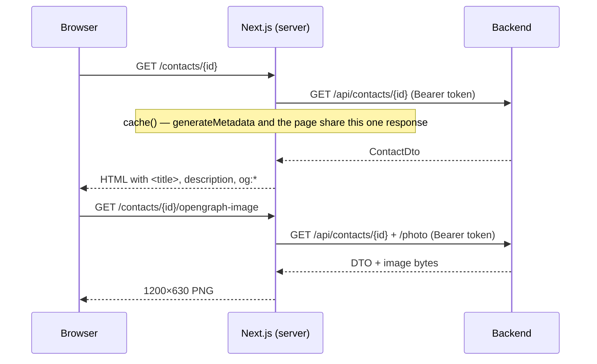

# Design: Per-page HTML metadata for contacts and companies

## GitHub Issue

_To be created — see the drafted issue text at the end of this document._

## Summary

Every page in Open CRM currently ships the same HTML metadata. `src/app/layout.tsx` sets
`title: "Open CRM"` and a generic description, and there is **no `generateMetadata` anywhere** under
`src/app/`. A browser tab, a bookmark, and a history entry for Max Mustermann's contact page are
therefore indistinguishable from the company list or the admin area.

This spec gives contact and company detail pages their own metadata: a document title
`Open CRM: Max Mustermann`, a `<meta name="description">` taken from the entity's free-text
description when one exists, and Open Graph / Twitter tags including a generated 1200×630 preview
image that frames the contact's photo or the company's logo in Open Elements branding.

## Scope decision: this is metadata hygiene, not crawler reach

The metadata is rendered **behind the existing authentication** and is not made reachable for
unauthenticated consumers. That is a deliberate boundary, and it is worth recording why, because
"Open Graph tags" normally implies the opposite.

`frontend/src/middleware.ts` protects every route except `api/auth`, `api/logout`, `login` and static
assets. Images are served through the `/api/[...path]` proxy, which attaches the OIDC access token,
and the backend contains no `permitAll` matcher at all. An unauthenticated fetch of
`/contacts/{id}` is redirected to `/login`.

Social-media crawlers (Slack, LinkedIn, WhatsApp, Signal, Teams) fetch without cookies, so they will
continue to see nothing — and that is the intended outcome. Making them see a preview would mean
serving a third party's name, photo, job position and free-text notes to an unauthenticated client,
which in a CRM is personal data requiring a legal basis under Art. 6 GDPR, over a URL that is
effectively public once shared.

The value being delivered is instead:

- **Browser tabs** — distinguishable when a user has several CRM records open side by side.
- **Bookmarks and history** — meaningful names instead of a wall of "Open CRM" entries.
- **Browser-native previews** — some browsers surface `og:image`/`og:title` in tab hover cards,
  history views, reading lists and new-tab tiles.
- **The installed PWA** (spec 111) — the window title follows the document title.
- **Print output** — browsers put the document title in the page header.

## Goals

- `Open CRM: <name>` as the document title on contact and company detail pages.
- The entity's description as `<meta name="description">` when one exists.
- Open Graph and Twitter card tags carrying the same title, description and a branded image.
- A 1200×630 preview image with a fixed aspect ratio regardless of the source image's dimensions.
- A consistent initials fallback when no photo or logo is stored.

## Non-goals

- **Any unauthenticated exposure.** No public route, no signed share token, no `permitAll` matcher.
- **Opportunities and tags.** Opportunities carry monetary values and tags have no image of their own;
  both are out of scope. Their pages keep inheriting the root metadata.
- **List, edit, new, print and admin pages.** Only the two detail routes get per-page metadata.
- **Loading a web font.** See _Typography_ below.
- **Changing how photos and logos are stored, transcoded or served.** The existing
  `/api/contacts/{id}/photo` and `/api/companies/{id}/logo` endpoints are consumed as they are.

## Technical approach

### Title template in the root layout

Rather than composing the `Open CRM: ` prefix at every call site, the root layout switches to a
Next.js title template:

```ts
// src/app/layout.tsx
export const metadata: Metadata = {
  title: {
    default: "Open CRM",
    template: "Open CRM: %s",
  },
  // …unchanged
};
```

A page then sets only `title: "Max Mustermann"` and the framework produces
`Open CRM: Max Mustermann`. Pages that set no title keep the `default`, so every existing page is
unaffected.

**Rationale:** the prefix is a branding decision that belongs in one place. Hard-coding
`` `Open CRM: ${name}` `` in each page would drift the moment a third page is added.

### `metadataBase` and `robots`

Open Graph URLs must be absolute. Without `metadataBase`, Next.js emits a build-time warning and
resolves image URLs against `localhost`. The root layout sets it from the already-present `AUTH_URL`
environment variable, falling back to `http://localhost:3000` for local development.

The root metadata also gains `robots: { index: false, follow: false }`. The application is not
reachable unauthenticated, so this changes nothing functionally — it is defence in depth against a
future misconfiguration that exposes a route, and it is the honest declaration for an internal CRM.

### `generateMetadata` on the two detail pages

Both pages already are `async` server components with `export const dynamic = "force-dynamic"`. Each
gains a `generateMetadata` export alongside the existing default export.

```
src/app/(app)/contacts/[id]/page.tsx    → generateMetadata
src/app/(app)/companies/[id]/page.tsx   → generateMetadata
```

Title source:

| Entity | Title |
|---|---|
| Contact | `title`, `firstName` and `lastName` joined and collapsed — e.g. `Dr. Max Mustermann` |
| Company | `name` |

Description source: the entity's `description` field, which exists on both `ContactDto` and
`CompanyDto`. It is normalised before use — HTML-irrelevant whitespace collapsed to single spaces,
trimmed, and truncated to 160 characters at a word boundary with an ellipsis. When the field is
empty or absent, **no page-level description is set** and the root description is inherited.

**Rationale for inheriting rather than composing a fallback:** a synthesised description
("Head of Sales at Acme GmbH") is a second, invented source of truth that has to be translated and
kept in step with the entity. The request was to surface an existing description; absent one, the
generic application description is the honest answer.

### Avoiding a duplicate backend request

`generateMetadata` and the page component both need the entity. Next.js deduplicates identical
`fetch` calls within a render pass, but `apiFetch` attaches a per-request `Authorization` header and
the routes are `force-dynamic`, so the two calls would hit the backend twice per page view.

`getContact` and `getCompany` are therefore wrapped in React's `cache()` so both callers share one
in-flight request per render pass:

```ts
import { cache } from "react";

export const getContact = cache(async (id: string): Promise<ContactDto> => { /* … */ });
```

**Rationale:** this is the documented Next.js remedy for the `generateMetadata`-plus-page pattern.
The alternative — threading the already-fetched entity from the page into the metadata function — is
not possible, because Next.js calls `generateMetadata` before rendering the component.

### Preview image

Each detail route gains an `opengraph-image.tsx` using `ImageResponse` from `next/og`:

```
src/app/(app)/contacts/[id]/opengraph-image.tsx
src/app/(app)/companies/[id]/opengraph-image.tsx
```

Both export `size = { width: 1200, height: 630 }` and `contentType = "image/png"`, the conventional
Open Graph dimensions (1.91:1).

Layout — a fixed frame that makes any source image fit the ratio:

- Background: `--color-oe-dark` (`#020144`).
- Left: a square portrait area holding the photo or logo, scaled to *cover* and centre-cropped, with
  rounded corners on a `--color-oe-gray-light` (`#e8e6dc`) surface.
- Right: the entity name in large type, and beneath it the secondary line — position and company for
  a contact, city and country for a company — when present.
- Bottom-left: an "Open CRM" wordmark in `--color-oe-white`, with a `--color-oe-green` (`#5cba9e`)
  accent rule.

The centre-crop is what delivers the requested guarantee: a portrait photo, a wide logo and a square
avatar all produce the same 1200×630 output.

Image data is fetched server-side from the backend with the session's access token, the same way
`apiFetch` does it, and embedded as a `data:` URI — `ImageResponse` cannot follow a relative URL or
carry the caller's credentials.

**Fallback:** when `hasPhoto` / `hasLogo` is false, or the image fetch fails, the portrait area
renders the entity's initials — first letters of first and last name for a contact, of the first two
words of the name for a company — in `--color-oe-dark` on `--color-oe-gray-light`. The frame, the
name and the wordmark are identical to the photo case, so the two variants are visually consistent.

### Typography

`ImageResponse` uses its bundled default font. This is deliberate: `@open-elements/ui`'s `brand.css`
declares `--font-heading: "Montserrat"` and `--font-body: "Lato"` but contains **no `@font-face`
rule**, so no web font is loaded in the application today either — the UI renders in the platform's
`sans-serif`. Shipping Montserrat only for the preview image would make the image diverge from the
app it depicts, and fetching it from Google Fonts at render time would add an external request to a
build that is otherwise self-contained.

If brand fonts are introduced later, they should land in `brand.css` and in the preview image
together — noted in `docs/TODO.md`.

## Key flows



## Error handling

| Situation | Behaviour |
|---|---|
| Entity not found or fetch fails in `generateMetadata` | Return an empty metadata object; the root title and description apply. The page component's existing `notFound()` still produces the 404. |
| Entity not found in the image route | Render the fallback frame with a neutral placeholder rather than throwing, so a 404 page never carries a broken image reference. |
| Photo/logo fetch fails or returns a non-image | Fall back to the initials variant. |
| No session on the image route | The middleware redirects to `/login` before the route runs; the route itself needs no extra check. |

`generateMetadata` must never throw: an exception there fails the whole page render, turning a
cosmetic metadata problem into an outage. All fetches inside it are wrapped.

## Security considerations

- No new endpoint, no route excluded from the middleware matcher, no `permitAll` on the backend. The
  image route sits behind exactly the same authentication as the page it belongs to.
- The description is placed in a `<meta>` attribute; React escapes attribute values, so a description
  containing quotes or angle brackets cannot break out of the tag. The normalisation step additionally
  strips control characters and newlines.
- `robots: noindex, nofollow` is declared application-wide.

## GDPR

The metadata surfaces personal data (a contact's name, photo and free-text description) that the
authenticated user can already see in full on the same page. No new data category, no new recipient,
no new retention: the same data over the same authenticated channel, in a different part of the HTML
document.

Two properties keep it that way and are load-bearing rather than incidental:

- The preview image is generated per request and **not** written to disk or a cache directory, so no
  new copy of a contact photo comes into existence.
- Nothing is exposed to unauthenticated clients, so no personal data reaches a crawler or a
  link-preview service.

## Dependencies

`next/og` ships with Next.js 15 — no new dependency. `React.cache` is part of React 19. Brand colours
come from the already-imported `@open-elements/ui/styles/brand.css`.

## Testing

Vitest covers the pure logic and the metadata objects:

- The title/initials/description helpers, extracted into `src/lib/metadata/` so they are testable
  without rendering: name composition, initials derivation, whitespace collapsing, truncation at a
  word boundary, control-character stripping.
- `generateMetadata` for both routes, with the API module mocked: with and without a description,
  with and without an image, and on a fetch failure.

The `ImageResponse` output itself is not asserted pixel-by-pixel; the tests cover the data passed
into it (which variant, which text) rather than the rendered PNG.

## Open questions

None outstanding. The exposure model, the entity scope (contacts and companies only) and the initials
fallback were decided before this design was written.

---

## Drafted GitHub issue

> **Title:** Per-page HTML metadata for contact and company detail pages
>
> **Description**
>
> Every page currently renders the same `<title>Open CRM</title>` and the same description — there is
> no `generateMetadata` anywhere in `src/app/`. Contact and company detail pages should carry their
> own metadata so browser tabs, bookmarks, history entries, the installed PWA and print output
> identify the record.
>
> Scope is explicitly **behind the existing authentication**: this is about well-formed metadata for
> the browser, not about link previews for social-media crawlers. Crawlers are unauthenticated and
> would require serving contacts' personal data publicly, which is out of scope.
>
> **Acceptance criteria**
>
> - [ ] The root layout uses a title template so pages set only their own name.
> - [ ] `/contacts/{id}` renders `Open CRM: Dr. Max Mustermann`; `/companies/{id}` renders
>       `Open CRM: Acme GmbH`.
> - [ ] The entity description, when present, becomes `<meta name="description">`, normalised and
>       truncated to 160 characters; when absent the root description is inherited.
> - [ ] Both routes emit Open Graph and Twitter tags and a 1200×630 preview image that centre-crops
>       the photo/logo into an Open Elements frame.
> - [ ] Entities without a photo or logo get an initials variant of the same frame.
> - [ ] `getContact`/`getCompany` are wrapped in `React.cache` so metadata and page share one backend
>       request.
> - [ ] `metadataBase` is set and `robots: noindex, nofollow` is declared.
> - [ ] `generateMetadata` never throws; a failed fetch falls back to root metadata.
> - [ ] No route is removed from the middleware matcher and no backend endpoint becomes public.
