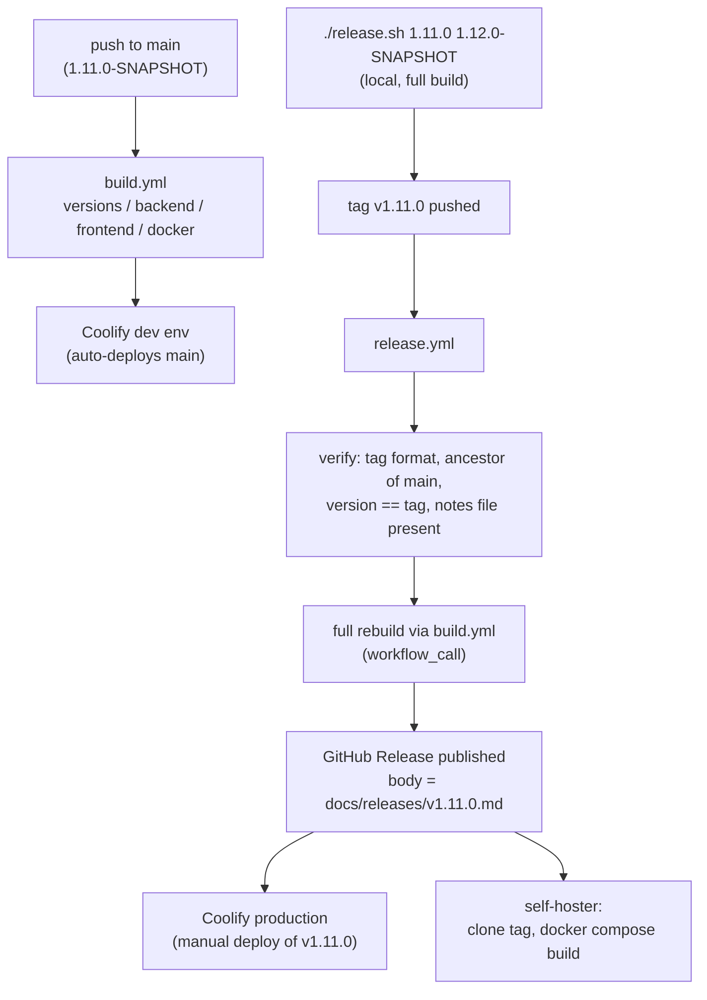
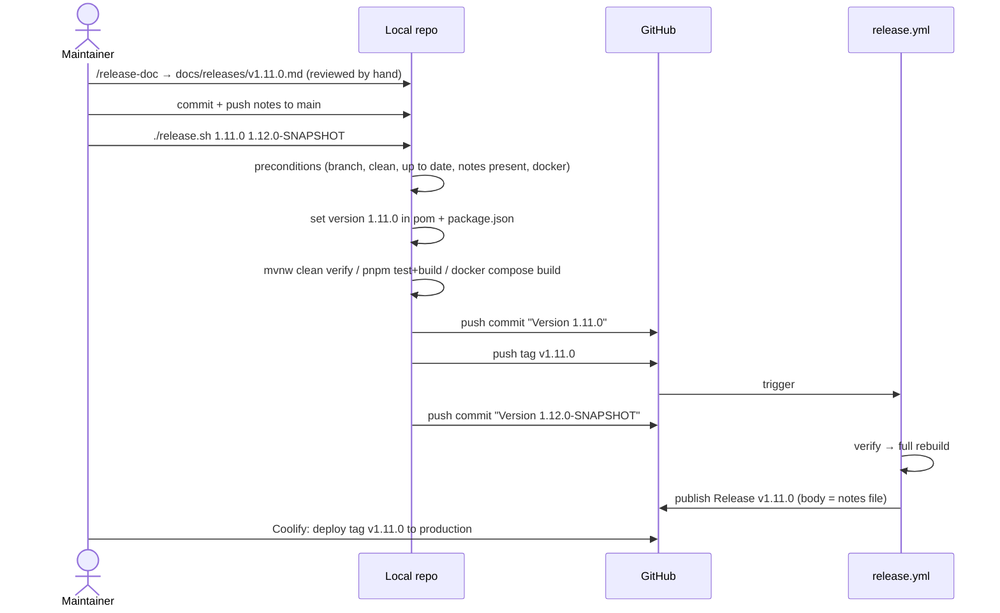

# Design: Application Release Process

**GitHub Issue:** — (issue draft proposed alongside this spec)

## Summary

Open Elements has documented release processes for its **libraries** — Java/Maven artifacts published to
Maven Central (`java-release-process.md`) and TypeScript packages published to npm
(`npm-release-process.md`), both in the `infrastructure-docs` repository. There is no equivalent for
**applications**, and it shows: `open-crm` has shipped eleven releases (`v0.1` … `v1.10.0`) with
hand-written release notes in `docs/releases/`, but the versions in its build files were never maintained.
`backend/pom.xml` still says `0.1.0-SNAPSHOT` and `frontend/package.json` still says `0.1.0` while the
application is at `v1.10.0`. The git tag is the only truthful record of what version exists, and nothing
in CI ever checked otherwise.

This spec establishes the release process for Open Elements **applications**, implemented concretely in
this repository. An application release publishes **nothing to any registry** — but it is not a passive
marker either: production is deployed from a concrete tag, and third-party self-hosters clone the
repository at a tag and build the images themselves. The release therefore has to guarantee that the
tagged tree carries the correct version, actually builds on a neutral machine, and is accompanied by
release notes an outside operator can act on.

`open-crm` becomes the reference application for this pattern, the way `java-parent` is the reference for
libraries. The generic, org-wide `app-release-process.md` document is a deliberate follow-up (tracked in
`docs/TODO.md`) so that the doc describes something that exists and has been used at least once.

## Goals

- One application version, always identical in `backend/pom.xml` and `frontend/package.json`, and always
  matching the release tag.
- Make version drift impossible to merge: a CI gate on every pull request and push.
- A local `release.sh` that prepares the git state for a release and refuses to produce an invalid tag.
- A tag-triggered workflow that re-builds the tagged tree from scratch on a neutral runner and, only on
  success, publishes a GitHub Release whose body is the committed release-notes file.
- A single, unambiguous meaning for the artefacts a reader sees on GitHub: **a tag without a published
  GitHub Release is not approved for deployment.**

## Non-goals

- **No artefact publishing.** Nothing is pushed to Maven Central, npm, GHCR, or any other registry.
  Third-party operators clone the repository at the tag and let `docker compose` build the images.
- **No deployment automation.** The dev environment in Coolify keeps building `main` continuously;
  production keeps being deployed manually by pointing Coolify at a tag. This spec does not touch Coolify.
- **No runtime version display.** Making the running version observable via an endpoint or the
  `/admin/status` page is deferred (see `docs/TODO.md`).
- **No hotfix branches.** Releases are cut from `main` only; `release.sh` and CI both enforce it.
  Patch releases from a branch off a released tag are deferred (see `docs/TODO.md`).
- **No release candidates.** Only `vA.B.C` tags exist; `v1.11.0-rc.1` is rejected.
- **No generic, copy-pasteable script.** `release.sh` is deliberately specific to this repository's
  `backend/` + `frontend/` layout. Other applications follow the *pattern*, not the file.
- **No retroactive cleanup.** The legacy two-component tags (`v0.1` … `v1.4`) and the existing
  `docs/releases/v1.4.md` stay untouched as history.

## The release model

Three audiences consume the output of this process, and they consume different things:

| Audience | Consumes | Consequence for the design |
|---|---|---|
| Open Elements dev environment | `main`, continuously built by Coolify | `main` must be visibly *not* a release → `-SNAPSHOT` version |
| Open Elements production | a concrete `vA.B.C` tag, deployed manually via Coolify | the tagged tree must be proven to build, and must carry the exact version |
| Third-party self-hosters | the GitHub Release page + the repository at the tag | notes must be actionable without the source; the tag must be self-sufficient |



**Rationale for re-building the tagged tree in CI even though `release.sh` already built it locally:**
the local build proves it works on the maintainer's machine with their caches; the CI build proves the
tagged commit builds from a clean checkout. Since that exact tree is what production and every self-hoster
will build, the redundant build is the point, not waste.

## Versioning model

- The application version is `A.B.C` — a single number for the whole application, held identically in
  `backend/pom.xml` (`/project/version`) and `frontend/package.json` (`version`).
- **Between releases, `main` carries `A.B.C-SNAPSHOT`** — the Java-library convention, chosen over the
  npm convention (sitting on the last released version) because the dev environment continuously deploys
  `main`. A build must never be mistakable for a release.
- A release is the same number without the suffix, and the tag is `v` + that number.
- Immediately after the tag is pushed, `main` is bumped to the next `-SNAPSHOT`, so `main` never sits on a
  release version for longer than one commit.
- `frontend/package.json` is `private: true`, so `1.11.0-SNAPSHOT` — a valid semver pre-release — carries
  no npm publishing semantics; it exists purely so both build files can be compared literally.

**Starting point.** As part of this spec, `main` is corrected from the stale `0.1.0` / `0.1.0-SNAPSHOT` to
**`1.11.0-SNAPSHOT`**, i.e. the next minor after the last real release `v1.10.0`.

## Deliverables

### 1. `check-versions.sh` (repository root)

A single script that is the shared definition of "the versions are correct". Used by CI and by
`release.sh`, so there is exactly one implementation of the rules.

It reads:

- the backend version from `/project/version` of `backend/pom.xml` — parsed directly from the XML, *not*
  via `mvnw help:evaluate`, so the check needs no JDK, no Maven, and no network and stays a
  seconds-long job;
- the frontend version from `frontend/package.json`.

It then asserts:

1. **Equality** — both files carry the exact same string. This is the only rule that must hold on every
   commit, and deliberately says nothing about the `-SNAPSHOT` suffix, so the transient
   `Version 1.11.0` commit that `release.sh` puts on `main` does not fail.
2. **No downgrade** — let `V` be the `(A,B,C)` triple from the build files (suffix ignored) and `T` the
   triple of the highest existing `vA.B.C` tag. The check fails if `V < T`. It also fails if `V == T`
   *and* the version carries `-SNAPSHOT` — that combination means a `-SNAPSHOT` is sitting on a version
   number that has already been released (typically a forgotten post-release bump), while
   `V == T` *without* the suffix is exactly the legitimate release commit.
3. Optional argument `--expect <version>`: both files must equal that exact string. Used by the release
   workflow to compare against the tag.

Legacy two-component tags (`v1.4`) are ignored when determining `T`; only `v[0-9]+.[0-9]+.[0-9]+` counts.
If no such tag exists at all, rule 2 is skipped rather than failing, so the script also works in a fresh
repository.

*Rationale for the "no downgrade" rule:* pure equality would have merged happily with today's broken
`0.1.0` in both files. The rule catches exactly the failure this spec exists to fix, and it is the one
gate that would have caught it years ago.

### 2. `build.yml` becomes reusable and gains a version gate

- Add `workflow_call: {}` to its triggers, so the release workflow can invoke the *same* build definition
  instead of duplicating the steps. Without this, the release build and the PR build drift apart — the
  exact problem the npm process doc already records under "Known drift".
- Add a `versions` job that checks out with tags and runs `./check-versions.sh`. It has no `needs`, so it
  runs in parallel with the existing `backend`, `frontend`, and `docker` jobs and fails the run fast.

### 3. `release.sh` (repository root)

Prepares git state only. It never deploys and never publishes; it needs no secrets, so any maintainer can
run it.

```bash
./release.sh <release-version> <next-snapshot-version>
# e.g.
./release.sh 1.11.0 1.12.0-SNAPSHOT
```

**Preconditions — all checked before anything is modified:**

| Check | Why it exists |
|---|---|
| `<release-version>` matches `A.B.C`, `<next-snapshot-version>` matches `A.B.C-SNAPSHOT` | the only formats the rest of the pipeline accepts |
| `<next-snapshot-version>` is strictly greater than `<release-version>` | a typo here would push a `main` that `check-versions.sh` then rejects on every subsequent PR — cheaper to catch before the release commit than after |
| current branch is `main` | releases come from `main` only; hotfix branches are out of scope |
| working tree is clean | otherwise unrelated local changes would be swept into the version commit by `git commit -a` |
| `main` is up to date with `origin/main` | prevents tagging a tree that is missing merged work, and prevents a push race |
| tag `v<release-version>` does not exist locally or on the remote | re-cutting an existing version must be a deliberate act, not an accident |
| `docs/releases/v<release-version>.md` exists and is non-empty | the release workflow *hard-fails* without it; catching it here avoids pushing a guaranteed-invalid tag |
| `docker info` succeeds | the backend tests (Testcontainers/PostgreSQL) and `docker compose build` both need a running daemon |

**Steps:**

1. **Set the release version** in both build files —
   `./mvnw versions:set -DnewVersion=<release> -DgenerateBackupPoms=false` in `backend/`, and
   `pnpm version <release> --no-git-tag-version` in `frontend/`. Then run `./check-versions.sh` as a
   sanity check that both landed.
2. **Assert no `-SNAPSHOT` remains anywhere in `backend/pom.xml`.** After step 1 the project's own version
   is a release version, so any remaining occurrence is a `-SNAPSHOT` *dependency* — which would make the
   release unreproducible and is a hard stop. (This has been a real situation in this repository:
   spec 107 depended on `spring-services 1.0.0-SNAPSHOT`.)
3. **Full local build** — the gate:
   - `backend/`: `./mvnw clean verify`
   - `frontend/`: `pnpm install --frozen-lockfile && pnpm test && pnpm build`
   - repository root: `docker compose build`
4. **Commit and push** `Version <release-version>` to `main`.
5. **Tag and push** `v<release-version>` — *this is what triggers the release workflow.*
6. **Bump** both build files to `<next-snapshot-version>`, commit `Version <next-snapshot-version>`, push.
7. Print the Actions URL to watch, and a reminder that the release is only approved once that run is green.

**Failure behaviour.** An `ERR` trap that is armed only for steps 1–3 (i.e. until the first commit) reverts
`backend/pom.xml` and `frontend/package.json` to `HEAD` and reports which step failed. This matters
because a half-applied version change would otherwise make the *next* attempt fail its "working tree is
clean" precondition, which is a confusing way to learn that the build broke. After step 4 the trap is
disarmed — from that point the state is public and recovery is the documented "delete the tag" path below.

*Rationale for building everything locally rather than trusting a green `main`:* consistency with the
library process, and `main` being green says nothing about the tree *with the release version applied*,
which is what gets tagged.

*Rationale for not generating the release notes from the script:* the library `release.sh` generates docs
best-effort via `claude -p "/release-doc …"` and explicitly never lets a doc problem block a release. Here
the notes file **is** the public release body that third-party operators read to decide whether they can
upgrade. It is written and reviewed by a human beforehand (using `/release-doc`), and `release.sh` merely
refuses to proceed without it.

### 4. `release.yml` (new workflow)

```yaml
on:
  push:
    tags: [ "v*.*.*" ]

permissions:
  contents: write        # create the GitHub Release

concurrency:
  group: release-${{ github.ref_name }}
  cancel-in-progress: false
```

Three jobs, strictly sequenced:

**`verify`** — cheap gates first, before any build time is spent:

1. Tag matches `^v[0-9]+\.[0-9]+\.[0-9]+$` — rejects release candidates and partial versions.
2. **Ancestor check**: the tagged commit is an ancestor of `origin/main`
   (`git merge-base --is-ancestor "$GITHUB_SHA" origin/main`). Enforces "releases come from `main`" a
   second time, in the place a developer cannot bypass. A commit is its own ancestor, so this also passes
   in the window before `release.sh` has pushed the follow-up bump commit.
3. `./check-versions.sh --expect "${GITHUB_REF_NAME#v}"` — both build files equal the tag without the `v`.
4. `docs/releases/${GITHUB_REF_NAME}.md` exists and is non-empty.

**`build`** — `needs: verify`, `uses: ./.github/workflows/build.yml`. The complete PR build (backend
`mvnw clean verify`, frontend `pnpm test` + `build`, all three Docker builds, plus the `versions` job)
re-run against the tagged tree from a clean checkout.

**`release`** — `needs: build`. Assembles the body and publishes:

- Body = the content of `docs/releases/vA.B.C.md`, with a leading `# …` H1 line stripped (GitHub already
  renders the release title, so the repeated heading is noise), followed by a horizontal rule and a
  permalink to the file at that tag —
  `https://github.com/OpenElementsLabs/open-crm/blob/vA.B.C/docs/releases/vA.B.C.md`.
- `gh release create "$GITHUB_REF_NAME" --title "Open CRM $GITHUB_REF_NAME" --notes-file body.md --verify-tag`
  using the automatic `GITHUB_TOKEN`.
- Published immediately, **not** a draft: green CI *is* the approval gate. Unlike the npm process there is
  no registry publication behind a 2FA gate, so a human publish step would add delay without adding a
  guarantee — and it would make "tag without release" ambiguous.

**Required secrets: none.** `GITHUB_TOKEN` is provided by Actions.

### 5. Documentation

- `docs/release.md` — how to cut a release of *this* application: the version model, the
  `/release-doc` → review → `release.sh` sequence, what the workflow verifies, and the recovery path.
- A short **Releases** section in `README.md` linking to it, and stating for third-party operators that
  they should deploy a tag that has a published GitHub Release — never `main`.

## Key flows

### Cutting a release



### Recovering from a failed release run

Because "tag without a published Release" means "not approved", a failed run is not repaired by
re-running it:

1. Delete the tag locally and on the remote (`git tag -d v1.11.0`, `git push --delete origin v1.11.0`).
2. Fix the cause on `main`.
3. Write `docs/releases/v1.11.1.md` and cut **a new version** — `./release.sh 1.11.1 1.12.0-SNAPSHOT`.

*Rationale:* the tag may already have been fetched, read, or deployed by someone the moment it appeared.
Re-pointing an existing tag at different code would silently change what `v1.11.0` means for every
consumer. Burning a patch number is cheap; a mutable release tag is not.

## Dependencies

- **GitHub Actions**: `actions/checkout@v6`, `actions/setup-java@v5`, `actions/setup-node@v6`,
  `pnpm/action-setup@v4` (all already used by `build.yml`), plus the `gh` CLI, pre-installed on
  `ubuntu-latest`.
- **`versions-maven-plugin`**, already version-managed by `java-parent`, for `versions:set`.
- **`python3`** for parsing `backend/pom.xml` and `frontend/package.json` in `check-versions.sh` —
  pre-installed on `ubuntu-latest` and on macOS, and avoids booting a JVM for a string comparison.
- No new application dependencies; no changes to production code.

## Security considerations

- The release path introduces **no new secrets**. `GITHUB_TOKEN` with `contents: write` is the only
  credential, scoped to creating the Release.
- `permissions` is declared explicitly at workflow level, so the token is not granted the repository
  default.
- `concurrency` with `cancel-in-progress: false` prevents a second push of the same tag from aborting a
  run mid-publish.
- The ancestor check is a supply-chain guard: without it, anyone able to push a tag could have arbitrary
  code published as an official release of this application.

## Reproducible builds

The [reproducible builds convention](../../../.claude/conventions/reproducible-builds.md) treats a
`-SNAPSHOT` inside a release as a defect. Step 2 of `release.sh` enforces that no `-SNAPSHOT` string
survives anywhere in `backend/pom.xml` at release time, and `pnpm install --frozen-lockfile` in both the
local gate and CI keeps the frontend dependency graph pinned to the committed lockfile.

## GDPR

Not applicable — this spec touches build files, shell scripts, CI workflows, and documentation. No
personal data is processed, stored, or transmitted.

## Open questions

- The `docs/releases/` filename convention is normalised to `vA.B.C.md` going forward; the existing
  two-component `v1.4.md` is left as-is. Should a short note be added to that legacy file explaining the
  format change, or is the inconsistency acceptable as history? (Assumption taken: acceptable, no note.)
- `docker compose build` in the local gate also builds the `db-backup-service` image reference — it is
  pinned by digest and only pulled, so it costs a pull on a cold cache. Acceptable, but it makes a cold
  first release cut noticeably slower.
