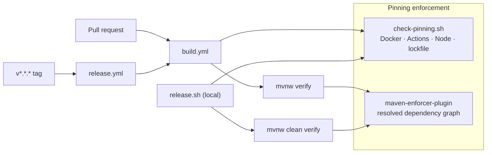

# Design: Version Pinning Gate

**GitHub Issue:** _(to be created — see the draft at the end of this document)_

## Summary

Every version that influences an Open CRM build must be pinned to an immutable value, and a gate must
enforce that permanently rather than relying on review discipline. Today most of the Java side is already
pinned, but **seven container image references float**, the CI actions resolve mutable major tags at run
time, `.nvmrc` carries only a major version, and nothing prevents a future SNAPSHOT or version-range
dependency from entering the Maven graph.

This spec pins what floats and adds the enforcement: a new `check-pinning.sh` at the repository root —
wired into CI and `release.sh` exactly like the existing `check-versions.sh` — plus `maven-enforcer-plugin`
rules for the part of the problem a shell script structurally cannot see.

**This spec does not make builds byte-identical.** Reproducibility in the strict sense (same commit → same
SHA-256) remains the longer-term goal; pinning is its precondition, not its achievement. Two builds of the
same tag will still differ after this spec, and that is expected. See
[Explicitly not solved](#explicitly-not-solved) and the *Byte-identical builds* entry in `docs/TODO.md`.

## Goals

- Every container image reference in the repository is pinned by **tag + digest**.
- Every GitHub Actions reference is pinned by **commit SHA**.
- The Maven dependency graph provably contains **no version ranges and no SNAPSHOT dependencies**, including
  transitively.
- The Node toolchain version is stated exactly, and `engines` stops claiming a compatibility that does not
  exist.
- Violations of all of the above **block a merge and block a release**, through one documented mechanism per
  ecosystem.
- The one place where pinning is deliberately *not* applied (OS packages) is documented in the repository, so
  it is not mistaken for an oversight later.

## Non-goals

- **Byte-identical rebuilds.** No `project.build.outputTimestamp`, no deterministic Next.js `buildId`, no
  `verify-reproducible-build` job. All three are tracked in `docs/TODO.md`.
- **Freshness checking.** The gate never asks a registry whether a newer digest exists for a tag. That is an
  update-automation concern (Dependabot/Renovate) and a separate piece of work.
- **Pinning OS package versions.** Deliberately excluded — see
  [Explicitly not solved](#explicitly-not-solved).
- **Bumping `java-parent`.** The parent release carrying the org-wide reproducibility settings is not out
  yet; consuming it is a separate dependency-update spec.
- **Exact base-image tags.** `node:24-alpine@sha256:…` satisfies the rule; requiring `node:24.9.0-alpine`
  and cross-checking it against `.nvmrc` is deferred (TODO).
- **A test suite for the gate.** Consciously accepted risk, tracked as a TODO.

## Terminology: what "pinned" means per ecosystem

The definition is deliberately different per ecosystem, because the mechanisms differ. Getting this wrong in
either direction produces a useless gate.

| Ecosystem | "Pinned" means | Rationale |
|---|---|---|
| **Docker** | `name:tag@sha256:…` — tag **and** digest | A tag is mutable. Adoptium, Alpine and Docker Hub all re-push existing tags when a base layer receives a CVE fix. Only the digest is immutable; when both are present Docker resolves by digest and the tag is documentation for humans. |
| **npm / pnpm** | `pnpm-lock.yaml` committed **and** `--frozen-lockfile` at every install site | The lockfile fixes every resolved version *including all transitive dependencies* and their `sha512` integrity hashes. The `^` ranges in `package.json` are not consulted under `--frozen-lockfile`. Replacing them with exact versions would be **weaker**, not stronger — exact direct versions pin no transitive dependency at all. |
| **Maven** | Explicit version on every dependency, and no range or SNAPSHOT anywhere in the **resolved** graph | Maven has no lockfile. Direct declarations are already explicit; the risk is a *transitive* dependency introducing a range or a SNAPSHOT, which only Maven itself can observe. |
| **GitHub Actions** | `owner/repo@<40-hex commit SHA>` | `@v6` is a mutable git tag resolved at run time; a re-pushed tag executes different code in CI. The motivation here is supply-chain security rather than reproducibility — the actions only prepare toolchains for throwaway builds and do not produce the shipped artifact. |
| **Node toolchain** | `.nvmrc` contains an exact `X.Y.Z` | `actions/setup-node` resolves a bare major to the newest matching release at run time. |

## Current state (audit)

Verified against the working tree on 2026-09-01.

### Already correct

- `backend/pom.xml`: every direct dependency carries an explicit version, either inline via a property or
  managed through `spring-services-bom:1.3.1`; the parent `java-parent:1.2.1` is exact. No version ranges,
  no SNAPSHOT dependencies. The only `-SNAPSHOT` is the application's own version, which is a release-process
  concern (spec 117), not a dependency.
- `backend/.mvn/wrapper/maven-wrapper.properties` pins Maven `3.9.14`.
- `java-parent` already hardens the git metadata it embeds: UTC-fixed date format, and `git.build.time`,
  `git.build.host`, `git.build.user.*` explicitly excluded.
- `frontend/pnpm-lock.yaml` is committed; `packageManager: pnpm@11.3.0` is exact; all three install sites
  (`frontend/Dockerfile:13`, `.github/workflows/build.yml:51`, `release.sh:130`) already use
  `--frozen-lockfile`.
- `docker-compose.yml:80` pins `db-backup-service` by tag **and** digest — the pattern this spec generalises.
- `.editorconfig` sets `end_of_line = lf`.
- `frontend/scripts/generate-pwa-assets.mjs` is deterministic: the service-worker cache version is a content
  hash of the generated `offline.html`, not a timestamp.

### Violations to fix

| # | File / line | Current | Problem |
|---|---|---|---|
| 1 | `backend/Dockerfile:1` | `eclipse-temurin:21-jdk` | floating tag, no digest |
| 2 | `backend/Dockerfile:15` | `eclipse-temurin:21-jre` | floating tag, no digest |
| 3 | `frontend/Dockerfile:1` | `node:24-alpine` | floating tag, no digest |
| 4 | `db-backup/Dockerfile:1` | `alpine:3.21` | no digest |
| 5 | `docker-compose.yml:3` | `postgres:17-alpine` | floating tag, no digest |
| 6 | `docker-compose.yml:17` | `getmeili/meilisearch:v1.10` | floating minor tag, no digest |
| 7 | `docker-compose.override.yml:25` | `ghcr.io/navikt/mock-oauth2-server` | **no tag at all** → implicitly `latest` |
| 8 | `.github/workflows/build.yml`, `release.yml` (8 `uses:` lines, 4 distinct actions) | `actions/checkout@v6`, `actions/setup-java@v5`, `actions/setup-node@v6`, `pnpm/action-setup@v4` | mutable major tags |
| 9 | `frontend/.nvmrc` | `24` | major only; `setup-node` resolves it at run time |
| 10 | `frontend/package.json` → `engines.node` | `">=20"` | **factually wrong**, see below |
| 11 | `backend/pom.xml` | — | no rule prevents a future range/SNAPSHOT entering the resolved graph |
| 12 | repository root | — | `.gitattributes` missing; line endings enforced only editor-side |

**On #7:** `docker-compose.override.yml` is development-only and influences no released artifact. It is
covered anyway, on a different justification: an untagged OAuth2 mock means an upstream release with changed
JWKS or discovery behaviour can break every developer's local environment simultaneously, without any commit
in this repository. That is a reliability problem, not a reproducibility one, but it is a real one.

**On #10 — this is a genuine bug, not just a pinning defect:** `frontend/package.json` declares
`"engines": { "node": ">=20" }`, but `frontend/scripts/generate-pwa-assets.mjs` — which runs as part of
`pnpm build` — imports `../src/lib/pwa/build-offline-html.ts` directly, i.e. a TypeScript file with no
transpile step. Unflagged TypeScript type-stripping only exists from Node 23.6 onwards. On Node 20 or 22
`pnpm build` fails. The script's own comment already says *"Node (>= 24, matching the Docker base)"*. The
declaration is corrected to `">=24"`; as a minimum requirement a range is correct there, since `engines` is
an assertion and not a resolution mechanism.

## Technical approach

Enforcement is split across **two** mechanisms, because a shell script parsing `backend/pom.xml` can only
see direct declarations — it can never observe that some transitive dependency carries `[1.0,2.0)` or a
SNAPSHOT version. That part is only visible to Maven itself.



`release.yml` reaches both mechanisms for free: it already calls `build.yml` via `workflow_call`, so the
release build and the PR build cannot drift apart.

### 1. `check-pinning.sh` (new, repository root)

Placed next to `check-versions.sh` and following its conventions: `set -euo pipefail`, a header comment that
states the rules, no JDK / Maven / Node / network dependency, and a machine-readable exit code. Written in
Bash with `python3` for the parsing, matching the existing script's approach — `python3` is already a hard
prerequisite of `check-versions.sh`, so this introduces no new dependency.

**Exit codes:** `0` all rules pass · `1` at least one rule failed · `2` usage error · `3` a scanned file
could not be parsed.

The script prints every file it scanned, so a file that is silently *not* covered is visible in the CI log
rather than being mistaken for a pass.

#### Rule D — container images

An image reference is compliant iff it matches `<name>:<tag>@sha256:<64 lowercase hex>`.

Scanned:
- every `Dockerfile*` found under the repository root, and
- `docker-compose.yml`, `docker-compose.override.yml` (the `image:` keys).

Excluded paths: `.git/`, `node_modules/`, `target/`, `.next/`, and `.claude/` — the last because the bundled
skills contain example Dockerfiles and convention documents that are not part of this build.

**Rationale for globbing rather than an explicit file list:** an explicit list is immune to false positives
but silently fails to cover a Dockerfile added later, which is precisely the regression the gate exists to
catch. Globbing with a documented exclusion list covers new files automatically; the printed scan list makes
the coverage auditable.

Two parser traps must be handled, both present in the repository today:

- **Multi-stage references.** `frontend/Dockerfile` contains `FROM base AS deps`, `FROM base AS build` and
  `FROM base AS runner`. These reference an internal stage, not an image. A `FROM` operand is skipped when it
  matches a stage name introduced by an earlier `AS <name>` in the same file.
- **`ARG`-substituted and scratch bases.** Not present today, but `FROM scratch` and `FROM ${SOME_ARG}` must
  not be reported as unpinned images. `scratch` is skipped; a `${…}` operand is reported as a violation with
  a distinct message, since it hides the reference from the gate.

Reported violations distinguish: missing digest, missing tag, digest without tag, and unresolvable operand.

#### Rule N — Node and npm

- `frontend/pnpm-lock.yaml` exists and is tracked by git.
- Every `pnpm install` invocation in any scanned Dockerfile, workflow file or `*.sh` script carries
  `--frozen-lockfile`.
- `frontend/.nvmrc` contains exactly `X.Y.Z`.

The `^` ranges in `frontend/package.json` are **not** flagged — see
[Terminology](#terminology-what-pinned-means-per-ecosystem).

#### Rule A — GitHub Actions

Every `uses:` value in `.github/workflows/*.yml` must be `owner/repo@<40 lowercase hex>`.

One exception, present today at `release.yml:60`: a value beginning with `./` is a local workflow call
(`uses: ./.github/workflows/build.yml`) and is skipped — there is nothing to pin, it is a path in this
repository.

A trailing comment naming the human-readable version (`# v6.0.1`) is expected and permitted; without it the
pinned SHAs are unreadable and unmaintainable.

### 2. `maven-enforcer-plugin` rules (`backend/pom.xml`)

A new execution adds:

- **`banDynamicVersions`** — fails on any version range or `LATEST`/`RELEASE` in the resolved graph. Configured
  to also check transitive dependencies. `allowSnapshots` is **not** enabled.
- **`requireReleaseDeps`** — fails on any SNAPSHOT dependency, with the project's own version excluded (the
  application legitimately carries `A.B.C-SNAPSHOT` between releases per spec 117).

Added locally rather than to `java-parent` because no parent release carries these rules yet and blocking
this spec on an unreleased parent was not wanted. Moving them upstream is tracked as a TODO.

**Rationale for the enforcer over a pom-parsing script:** the enforcer operates on the graph Maven actually
resolved, which is the only place a transitive range or SNAPSHOT becomes visible. A script reading
`backend/pom.xml` would report a clean result while the build silently resolved a floating version.

### 3. `.gitattributes` (new, repository root)

`* text=auto eol=lf` plus explicit `binary` markers for the committed binary assets (PNG icons, image test
fixtures under `backend/src/test/resources/images/`), so a checkout on Windows cannot introduce CRLF into
tracked text and no filter mangles the binaries. Complements `.editorconfig`, which only governs editors and
has no effect on what git writes to disk.

This is strictly a byte-identity concern rather than a pinning one, kept in scope because it is a single cheap
file and pointless to defer.

### 4. Wiring

- `.github/workflows/build.yml`: a new `pinning` job mirroring the existing `versions` job — `runs-on:
  ubuntu-latest`, no `needs`, so it runs in parallel with the build jobs and fails the run within seconds.
  `fetch-depth` can stay at the default; unlike `check-versions.sh` this gate needs no tag history.
- `release.sh`: `check-pinning.sh` is called in the precondition block, next to the existing
  `check-versions.sh` call, before any build time is spent.
- `docs/development.md`: the rules table and the OS-package gap are documented for contributors.

### 5. Obtaining the digests

For each of the seven unpinned references, at implementation time:

```bash
docker pull <image>:<tag>
docker inspect --format='{{index .RepoDigests 0}}' <image>:<tag>
```

`RepoDigests` yields the digest of the **manifest list**, which is platform-independent. This matters here:
development happens on macOS/arm64 while CI and production run amd64. A per-architecture digest copied from a
registry web UI would pin a single-platform image and break the build on the other architecture. The
implementation must use the manifest-list digest, and `docs/development.md` must say so — this is the most
likely way a later digest bump goes wrong.

`ghcr.io/navikt/mock-oauth2-server` additionally needs a concrete tag chosen, since it currently has none.

## Explicitly not solved

**OS packages remain unpinned, by decision.**

- `backend/Dockerfile` runs `apt-get update && apt-get install -y --no-install-recommends libheif1
  libheif-plugin-libde265`.
- `db-backup/Dockerfile` runs `apk add --no-cache postgresql17-client aws-cli bash tzdata`.

Pinning exact package versions would make the build **fail**, not become reproducible: Debian and Alpine
remove superseded package versions from their production mirrors, so `libheif1=1.15.1-1+deb12u1` stops
resolving within weeks. The correct fix is a snapshot mirror (`snapshot.debian.org` and an Alpine
equivalent), which is a substantial change to how the images are built and out of scope here.

Two consequences that must be stated plainly, because they are easy to misread as solved:

1. **The base-image digest does not cover this.** `apt-get update` fetches the package index at build time, so
   the installed `libheif1` version depends on the build *date*, no matter how firmly the base layer is
   pinned.
2. **The container images are therefore still not reproducible after this spec.** What this spec achieves for
   Docker is a reproducible *starting point*, not a reproducible *result*.

The gate deliberately does not flag these lines. Tracked in `docs/TODO.md`.

## Dependencies

- No new runtime or build dependencies. `python3` and `git` are already prerequisites of
  `check-versions.sh`; `maven-enforcer-plugin` is already managed by `java-parent` (version `3.6.3`) and
  already executes there (`enforce-build-environment`).
- Coupled to spec 117 only by convention: this gate copies `check-versions.sh`'s structure and its two
  enforcement points.

## Security considerations

SHA-pinning the GitHub Actions is the one item in this spec whose primary benefit is security rather than
reproducibility: a mutable `@v6` tag can be re-pushed to execute arbitrary code in a workflow that holds
`contents: write` (which `release.yml` does).

Note the trade-off this creates: SHA pins never update themselves. Without the deferred update automation,
the pinned actions will accumulate unpatched vulnerabilities over time. This spec buys immunity to tag
re-pushes at the cost of a maintenance obligation that currently has no owner — an accepted, documented
tension rather than a solved problem.

## GDPR

Not applicable. This spec touches only build configuration and CI wiring; no personal data is processed,
stored or transmitted, and no runtime behaviour of the application changes.

## Open questions

- **Which Node patch version** goes into `.nvmrc`? Must equal the Node version inside the chosen
  `node:24-alpine` digest, determined at implementation time.
- **Which tag** for `ghcr.io/navikt/mock-oauth2-server`? Currently untagged, so there is no incumbent version
  to preserve; the newest release at implementation time is the pragmatic choice, but it must be verified
  against `mock-oauth2-config.json` before pinning.
- **Does `meilisearch:v1.10` stay on v1.10** when its digest is taken, or is this the moment to move to a
  current release? Pinning the digest of an old minor freezes it indefinitely, since nothing updates digests
  yet.

---

## Appendix: GitHub issue draft

To be created by hand; not created automatically.

**Title:** `Pin all build-relevant versions and enforce it with a gate`

**Body:**

> Open CRM's stated goal is reproducible builds. The precondition — that nothing floats — is currently not
> met, and nothing prevents a regression.
>
> **Audit result (working tree, 2026-09-01):**
>
> - 7 container image references are unpinned: `eclipse-temurin:21-jdk`, `eclipse-temurin:21-jre`,
>   `node:24-alpine`, `alpine:3.21`, `postgres:17-alpine`, `getmeili/meilisearch:v1.10`, and
>   `ghcr.io/navikt/mock-oauth2-server` — the last with **no tag at all**. Only `db-backup-service` is
>   correctly pinned by tag + digest.
> - 4 GitHub Actions are referenced by mutable major tags across `build.yml` and `release.yml`.
> - `frontend/.nvmrc` contains only the major version `24`; `actions/setup-node` resolves it at run time.
> - `frontend/package.json` declares `engines.node: ">=20"`, which is **wrong** — `pnpm build` runs
>   `generate-pwa-assets.mjs`, which imports a `.ts` file directly and therefore requires Node ≥ 23.6.
> - Nothing prevents a version range or a SNAPSHOT dependency from entering the Maven graph transitively.
> - `.gitattributes` is missing, so line endings are enforced only editor-side.
>
> **What should happen:**
>
> - Pin container images by **tag + digest** (the pattern `docker-compose.yml` already uses for
>   `db-backup-service`), covering `docker-compose.override.yml` too.
> - Pin GitHub Actions by commit SHA.
> - Add `maven-enforcer-plugin` rules (`banDynamicVersions`, `requireReleaseDeps`) so the *resolved* Maven
>   graph is provably free of ranges and SNAPSHOTs.
> - Exact `.nvmrc`, corrected `engines`, new `.gitattributes`.
> - Add `check-pinning.sh` and wire it into `build.yml` and `release.sh`, mirroring `check-versions.sh`, so a
>   violation can neither be merged nor released.
>
> **Deliberately out of scope** — byte-identical builds. This issue establishes pinning only; two builds of
> the same tag will still differ afterwards. OS packages (`apt-get`/`apk`) stay unpinned on purpose, because
> Debian and Alpine drop superseded versions from their mirrors and an exact pin would make the build fail
> rather than reproducible. Both are tracked in `docs/TODO.md`.
>
> **Acceptance criteria:**
>
> - [ ] `./check-pinning.sh` exits 0 on the working tree and non-zero when any pin is removed.
> - [ ] The gate runs as its own job in `build.yml` and as a precondition in `release.sh`.
> - [ ] `./mvnw verify` fails if a SNAPSHOT or ranged dependency is introduced.
> - [ ] `docker compose build` and `docker compose up` still work with all digests pinned, on both arm64 and
>       amd64.
> - [ ] `docs/development.md` documents the per-ecosystem rules, how to obtain a manifest-list digest, and
>       the OS-package gap.
