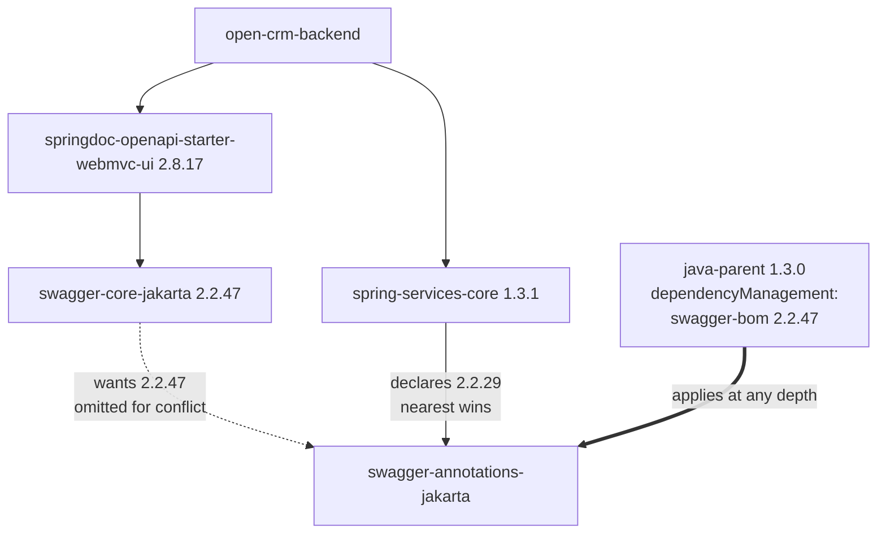

# Design: Open Elements Dependency Updates (java-parent, ui, nextjs-app-layer)

## GitHub Issue

— (none; tracked by this spec, as with specs 115, 117 and 118)

## Summary

Three of the four Open Elements dependencies of `open-crm` have newer releases. This spec bumps all
three and, in doing so, repairs a Swagger dependency split that exists in the project **today**, closes
a silent UI regression the `ui` bump would otherwise introduce, and turns an inert supply-chain setting
into an enforced policy.

| # | Dependency | From | To | Nature |
|---|------------|------|----|--------|
| 1 | `com.open-elements:java-parent` | 1.2.1 | 1.3.0 | Build-only; fixes a live Swagger split |
| 2 | `@open-elements/ui` | 0.9.0 | 0.10.0 | **Breaking** (toolbar default) + behavioural (Markdown schema) |
| 3 | `@open-elements/nextjs-app-layer` | 0.7.1 | 0.8.0 | Behavioural (backend proxy) |

`com.open-elements:spring-services` is **already at its latest release**, 1.3.1 — Maven Central carries
no newer version of `spring-services-bom` or any of its modules, and the GitHub release list ends at
`v1.3.1` (2026-07-15). It is not touched.

Items 2 and 3 are **coupled and must land together**: `nextjs-app-layer@0.8.0` declares
`@open-elements/ui: ^0.10.0` as a peer dependency, so bumping either one alone produces a peer conflict.

### The finding that shaped this spec

`@open-elements/ui@0.10.0` **does not match its own upgrade guide**. `docs/upgrade-to-0.10.md` in the
library repository states "There is **no API change** — `MarkdownEditor` and `MarkdownView` keep the exact
same props" and "task lists render but cannot be created". The published npm tarball disagrees:

```
package/src/types/index.ts:82    /** Actions offered in the toolbar … Defaults to ["bold", "italic"]. */
package/src/types/index.ts:83    readonly toolbar?: readonly MarkdownToolbarAction[];
package/src/components/markdown-editor.tsx:27
                                 const DEFAULT_TOOLBAR = ["bold", "italic"];
package/src/types/index.ts:96    readonly onChange?: (markdown: string) => void | Promise<void>;   // MarkdownView
```

That is the work the library documents separately as `upgrade-to-0.11.md` (**explicitly breaking**: the
toolbar default drops from Bold/Italic/Strikethrough/Link to Bold/Italic) and `upgrade-to-0.12.md`
(interactive task-list checkboxes). Both were published inside 0.10.0. For comparison, the 0.9.0 tarball's
`MarkdownEditorProps` carries only `value`, `onChange` and `placeholder` — no `toolbar` at all.

**Decision: the published artifact is authoritative for this spec, not the upgrade guide.** Every
statement below about `ui` was verified against the unpacked tarball. The discrepancy itself is a finding
for the `open-elements-ui` repository and is out of scope here.

**Rationale.** The guide describes intent; the tarball is what `pnpm install` puts on the classpath. A
spec written from the guide would have shipped a silent loss of two toolbar buttons in both entity forms.

## Goals

- Bring all three dependencies to their latest published releases.
- Repair the split Swagger stack that `dependency:tree` shows in the project today.
- Keep the `MarkdownEditor` feature set of both description fields unchanged across the bump, declared
  explicitly rather than inherited from a library default.
- Leave behind a regression net for all three changes, so the next bump of any of them cannot repeat this
  silently.
- Activate `minimumReleaseAge` as a real supply-chain policy while keeping Open Elements' own packages
  immediately consumable.

## Non-goals

- **Bumping `spring-services`.** Already at the latest release (1.3.1).
- **Wiring `MarkdownView.onChange`.** 0.10.0 makes task-list checkboxes interactive when the prop is
  supplied. It is deliberately not supplied: with `"taskList"` absent from the toolbar (see Part 2), no
  checklist can be created in the application at all, so an interactive checkbox would have almost nothing
  to act on. Omitting the prop reproduces 0.9.0 behaviour exactly.
- **Adding `@tailwindcss/typography`.** Deferred to `docs/TODO.md` — see [Accepted visual
  regression](#accepted-visual-regression).
- **Handling `MaxUploadSizeExceededException`.** Pre-existing defect, deferred to `docs/TODO.md`.
- **Adding a `.gitattributes`.** Deferred to `docs/TODO.md` as an item for spec 118, where pinning and
  determinism are negotiated.
- **Copying the parent's `.editorconfig`.** Actively rejected — see [Deliberately not
  adopted](#deliberately-not-adopted).
- **Running Spotless.** Unchanged from the decision in spec 115: no execution is bound to a lifecycle
  phase, and `spotless:apply` would reformat the entire backend into a style it does not use.
- **Correcting `engines.node`.** `frontend/package.json` claims `">=20"` while `nextjs-app-layer` has
  required `">=22"` since 0.7.1 — pre-existing, and already in the scope of spec 118.
- **Byte-identical builds.** This spec inherits one precondition for free (see Part 1); it does not
  achieve reproducibility and adds no verification job.

---

## Part 1 — `java-parent` 1.2.1 → 1.3.0

### What actually changes

Verified against the published `java-parent-1.3.0.pom` rather than the release notes. The complete
version-property delta against 1.2.1 is two lines:

```diff
+ <swagger.version>2.2.47</swagger.version>
+ <swagger-ui.version>5.32.2</swagger-ui.version>
```

Spring Boot stays at 3.5.14, Testcontainers at 2.0.5, and `maven-enforcer-plugin` keeps exactly the rules
it had in 1.2.1 (`requireMavenVersion 3.9.11`, `requireJavaVersion 21`) — **the parent adds no new gate
that could fail the build**. Three things reach open-crm:

1. `project.build.outputTimestamp` = `2026-09-10T00:00:00Z` (`:49`), inherited by the backend.
2. Spotless gains `<lineEndings>UNIX</lineEndings>` (`:269`), still without `<executions>`.
3. The OpenAPI stack moves from one managed coordinate to three: the springdoc BOM (2.8.17), the Swagger
   BOM (2.2.47) and the `swagger-ui` webjar (5.32.2).

Of the three "breaking-light" items the upgrade guide warns about, **two are inert here**:

- **Spotless / line endings.** No goal is bound to a phase, CI runs `./mvnw clean verify`
  (`build.yml:34`) and the backend Dockerfile runs `clean package` — neither invokes Spotless. There is
  additionally not a single CRLF-encoded `.java` file in the repository.
- **Byte-for-byte artifact comparison.** open-crm performs none, so there is no reference to re-baseline.

### The Swagger split exists today

This is the substantive reason to take 1.3.0. `./mvnw dependency:tree -Dverbose` against the current
`pom.xml`:

```
com.open-elements:open-crm-backend:jar:1.12.0-SNAPSHOT
+- org.springdoc:springdoc-openapi-starter-webmvc-ui:jar:2.8.17
|  \- … \- io.swagger.core.v3:swagger-core-jakarta:jar:2.2.47
|           \- (io.swagger.core.v3:swagger-annotations-jakarta:jar:2.2.47 - omitted for conflict with 2.2.29)
\- com.open-elements:spring-services-core:jar:1.3.1
   \- io.swagger.core.v3:swagger-annotations-jakarta:jar:2.2.29
```

`spring-services-core` declares the Swagger annotations at depth 1; springdoc's `swagger-core-jakarta`
wants them at depth 4. Maven's nearest-wins mediation picks 2.2.29, so the resolved stack is
**core and models at 2.2.47, annotations at 2.2.29** — precisely the split `java-parent` 1.3.0 exists to
prevent. `ModelResolver` from `swagger-core-jakarta:2.2.47` calls `Schema.$dynamicRef()`, a method added
in `swagger-annotations-jakarta:2.2.47` and absent from 2.2.29; the failure mode is a `NoSuchMethodError`
during schema resolution, typically on startup or on the first `/v3/api-docs` request.



`dependencyManagement` is consulted before mediation and applies at any depth, so importing `swagger-bom`
in the parent removes the mediation entirely. The annotations are **transitive** from open-crm's point of
view — the project declares no Swagger coordinate itself — so the one case the fix cannot repair (a direct
declaration carrying an explicit `<version>`) does not apply.

`springdoc-openapi-starter-webmvc-ui` is already declared without a `<version>` in `backend/pom.xml:109`,
so no consumer edit is needed beyond the parent bump.

### `outputTimestamp` in an application

The guide writes for a library published to Maven Central. open-crm is an application: the backend JAR is
built into a container image and never published. The inherited literal is the release date of
*java-parent*, not of open-crm, and it stays frozen at `2026-09-10` across every CRM release until the
next parent bump.

This is accepted deliberately. Spec 118 lists "No `project.build.outputTimestamp`" among its non-goals and
defers byte-identical builds to `docs/TODO.md`, noting there that the fix "exists upstream in `java-parent`
… it arrives via the dependency-update spec, not through any change in this repository". **This spec is
that arrival.** It is recorded as a welcome partial step toward the goal spec 118 defers, not as something
to be neutralised. Spec 118 itself is not modified by this spec.

The guide's warning about presenting the literal as a build time cannot bite here: the backend exposes no
build timestamp at all — no `BuildProperties` bean, no `build-info.properties`, no `Implementation-Version`
in the manifest. No property override for `project.build.outputTimestamp` exists in `pom.xml`, in either
workflow, or in `release.sh`, so the inherited value applies unopposed.

### Deliberately not adopted

- **The parent's `.editorconfig`.** Its `[*.java]` block specifies `indent_size = 2` and
  `max_line_length = 100` to match `googleJavaFormat`; open-crm's specifies 4 and 120, matching the code
  that is actually in the repository. The guide's rationale — "an `.editorconfig` specifying anything else
  for Java makes the editor fight the formatter" — presupposes that the formatter runs. Here it does not,
  so adopting the parent's file would point the editor against the existing style instead of with it.
- **`.gitattributes`.** The guide motivates it as protection against Spotless re-introducing CRLF, which
  does not apply. The remaining determinism argument is real but belongs to spec 118; captured in
  `docs/TODO.md`.

### Change

- `backend/pom.xml`: `<parent><version>` `1.2.1` → `1.3.0`. Nothing else.

### Verification

1. `./mvnw clean verify` is green.
2. `./mvnw dependency:tree -Dincludes=io.swagger.core.v3,org.webjars:swagger-ui` shows
   `swagger-annotations-jakarta`, `swagger-models-jakarta` and `swagger-core-jakarta` **all at 2.2.47**.
3. The new `/v3/api-docs` integration test (below) passes.

---

## Part 2 — `@open-elements/ui` 0.10.0 and `@open-elements/nextjs-app-layer` 0.8.0

### Breaking: the `MarkdownEditor` toolbar default

Under 0.9.0 every `MarkdownEditor` rendered four buttons — Bold, Italic, Strikethrough, Link — with no way
to configure them. 0.10.0 introduces the `toolbar` allowlist and defaults it to `["bold", "italic"]`.
open-crm has two usages, neither passing the prop:

- `frontend/src/components/contact-form.tsx:381` — contact description
- `frontend/src/components/company-form.tsx:247` — company description

Both would silently lose Strikethrough and Link.

**Change:** declare the previous four actions explicitly at both call sites.

```tsx
<MarkdownEditor
  value={description}
  onChange={setDescription}
  placeholder={S.descriptionPlaceholder}
  toolbar={["bold", "italic", "strike", "link"]}
/>
```

**Rationale.** The 0.11 guide advises against blindly restoring the old default and treats the upgrade as
the moment to make each field honest about what it offers. The decision taken here is that these two
fields offer exactly these four actions — the same set as before, now written down rather than inherited,
so a future default change cannot move it again. `"taskList"` is deliberately absent, which keeps task-list
creation closed (the `Mod-Shift-9` shortcut and the `[ ] ` input rule are stripped when the action is not
allowed).

### Behavioural: the Markdown schema opens

0.9.0 trimmed the TipTap schema to paragraphs, a few marks and links. Loading a value containing headings,
lists, blockquotes, code blocks or horizontal rules discarded those constructs — in `MarkdownEditor` this
corrupted stored data on open, without a keystroke. 0.10.0 opens the schema so all of them round-trip.

open-crm has no workaround for the old bug to remove: no call site pre-processes Markdown before handing it
to the editor, and none ignores the first `onChange` after mount.

The seven affected call sites are `contact-detail.tsx:252`, `company-detail.tsx:191`,
`contact-comments.tsx:168`, `company-comments.tsx:171`, `opportunity-comments.tsx:188` (all `MarkdownView`)
plus the two `MarkdownEditor` usages above.

### Accepted visual regression

`MarkdownView` and `MarkdownEditor` hardcode `class="prose prose-sm max-w-none"`, but
`frontend/src/app/globals.css` never loads `@tailwindcss/typography` and the package is not in
`frontend/package.json`. The only stylesheet the library exports is `dist/brand.css`, which contains no
`prose` rules. Newly rendered headings, lists and blockquotes therefore receive nothing but the Tailwind
preflight reset.

This gap is **pre-existing, not caused by the bump**: the `prose` classes are byte-identical in the 0.9.0
tarball, which also predates the README section that now documents the requirement. Under 0.9.0 it was
invisible because no block construct ever reached the DOM.

**Decision:** ship it. Existing content realistically contains only paragraphs, bold, italic, strikethrough
and links — under 0.9.0 no user could produce anything else through the editor — and none of those needs
`prose`. The exception is externally written content (Brevo import, CSV contact import), which no editor
ever filtered. Going forward the effect grows, because the input rules stay active: typing `# ` or `- `
creates real nodes even though no button offers them. The typography fix is captured in `docs/TODO.md` as
a separate change.

### `nextjs-app-layer` 0.8.0 — the backend proxy

`createBackendProxyHandler` is used once, in `frontend/src/app/api/[...path]/route.ts`, with only
`backendUrl` and `auth`. Verified against the unpacked 0.8.0 tarball:

- The request body is **streamed** (`req.body` with `duplex: "half"`) instead of buffered through
  `req.arrayBuffer()`, so uploads pass through with constant memory.
- `Content-Length` is now among the always-forwarded headers (`src/server/route-handlers.ts:40`),
  alongside `Content-Type`, `Accept` and the range/conditional set. *(The description of PR #11 lists
  `Content-Length` in the deny-set; the shipped code and the README agree that it is forwarded. The PR
  description is wrong.)*
- `redirect: "manual"`, because a streamed body cannot be replayed for a 307/308.
- A new optional `forwardRequestHeaders` allowlist, with `Cookie`, `Host`, `Authorization` and
  `Connection` excluded unconditionally. open-crm does not use it.

Two of these are inert for open-crm. Range forwarding cannot produce a `206`, because `getPhoto`
(`ContactController.java:238`) returns a `ResponseEntity<byte[]>` and Spring does not honour `Range` for a
byte-array body. Streaming only improves the memory profile.

The one real change is on upload: the body previously arrived framed as `Transfer-Encoding: chunked`, so
the 20 MB multipart limit was reached while reading; now Tomcat knows the size up front and can reject
before the transfer. The resulting status code is unchanged — and wrong in both cases, which is the
pre-existing defect captured in `docs/TODO.md`.

### Change

- `frontend/package.json`: `@open-elements/ui` `^0.9.0` → `^0.10.0`,
  `@open-elements/nextjs-app-layer` `^0.7.1` → `^0.8.0`.
- `frontend/pnpm-lock.yaml`: regenerated.
- The two `toolbar` props above.

---

## Part 3 — `minimumReleaseAge` becomes a real policy

`frontend/pnpm-workspace.yaml` carries a `minimumReleaseAgeExclude` list —
`@open-elements/nextjs-app-layer@0.7.0` and `@open-elements/ui@0.9.0` — but **`minimumReleaseAge` itself is
set nowhere**: not in `pnpm-workspace.yaml`, not in `frontend/.npmrc`, not in the workflows, not in the
Dockerfile, and `pnpm config get minimumReleaseAge` returns `undefined`. The exclusion list is an exception
to a rule that does not exist, which is why nobody noticed that it still names 0.7.0 a month after 0.7.1
was installed. `frontend/Dockerfile:10-12` nevertheless describes it as load-bearing.

Four measurements with pnpm 11.3.0 — the version `packageManager` pins — in an isolated directory
requiring `@open-elements/ui@^0.10.0` and `@open-elements/nextjs-app-layer@^0.8.0`:

| # | Configuration | Result |
|---|---------------|--------|
| A | `minimumReleaseAge: 10080`, no exclusion | `ERR_PNPM_NO_MATURE_MATCHING_VERSION` — both packages blocked |
| B | + `minimumReleaseAgeExclude: ["@open-elements/*"]` | install succeeds |
| C | + exclusion narrowed to `"@open-elements/ui"` | `nextjs-app-layer@0.8.0` still blocked |
| D | lockfile built under B, then `--frozen-lockfile` **without** the exclusion | `ERR_PNPM_MINIMUM_RELEASE_AGE_VIOLATION` |

A establishes the unit is minutes (the reported cutoff lay exactly seven days back). B and C together
establish that a scope wildcard works and is **selective** — it exempts Open Elements' own packages while
every third-party package stays subject to the quarantine. D establishes that `--frozen-lockfile`
re-verifies the lockfile against the active policy, so the configuration must be present wherever an
install runs, not merely where the lockfile was produced.

### Change

```yaml
# frontend/pnpm-workspace.yaml
minimumReleaseAge: 10080 # 7 days, in minutes
minimumReleaseAgeExclude:
  - "@open-elements/*"
```

Both existing version-pinned entries are replaced by the wildcard, which cannot go stale.

No change is needed at the two install sites that D makes relevant: `.github/workflows/build.yml:51` runs
after a repository checkout, and `frontend/Dockerfile:12` already copies `pnpm-workspace.yaml` into the
build context before `pnpm install --frozen-lockfile` on line 13. The comment on `Dockerfile:10-12`
becomes accurate for the first time.

### Escape hatch

A seven-day quarantine delays exactly the update that is most urgent: a security fix in a third-party
package. Measurement D shows the block reaches CI and the Docker build, not just a local install. The
documented procedure, to be added to `docs/development.md`:

> To take a third-party package inside the quarantine window, add the specific
> `name@version` to `minimumReleaseAgeExclude` in `frontend/pnpm-workspace.yaml`, state the reason in the
> commit message, and remove the entry once the package is older than seven days. Never widen the wildcard
> and never lower `minimumReleaseAge` for a single update.

**Rationale.** A version-pinned exception expires naturally in review (it is visibly obsolete after a
week), whereas lowering the global value silently weakens the policy for every package at once.

---

## Tests introduced

Three regressions in this spec were invisible precisely because nothing tested for them. Each gets a
permanent test, so the next bump of the same dependency cannot repeat it silently.

| Test | Location | Guards |
|------|----------|--------|
| `/v3/api-docs` integration test | `backend/src/test/java/…` | The OpenAPI endpoint resolves a schema. A re-split Swagger stack fails here instead of in production. |
| Proxy route test | `frontend/src/app/api/…/__tests__/` | open-crm's own wiring **and** the library contract. |
| Markdown test | `frontend/src/components/__tests__/` | Both forms declare their four toolbar actions; structured Markdown round-trips through `MarkdownView` unchanged. |

Scope notes:

- The **proxy test** covers both layers deliberately. The wiring half (`BACKEND_URL` with its
  `http://localhost:8080` fallback, the bearer token from `auth`, all four HTTP methods exported, no
  `Cookie` leak) exists only in open-crm and is untested anywhere else. The contract half
  (`Content-Length` is set on the upstream request, a `Range` request passes through) duplicates assertions
  the library makes about itself, on purpose: it is what turns a future library bump that quietly changes
  the proxy into a red build here.
- `vitest.config.ts` aliases `@open-elements/nextjs-app-layer/server` to the package's **TypeScript
  source**, so the test exercises real 0.8.0 code rather than a mock. One caveat for implementation:
  `environment: "jsdom"` is global, while a streamed request body and `duplex` come from Node/undici. If
  the environment interferes, the test file needs a `// @vitest-environment node` annotation — the failure
  to watch for is one in the setup rather than in the subject.
- The **OpenAPI test** is new ground: nothing in `src/test`, `application.yml` or the security
  configuration currently touches `/v3/api-docs` or the Swagger UI. It therefore also establishes whether
  the endpoint is reachable for the configured security setup at all.

Per the decision taken during the grill, no attempt is made to demonstrate the *pre-bump* failure; the
evidence required is that the endpoint works afterwards.

## Commit structure and rollback

One pull request, three commits, so a single aspect can be reverted without the others:

1. **Backend** — parent bump plus the `/v3/api-docs` test.
2. **Frontend** — both library bumps, the lockfile, the two `toolbar` props, plus the proxy and Markdown
   tests. **Atomic**: splitting the two bumps would leave a peer-dependency conflict at the intermediate
   commit.
3. **Policy** — `minimumReleaseAge` and the wildcard exclusion, plus the escape hatch in
   `docs/development.md`.

Rollback is `git revert` of the relevant commit. Reverting commit 2 restores 0.9.0/0.7.1 and the lockfile
in one step. Reverting commit 1 restores parent 1.2.1 and with it the Swagger split, which is the state
the project is in today. Reverting commit 3 is inert for resolution, because the committed lockfile already
holds the resolved versions.

No database migration, no configuration change, and no version change to the application itself —
`check-versions.sh` is unaffected, and `backend/pom.xml` and `frontend/package.json` both stay at
`1.12.0-SNAPSHOT`.

## Dependencies and interactions

- **Spec 118 (version pinning gate, `open`)** — remains untouched by this spec, as decided. Two points of
  contact are recorded rather than acted on: its non-goal "No `project.build.outputTimestamp`" is overtaken
  by the inherited parent property, and its scope already contains the `engines.node` correction that this
  spec leaves alone. The `.gitattributes` item in `docs/TODO.md` names spec 118 as its home.
- **Spec 115 (dependency updates)** — this spec is its successor and keeps its Spotless non-goal intact.
- **`spring-services`** — remains at 1.3.1. Note that `spring-services-core` is the source of the
  `swagger-annotations-jakarta:2.2.29` declaration; the split is fixed here by version management rather
  than by changing that library.

## Risks

| Risk | Likelihood | Mitigation |
|------|-----------|------------|
| `/v3/api-docs` turns out to be broken by the current split and the new test fails before the parent bump lands | Low | The test is written in the same commit as the parent bump, which is the fix. |
| The Swagger 2.2.47 upgrade changes generated OpenAPI output | Low | Additive change between 2.2.29 and 2.2.47; the new test asserts a successful schema, not its exact content. |
| The proxy test fails on jsdom rather than on the subject | Medium | Known in advance; `// @vitest-environment node` is the documented remedy. |
| Users perceive the newly rendered, unstyled structure as a regression | Medium | Accepted explicitly; the typography fix is queued in `docs/TODO.md`. |
| A third-party security update is delayed by the seven-day quarantine | Low | Documented escape hatch. |

## Open questions

None. All items raised during the grill were resolved, deferred to `docs/TODO.md` with a recorded reason,
or assigned to spec 118.
