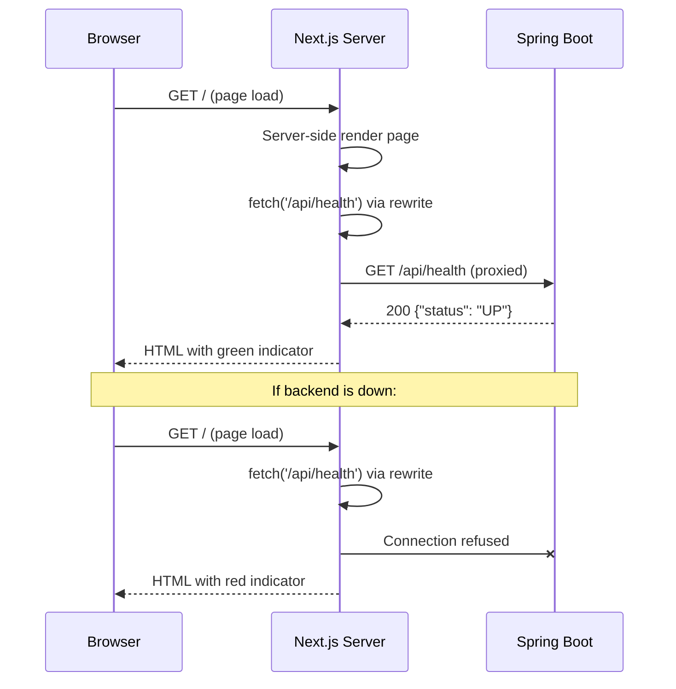

# Design: Base Project Setup

## GitHub Issue

_To be created — see draft issue in spec-create conversation._

## Summary

Set up the foundational project structure for Open CRM: a Spring Boot backend with a single health endpoint (`GET /api/health`) and a Next.js frontend that displays the backend's health status as a green/red indicator. This establishes the end-to-end wiring (frontend -> backend -> database) that all future features build on.

The health endpoint is a pure liveness check — it returns 200 if Spring Boot is running. No database connectivity check, no dependency checks.

## Goals

- Working Spring Boot backend with a health endpoint
- Working Next.js frontend that displays backend health status
- Docker Compose setup with PostgreSQL, backend, and frontend
- Standalone development possible (without Docker)
- CI/CD pipeline for build verification
- All project conventions applied (editorconfig, gitignore, license, code of conduct)

## Non-goals

- Authentication (Authentik SSO) — separate feature
- Brevo sync — separate feature
- Database entities or migrations — no data model yet
- Company/contact/customer management — separate features
- Production deployment configuration
- Multi-language i18n translations (but architecture is i18n-ready)

## Technical Approach

### Backend (Spring Boot + Maven)

**Framework:** Spring Boot 3.4.x with Java 21

**Health endpoint:** A plain `@RestController` with a single `GET /api/health` mapping that returns a record DTO `{"status": "UP"}` with HTTP 200. No Spring Boot Actuator — this is intentionally simple.

**Rationale:** Using a plain controller instead of Actuator keeps the initial setup minimal and avoids pulling in monitoring infrastructure before it's needed. Actuator can be added later when real health checks (DB, external services) are required.

**Project structure:**
```
backend/
├── .sdkmanrc                          # java=21
├── .dockerignore
├── Dockerfile
├── pom.xml
├── mvnw, mvnw.cmd, .mvn/wrapper/
└── src/
    ├── main/
    │   ├── java/com/openelements/crm/
    │   │   ├── CrmApplication.java
    │   │   └── health/
    │   │       ├── HealthController.java
    │   │       └── HealthResponse.java
    │   └── resources/
    │       ├── application.yml
    │       └── db/migration/.gitkeep
    └── test/
        └── java/com/openelements/crm/
            └── health/
                └── HealthControllerTest.java
```

**Dependencies:**
- `spring-boot-starter-web` — REST endpoint
- `spring-boot-starter-data-jpa` — JPA/Hibernate (ready for future entities)
- `postgresql` (runtime) — PostgreSQL driver
- `flyway-core` + `flyway-database-postgresql` — schema migrations
- `springdoc-openapi-starter-webmvc-ui` — Swagger UI at `/swagger-ui.html`
- `spring-boot-starter-test` (test) — JUnit 5, MockMvc
- CycloneDX Maven Plugin — SBOM generation

**Configuration (`application.yml`):**
- Datasource configured via environment variables (`SPRING_DATASOURCE_URL`, etc.)
- Flyway enabled with `db/migration` location
- Server port 8080

**Rationale for including JPA/Flyway/PostgreSQL now:** The project will use PostgreSQL for all future features. Including the dependencies and configuration from the start means the Docker Compose setup is complete and developers won't need to reconfigure when the first entity is added.

### Frontend (Next.js + TypeScript)

**Framework:** Next.js 15 with React 19, TypeScript (strict), Tailwind CSS, shadcn/ui, pnpm

**Health display:** The main page fetches `/api/health` server-side on each request (`force-dynamic`). The result is passed to a client component that renders a green or red dot with a status label.

**Rationale for server-side fetch:** Per conventions, the frontend must never call the backend directly from the browser. The Next.js rewrite proxies `/api/*` to the backend server-side, and the page itself uses server-side rendering to fetch the health status.

**Project structure:**
```
frontend/
├── .nvmrc                             # v22.19.0
├── .dockerignore
├── Dockerfile
├── package.json
├── pnpm-lock.yaml
├── tsconfig.json
├── next.config.ts
├── tailwind.config.ts
├── postcss.config.mjs
├── eslint.config.mjs
├── prettier.config.js
├── components.json                    # shadcn/ui config
├── public/.gitkeep
└── src/
    ├── app/
    │   ├── layout.tsx
    │   ├── page.tsx
    │   └── globals.css
    ├── components/
    │   └── health-status.tsx
    └── lib/
        └── constants.ts               # i18n-ready string constants
```

**API proxying (`next.config.ts`):**
```typescript
async rewrites() {
  return [{
    source: '/api/:path*',
    destination: `${process.env.BACKEND_URL}/api/:path*`,
  }];
}
```

**UI design:**
- Centered card layout with Open CRM title
- Health status indicator: colored circle (green `#2ECC71` / red `#E74C3C`) with text
- Uses shadcn/ui `Card` component
- Responsive, professional styling with Tailwind
- Open Elements brand colors applied via Tailwind config

### Docker Compose

```yaml
services:
  db:
    image: postgres:17-alpine
    environment:
      POSTGRES_DB: ${DB_NAME}
      POSTGRES_USER: ${DB_USER}
      POSTGRES_PASSWORD: ${DB_PASSWORD}
    ports:
      - "${DB_PORT:-5432}:5432"

  backend:
    build: ./backend
    environment:
      SPRING_DATASOURCE_URL: jdbc:postgresql://db:5432/${DB_NAME}
      SPRING_DATASOURCE_USERNAME: ${DB_USER}
      SPRING_DATASOURCE_PASSWORD: ${DB_PASSWORD}
    ports:
      - "${BACKEND_PORT:-9081}:8080"
    depends_on:
      - db

  frontend:
    build: ./frontend
    environment:
      - BACKEND_URL=http://backend:8080
    ports:
      - "${FRONTEND_PORT:-4001}:3000"
    depends_on:
      - backend
```

### CI/CD

GitHub Actions workflow (`.github/workflows/build.yml`):
- **Backend job:** Setup Java 21, run `./mvnw clean verify`
- **Frontend job:** Setup Node 22, pnpm, run `pnpm install --frozen-lockfile && pnpm build`
- **Docker job:** After both succeed, run `docker compose build`
- Triggers: push to `main`, PRs to `main`

## Key Flows

### Health Check Flow



## Dependencies

- **Spring Boot 3.4.x** — Latest stable 3.4 release
- **Next.js 15.x** — Latest stable
- **PostgreSQL 17** — Via Docker image `postgres:17-alpine`
- **shadcn/ui** — Component library (Card component used)
- **SpringDoc OpenAPI 2.x** — Swagger UI

## Security Considerations

- No authentication in this initial setup (added later with Authentik)
- No sensitive data handled yet
- Database credentials stored in `.env` (gitignored), `.env.example` has placeholders only
- Backend runs as non-root in Docker
- Frontend runs as non-root in Docker

## Open Questions

- Exact Spring Boot 3.4.x patch version — will use latest available
- Whether to include a `CONTRIBUTING.md` in this initial setup (conventions say "planned")
