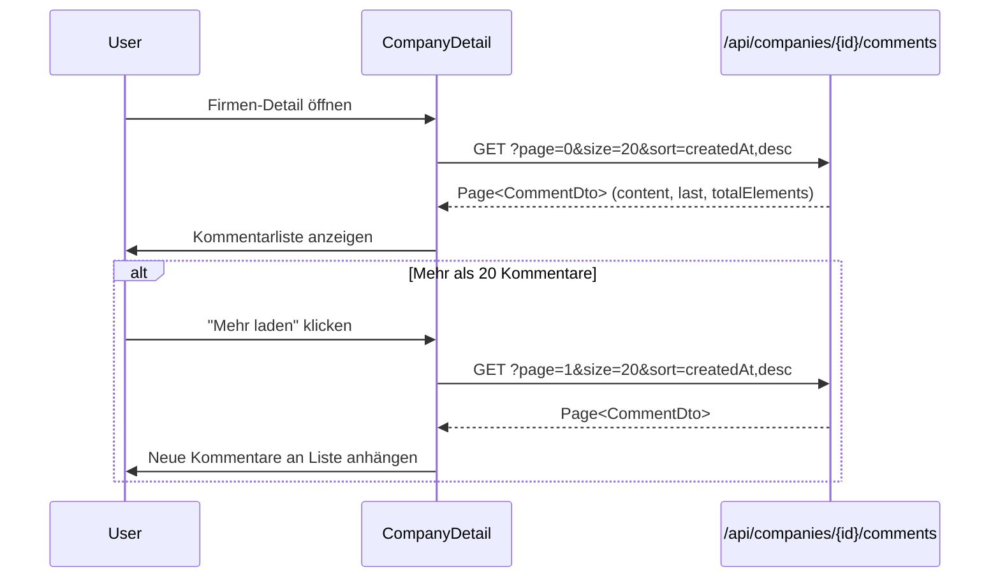
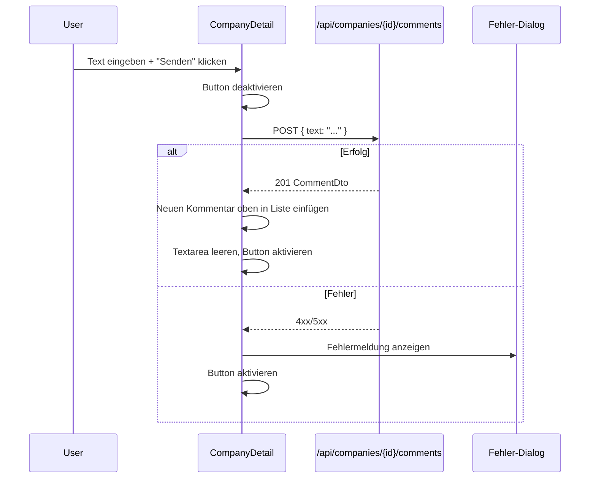

# Design: Company Comments

## Summary

In der Firmen-Detailansicht sollen Kommentare angezeigt und erstellt werden können. Das Backend ist bereits komplett implementiert (Entity, Service, Controller, Repository, DB-Migration, Tests). Im Frontend existiert ein Platzhalter mit deaktiviertem Button. Dieses Feature bindet das Frontend an die bestehende Backend-API an und passt das Backend an, sodass der Author-Name nicht mehr vom Client kommt.

## Goals

- Kommentare zu einer Firma in der Detailansicht anzeigen (neueste zuerst)
- Neue Kommentare über ein Textfeld erstellen
- "Mehr laden"-Button für Pagination (initial 20 Kommentare)
- Backend setzt Author automatisch auf `"UNKNOWN"` (Vorbereitung für SSO)

## Non-goals

- Kommentare bearbeiten oder löschen (Backend unterstützt es, UI kommt später)
- Kommentare an Kontakten (nur Firmen in diesem Scope)
- Echtzeit-Updates / WebSockets
- Author-Eingabe durch den Nutzer (kommt mit SSO)

## Technical Approach

### Backend-Änderung: Author aus CreateDto entfernen

**Rationale:** Der Author soll nie vom Client kommen. Aktuell wird er hardcoded auf `"UNKNOWN"` gesetzt, bei SSO-Integration später aus dem Security-Context gelesen. So muss das API-Protokoll zwischen Frontend und Backend bei SSO nicht geändert werden.

**Betroffene Dateien:**

| Datei | Änderung |
|-------|----------|
| `CommentCreateDto.java` | `author`-Feld und `@NotBlank`-Validierung entfernen |
| `CommentService.java` | `addToCompany()` und `addToContact()`: `entity.setAuthor("UNKNOWN")` statt `request.author()` |
| `CommentUpdateDto.java` | `author`-Feld entfernen (konsistent) |
| `CommentService.update()` | Author nicht mehr überschreiben |
| `CommentControllerTest.java` | Tests anpassen — kein `author` mehr im Request-Body für Create |

### Frontend: Neue Typen

```typescript
// types.ts
interface CommentDto {
  readonly id: string;
  readonly text: string;
  readonly author: string;
  readonly companyId: string | null;
  readonly contactId: string | null;
  readonly createdAt: string;
  readonly updatedAt: string;
}

interface CommentCreateDto {
  readonly text: string;
  // Kein author — wird vom Backend gesetzt
}
```

### Frontend: API-Funktionen

Zwei neue Funktionen in `api.ts`, analog zu den bestehenden Company-Funktionen:

| Funktion | HTTP | URL | Rückgabe |
|----------|------|-----|----------|
| `getCompanyComments(companyId, page?)` | GET | `/api/companies/{id}/comments?page={page}&size=20&sort=createdAt,desc` | `Page<CommentDto>` |
| `createCompanyComment(companyId, data)` | POST | `/api/companies/{id}/comments` | `CommentDto` |

### Frontend: UI-Komponente

Der Platzhalter in `company-detail.tsx` (Zeilen 95-107) wird durch eine funktionale Kommentar-Sektion ersetzt:

```
┌─────────────────────────────────────────┐
│ Kommentare                              │
│─────────────────────────────────────────│
│ ┌─────────────────────────────────────┐ │
│ │ Kommentartext eingeben...           │ │
│ │                                     │ │
│ └─────────────────────────────────────┘ │
│                        [Kommentar senden]│
│─────────────────────────────────────────│
│ UNKNOWN · 27.03.2026, 15:30             │
│ Erstes Gespräch war sehr produktiv.     │
│                                         │
│ UNKNOWN · 27.03.2026, 14:00             │
│ Kontaktdaten aktualisiert.              │
│                                         │
│           [Mehr laden]                  │
└─────────────────────────────────────────┘
```

**Komponentenstruktur:**
- Textarea für neuen Kommentar + "Senden"-Button
- Liste der Kommentare (Author, Datum, Text)
- "Mehr laden"-Button wenn `page.last === false`
- Modaler Fehler-Dialog bei API-Fehlern (nutzt bestehenden `AlertDialog`)

**Zustände:**
- **Leer:** "Keine Kommentare vorhanden" + Eingabefeld
- **Laden:** Skeleton-Platzhalter während Kommentare geladen werden
- **Kommentare vorhanden:** Liste + ggf. "Mehr laden"
- **Senden:** Button deaktiviert während Request läuft
- **Fehler:** Modaler Dialog mit Fehlermeldung

### Frontend: Strings

Bestehende Kommentar-Strings in `constants.ts` erweitern:

```typescript
comments: {
  title: "Kommentare",
  empty: "Keine Kommentare vorhanden",
  add: "Kommentar hinzufügen",        // bestehend
  placeholder: "Kommentar eingeben...",
  send: "Senden",
  loadMore: "Mehr laden",
  sending: "Wird gesendet...",
  errorTitle: "Fehler",
  errorGeneric: "Der Kommentar konnte nicht gespeichert werden. Bitte versuchen Sie es erneut.",
}
```

## Key Flows

### Kommentare laden



### Kommentar erstellen



## Dependencies

- Bestehende UI-Komponenten: `Card`, `Button`, `Separator`, `AlertDialog`, `Skeleton`
- Bestehende API-Patterns aus `api.ts` (gleiche `baseUrl()`/`fetch`-Konventionen)
- Backend-API bereits vorhanden (nur CreateDto-Änderung nötig)

## Security Considerations

- Keine Client-seitige Author-Eingabe — verhindert Spoofing
- Backend validiert `@NotBlank` für den Kommentartext
- Keine XSS-Gefahr: React escaped HTML-Entities automatisch

## Open Questions

- Keine
