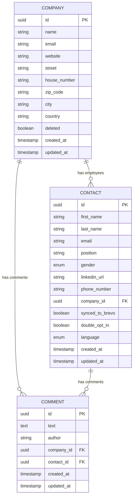
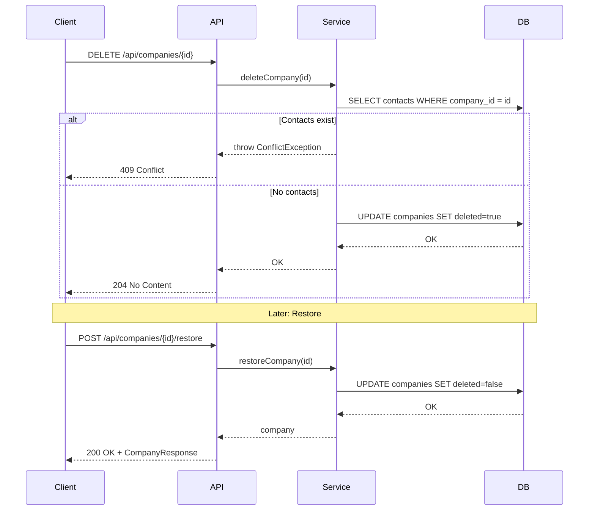
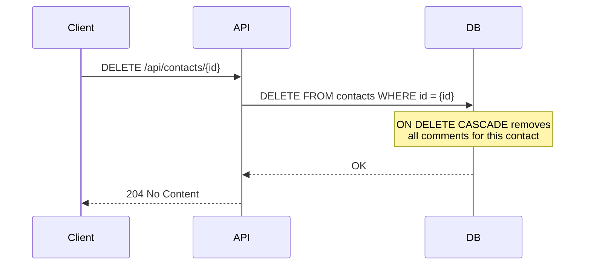

# Design: Core Data Model

## GitHub Issue

_To be created._

## Summary

Introduce the core domain entities for Open CRM: **Company**, **Contact**, and **Comment**. Companies represent organizations, contacts represent individual people who may work at a company, and comments are free-text notes attachable to either a company or a contact. This spec covers the backend only: JPA entities, Flyway migrations, service layer, and full CRUD REST APIs with pagination, filtering, and sorting.

## Goals

- Define and persist the Company, Contact, and Comment entities in PostgreSQL
- Provide full CRUD REST APIs for all three entity types
- Support pagination, filtering, and sorting on list endpoints
- Implement soft-delete for companies, hard-delete for contacts (with comment cascade)
- Document all endpoints via OpenAPI/Swagger
- Comprehensive test coverage (unit, integration, E2E)

## Non-goals

- Frontend UI — separate feature
- Authentication / authorization (Authentik SSO) — separate feature
- Brevo synchronization — separate feature (fields `syncedToBrevo` and `doubleOptIn` are prepared but read-only)
- DSGVO self-service endpoints (Art. 15/17) — later
- File attachments on comments

## Technical Approach

### Package Structure

Each domain concept gets its own package under `com.openelements.crm`:

```
com.openelements.crm.company/
    CompanyEntity, CompanyRepository, CompanyService, CompanyController
    CompanyCreateRequest, CompanyUpdateRequest, CompanyResponse

com.openelements.crm.contact/
    ContactEntity, ContactRepository, ContactService, ContactController
    ContactCreateRequest, ContactUpdateRequest, ContactResponse
    Gender (enum), Language (enum)

com.openelements.crm.comment/
    CommentEntity, CommentRepository, CommentService, CommentController
    CommentCreateRequest, CommentUpdateRequest, CommentResponse
```

**Rationale:** Feature-based package structure keeps related classes together and makes it easy to find everything related to a domain concept. Each package is self-contained with entity, repository, service, controller, and DTOs.

### Entities vs. DTOs

- **Entities** are JPA-managed classes (not records — JPA requires mutable state, default constructors, and proxying).
- **DTOs** are Java records (immutable, used exclusively in the REST API layer).
- Mapping between entities and DTOs happens in the service layer.

**Rationale:** Per backend conventions, JPA entities must never be exposed in REST endpoints. Records provide immutability and conciseness for the API layer.

### Validation

Add `spring-boot-starter-validation` dependency for Bean Validation (JSR-380). Use `@Valid` on request bodies and validation annotations (`@NotBlank`, `@Size`, `@Email`, etc.) on DTO fields.

## Data Model

### Company

| Field | Column | Type | Constraints |
|-------|--------|------|-------------|
| id | `id` | UUID | PK, auto-generated |
| name | `name` | VARCHAR(255) | NOT NULL |
| email | `email` | VARCHAR(255) | nullable |
| website | `website` | VARCHAR(500) | nullable |
| street | `street` | VARCHAR(255) | nullable |
| houseNumber | `house_number` | VARCHAR(20) | nullable |
| zipCode | `zip_code` | VARCHAR(20) | nullable |
| city | `city` | VARCHAR(255) | nullable |
| country | `country` | VARCHAR(100) | nullable |
| deleted | `deleted` | BOOLEAN | NOT NULL, DEFAULT false |
| createdAt | `created_at` | TIMESTAMP WITH TIME ZONE | NOT NULL, auto-set |
| updatedAt | `updated_at` | TIMESTAMP WITH TIME ZONE | NOT NULL, auto-set |

- Soft-delete: The `deleted` flag marks a company as deleted without removing the row.
- A soft-deleted company can be restored.
- List endpoints exclude soft-deleted companies by default (`?includeDeleted=true` to include them).

### Contact

| Field | Column | Type | Constraints |
|-------|--------|------|-------------|
| id | `id` | UUID | PK, auto-generated |
| firstName | `first_name` | VARCHAR(255) | NOT NULL |
| lastName | `last_name` | VARCHAR(255) | NOT NULL |
| email | `email` | VARCHAR(255) | nullable |
| position | `position` | VARCHAR(255) | nullable |
| gender | `gender` | VARCHAR(20) | nullable, enum (MALE, FEMALE, DIVERSE) |
| linkedInUrl | `linkedin_url` | VARCHAR(500) | nullable |
| phoneNumber | `phone_number` | VARCHAR(50) | nullable |
| companyId | `company_id` | UUID | nullable, FK → companies(id) |
| syncedToBrevo | `synced_to_brevo` | BOOLEAN | NOT NULL, DEFAULT false |
| doubleOptIn | `double_opt_in` | BOOLEAN | NOT NULL, DEFAULT false |
| language | `language` | VARCHAR(5) | NOT NULL, enum (DE, EN) |
| createdAt | `created_at` | TIMESTAMP WITH TIME ZONE | NOT NULL, auto-set |
| updatedAt | `updated_at` | TIMESTAMP WITH TIME ZONE | NOT NULL, auto-set |

- Hard-delete: Contacts are physically removed from the database (DSGVO compliance for personal data).
- A contact can exist without a company (e.g., freelancers).
- `syncedToBrevo` and `doubleOptIn` are read-only in the API — they will be set exclusively by the future Brevo synchronization.
- A contact cannot reference a soft-deleted company (validated at the service level).

### Comment

| Field | Column | Type | Constraints |
|-------|--------|------|-------------|
| id | `id` | UUID | PK, auto-generated |
| text | `text` | TEXT | NOT NULL |
| author | `author` | VARCHAR(255) | NOT NULL |
| companyId | `company_id` | UUID | nullable, FK → companies(id) |
| contactId | `contact_id` | UUID | nullable, FK → contacts(id) ON DELETE CASCADE |
| createdAt | `created_at` | TIMESTAMP WITH TIME ZONE | NOT NULL, auto-set |
| updatedAt | `updated_at` | TIMESTAMP WITH TIME ZONE | NOT NULL, auto-set |

- A comment belongs to exactly one entity (either a company or a contact, never both, never neither).
- Database CHECK constraint: `(company_id IS NOT NULL AND contact_id IS NULL) OR (company_id IS NULL AND contact_id IS NOT NULL)`
- When a contact is hard-deleted, all associated comments are cascade-deleted (DB-level ON DELETE CASCADE).
- When a company is soft-deleted, its comments remain accessible.
- The `author` field is freetext for now. It will be replaced by an Authentik user ID reference when SSO is integrated.

### Entity-Relationship Diagram



### Flyway Migrations

- `V1__create_companies.sql` — Creates the `companies` table
- `V2__create_contacts.sql` — Creates the `contacts` table with FK to `companies`
- `V3__create_comments.sql` — Creates the `comments` table with FKs and CHECK constraint

## API Design

### Companies

| Method | Path | Description | Status Codes |
|--------|------|-------------|--------------|
| GET | `/api/companies` | List companies (paginated, filterable) | 200 |
| GET | `/api/companies/{id}` | Get company by ID | 200, 404 |
| POST | `/api/companies` | Create company | 201, 400 |
| PUT | `/api/companies/{id}` | Update company | 200, 400, 404 |
| DELETE | `/api/companies/{id}` | Soft-delete company | 204, 404, 409 |
| POST | `/api/companies/{id}/restore` | Restore soft-deleted company | 200, 404 |
| GET | `/api/companies/{id}/comments` | List comments for company | 200, 404 |

**List filters:** `name` (partial match, case-insensitive), `city`, `country`, `includeDeleted` (boolean, default false)
**Sorting:** `name`, `createdAt` (default: `name` ASC)
**Pagination:** `page` (default 0), `size` (default 20)

**DELETE returns 409 Conflict** if the company still has associated contacts. The response body includes an error message explaining that contacts must be removed or reassigned first.

### Contacts

| Method | Path | Description | Status Codes |
|--------|------|-------------|--------------|
| GET | `/api/contacts` | List contacts (paginated, filterable) | 200 |
| GET | `/api/contacts/{id}` | Get contact by ID | 200, 404 |
| POST | `/api/contacts` | Create contact | 201, 400 |
| PUT | `/api/contacts/{id}` | Update contact | 200, 400, 404 |
| DELETE | `/api/contacts/{id}` | Hard-delete contact (cascades comments) | 204, 404 |
| GET | `/api/contacts/{id}/comments` | List comments for contact | 200, 404 |

**List filters:** `firstName`, `lastName`, `email` (all partial match, case-insensitive), `companyId` (exact), `language` (exact)
**Sorting:** `lastName`, `firstName`, `createdAt` (default: `lastName` ASC)
**Pagination:** `page` (default 0), `size` (default 20)

**Create/Update ignores** `syncedToBrevo` and `doubleOptIn` fields — they are read-only and omitted from request DTOs.

**Create/Update validates** that the referenced `companyId` (if provided) exists and is not soft-deleted.

### Comments

| Method | Path | Description | Status Codes |
|--------|------|-------------|--------------|
| POST | `/api/companies/{id}/comments` | Add comment to company | 201, 400, 404 |
| POST | `/api/contacts/{id}/comments` | Add comment to contact | 201, 400, 404 |
| PUT | `/api/comments/{id}` | Update comment | 200, 400, 404 |
| DELETE | `/api/comments/{id}` | Delete comment | 204, 404 |

**Comment lists** (via company/contact endpoints) are paginated, always sorted by `createdAt` DESC (newest first), with no additional filtering.

### Request/Response Shapes

**CompanyCreateRequest / CompanyUpdateRequest:**
```json
{
  "name": "Open Elements GmbH",
  "email": "info@open-elements.com",
  "website": "https://open-elements.com",
  "street": "Musterstraße",
  "houseNumber": "42",
  "zipCode": "12345",
  "city": "Berlin",
  "country": "Germany"
}
```

**CompanyResponse:**
```json
{
  "id": "uuid",
  "name": "Open Elements GmbH",
  "email": "info@open-elements.com",
  "website": "https://open-elements.com",
  "street": "Musterstraße",
  "houseNumber": "42",
  "zipCode": "12345",
  "city": "Berlin",
  "country": "Germany",
  "deleted": false,
  "createdAt": "2026-03-27T10:00:00Z",
  "updatedAt": "2026-03-27T10:00:00Z"
}
```

**ContactCreateRequest / ContactUpdateRequest:**
```json
{
  "firstName": "Hendrik",
  "lastName": "Ebbers",
  "email": "hendrik@open-elements.com",
  "position": "CEO",
  "gender": "MALE",
  "linkedInUrl": "https://linkedin.com/in/hendrik-ebbers",
  "phoneNumber": "+49 123 456789",
  "companyId": "uuid-or-null",
  "language": "DE"
}
```

**ContactResponse:**
```json
{
  "id": "uuid",
  "firstName": "Hendrik",
  "lastName": "Ebbers",
  "email": "hendrik@open-elements.com",
  "position": "CEO",
  "gender": "MALE",
  "linkedInUrl": "https://linkedin.com/in/hendrik-ebbers",
  "phoneNumber": "+49 123 456789",
  "companyId": "uuid-or-null",
  "companyName": "Open Elements GmbH",
  "syncedToBrevo": false,
  "doubleOptIn": false,
  "language": "DE",
  "createdAt": "2026-03-27T10:00:00Z",
  "updatedAt": "2026-03-27T10:00:00Z"
}
```

**CommentCreateRequest:**
```json
{
  "text": "Had a great meeting today.",
  "author": "Hendrik Ebbers"
}
```

**CommentResponse:**
```json
{
  "id": "uuid",
  "text": "Had a great meeting today.",
  "author": "Hendrik Ebbers",
  "companyId": "uuid-or-null",
  "contactId": "uuid-or-null",
  "createdAt": "2026-03-27T10:00:00Z",
  "updatedAt": "2026-03-27T10:00:00Z"
}
```

## Key Flows

### Soft-Delete and Restore Company



### Contact Hard-Delete with Comment Cascade



## Dependencies

- `spring-boot-starter-validation` — Bean Validation for request DTOs (must be added to `pom.xml`)
- Existing: `spring-boot-starter-data-jpa`, `postgresql`, `flyway-core`, `springdoc-openapi`

## Security Considerations

- No authentication in this phase (comes with Authentik later)
- No personal data in log messages (DSGVO)
- `syncedToBrevo` and `doubleOptIn` are not settable via API — prevents unauthorized state changes
- Contact hard-delete ensures DSGVO right to erasure is possible
- Comment `author` is freetext for now — no user identity verification until Authentik is integrated

## GDPR (DSGVO) Considerations

- **Legal basis:** Legitimate interest (Art. 6 Abs. 1 lit. f DSGVO) for storing business contact data
- **Personal data:** Contact fields (name, email, phone, LinkedIn) are personal data
- **Data minimization:** Only fields relevant for CRM relationship management are stored
- **Right to erasure:** Contact hard-delete physically removes all personal data and associated comments
- **No personal data in logs:** Service and controller layers must not log personal contact details
- **Self-service endpoints** (Art. 15 access, Art. 17 erasure requests) are planned for a future iteration

## Open Questions

- Exact maximum lengths for string fields (current values are reasonable defaults)
- Whether `email` on Company and Contact should be validated as email format or just stored as string
- Whether the `language` enum should be extended beyond DE/EN in the future
