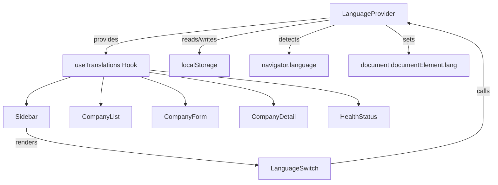
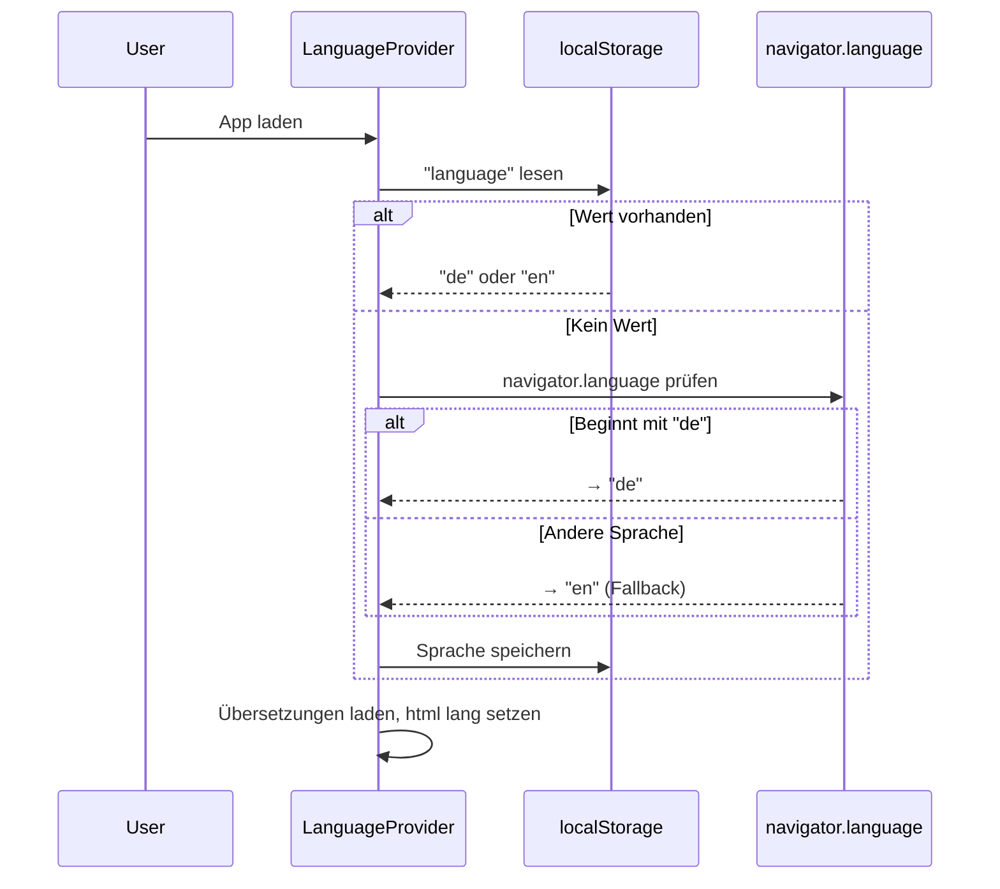
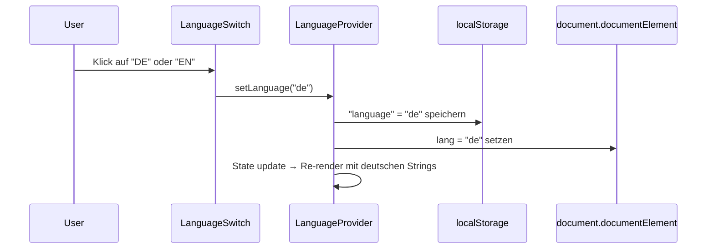

# Design: Frontend i18n (DE/EN)

## Summary

Alle UI-Strings im Frontend sind aktuell in einem einzigen `STRINGS`-Objekt in `constants.ts` hardcoded (überwiegend Deutsch). Es gibt keine Möglichkeit, die Sprache zu wechseln. Dieses Feature führt Zweisprachigkeit (Deutsch/Englisch) ein, mit einem sichtbaren Sprach-Umschalter in der Sidebar.

## Goals

- Alle UI-Texte in Deutsch und Englisch verfügbar machen
- Sprach-Umschalter ("DE | EN") in der Sidebar
- Automatische Spracherkennung über die Browser-Sprache beim ersten Besuch
- Sprachwahl persistent in localStorage speichern
- `<html lang>` Attribut dynamisch mit der Sprache setzen

## Non-goals

- Mehr als zwei Sprachen unterstützen (kann später ergänzt werden)
- URL-basierte Locale-Prefixes (`/de/...`, `/en/...`)
- Serverseitige Spracherkennung (Flash der Default-Sprache ist akzeptabel)
- Übersetzung von Backend-Fehlermeldungen
- Übersetzung von Meta-Tags (`<title>`, `<meta description>`)

## Technical Approach

### Custom React Context (kein externes i18n-Framework)

**Rationale:** Die App hat nur 2 Sprachen, ~50 Strings, und ausschließlich Client Components. Bibliotheken wie `next-intl` oder `react-i18next` sind auf Routing-basierte Locale-Erkennung und serverseitige Features ausgelegt, die hier nicht benötigt werden. Ein eigener React Context ist leichtgewichtiger, hat keine externe Abhängigkeit und passt exakt zum bestehenden `STRINGS`-Muster.

### Architektur



### Neue Dateien

| Datei | Zweck |
|-------|-------|
| `frontend/src/lib/i18n/de.ts` | Deutsche Übersetzungen |
| `frontend/src/lib/i18n/en.ts` | Englische Übersetzungen |
| `frontend/src/lib/i18n/index.ts` | Typ `Translations`, Sprach-Registry, Typ `Language` |
| `frontend/src/lib/i18n/language-context.tsx` | React Context, `LanguageProvider`, `useTranslations()` Hook |
| `frontend/src/components/language-switch.tsx` | "DE \| EN" Toggle-Komponente |

### Zu ändernde Dateien

| Datei | Änderung |
|-------|----------|
| `frontend/src/app/layout.tsx` | `LanguageProvider` wrappen; `<html lang="en">` bleibt als SSR-Default |
| `frontend/src/components/sidebar.tsx` | `LanguageSwitch` einbauen, `STRINGS` → `useTranslations()` |
| `frontend/src/components/company-list.tsx` | `STRINGS` → `useTranslations()` |
| `frontend/src/components/company-form.tsx` | `STRINGS` → `useTranslations()` |
| `frontend/src/components/company-detail.tsx` | `STRINGS` → `useTranslations()` |
| `frontend/src/components/health-status.tsx` | `STRINGS` → `useTranslations()` |
| `frontend/src/app/health/page.tsx` | Hardcodierte Strings prüfen und umstellen |
| `frontend/src/lib/constants.ts` | `STRINGS` entfernen |
| `frontend/src/components/__tests__/*.test.tsx` | `LanguageProvider` als Test-Wrapper |

## Data Model

### Typ `Language`

```typescript
type Language = "de" | "en";
```

### Typ `Translations`

Identisch mit der Struktur des bestehenden `STRINGS`-Objekts. Wird als TypeScript-Typ aus der deutschen Übersetzungsdatei abgeleitet:

```typescript
import { de } from "./de";
export type Translations = typeof de;
```

### Context-Wert

```typescript
interface LanguageContextValue {
  language: Language;
  setLanguage: (lang: Language) => void;
  t: Translations;
}
```

## Key Flows

### Spracherkennung beim ersten Besuch



### Sprachwechsel



## UI Design: Language Switch

Position: Unten in der Sidebar, am unteren Rand fixiert.

```
┌──────────────────┐
│  Open CRM        │
│──────────────────│
│  ● Firmen        │
│  ○ Server-Health │
│                  │
│                  │
│                  │
│    DE | EN       │  ← Language Switch
└──────────────────┘
```

Styling:
- Aktive Sprache: `text-oe-green font-bold` (visuell hervorgehoben)
- Inaktive Sprache: `text-oe-white/70 hover:text-oe-white cursor-pointer`
- Trenner: `|` in `text-oe-white/30`

## Security Considerations

Keine sicherheitsrelevanten Aspekte. Es werden keine personenbezogenen Daten verarbeitet — die Sprachwahl ist eine reine UI-Präferenz in localStorage.

## Open Questions

- Keine (alle Fragen wurden in der Grill-Session geklärt)

## Future Considerations (nicht Teil dieses Specs)

- Cookie-basierte Spracherkennung zur Flash-Vermeidung bei SSR
- Weitere Sprachen hinzufügen (Struktur unterstützt das bereits)
