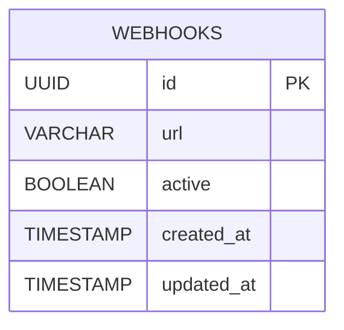
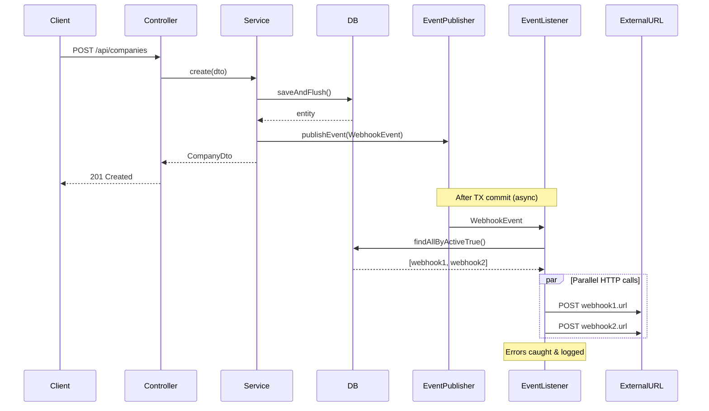

# Design: Webhook Support (Backend)

## GitHub Issue

---

## Summary

External systems need to be notified when domain events occur in the CRM (e.g. a contact is created, a company is updated). This spec adds webhook support to the backend: a `Webhook` entity with a URL and active/inactive status, an event type model covering all CRUD operations on all domain entities, and an asynchronous firing mechanism that sends HTTP POST requests to registered webhook URLs after each domain event.

Frontend changes are explicitly out of scope — webhooks are managed via the REST API only.

## Goals

- Allow registering webhooks (URL + active flag) via a CRUD REST API
- Define a complete set of domain event types (create/update/delete for all 6 entities)
- Fire all active webhooks asynchronously after each domain event with a JSON payload
- Ensure webhook failures do not affect the original business operation

## Non-goals

- Frontend UI for webhook management
- Filtering webhooks by event type (every webhook receives all events)
- Retry logic or delivery guarantees (fire-and-forget)
- HMAC signature / secret for webhook authentication (will come with API keys later)
- Webhook delivery logging or history table

## Technical Approach

### Event Publishing with Spring ApplicationEventPublisher

Each service (Company, Contact, Comment, Tag, Task, User) publishes a `WebhookEvent` via Spring's `ApplicationEventPublisher` after successful create, update, and delete operations.

**Rationale:** Using Spring's event system over direct service calls decouples webhook logic from business logic. Combined with `@TransactionalEventListener(phase = AFTER_COMMIT)`, events only fire when the database transaction succeeds — a failed webhook call never rolls back a business operation.

### Asynchronous Webhook Delivery

A `WebhookEventListener` listens for `WebhookEvent` instances using `@TransactionalEventListener(phase = AFTER_COMMIT)` combined with `@Async`. When an event arrives:

1. Load all active webhooks from the database
2. Build the `WebhookEventPayload` JSON
3. Fire HTTP POST to each webhook URL in parallel using `CompletableFuture.allOf()`
4. Each call has a 10-second timeout
5. Exceptions are caught per-webhook and logged at WARN level — never rethrown

`@EnableAsync` is added to `CrmApplication` to enable async method execution.

**HTTP client:** Spring 6 `RestClient` with a configured timeout of 10 seconds (connect + read).

### Event Firing Points

Events are published in the following service methods:

| Service | Method | Event Type |
|---------|--------|------------|
| CompanyService | `create()` | `COMPANY_CREATED` |
| CompanyService | `update()` | `COMPANY_UPDATED` |
| CompanyService | `delete()` | `COMPANY_DELETED` |
| ContactService | `create()` | `CONTACT_CREATED` |
| ContactService | `update()` | `CONTACT_UPDATED` |
| ContactService | `delete()` | `CONTACT_DELETED` |
| CommentService | `addToCompany()` | `COMMENT_CREATED` |
| CommentService | `addToContact()` | `COMMENT_CREATED` |
| CommentService | `addToTask()` | `COMMENT_CREATED` |
| CommentService | `update()` | `COMMENT_UPDATED` |
| CommentService | `delete()` | `COMMENT_DELETED` |
| TagService | `create()` | `TAG_CREATED` |
| TagService | `update()` | `TAG_UPDATED` |
| TagService | `delete()` | `TAG_DELETED` |
| TaskService | `create()` | `TASK_CREATED` |
| TaskService | `update()` | `TASK_UPDATED` |
| TaskService | `delete()` | `TASK_DELETED` |
| UserService | `getCurrentUser()` (when new) | `USER_CREATED` |

**Note:** Logo/photo/avatar uploads and Brevo imports are not separate event types — they modify existing entities and would be covered by update events if the service publishes them. For this spec, image operations and Brevo import do **not** fire webhook events. Only the core CRUD methods listed above do.

## API Design

### Webhook CRUD — `/api/webhooks`

#### Create Webhook

```
POST /api/webhooks
Content-Type: application/json

{
  "url": "https://example.com/webhook"
}

201 Created
{
  "id": "550e8400-e29b-41d4-a716-446655440000",
  "url": "https://example.com/webhook",
  "active": true,
  "createdAt": "2026-04-04T10:00:00Z",
  "updatedAt": "2026-04-04T10:00:00Z"
}
```

#### List Webhooks

```
GET /api/webhooks?page=0&size=20

200 OK
{
  "content": [ ... ],
  "totalElements": 5,
  ...
}
```

#### Get Webhook

```
GET /api/webhooks/{id}

200 OK
{ ... }
```

#### Update Webhook

```
PUT /api/webhooks/{id}
Content-Type: application/json

{
  "url": "https://example.com/new-webhook",
  "active": false
}

200 OK
{ ... }
```

#### Delete Webhook

```
DELETE /api/webhooks/{id}

204 No Content
```

### Webhook Event Payload (sent to registered URLs)

```json
{
  "eventId": "a1b2c3d4-e5f6-7890-abcd-ef1234567890",
  "eventType": "COMPANY_CREATED",
  "timestamp": "2026-04-04T10:15:30Z",
  "entityId": "550e8400-e29b-41d4-a716-446655440000",
  "data": {
    "id": "550e8400-e29b-41d4-a716-446655440000",
    "name": "Acme Corp",
    "email": "info@acme.com",
    ...
  }
}
```

For delete events, `data` is `null` — only `entityId` identifies the deleted resource.

**No user information** is included in the payload (GDPR).

## Data Model

### `webhooks` table

| Column | Type | Constraints |
|--------|------|-------------|
| `id` | UUID | PRIMARY KEY |
| `url` | VARCHAR(2048) | NOT NULL |
| `active` | BOOLEAN | NOT NULL DEFAULT true |
| `created_at` | TIMESTAMP | NOT NULL |
| `updated_at` | TIMESTAMP | NOT NULL |



**Rationale:** No event type filtering column needed — every webhook receives all events (confirmed as a permanent design decision). No secret column — authentication will be handled by API keys in a future spec.

## Key Flows

### Webhook Event Firing



## Dependencies

- **Spring Framework:** `ApplicationEventPublisher`, `@TransactionalEventListener`, `@Async`, `@EnableAsync`
- **Spring RestClient:** For HTTP POST calls to webhook URLs (already available via `spring-boot-starter-web`)
- **Jackson:** For JSON serialization of `WebhookEventPayload` (already available)

No new Maven dependencies required.

## Security Considerations

- **No authentication on webhook calls** — the receiving endpoint cannot verify the caller. This is a known limitation, to be addressed when API keys are implemented.
- **GDPR:** Webhook payloads contain entity DTOs which include personal data (contact names, emails, birthdays). Users creating webhooks are responsible for ensuring the receiving endpoint is GDPR-compliant. No additional safeguard is implemented (conscious decision).
- **No user in payload:** The acting user is intentionally excluded from webhook payloads for GDPR reasons.
- **URL validation:** The webhook URL must be a valid HTTP(S) URL. No restriction on internal/private IPs (SSRF) for now — the CRM runs in a trusted environment.

## Open Questions

None — all questions were resolved during the grill session.
